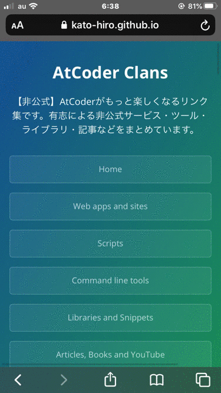

<!-- START doctoc generated TOC please keep comment here to allow auto update -->
<!-- DON'T EDIT THIS SECTION, INSTEAD RE-RUN doctoc TO UPDATE -->

- [AtCoder Clans](#atcoder-clans)
  - [特長](#%E7%89%B9%E9%95%B7)
  - [対象ユーザとメリット](#%E5%AF%BE%E8%B1%A1%E3%83%A6%E3%83%BC%E3%82%B6%E3%81%A8%E3%83%A1%E3%83%AA%E3%83%83%E3%83%88)
  - [各ページの説明](#%E5%90%84%E3%83%9A%E3%83%BC%E3%82%B8%E3%81%AE%E8%AA%AC%E6%98%8E)
    - [注意事項](#%E6%B3%A8%E6%84%8F%E4%BA%8B%E9%A0%85)
  - [最新情報のお知らせ](#%E6%9C%80%E6%96%B0%E6%83%85%E5%A0%B1%E3%81%AE%E3%81%8A%E7%9F%A5%E3%82%89%E3%81%9B)
  - [ご要望、ご報告、お気付きの点などについて](#%E3%81%94%E8%A6%81%E6%9C%9B%E3%81%94%E5%A0%B1%E5%91%8A%E3%81%8A%E6%B0%97%E4%BB%98%E3%81%8D%E3%81%AE%E7%82%B9%E3%81%AA%E3%81%A9%E3%81%AB%E3%81%A4%E3%81%84%E3%81%A6)
  - [関連プロジェクト・参考資料](#%E9%96%A2%E9%80%A3%E3%83%97%E3%83%AD%E3%82%B8%E3%82%A7%E3%82%AF%E3%83%88%E3%83%BB%E5%8F%82%E8%80%83%E8%B3%87%E6%96%99)
  - [レポジトリ作者](#%E3%83%AC%E3%83%9D%E3%82%B8%E3%83%88%E3%83%AA%E4%BD%9C%E8%80%85)
  - [ライセンス](#%E3%83%A9%E3%82%A4%E3%82%BB%E3%83%B3%E3%82%B9)

<!-- END doctoc generated TOC please keep comment here to allow auto update -->

# AtCoder Clans

    
    
    
    

【非公式】競技プログラミングサイト[AtCoder](https://atcoder.jp/)がもっと楽しくなる[リンク集](https://kato-hiro.github.io/AtCoderClans/)です。有志による非公式サービス・ツール・ライブラリ・記事などをまとめています。

***DEMO***

  

## 特長

* **網羅性が高い**: 初心者から上級者向けの情報まで幅広く掲載しています。
* **最新**: 最新の情報が入手できます。また、[Twitter](https://twitter.com/atcoderclans)で直近1週間の内容をお届けしています。
* **日本語の紹介文**: 日本語で紹介しています。
* **眺めるだけでも楽しい**: サービス・ツールのサムネイルが豊富です。
* **目的に応じて探せる**: 欲しい情報がすぐに探せるように、カテゴリ分けをしています。

## 対象ユーザとメリット

- [AtCoder](https://atcoder.jp/)ユーザ - 困ったことや不便なことが解決できるかもしれません。気になったサービス・ツールなどを使ってみましょう!

- 開発者 - 公開したサービスやツールなどの利用者が増えるだけでなく、ネタ探しや共同開発につながることも期待しています。

- [AtCoder](https://atcoder.jp/)運営チーム - 非公式サービス・ツールの全体像を踏まえ、公式として対応の有無を判断する材料の一つになると思います。また、企業向けの参考資料にもなるかもしれません。

- 企業の採用担当者 - [AtCoder](https://atcoder.jp/)ユーザの実務能力・ポテンシャルの評価材料の一つになると思います。ひいては人材発掘の効率化にも、つながるかもしれません。

## 各ページの説明

- [クイックスタート](https://kato-hiro.github.io/AtCoderClans/quick_start/)をご覧ください。

### 注意事項

- [AtCoder](https://atcoder.jp/)公式（以降、公式と表記）の仕様変更や諸事情により、公開されているサービス・ツールなどが予告なく利用できなくなる場合があります。ご了承ください。

- サービス・ツールなどに関するお問い合わせは、**開発者が公開している連絡先に直接行ってください**。公式のサポート対象外のため、運営チームへの問い合わせは絶対しないでください。

- ご利用は自己責任でお願いします。

## 最新情報のお知らせ

毎週水曜日の18:30〜19:30に、[Twitter](https://twitter.com/atcoderclans)でお届けする予定です。

## ご要望、ご報告、お気付きの点などについて

- [連絡先](https://kato-hiro.github.io/AtCoderClans/contact/)

- [本プロジェクトへの参加方法](https://kato-hiro.github.io/AtCoderClans/contributing/)

## 関連プロジェクト・参考資料

- [一覧](https://kato-hiro.github.io/AtCoderClans/contributing/references/)

## レポジトリ作者

[@KATO-Hiro](https://twitter.com/k_hiro1818)

## ライセンス

[MIT](https://github.com/KATO-Hiro/AtCoderClans/blob/master/LICENSE)
