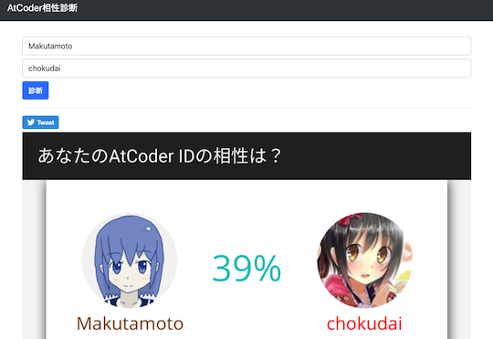

## 目次

<!-- START doctoc generated TOC please keep comment here to allow auto update -->
<!-- DON'T EDIT THIS SECTION, INSTEAD RE-RUN doctoc TO UPDATE -->

- [本サイトの運営者の環境では動作が確認できていないサービス、ツールなど](#%E6%9C%AC%E3%82%B5%E3%82%A4%E3%83%88%E3%81%AE%E9%81%8B%E5%96%B6%E8%80%85%E3%81%AE%E7%92%B0%E5%A2%83%E3%81%A7%E3%81%AF%E5%8B%95%E4%BD%9C%E3%81%8C%E7%A2%BA%E8%AA%8D%E3%81%A7%E3%81%8D%E3%81%A6%E3%81%84%E3%81%AA%E3%81%84%E3%82%B5%E3%83%BC%E3%83%93%E3%82%B9%E3%83%84%E3%83%BC%E3%83%AB%E3%81%AA%E3%81%A9)
- [記載されている情報が古くなったと思われる記事](#%E8%A8%98%E8%BC%89%E3%81%95%E3%82%8C%E3%81%A6%E3%81%84%E3%82%8B%E6%83%85%E5%A0%B1%E3%81%8C%E5%8F%A4%E3%81%8F%E3%81%AA%E3%81%A3%E3%81%9F%E3%81%A8%E6%80%9D%E3%82%8F%E3%82%8C%E3%82%8B%E8%A8%98%E4%BA%8B)
- [リンク切れと思われるサービス、ツールなど](#%E3%83%AA%E3%83%B3%E3%82%AF%E5%88%87%E3%82%8C%E3%81%A8%E6%80%9D%E3%82%8F%E3%82%8C%E3%82%8B%E3%82%B5%E3%83%BC%E3%83%93%E3%82%B9%E3%83%84%E3%83%BC%E3%83%AB%E3%81%AA%E3%81%A9)
- [開発、提供が終了したサービス、ツールなど](#%E9%96%8B%E7%99%BA%E6%8F%90%E4%BE%9B%E3%81%8C%E7%B5%82%E4%BA%86%E3%81%97%E3%81%9F%E3%82%B5%E3%83%BC%E3%83%93%E3%82%B9%E3%83%84%E3%83%BC%E3%83%AB%E3%81%AA%E3%81%A9)
  - [AtCoder](#atcoder)
  - [Codeforces](#codeforces)

<!-- END doctoc generated TOC please keep comment here to allow auto update -->

## 本サイトの運営者の環境では動作が確認できていないサービス、ツールなど

少なくとも本サイトの運営者の環境では動作が確認できていないサービス・ツールなどの一覧です。皆さまの環境で動作する可能性があります。該当するサービス・ツールなどの作者の方や動作を確認された方は[本サイトの運営者](https://twitter.com/k_hiro1818)まで、ご一報いただけると幸いです。

- [AtCoder Code Evaluate](https://ac-code-eval.com/) - 問題の実装の重さをAC(Accepted)コードをもとに評価しているWebアプリ。
  - 理由: バグにより主要な機能が動作していない可能性が高いため([出典](https://twitter.com/IT_parsely/status/1319228723908857856))
  - 代替手段: 調査中。

- ["Atcoder" Finder](https://greasyfork.org/ja/scripts/373742-atcoder-finder) - [Twitter](https://twitter.com/)のツイートに含まれる"Atcoder"の文字列を赤色にするユーザスクリプト。
  - 理由: 記載なし。
  - 代替手段: 調査中。

- [AtCoder Graduation](https://greasyfork.org/ja/scripts/394079-atcoder-graduation) - ユーザの「プロフィール」ページに卒業・修了年度を表示するユーザスクリプト。
  - 理由: 記載なし。
  - 代替手段: 調査中。

- [AtCoder Twitter Avatar](https://greasyfork.org/en/scripts/372507-atcoder-twitter-avatar) - 「ユーザ」ページのtwitter IDの欄に、[Twitter](https://twitter.com/)のアバターを追加するユーザスクリプト。
  - 理由: 記載はないが、[AtCoder](https://atcoder.jp/)の仕様変更に伴うものと思われる。
  - 代替手段: 調査中。

  

    
  

- [AtCoderBook](https://chrome.google.com/webstore/detail/atcoderbook/lcojnofidkanlkoaagdbjkdnelbnlnng?hl=ja&gl=UA) - 問題のリンクを保存するChrome拡張機能。復習やお気に入りの管理用など。[Codeforces](https://codeforces.com/)にも対応している。
  - 理由: 記載はないが、[AtCoder](https://atcoder.jp/)の仕様変更に伴うものと思われる。
  - 代替手段: 調査中。

  

    
  

- [AtCoder judge notifier](https://chrome.google.com/webstore/detail/atcoder-judge-notifier/hcjjfcidaloadjcemebolmdphhbpehba?hl=ja&gl=UA) - 「提出」ページのジャッジ結果を通知するChrome拡張機能。
  - 理由: 記載はないが、[AtCoder](https://atcoder.jp/)の仕様変更に伴うものと思われる。
  - 代替手段: [AtCoderResultNotifier](https://greasyfork.org/ja/scripts/371225-atcoderresultnotifier)などを利用する。

  

    
  

- [Coding Shout](https://chrome.google.com/webstore/detail/coding-shout/nggokghmfinpljihgjkkbogpgbbjjjme?hl=ja&gl=UA) - ジャッジ結果を通知するChrome拡張機能。[Codechef](https://www.codechef.com/)や[Codeforces](https://codeforces.com/)にも対応している。
  - 理由: [AtCoder](https://atcoder.jp/)の仕様変更に伴うもの。
  - 代替手段: [AtCoderResultNotifier](https://greasyfork.org/ja/scripts/371225-atcoderresultnotifier)などを利用する。

  

    
  

- [kunai](https://github.com/mouri111/kunai)  - サンプルケースのテストができるコマンドラインツール。
  - 理由: パッケージのインストールによる動作確認、ソースコードのビルドにおいて依存関係の解消が困難なため。
  - 代替手段: 調査中。

- [AtCoder Review](https://github.com/jueve/atcoder-review) - コンテストの復習に焦点を置いたクロスプラットフォームのデスクトップアプリケーション。
  - 理由: ドキュメントの記載はないが、ソースコードのビルドおよび配布されているインストーラの動作保証が困難な状況のため。
  - 代替手段: 調査中。

  

    
  

## 記載されている情報が古くなったと思われる記事

記載されている情報が古くなったと思われる記事を掲載しています。

- [Rustで競技プログラミングの入力をスッキリ記述するマクロ](https://qiita.com/tanakh/items/0ba42c7ca36cd29d0ac8) - Rustで入力データを扱うコードを簡潔に書くためのinput!マクロが紹介されている記事。
  - 代替手段: [AtCoder言語アップデートでRustの入出力が楽になっていた](https://qiita.com/koji-cw/items/0cce3b075faffe5e50ed)や[言語アップデートで追加されたライブラリ一覧](https://github.com/rust-lang-ja/atcoder-rust-base/blob/ja-all-enabled/Cargo.toml)を読む。

## リンク切れと思われるサービス、ツールなど

リンクが切れていると思われるサービス・ツールなどを掲載しています。一定の期間(3〜6か月程度)更新されない場合は、下記の「開発、提供が終了したサービス、ツールなど」へ移動させたいと思います。

<!-- markdown-link-check-disable -->

- [AtCoder じゃんけん](https://atcoder-janken.appspot.com/) - 指定した2人のユーザが共通して出場したコンテストの順位を比較できるWebアプリ。
  - 確認した日: 2020/10/12
  - 理由: Google Cloud Platform(GCP)で、Go1.9の提供が終了したため。
  - 対処方法: Goの新しいランタイムに移行する。

  

    
  

- [AtCoder Stats](https://atcoderstats.appspot.com/) - コンテスト、問題、ユーザに関する様々な統計情報が閲覧できるWebアプリ。
  - 確認した日: 2020/10/12
  - 理由: Google Cloud Platform(GCP)で、Go1.9の提供が終了したため。
  - 対処方法: Goの新しいランタイムに移行する。

  

    
  

- [Devotter](https://devotter.app/) - 1日1回AC(Accepted)数を[Twitter](https://twitter.com/)にツイートするWebアプリ。

  

    
  

  - 確認した日: 2020/12/20

- [Future Contest](https://future-contest.appspot.com/) - 開催予定のコンテスト情報を表示するWebアプリ。[yukicoder](https://yukicoder.me/)、[CS Academy](https://csacademy.com/)、[Codeforces](https://codeforces.com/)にも対応している。
  - 確認した日: 2020/10/12
  - 理由: Google Cloud Platform(GCP)で、Go1.9の提供が終了したため。
  - 対処方法: Goの新しいランタイムに移行する。

  

    
  

- [gzlcp/competitive-library](https://github.com/gzlcp/competitive-library)  - [gazelle](https://atcoder.jp/users/gazelle)さんのC++ライブラリ。
  - 確認した日: 2020/12/27
- [hiro116s/atcoder_library](https://github.com/hiro116s/atcoder_library)  - [hiro116s](https://atcoder.jp/users/hiro116s)さんのJavaライブラリ。
  - 確認した日: 2020/12/14
- [naipia/competitive-programming-go](https://github.com/naipia/competitive-programming-go)  - [naipia](https://atcoder.jp/users/naipia)さんのGoライブラリ。
  - 確認した日: 2020/11/18
- [Neterukun1993/algorithm](https://github.com/Neterukun1993/algorithm)  - [neterukun](https://atcoder.jp/users/neterukun)さんのPythonライブラリ。
  - 確認した日: 2021/01/03
- [sciencesakura/atcoder-sandbox](https://github.com/sciencesakura/atcoder-sandbox)  - [sciencesakura](https://atcoder.jp/users/sciencesakura)さんのライブラリ。
- [ゼロから始める競プロ部 - 部長 次郎花](https://note.com/jirohhana2/n/n0c1233f14824) - 会社のプロジェクトメンバーと競プロ部を立ち上げた[jirohhana2](https://atcoder.jp/users/jirohhana2)さんが、コンテストの参加記を不定期に連載している。
  - 確認した日: 2021/02/20

<!-- markdown-link-check-enable -->

## 開発、提供が終了したサービス、ツールなど

諸事情により提供・開発が終了した(と思われる)サービス・ツールなどに対して、感謝や敬意を表するため掲載しています。

### AtCoder

- [ac-library-mirror](https://github.com/TonalidadeHidrica/ac-library-mirror) - [AtCoder Library (ACL)](https://atcoder.jp/posts/518)の非公式ミラー。別言語へのラッパー作成などに役立てるため、公式ライブラリの変更を管理している。
  - 理由: [公式レポジトリ](https://github.com/atcoder/ac-library)が公開されているため。
  - 代替手段: [公式レポジトリ](https://github.com/atcoder/ac-library)を参照する。
- [acscores-link](https://greasyfork.org/ja/scripts/377267-acscores-link) - ユーザ名のドロップダウンメニューに[AtCoder Scores](http://atcoder-scores.herokuapp.com/)へのリンクを追加する。
  - 理由: 記載はないが、[AtCoder](https://atcoder.jp/)の仕様変更に伴うものと思われる。
  - 代替手段: [AtCoder Scores](http://atcoder-scores.herokuapp.com/)のリンクから閲覧する。
- [ac-standings-notifier](https://greasyfork.org/ja/scripts/372988-ac-standings-notifier) - コンテスト中に「順位表」ページを開いておくと、順位を通知する。
  - 理由: 記載はないが、[AtCoder](https://atcoder.jp/)の仕様変更に伴うものと思われる。
  - 代替手段: [AtCoder コンテスト実況 Bot](https://twitter.com/cpcontest_bot?lang=en)を利用する。
- [AtCoderACPercentage](https://greasyfork.org/ja/scripts/388000-atcoderacpercentage) - ある問題について、同じレーティング帯の参加者が正解している割合を順位表に表示するユーザスクリプト。
  - 理由: 記載はないが、[AtCoder](https://atcoder.jp/)の仕様変更に伴うものと思われる。
  - 対処方法: 該当する[Issue](https://github.com/null-null-programming/AtCoderACPercentage/issues/14)を修正して、Pull Requestを送る。

<!-- markdown-link-check-disable -->

- [AtCoder相性診断](https://atcoder-aisho-shindan.vercel.app/) - レーティングを元に相性を診断する。
  - 理由: 作者からサービスの提供終了の連絡を受けたため。

  

    
  

<!-- markdown-link-check-enable -->

- [AtCoder Calendar](https://atcoder-calendar.tkt989.info/) - 指定したURLをGoogleカレンダーに登録する。
  - 理由: 記載はないが、[AtCoder](https://atcoder.jp/)の仕様変更に伴うものと思われる。
  - 代替手段: [CLIST](https://clist.by/)や[Competitive Programming Contests Calendar](https://competitiveprogramming.info/calendar)などを利用する。
- [AtCoderカレンダー通知](https://twitter.com/AtcoderCalendar) - イベント開始15分前に通知する。
  - 理由: 記載はないが、[AtCoder](https://atcoder.jp/)の仕様変更に伴うものと思われる。
  - 代替手段: [競プロリマインダー](https://twitter.com/ComproReminder)などを利用する。
- [AtCoderEditorials](https://github.com/null-null-programming/AtCoder-Editorials) - 解法ブログの投稿・閲覧と知見の集約を目指したWebサービス。
  - 理由: 記載なし。
  - 代替手段: 公式解説や個々の解説ブログ、提出コードを見る。
- [AtCoder Problems Penalty Counter](https://greasyfork.org/ja/scripts/395755-atcoder-problems-penalty-counter) -  [AtCoder Problems](https://kenkoooo.com/atcoder/)のTableページで、各問題のコンテスト中のペナルティ数を表示する。
  - 理由: [AtCoder Problems](https://kenkoooo.com/atcoder/)で実装されており、追加で導入する必要性は薄いと思われるため。
  - 代替手段: [AtCoder Problems](https://kenkoooo.com/atcoder/)を利用する。
- AtCoderProblemsRush - [AtCoder Problems](https://kenkoooo.com/atcoder/)のクローラが実行される前に、提出データをブラウザに保存し進捗状況を表示する。
  - 理由: [AtCoder Problems](https://kenkoooo.com/atcoder/)での進捗状況が短時間で更新されるようになり、追加で導入する必要性は薄いと思われるため。
  - 2021年2月23日追記: スクリプトのリンクが削除されているのを確認。
- [AtCoder Rating Simulator](https://twitter.com/AtCoderRS) - Ratedコンテスト当日に、所定のレーティングに到達するのに必要なパフォーマンスを自動返信するTwitter Bot。
  - 理由: 開発者により、Twitterアカウントの運用終了が告知されたため([出典](https://twitter.com/AtCoderRS/status/1323666246173413376))。
  - 代替手段: 同名の[Webページ版](https://atcoderratingsimulator.herokuapp.com/)を利用する。

  

    
  

- [AtCoder Virtual Contest](https://not-522.appspot.com/) - 仮想コンテスト(本番のコンテストに近い状態で練習できる)を開催できるWebサービス。
  - 理由: [AtCoder](https://atcoder.jp/)の仕様変更に伴うもの。
  - 代替手段: 公式のバーチャル参加や[AtCoder Problems](https://kenkoooo.com/atcoder/)のVitual Contestsを利用する。
- [comp-prog-jp-library-standard/competitive-programming-library](https://github.com/comp-prog-jp-library-standard/competitive-programming-library) - 競技プログラミングのための共通ライブラリをまとめようとしたプロジェクト。
  - 理由: 記載なし。
  - 代替手段: [AtCoder Library (ACL)](https://atcoder.jp/posts/517)や[Libraries and Snippets](https://kato-hiro.github.io/AtCoderClans/libraries)などで公開されているライブラリを利用するか、自分で作成する。
- [wacchoz/kyopro](https://github.com/wacchoz/kyopro) - 過去問の難易度を推定している。2019年11月以降は、更新が途絶えている。
  - 理由: 記載なし。
  - 代替手段: [AtCoder Problems](https://kenkoooo.com/atcoder/)で確認できる。
- [ばちゃこんお知らせbot](https://twitter.com/vtcon_bot?lang=ja) - [AtCoder Virtual Contest](https://not-522.appspot.com/)に関する情報をつぶやくbot。
  - 理由: [AtCoder](https://atcoder.jp/)の仕様変更および[AtCoder Virtual Contest](https://not-522.appspot.com/)のサービス終了に伴い、新たな情報提供が困難な状況。
  - 代替手段: 調査中。

<!-- markdown-link-check-disable -->

- [Coki628/Python/lib](https://github.com/Coki628/Python/tree/master/lib)  - [Coki628](https://atcoder.jp/users/Coki628)さんのPythonライブラリ。
  - 理由: 記載なし。

- [KCLC公開講座](https://drive.google.com/drive/folders/12XfIWr37AiDJpvZkygd8H2fJjJdlQOxx) - Kaisei Computer Lovers' Club (KCLC)の有志によって作成された公開資料集。競技プログラミングの入門者・初心者向けに、興味を持ってもらうためのきっかけ作り、データ構造、基礎文法などの資料が用意されている。
  - 理由: 記載なし。
  - 代替手段: 調査中。

<!-- markdown-link-check-enable -->

### Codeforces

- [Codeforces Problems](https://yang33-kassa.jp/Codeforces-Problems/) - 開催されたコンテストの問題を一覧できるwebアプリ。
  - 理由: 記載なし。
  - 代替手段: [CONTEST MANIA](https://contestmania.web.app/)や[CF Problems](https://cf-problems.glitch.me/)を利用する。
