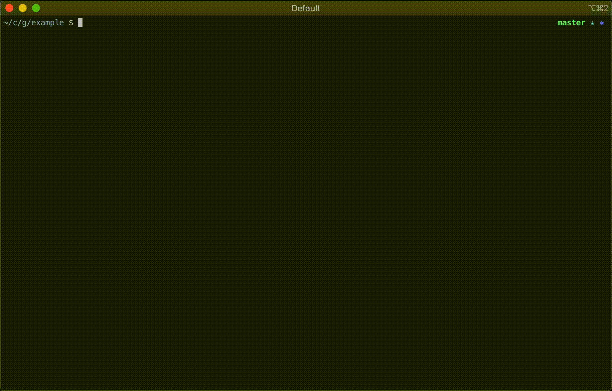
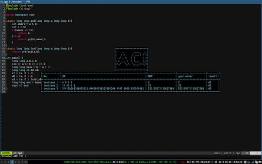
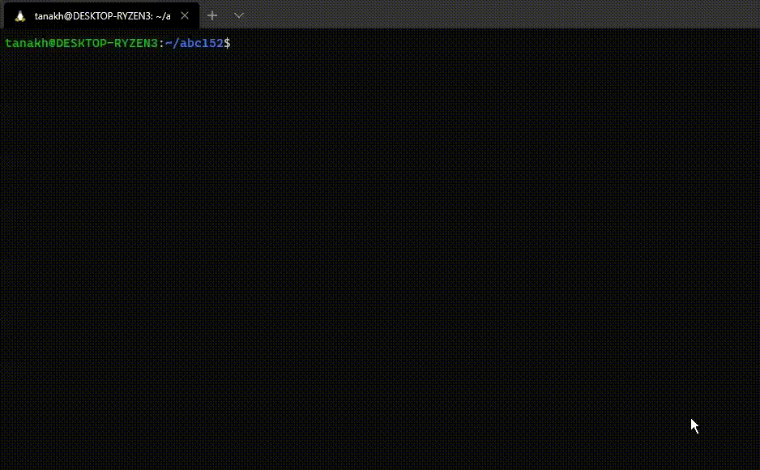
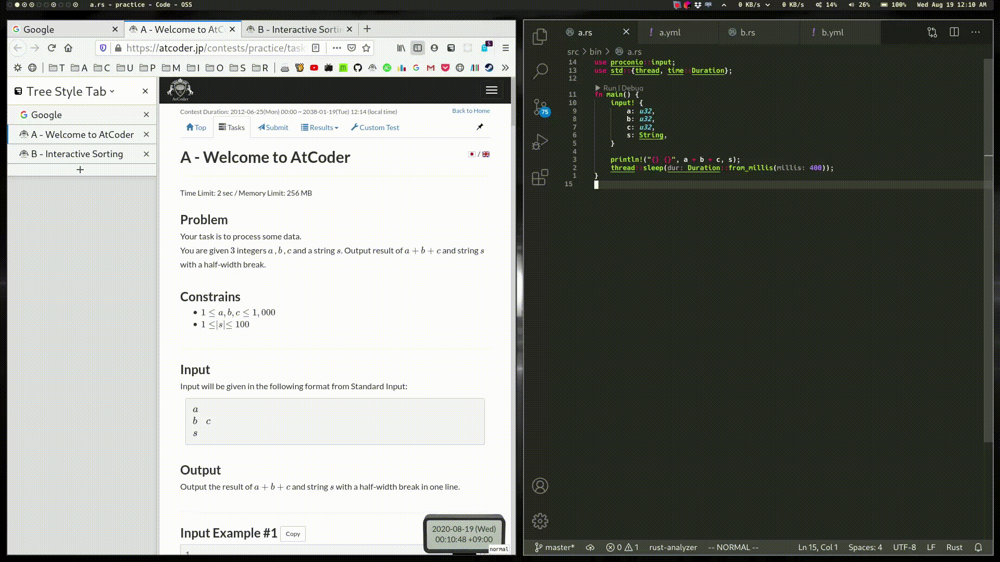

## 目次

<!-- START doctoc generated TOC please keep comment here to allow auto update -->
<!-- DON'T EDIT THIS SECTION, INSTEAD RE-RUN doctoc TO UPDATE -->

- [コマンドラインツール](#%E3%82%B3%E3%83%9E%E3%83%B3%E3%83%89%E3%83%A9%E3%82%A4%E3%83%B3%E3%83%84%E3%83%BC%E3%83%AB)
  - [ローカル環境でサンプルのテストを実行する](#%E3%83%AD%E3%83%BC%E3%82%AB%E3%83%AB%E7%92%B0%E5%A2%83%E3%81%A7%E3%82%B5%E3%83%B3%E3%83%97%E3%83%AB%E3%81%AE%E3%83%86%E3%82%B9%E3%83%88%E3%82%92%E5%AE%9F%E8%A1%8C%E3%81%99%E3%82%8B)
    - [任意の言語](#%E4%BB%BB%E6%84%8F%E3%81%AE%E8%A8%80%E8%AA%9E)
    - [複数の言語](#%E8%A4%87%E6%95%B0%E3%81%AE%E8%A8%80%E8%AA%9E)
    - [C++](#c)
    - [Python](#python)
    - [Ruby](#ruby)
    - [Rust](#rust)
  - [テンプレートを生成するツール](#%E3%83%86%E3%83%B3%E3%83%97%E3%83%AC%E3%83%BC%E3%83%88%E3%82%92%E7%94%9F%E6%88%90%E3%81%99%E3%82%8B%E3%83%84%E3%83%BC%E3%83%AB)
  - [複数のファイルを一つにまとめるツール](#%E8%A4%87%E6%95%B0%E3%81%AE%E3%83%95%E3%82%A1%E3%82%A4%E3%83%AB%E3%82%92%E4%B8%80%E3%81%A4%E3%81%AB%E3%81%BE%E3%81%A8%E3%82%81%E3%82%8B%E3%83%84%E3%83%BC%E3%83%AB)
    - [Go](#go)
    - [Rust](#rust-1)
  - [環境構築](#%E7%92%B0%E5%A2%83%E6%A7%8B%E7%AF%89)
  - [コードの高速化、バックアップなど](#%E3%82%B3%E3%83%BC%E3%83%89%E3%81%AE%E9%AB%98%E9%80%9F%E5%8C%96%E3%83%90%E3%83%83%E3%82%AF%E3%82%A2%E3%83%83%E3%83%97%E3%81%AA%E3%81%A9)
  - [問題の作成と準備を支援するツール](#%E5%95%8F%E9%A1%8C%E3%81%AE%E4%BD%9C%E6%88%90%E3%81%A8%E6%BA%96%E5%82%99%E3%82%92%E6%94%AF%E6%8F%B4%E3%81%99%E3%82%8B%E3%83%84%E3%83%BC%E3%83%AB)

<!-- END doctoc generated TOC please keep comment here to allow auto update -->

## コマンドラインツール

キーボードの操作で特定の処理を簡単に行うことができます。

### ローカル環境でサンプルのテストを実行する

類似した機能を持つツールが多いため、対応言語ごとに分類しています。

#### 任意の言語

- [acc](https://github.com/Takachiha/acc)  - テスト、提出ができる。提出する言語は、オプションで新旧システムのいずれかを選択できる。
- [atcoder-cli](https://github.com/Tatamo/atcoder-cli)  - AtCoderでの利用に特化しているのが特徴。一部の機能は、後述の[Online Judge Tools](https://github.com/online-judge-tools/oj)に依存しており、導入が必要。日本語・英語ともにドキュメントが充実している。
- [AtCoderSupporter](https://github.com/shun0923/AtCoderSupporter)  - サンプルケースのテストと提出ができる。
- [AtCoder Tools](https://github.com/kyuridenamida/atcoder-tools)  - サンプルケースのダウンロードが便利になる。ログイン、サンプルのローカルテスト、コード提出、テンプレートからのコード自動生成機能などを備えている。

  

    
  

- [ICIE](https://marketplace.visualstudio.com/items?itemName=pustaczek.icie)  - 競技プログラミングに参加する上で、必要な機能を揃えた[Visual Studio Code](https://code.visualstudio.com/)の拡張機能。
- [Online Judge API Client](https://github.com/online-judge-tools/api-client)  - 後述する[Online Judge Tools](https://github.com/online-judge-tools/oj)における`oj` commandのbackendライブラリとして使われている。サンプルケースやコンテスト情報などを出力できる。
- [OnlineJudgeHelper](https://github.com/nodchip/OnlineJudgeHelper)  - サンプルの入出力データを用いたテストや解答コードの提出ができるツール。これらの機能を備えた日本初のツールであり([出典](https://github.com/KATO-Hiro/AtCoderClans/issues/489))、後述する[Online Judge Tools](https://github.com/online-judge-tools/oj)などに大きな影響を与えた。注: 近年は、更新頻度がやや低下しており、最新のジャッジシステムに対応していない可能性もある。
- [Online Judge Tools](https://github.com/online-judge-tools/oj)  - サンプルケースのダウンロード、テスト、提出ができる。[Codeforces](https://codeforces.com/)や[Hackerrank](https://www.hackerrank.com/)などの複数のコンテストサイトにも対応している。詳細は、[対応表](https://github.com/online-judge-tools/api-client#supported-websites)を参照。また、ランダムケースを出力するテンプレートを生成する[Online Judge Template Generator](https://github.com/online-judge-tools/template-generator)を導入すると、デバッグの手間を減らすことができる。

  

    
  

- [WrongAnswer](https://github.com/takoha-cpp/WrongAnswer)  - 指定した問題のテストケースをダウンロードする。利用には、前述の[Online Judge Tools](https://github.com/online-judge-tools/oj)が必須。使い方が日本語・英語で説明されている。

  

    
  

#### 複数の言語

- [AC Deck](https://github.com/sachaos/ac-deck)  - サンプルのテスト([Docker](https://www.docker.com/)にも対応)、提出ができる。対応言語は、C++ (GCC 9.2.1)、Python3 (3.8.2)、Go (1.14.1、[Gonum](https://www.gonum.org/)や[GoDS](https://github.com/emirpasic/gods)には未対応)。組み込みのテンプレートが用意されており、主要な言語に対応している。

  

    
  

- [atsubmit](https://github.com/flow6852/atsubmit)  - サンプルの取得・テスト、提出、結果の閲覧を自動で行うことができる。テストケースの正誤判定は、HaskellとRustが可能。
- [getac](https://github.com/fukamachi/getac)  - サンプルのテストを実行できる。対応言語は、C、C++、Clojure、Common Lisp、Go、Haskell、Java、Node.js、Python、Ruby、Scheme。

  

    
  

- [Procon Tools](https://github.com/naipia/procon-tools)  - 競技プログラミングサイトに参加する上で必要な機能を提供している[Visual Studio Code](https://code.visualstudio.com/)の拡張機能。C++とGoに対応している。

#### C++

- [procon.vim](https://github.com/ogura01/procon.nvim)  - [Neovim](https://neovim.io/)プラグイン。
- [vim-atcoder](https://github.com/cannot-fly-pig/vim-atcoder)  - [Vim](https://www.vim.org/)でサンプルケースのテストするためのプラグイン。企業コンテストには、今後対応予定。

  

    
  

#### Python

利用するときは、Pythonのパッケージ管理システムであるpipが必要。

- [atc](https://github.com/nasjp/atc)  - 軽量のテストツール。

#### Ruby

利用するときは、Rubyのパッケージ管理システムであるGemが必要。

- [GreenDay](https://qiita.com/QWYNG/items/0e2e6b72bd1969d0d751)  - サンプルケースのテスト、提出ができる。

#### Rust

利用するときは、RustとRustのビルドシステムおよびパッケージマネージャであるCargoが必要。

- [cargo-atcoder](https://github.com/tanakh/cargo-atcoder)  - サンプルケースのダウンロード、テスト、提出ができる。使い方が日本語で丁寧に説明されている。

  

    
  

- [cargo-compete](https://github.com/qryxip/cargo-compete)  - コンテストへの参加登録・サンプルケースの取得およびテスト、提出ができる。日本語のドキュメントも充実している。また、[Codeforces](https://codeforces.com/)や[yukicoder](https://yukicoder.me/)にも対応している。

  

    
  

- [kunai](https://github.com/mouri111/kunai)  - サンプルケースのテストができる。

### テンプレートを生成するツール

- [Online Judge Template Generator](https://github.com/online-judge-tools/template-generator)  - [Online Judge Tools](https://github.com/online-judge-tools/oj)と連携したツール。コンテストの問題を解析して、提出用のコードやランダムケース生成に関するテンプレートを出力できる。C++とPythonに対応。また、有志による[紹介記事](https://hamukichi.hatenablog.jp/entry/2020/09/17/230818)もある。

### 複数のファイルを一つにまとめるツール

#### Go

- [gpcg](https://github.com/monkukui/gpcg)  - 複数のファイルにまたがるGoのコードを一つにまとめて、提出用のコードを生成するツール。注: レポジトリのREADMEによると、未完成の状態。

#### Rust

- [cargo-auto-bundle](https://github.com/shino16/cargo-auto-bundle)  - Rustのライブラリを一つのファイルにまとめて提出するときに、コピー&ペーストの作業を補助するツール。注: レポジトリのREADMEによると、一部の機能は今後実装される可能性がある。

### 環境構築

- [atcoder_docker_sample](https://github.com/yamatia/atcoder_docker_sample) - [Visual Studio Code](https://code.visualstudio.com/)・[Docker](https://www.docker.com/)・[Git](https://git-scm.com/downloads)を使って、PythonとC++の実行環境を構築。
- [atcoder-rs](https://github.com/catupper/atcoder-rs) - Rustのテンプレートプロジェクト。
- [at-coder-with-php](https://github.com/KushibikiMashu/at-coder-with-php) - PHPの実行環境を構築。
- [AtCoder with Rust in mac](https://github.com/hppRC/AtCoder-with-Rust-in-mac) - [cargo-atcoder](https://github.com/tanakh/cargo-atcoder)を使用して、Mac OSでRustの実行環境を構築。
- [rust-lang-ja/atcoder-rust-base](https://github.com/rust-lang-ja/atcoder-rust-base) - Rustの日本語ドキュメント作成チームによるCargoパッケージテンプレート。

### コードの高速化、バックアップなど

- [AtCoder_GitCommit](https://github.com/xryuseix/AtCoder_GitCommit) - 提出したコードをGitHubに自動でバックアップする。
- [atcoder-numba](https://github.com/pyatcoder/atcoder-numba) - NumbaのJITを使用したコードをAOT(事前)コンパイルして、提出することができる。Pythonのパッケージ管理システムであるpipが必要。
- [AtCoderStreak](https://github.com/naminodarie/AtCoderStreak) - 遅延提出で[AtCoder Problems](https://kenkoooo.com/atcoder)のStreakをつなぐ。

### 問題の作成と準備を支援するツール

- [Rime](https://github.com/icpc-jag/rime)  - コンテストの問題セット作成を補助するツール。少なくとも国内では、デファクトスタンダードになっている([出典](https://github.com/KATO-Hiro/AtCoderClans/issues/489))。[日本語のドキュメント](https://rime.readthedocs.io/ja/latest/)も充実している。
- [rules_contest](https://github.com/nya3jp/rules_contest)  - コンテストの問題準備に関するタスクを自動化するツール。
