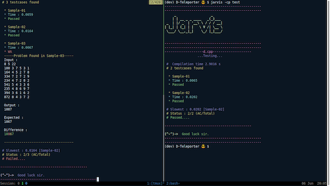
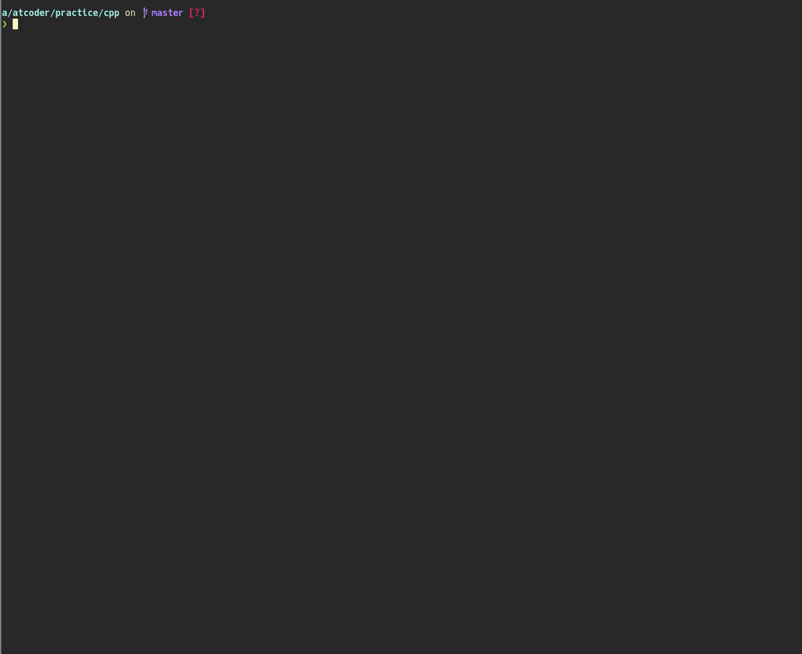

## 目次

<!-- START doctoc generated TOC please keep comment here to allow auto update -->
<!-- DON'T EDIT THIS SECTION, INSTEAD RE-RUN doctoc TO UPDATE -->

- [コマンドラインツール](#%E3%82%B3%E3%83%9E%E3%83%B3%E3%83%89%E3%83%A9%E3%82%A4%E3%83%B3%E3%83%84%E3%83%BC%E3%83%AB)
  - [ローカル環境でサンプルのテストを実行する](#%E3%83%AD%E3%83%BC%E3%82%AB%E3%83%AB%E7%92%B0%E5%A2%83%E3%81%A7%E3%82%B5%E3%83%B3%E3%83%97%E3%83%AB%E3%81%AE%E3%83%86%E3%82%B9%E3%83%88%E3%82%92%E5%AE%9F%E8%A1%8C%E3%81%99%E3%82%8B)
    - [任意の言語](#%E4%BB%BB%E6%84%8F%E3%81%AE%E8%A8%80%E8%AA%9E)
    - [複数の言語](#%E8%A4%87%E6%95%B0%E3%81%AE%E8%A8%80%E8%AA%9E)
    - [C++](#c)
    - [Python](#python)
    - [Ruby](#ruby)
    - [Rust](#rust)
  - [テンプレートを生成するツール](#%E3%83%86%E3%83%B3%E3%83%97%E3%83%AC%E3%83%BC%E3%83%88%E3%82%92%E7%94%9F%E6%88%90%E3%81%99%E3%82%8B%E3%83%84%E3%83%BC%E3%83%AB)
  - [テストケースを生成するツール](#%E3%83%86%E3%82%B9%E3%83%88%E3%82%B1%E3%83%BC%E3%82%B9%E3%82%92%E7%94%9F%E6%88%90%E3%81%99%E3%82%8B%E3%83%84%E3%83%BC%E3%83%AB)
  - [テストケースの追加を簡易化するツール](#%E3%83%86%E3%82%B9%E3%83%88%E3%82%B1%E3%83%BC%E3%82%B9%E3%81%AE%E8%BF%BD%E5%8A%A0%E3%82%92%E7%B0%A1%E6%98%93%E5%8C%96%E3%81%99%E3%82%8B%E3%83%84%E3%83%BC%E3%83%AB)
  - [ヒューリスティック型コンテストのためのテンプレートレポジトリ](#%E3%83%92%E3%83%A5%E3%83%BC%E3%83%AA%E3%82%B9%E3%83%86%E3%82%A3%E3%83%83%E3%82%AF%E5%9E%8B%E3%82%B3%E3%83%B3%E3%83%86%E3%82%B9%E3%83%88%E3%81%AE%E3%81%9F%E3%82%81%E3%81%AE%E3%83%86%E3%83%B3%E3%83%97%E3%83%AC%E3%83%BC%E3%83%88%E3%83%AC%E3%83%9D%E3%82%B8%E3%83%88%E3%83%AA)
  - [コードの高速化、バックアップなど](#%E3%82%B3%E3%83%BC%E3%83%89%E3%81%AE%E9%AB%98%E9%80%9F%E5%8C%96%E3%83%90%E3%83%83%E3%82%AF%E3%82%A2%E3%83%83%E3%83%97%E3%81%AA%E3%81%A9)
  - [問題の作成と準備を支援するツール](#%E5%95%8F%E9%A1%8C%E3%81%AE%E4%BD%9C%E6%88%90%E3%81%A8%E6%BA%96%E5%82%99%E3%82%92%E6%94%AF%E6%8F%B4%E3%81%99%E3%82%8B%E3%83%84%E3%83%BC%E3%83%AB)
  - [問題を自動で解くツール](#%E5%95%8F%E9%A1%8C%E3%82%92%E8%87%AA%E5%8B%95%E3%81%A7%E8%A7%A3%E3%81%8F%E3%83%84%E3%83%BC%E3%83%AB)

<!-- END doctoc generated TOC please keep comment here to allow auto update -->

## コマンドラインツール

キーボードの操作で特定の処理を簡単に行うことができます。

### ローカル環境でサンプルのテストを実行する

類似した機能を持つツールが多いため、対応言語ごとに分類しています。

#### 任意の言語

- [acc](https://github.com/Takachiha/acc)  - テスト、提出ができる。提出する言語は、オプションで新旧システムのいずれかを選択できる。
- [atcoder-cli](https://github.com/Tatamo/atcoder-cli)  - AtCoderでの利用に特化しているのが特徴。一部の機能は、後述の[Online Judge Tools](https://github.com/online-judge-tools/oj)に依存しており、導入が必要。日本語・英語ともにドキュメントが充実している。
- [AtCoderSupporter](https://github.com/shun0923/AtCoderSupporter)  - サンプルケースのテストと提出ができる。
- [AtCoder Tools](https://github.com/kyuridenamida/atcoder-tools)  - サンプルケースのダウンロードが便利になる。ログイン、サンプルのローカルテスト、コード提出、テンプレートからのコード自動生成機能などを備えている。

  

    
  

- [ICIE](https://marketplace.visualstudio.com/items?itemName=pustaczek.icie)  - 競技プログラミングに参加する上で、必要な機能を揃えた[Visual Studio Code](https://code.visualstudio.com/)の拡張機能。
- [OnlineJudgeHelper](https://github.com/nodchip/OnlineJudgeHelper)  - サンプルの入出力データを用いたテストや解答コードの提出ができるツール。これらの機能を備えた日本初のツールであり([出典](https://github.com/KATO-Hiro/AtCoderClans/issues/489))、後述する[Online Judge Tools](https://github.com/online-judge-tools/oj)などに大きな影響を与えた。注: 近年は、更新頻度がやや低下しており、最新のジャッジシステムに対応していない可能性もある。
- [Online Judge API Client](https://github.com/online-judge-tools/api-client)  - 後述する[Online Judge Tools](https://github.com/online-judge-tools/oj)における`oj` commandのbackendライブラリとして使われている。サンプルケースやコンテスト情報などを出力できる。
- [Online Judge Tools](https://github.com/online-judge-tools/oj)  - サンプルケースのダウンロード、テスト、提出ができる。作者により、インストールの手順と使い方が[動画](https://www.youtube.com/watch?v=wOKuJyJIpUg)で紹介されている。
  - 関連するツール・派生ツールが充実している。ランダムケースを出力するテンプレートを生成する[Online Judge Template Generator](https://github.com/online-judge-tools/template-generator)、テストケースを簡単に追加できる[editSampleCase](https://marketplace.visualstudio.com/items?itemName=imomo.editsamplecase)などがある。
  - 複数のコンテストサイトで利用可能。詳細は、[対応表](https://github.com/online-judge-tools/api-client#supported-websites)を参照されたい。

  

    
  

- [WrongAnswer](https://github.com/takoha-cpp/WrongAnswer)  - 指定した問題のテストケースをダウンロードする。利用には、前述の[Online Judge Tools](https://github.com/online-judge-tools/oj)が必須。使い方が日本語・英語で説明されている。

  

    
  

#### 複数の言語

- [AC Deck](https://github.com/sachaos/ac-deck)  - サンプルのテスト([Docker](https://www.docker.com/)にも対応)、提出ができる。対応言語は、C++ (GCC 9.2.1)、Python3 (3.8.2)、Go (1.14.1、[Gonum](https://www.gonum.org/)や[GoDS](https://github.com/emirpasic/gods)には未対応)。組み込みのテンプレートが用意されており、主要な言語に対応している。

  

    
  

- [AI-virtual-assistant-python](https://github.com/Saurav-Paul/AI-virtual-assistant-python)  - サンプルのテスト、ログイン・コードの提出だけでなく、テンプレートやテストケースの生成などの多くの機能を備えているツール。C++とPythonに対応している。

  

    
  

- [AtCoderFriends](https://github.com/nejiko96/at_coder_friends)  - サンプルのテスト・提出が[36言語](https://github.com/nejiko96/at_coder_friends/blob/master/docs/CONFIGURATION.md)に対応している。また、テンプレートコードの生成機能もある（RubyとC++はデフォルトで対応しており、他の言語もプラグインで追加できる）。
- [atsubmit](https://github.com/flow6852/atsubmit)  - サンプルの取得・テスト、提出、結果の閲覧を自動で行うことができる。テストケースの正誤判定は、HaskellとRustが可能。
- [getac](https://github.com/fukamachi/getac)  - サンプルのテストを実行できる。対応言語は、C、C++、Clojure、Common Lisp、Go、Haskell、Java、Node.js、Python、Ruby、Scheme。

  

    
  

- [Procon Tools](https://github.com/naipia/procon-tools)  - 競技プログラミングサイトに参加する上で必要な機能を提供している[Visual Studio Code](https://code.visualstudio.com/)の拡張機能。C++とGoに対応している。

- [Snowchains](https://github.com/qryxip/snowchains)  - サンプルケースのテスト、解答コードの提出に加えて、システムテストの取得もできる。C++とRustが利用可能。また、一部の機能を除いて、[Codeforces](https://codeforces.com/)、[yukicoder](https://yukicoder.me/)にも対応している。

  

    
  

#### C++

- [procon.vim](https://github.com/ogura01/procon.nvim)  - [Neovim](https://neovim.io/)プラグイン。
- [vim-atcoder](https://github.com/cannot-fly-pig/vim-atcoder)  - [Vim](https://www.vim.org/)でサンプルケースのテストするためのプラグイン。企業コンテストには、今後対応予定。

  

    
  

#### Python

利用するときは、Pythonのパッケージ管理システムであるpipが必要。

- [atc](https://github.com/nasjp/atc)  - 軽量のテストツール。

#### Ruby

利用するときは、Rubyのパッケージ管理システムであるGemが必要。

- [GreenDay](https://qiita.com/QWYNG/items/0e2e6b72bd1969d0d751)  - サンプルケースのテスト、提出ができる。

#### Rust

利用するときは、RustとRustのビルドシステムおよびパッケージマネージャであるCargoが必要。

- [cargo-atcoder](https://github.com/tanakh/cargo-atcoder)  - サンプルケースのダウンロード、テスト、提出ができる。使い方が日本語で丁寧に説明されている。

  

    
  

- [cargo-compete](https://github.com/qryxip/cargo-compete)  - コンテストへの参加登録・サンプルケースの取得およびテスト、提出ができる。日本語のドキュメントも充実している。また、[Codeforces](https://codeforces.com/)や[yukicoder](https://yukicoder.me/)にも対応している。

  

    
  

### テンプレートを生成するツール

- [Online Judge Template Generator](https://github.com/online-judge-tools/template-generator)  - [Online Judge Tools](https://github.com/online-judge-tools/oj)と連携したツール。コンテストの問題を解析して、提出用のコードやランダムケース生成に関するテンプレートを出力できる。C++とPythonに対応。また、有志による[紹介記事](https://hamukichi.hatenablog.jp/entry/2020/09/17/230818)もある。さらに、コマンドラインツールに不慣れなユーザに向けて[Webアプリ版](https://online-judge-tools.github.io/template-generator-webapp/)も公開されている。作者による注: コンテスト中はコマンドライン版のみ利用できる。

### テストケースを生成するツール

- [bug_finder](https://github.com/Eug1ena/bug_finder)  - テストケースをランダムに生成し、愚直な解法で実装したコードとバグを含むコードを比較できるツール。注: 対応言語は、C++17のみ。
- [testcase-generator](https://github.com/naskya/testcase-generator)  - ランダムな整数や文字列を生成できるツール。また、多数のテストケースを生成して、愚直に実装した解法(愚直解)と比較することも可能。

### テストケースの追加を簡易化するツール

- [editSampleCase](https://marketplace.visualstudio.com/items?itemName=imomo.editsamplecase)  - [online-judge-tools/oj](https://github.com/online-judge-tools/oj)のサンプルデータにテストケースを簡単に追加できる[Visual Studio Code](https://code.visualstudio.com/)の拡張機能。詳しい使い方は、作者の[紹介記事](https://iiiimmmmo.hatenablog.com/entry/2020/12/21/153307)を参照されたい。

  

    
  

### ヒューリスティック型コンテストのためのテンプレートレポジトリ

- [kmyk/marathon-kit](https://github.com/kmyk/marathon-kit)  - AtCoder Heuristic Contestのためのテンプレートレポジトリ。テストの並列実行、途中経過のビジュアライズ、GitHubでの自動テストが実行できる。

### コードの高速化、バックアップなど

- [AtCoder_GitCommit](https://github.com/xryuseix/AtCoder_GitCommit) - 提出したコードをGitHubに自動でバックアップする。
- [atcoder-numba](https://github.com/pyatcoder/atcoder-numba) - NumbaのJITを使用したコードをAOT(事前)コンパイルして、提出することができる。Pythonのパッケージ管理システムであるpipが必要。
- [AtCoderStreak](https://github.com/naminodarie/AtCoderStreak) - 遅延提出で[AtCoder Problems](https://kenkoooo.com/atcoder/)のStreakをつなぐ。

### 問題の作成と準備を支援するツール

問題を作成されるときには、役割分担・作業工程などを把握するために、[関連記事](https://kato-hiro.github.io/AtCoderClans/media#%E5%95%8F%E9%A1%8C%E4%BD%9C%E6%88%90%E3%81%A8%E6%BA%96%E5%82%99)を参照することを推奨いたします。

- [Rime](https://github.com/icpc-jag/rime)  - コンテストの問題セット作成を補助するツール。少なくとも国内では、デファクトスタンダードになっている([出典](https://github.com/KATO-Hiro/AtCoderClans/issues/489))。[日本語のドキュメント](https://rime.readthedocs.io/ja/latest/)も充実している。
  - [Rime on Windows10](https://nebocco.hatenablog.com/entry/2021/05/01/223000) - Window10で利用する方法を紹介した記事。
  - 拡張プラグイン[Rime+](https://github.com/icpc-jag/rime-plus)の内容も取り込まれていることから、[Rime+の作者による紹介記事](https://qiita.com/hiroshi-cl/items/fbd0d0963d8207d33bc6)も参考になると思われる。
- [rules_contest](https://github.com/nya3jp/rules_contest)  - コンテストの問題準備に関するタスクを自動化するツール。
- [statements-manager](https://github.com/tsutaj/statements-manager)  - 問題文の管理を便利にするツール。

### 問題を自動で解くツール

- [Jikka](https://github.com/kmyk/Jikka)  - 式変形を行ったり、データ構造のライブラリを貼ったりするだけで解ける問題を自動で解くツール。
  - [jikka-example](https://github.com/uta8a/jikka-example)  - AtCoder Beginner Contestで出題された問題を対象として、同ツールで生成されたC++コードの正誤状況を検証している。
- [proof_assistant](https://github.com/kotatsugame/proof_assistant)  - 対話形式で定理を証明するツール。
