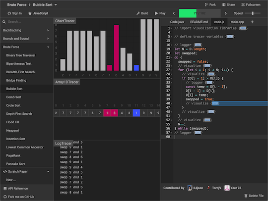
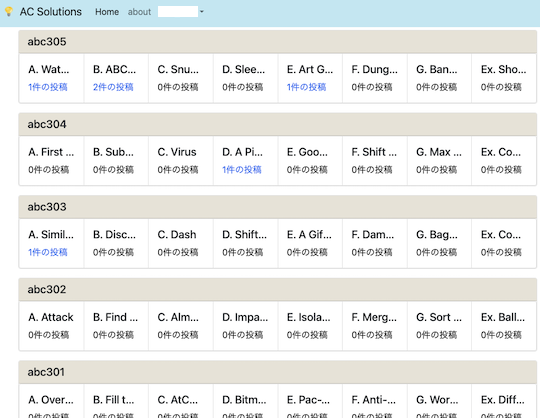
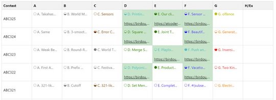
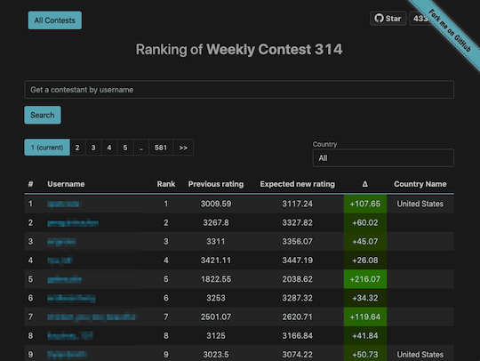

リンクが切れていると思われるサービス・ツールなどを掲載しています。

一定の期間(3〜6か月程度)更新されない場合は、「[開発・提供終了](../no_longer_available)」ページへ移動させたいと思います。

<!-- markdown-link-check-disable -->

## 入門者・初心者向け

- [間違っているテストケースが見つけられないときの手法](https://sumatome.com/su/1294961358119739392) - [chokudai](https://twitter.com/chokudai)さんによる一連のツイートをまとめた記事です。[ABC175-C問題](https://atcoder.jp/contests/abc175/tasks/abc175_c)を例に、間違っているテストケースを見つける方法が解説されています。

- [競技プログラミングとの向き合い方に関する記事](https://note.com/fidia0709/n/n3bde5443cd17) - 競技プログラミングを続ける上で必要なメンタル面に関するアドバイスが書かれた記事です。

- [AtCoder TestCase Extension](https://chrome.google.com/webstore/detail/atcoder-testcase-extensio/klmflnjcfalpmeldgkcinfilloihmbdh?hl=ja&gl=UA) - 公開されているテストケースのリンクを表示するChrome拡張機能を利用してみましょう。入出力データを使って、回答コードのデバッグを行うことができます。

    

      
    

    !!! warning "注意"
        一部のコンテストでは、対応していない場合があります。

## Webアプリ・Webサイト

### チーム分けを行う

- [TeamMaker](https://compro.tsutajiro.com/cp-teammaker/index.php) - 競技プログラミングにおけるチーム分けを補助する。beta版。
    - 確認した日: 2023/12/15

  

    
  

### 有名アルゴリズムを可視化

- [Algorithm Visualizer](https://algorithm-visualizer.org)  - 有名なアルゴリズムを視覚的に理解することができる。
    - 確認した日: 2024/07/12

    

      
    

### 解法・解説を共有

- [AC Solutions](https://ac-solutions.onrender.com/) - (ベータ版) 問題の解法・解説を共有できる。

    

      
    

### 復習の効果をより高める

- [AtCoderBlogs](https://atcoder-blogs.jp) - 問題の思考過程や解法を整理したブログを掲載・閲覧できる。
    - 確認した日: 2024/08/06

    

      
    

### コンテストの成績を見る

- [AtCoder Rating Comparison](https://atcoder-rating-comparison.herokuapp.com/?q=) - 指定した2人以上のレーティングの比較ができる。[Codeforces版](https://rika0384.github.io/codeforces_rating_comparison/)も公開されている。
    - 確認した日: 2024/07/12

    

      
    

### コンテスト・問題に関する統計情報

- [AC heatmap](https://rika0384.github.io/ac-heatmap/?handle_atcoder=&handle_codeforces=&handle_aoj=&handle_yukicoder=) - 任意のユーザが[AtCoder](https://atcoder.jp/)、[Codeforces](https://codeforces.com/)、[AOJ (AIZU ONLINE JUDGE)](https://onlinejudge.u-aizu.ac.jp/home)、[yukicoder](https://yukicoder.me/)で解いた問題のうち、unique ACをヒートマップで表示する。
    - 確認した日: 2024/07/12

    

      
    

- [AtCoder Code Evaluate](https://ac-code-eval.com/) - 問題の実装の重さをAC(Accepted)コードをもとに評価しているWebアプリ。
    - 確認した日: 2022/06/23
    - 理由: バグにより主要な機能が動作していない可能性が高いため([出典](https://twitter.com/IT_parsely/status/1319228723908857856))
    - 代替手段: 調査中。

- [AtCoder Hot Problems](https://new-hot-problems.herokuapp.com/ranking/) - 任意の期間(1〜30日)における問題別の提出数を集計し、上位100問を表示する。
    - 確認した日: 2022/07/15

    

      
    

- [tc-wleite/tc-wleite.github.io](https://github.com/tc-wleite/tc-wleite.github.io)  - [AtCoder Heuristic Contest (AHC)](https://atcoder.jp/contests/archive?ratedType=4&category=0&keyword=)の最終成績や制約条件別の得点・順位を見ることができる。[Topcoder](https://www.topcoder.com/)のMarathon Matches(MM)についても、同様の集計がされている。
    - [AHC 017](https://tc-wleite.github.io/ahc017.html)
    - [AHC 016](https://tc-wleite.github.io/ahc016.html)
    - [AHC 014](https://tc-wleite.github.io/ahc014.html)
    - [AHC 013](https://tc-wleite.github.io/ahc013.html)
    - [AHC 011](https://tc-wleite.github.io/ahc011.html)
    - [AHC 008](https://tc-wleite.github.io/ahc008.html)

    

      
    

### Bot

- [AtCoder Notify](https://atcoder-bot.firebaseapp.com/) - コンテスト情報を通知する。
    - 確認した日: 2023/01/27

    

      
    

## スクリプト

### おすすめの紹介

- [AtCoderを120%楽しむために便利な拡張機能](https://dailylife.dev/posts/79#body) - 記事の作成者が便利だと感じたユーザスクリプトや拡張機能が紹介されている記事。初めて使う方にもおすすめ。
    - 確認した日: 2022/02/09

### テストケースを見る

- [AtCoder TestCase Extension](https://chrome.google.com/webstore/detail/atcoder-testcase-extensio/klmflnjcfalpmeldgkcinfilloihmbdh?hl=ja&gl=UA) - 公開されているテストケースへのリンクを追加する。ABC/ARC/AGC以外のコンテストは一部未対応の場合もある。

    

      
    

## 記事

### 入門者・初心者向けの内容

- [私と競プロと教育活動（Qiita Night LT 資料）](https://www.slideshare.net/MasatakaYoneda/qiita-night-lt) - 記事「[現役高校生が、AtCoderでレッドコーダーになるまでにやってきたこと。プログラミング上達の秘訣を全て教えます](https://engineer-lab.findy-code.io/redcoder)」の続編とも言えるスライド。
    - 確認した日: 2021/12/01

### コードを書くための環境構築を行う

- [AtCoder用C++開発環境 (Mac編)](https://blog.spiralray.net/cp/devenv-cpp) - 動作環境は、macOS Catalina。C++17(デバッグ:Clang、テスト実行・提出: G++)のコンパイル・実行環境を[Visual Studio Code](https://code.visualstudio.com/)と、拡張機能を使って構築する方法が紹介されている。サンプルケースの実行や提出もできる。
    - 確認した日: 2024/02/22
- [競プロ環境構築 Ubuntu on Win10 #1 共通編](https://oucrc.net/articles/e6vkrz4uqtt/) - Windows Subsystem for Linux (WSL2)を利用した実行環境の構築方法が紹介されている。テキストエディタや便利なツールの導入・使用方法も解説されている。[#2 C/C++編](https://oucrc.net/articles/o2ql0oomqfd/)で紹介されているC++のコンパイラと[AtCoder Library](https://github.com/atcoder/ac-library)の導入方法も併せて参照されたい。
    - 確認した日: 2023/06/13

### アルゴリズムを学ぶ

- [誰でも分かる！ランダム性を利用した平衡二分木](https://qiita.com/Kodaman_KoD/items/5868462d530782e0a3a0) - ランダム性を利用した平行二分木について、丁寧に解説した記事。平行二分木の図解、ランダム性を利用する方法やC++による実装について説明されている。
    - 確認した日: 2022/09/05

- [DPの俗称](https://www.mathenachia.blog/dp/) - 典型的なDPの特徴を表す俗称と、それらの概要がまとめられている。
    - 確認した日: 2024/10/12

### ヒューリスティック問題を解く

- [マラソンマッチの取り組み方](http://www.colun.net/archives/294) - ヒューリスティック型コンテストの取り組み方について、3つの観点(問題の把握・判断基準の明確化・反復期間の短縮)に集約して説明した記事。
    - 確認した日: 2024/07/24
- [焼きなまし法の真実](http://www.colun.net/archives/774) - 焼きなまし法に関する疑問点・コンテストを通して得られた知見が整理されている記事。
    - 確認した日: 2024/07/24

    !!! warning "注意"
        前提条件として、焼きなまし法に関する一定程度の知識が求められる。

### 数学を学ぶ

- [異常modまとめ](https://hyado.hatenablog.jp/entry/2020/12/07/000000) - 場合の数を大きな素数で割った余りを求める問題において、珍しい素数や有名な素数に近い値が出題された事例を紹介した記事。
    - 確認した日: 2022/02/24
- 接続行列を係数にもつ線形方程式 (PDF)[archive.org](http://web.archive.org/web/20201101013405/https://opt-cp.com/linear-system-incidence/) - 「グラフの接続行列を係数にもつ線形方程式」の解法を説明した記事。また、解法の擬似コードやコンテストの例題も掲載されている。
    - 確認した日: 2022/10/03
- 形式的冪級数（FPS）が使えるAtCoderの問題リスト + 解説（随時更新）[archive.org](http://web.archive.org/web/20201101035012/https://opt-cp.com/fps-problem-list/) - 形式的冪級数が活用できる問題リスト。
    - 確認した日: 2022/10/03
- ミニマックス定理の意味と初等的証明[archive.org](http://web.archive.org/web/20220616233449/https://opt-cp.com/minimax-game-proof/) - ミニマックス定理のゲーム理論的な意味の解釈方法と同定理の証明を紹介した記事。
    - 確認した日: 2022/10/03

### 実装テクニックを学ぶ

- [間違っているテストケースが見つけられないときの手法](https://sumatome.com/su/1294961358119739392) - [chokudai](https://twitter.com/chokudai)さんによる一連のツイートをまとめた記事。[ABC175-C問題](https://atcoder.jp/contests/abc175/tasks/abc175_c)を例に、間違っているテストケースを見つける方法が解説されている。併せて、[テストを自動化するツール](https://kato-hiro.github.io/AtCoderClans/cli)の導入についても前向きなコメントがされている。
    - 確認した日: 2022/12/17
- [競技プログラミングでprintデバッグ](https://naskya.net/post/0002/) - printデバッグを素早く行うためのマクロを紹介した記事。任意の引数、データ型を扱うことができる上、可読性を高める工夫もされている。
    - 確認した日: 2023/09/06

### 解説ブログ・サイトを見る

- [うさぎ小屋](https://kimiyuki.net/) - [kimiyuki](https://atcoder.jp/users/kimiyuki)さんの解説ブログ。C++で実装されている。
    - 確認した日: 2022/02/17

    ---

    - [競プロ環境構築入門](https://kimiyuki.net/blog/2020/11/11/modern-environments-for-competitive-programming/) - 競技プログラミングという文脈において「環境構築」の意味や実現できることについて理解を深めることを目的とした記事。注: これから環境構築を行う場合は、より具体的な手順が書かれた記事を並行して読むことを推奨。
    - なお、二分法との違いを知りたい場合は、別の著者による[解説記事](https://kimiyuki.net/blog/2020/11/07/binary-search-and-bisection-method/)を参照されたい。
    - [集合 列 多重集合 違い](https://kimiyuki.net/blog/2020/11/03/set-sequence-multiset/) - 集合・列・多重集合の違いと記法について解説した記事。これらの要素を含む問題を作成・公開する前に確認すると、回答者に誤解されにくい問題文を用意できると思われる。
    - [競技プログラミングにおける個人的C++コーディングスタイル(2020)](https://kimiyuki.net/blog/2020/10/25/coding-style-for-competitive-programming/) - [kimiyuki](https://atcoder.jp/users/kimiyuki)さんの好みのコーディングスタイルについて、競技プログラミングという文脈での利点と批判の両面から紹介した記事。
    - [プログラミング言語処理系の作り方 (競プロer向け)](https://kimiyuki.net/blog/2021/08/05/how-to-make-your-own-interpreter/) - 競技プログラマーに向けて、言語処理系の作り方やその難易度について説明した記事。

- [optの競プロブログ](https://opt-cp.com/) - [opt](https://atcoder.jp/users/opt)さんの解説ブログ。数学に関する解説・証明を扱った記事が多い。
    - 確認した日: 2022/10/03

### 部活・サークル・同好会に参加する

- [AtCoder座談会 - deepblue](https://deepblue-ts.co.jp/competition/atcoder_symposium/) - 株式会社deepblueのメンバーによる座談会。練習方法や好きな問題、今後の目標などについて語られている。
    - 確認した日: 2022/10/23

### 競技プログラミングと就転職

- [AtCoder Jobsを使って転職しました](https://xkttqm.hatenablog.com/entry/2021/08/04/230000) - IT業界未経験の状態から転職を考えたきっかけ・[AtCoderJobs](https://jobs.atcoder.jp/)を利用した転職活動が紹介されている記事。
    - 確認した日: 2024/01/22
- [AtCoder純粋培養緑コーダーが転職ACするまで](https://seashellpink-frostywhite.hatenablog.com/entry/2021/03/31/185821) - [riano_](https://atcoder.jp/users/riano_)さんが[AtCoderJobs](https://jobs.atcoder.jp/)を利用してIT業界未経験の状態から転職した経験談を紹介した記事。
    - 確認した日: 2022/6/02
- [AtCoderでしかプログラミングを知らない生物学徒がハッカソンに挑戦してみた話](https://tsuna-lab.hatenablog.com/entry/2021/04/28/233453) - ハッカソンに初めて参加した筆者が、チーム開発で経験した内容を紹介した記事。
    - 確認した日: 2023/03/05
- [日本初のITコンサル「フューチャー」が競技プログラマーを積極採用する理由とは？～ヒューリスティック形式の競プロコンテスト「HACK TO THE FUTURE」を主催〜](https://prtimes.jp/story/detail/YxRv5Ksa8Dx) - [chokudai](https://twitter.com/chokudai)さんと[tsukammo](https://atcoder.jp/users/tsukammo)さんの対談記事。ヒューリスティック型コンテストを開催するまでの経緯、競技プログラマーの強みと業務との関連性、今後の展望など幅広い話題に言及されている。
    - 確認した日: 2023/02/18

## ブログ

- [はてなブログ - RheoTommy](https://rheotommy.hatenablog.com/)
    - 確認した日: 2024/09/02
- [自作ブログ - colun](http://www.colun.net/blog)
    - 確認した日: 2024/07/24
- [自作ブログ - ninja7](https://melting.love/blog/)
    - 確認した日: 2024/05/25
- [自作ブログ - hamadu](https://hamadu.net/)
    - 確認した日: 2023/10/14
- [はてなブログ - blackyuki](https://black-yuki.hatenablog.com/)
    - 確認した日: 2023/09/11
- [自作ブログ - opt](https://opt-cp.com/)
    - 確認した日: 2022/10/03
- [Qiita - KoD](https://qiita.com/Kodaman_KoD)
    - 確認した日: 2022/09/05
- [はてなブログ - yochan](https://www.yochan.blog/main/)
    - 確認した日: 2022/07/02

## 動画

### VTuber

- [ちょこちょこっ](https://www.youtube.com/c/chocochocoxtu/featured) - [chocochocoxtu](https://atcoder.jp/users/chocochocoxtu)さんのYouTubeチャンネル。コンテストの過去問を解く動画などが公開されている。
    - 確認した日: 2021/11/17

## ライブラリ・スニペット

### ACLの使用方法の解説

- 遅延伝播セグメント木の使い方，ACLPC: K – Range Affine Range Sumの解説[archive.org](http://web.archive.org/web/20210207063437/https://opt-cp.com/lazysegtree-aclpc-k/) - [opt](https://atcoder.jp/users/opt)さんによる遅延伝播セグメント木(lazysegtree)の使い方を解説した記事。`lazysegtree`をブラックボックスとして使えるようになることを目標としており、「モノイド」などの用語を一切使わずに説明されている点が特徴。例題として、[コンテストで出題された問題](https://atcoder.jp/contests/practice2/tasks/practice2_k)の解説もある。さらに、つまづきやすいポイントが別の記事[archive.org](http://web.archive.org/web/20201211073151/https://opt-cp.com/lazysegtree-practice/)でカバーされている。
    - 確認した日: 2022/10/03

- [AtCoder Library 解読 〜Pythonでの実装まで〜](https://qiita.com/R_olldIce) - ライブラリのアルゴリズムに関する解説とPythonによる実装例が紹介されている。
    - 確認した日: 2022/12/17

### ライブラリチェッカー

- [競プロAdC やってるみたいなので Library Checker の解法紹介をぶっこむ](https://www.mathenachia.blog/library-report-2022/) - 有志が問題の解法を解説した記事。
    - 確認した日: 2024/10/12

### ACL Kotlin

- [da-louis/ac-library-kt](https://github.com/da-louis/ac-library-kt)  - [AtCoder Library (ACL)](https://atcoder.jp/posts/517)のKotlin版。[Java版](https://github.com/NASU41/AtCoderLibraryForJava)をベースに作成されている。
    - 確認した日: 2022/03/16

### 複数の言語

- [The Algorithms - Webサイト版](https://the-algorithms.com/)

### Node.js

- [DecoratedKnight/js-cp-template](https://github.com/DecoratedKnight/js-cp-template/tree/0a09186b4bbf8dcb040f23e202957b40071f8b35)  - [decoratedknight](https://atcoder.jp/users/decoratedknight)さんのNode.jsテンプレート。
    - 確認した日: 2022/02/12

### Python

- [summersky08/CompetitiveProgramming](https://github.com/summersky08/CompetitiveProgramming)  - rkato5680さんのPythonライブラリ。
    - 確認した日: 2022/05/02

### Ruby

- [universato/compro](https://github.com/universato/compro)  - [universato](https://atcoder.jp/users/universato)さんのRubyライブラリ。
    - 確認した日: 2022/11/17

## 色変記事

### レーティング400〜799(茶色)

- [AtCoderで茶色になりました（色変記事） - 岸原オカルト研究部](https://kisihara-c.hatenablog.com/entry/2021/01/03/123133) - [kisihara_c](https://twitter.com/kisihara_c)さんが、2021年1月3日に公開。
    - 確認した日: 2024/07/04

- [14歳がAtCoderで入茶しました](https://note.com/mizzpika/n/n6b1714aa2ad1) - [mizuho0613](https://atcoder.jp/users/mizuho0613)さんが、2024年1月14日に達成。
    - 確認した日: 2024/06/28

- [数弱大学生がatcoderで入茶した](https://note.com/yindolsa/n/ncd59431b7a4d) - [ZUkA_](https://atcoder.jp/users/ZUkA_)さんが、2023年1月7日に達成。
    - 確認した日: 2024/02/14

- [【AtCoder】茶に色変記念にラブコメ作品紹介します【競プロ】](https://untitledreport.com/%e3%80%90atcoder%e3%80%91%e3%82%88%e3%81%86%e3%82%84%e3%81%8f%e8%8c%b6%e3%81%ab%e8%89%b2%e5%a4%89%e3%81%99%e3%82%8b%e3%81%93%e3%81%a8%e3%81%8c%e3%81%a7%e3%81%8d%e3%81%be%e3%81%97%e3%81%9f%e3%80%90/) - [ysknsid25](https://atcoder.jp/users/ysknsid25)さんが、2022年12月3日に達成。
    - 確認した日: 2024/02/03

- [入茶しました。](https://note.com/coco__0715/n/n655dc80fc5b6) - [coco0715](https://atcoder.jp/users/coco0715)さんが、2023年8月12日に達成。
    - 確認した日: 2023/12/28

- [【初投稿】AtCoder茶色になりました](https://note.com/kikka_mfybyr/n/n864aeb594ab1) - [Mafuyu](https://atcoder.jp/users/Mafuyu)さんが、2023年2月4日に達成。
    - 確認した日: 2023/10/29

- [入茶しました[AtCoder]](https://qiita.com/ramen0702/items/8e0f28b09796253b245f) - [missosiru](https://atcoder.jp/users/missosiru)さんが、2022年10月22日に達成。
    - 確認した日: 2023/10/17

- [【色変記事】社会人がAtCoder茶色になるまで1年半かかりました](https://qiita.com/satouMIMIMI/items/497b22ab2a89a02d5174) - mimimi0414さんが、2023年1月1日に公開。
    - 確認した日: 2023/04/07

- [Python未経験からAtCoder茶色になったよ！ - Dr. Koala’s Blog](https://mountkoara.hatenablog.com/entry/2021/06/29/Python%E6%9C%AA%E7%B5%8C%E9%A8%93%E3%81%8B%E3%82%89AtCoder%E8%8C%B6%E8%89%B2%E3%81%AB%E3%81%AA%E3%81%A3%E3%81%9F%E3%82%88%EF%BC%81) - [DY811](https://atcoder.jp/users/DY811)さんが、2021年6月26日に達成。
    - 確認した日: 2023/03/04

- [Atcoderで茶色になりました - sin471のブログ](https://sin471.hatenablog.com/entry/2022/02/06/003702) - [sin471](https://atcoder.jp/users/sin471)さんが、2022年2月5日に達成。
    - 確認した日: 2022/06/21

- [【入茶記事】AtCoderで茶色になりました！](https://note.com/takuma1229/n/n4c013fca8439) - [takuma1229](https://atcoder.jp/users/takuma1229)さんが、2021年11月27日に達成。
    - 確認した日: 2021/12/19

### レーティング800〜1199(緑色)

- [AtCoder色変記事（緑）。あるいは趣味としての競プロの勧め。 - 加具留矢流余](https://mikebird28.hatenablog.jp/entry/2020/11/09/223426) - [toritoritori29](https://atcoder.jp/users/toritoritori29)さんが、2020年11月8日に達成。
    - 確認した日: 2024/09/27

- [入緑記事 - rotti_coderのプログラミング](https://rotti-coder.hatenablog.com/entry/2023/08/13/085808) - [rotti](https://atcoder.jp/users/rotti)さんが、2023年8月12日に達成。
    - 確認した日: 2024/09/25

- [緑コーダー(AtCoder)になった和洋 - みどマメモ](https://mdrm1rou.hatenablog.com/entry/2021/07/12/013644) - [MDMA](https://atcoder.jp/users/MDMA)さんが、2021年7月10日に達成。
    - 確認した日: 2024/05/14

- [数学が苦手な大学生の AtCoder 入緑記事](https://note.com/yindolsa/n/n512d1530339e) - [ZUkA_](https://atcoder.jp/users/ZUkA_)さんが、2023年9月16日に達成。
    - 確認した日: 2024/05/09

- [atcoderで入緑したのでやったことをまとめる](https://qiita.com/koriori/items/001e85e790ed8e9fd43b) - [koriori](https://atcoder.jp/users/koriori)さんが、2021年9月26日に達成。
    - 確認した日: 2024/02/25

- [30代プログラミング初心者がAtCoderで緑色になった所感](https://zenn.dev/shinsatt/articles/81a926fe88987f) - [shinsatt](https://atcoder.jp/users/shinsatt)さんが、2021年7月4日に達成。
    - 確認した日: 2022/01/19

### レーティング1200〜1599(水色)

- [AtCoderで水色になりました(入水記事)](https://fiboooo.com/atcoder-lightblue/) - [fibon](https://atcoder.jp/users/fibon)さんが、2024年1月2日に公開。
    - 確認した日: 2024/10/03

- [水色を踏みました(AtCoder アルゴリズム部門)](https://ynm3n.blogspot.com/2022/12/atcoder.html) - [ynm3n](https://atcoder.jp/users/ynm3n)さんが、2022年12月10日に達成。
    - 確認した日: 2024/05/14

- [【色変記事】AtCoder水色になりました](https://blog.powell1213.com/2023/07/23/atcoder-cyan/) - [powell](https://atcoder.jp/users/powell)さんが、2023年7月22日に達成。
    - 確認した日: 2024/03/22

- [python使ってAtCoderで水色になるまで - xkttqm's blog](https://xkttqm.hatenablog.com/entry/2021/01/17/140000) - [at12](https://atcoder.jp/users/at12)さんが、2021年1月16日に達成。
    - 確認した日: 2024/01/22

- [3年かかってやっと水色コーダーになった話](https://qiita.com/kanten4205/items/60962a67ff36e647c373) - [Kanten4205](https://atcoder.jp/users/Kanten4205)さんが、2021年6月6日に達成。
    - 確認した日: 2024/01/15

- [【色変記事（入水）】return文さえ理解していない俺が水色に！？　～今更unratedと言ってももう遅い～](https://qiita.com/rei_pandada/items/c46615469b0a2baab238) - [rei_pandada](https://atcoder.jp/users/rei_pandada)さんが、2023年6月24日に達成。
    - 確認した日: 2024/01/01

- [入水記事 - AFKK](https://afkk.hatenablog.com/entry/2023/09/25/180656) - [NEET0321](https://atcoder.jp/users/NEET0321)さんが、2023年9月25日に公開。
    - 確認した日: 2023/10/22

- [AtCoderで水色になりました！ - bit_kyoproの日記](https://bit-kyopro.hatenablog.com/entry/2021/11/10/202718) - [bit_zentansaku](https://atcoder.jp/users/bit_zentansaku)さんが、2021年11月7日に達成。
    - 確認した日: 2022/03/28

- [AtCoderで水になったのでなんか書く - Takeshiのブログ](https://takesyhi.hatenablog.com/entry/2021/10/07/152435) - [Coordinator](https://atcoder.jp/users/Coordinator)さんが、2021年10月7日に公開。
    - 確認した日: 2022/02/03

### レーティング1600〜1999(青色)

- [AtCoder青になりました](https://note.com/ococonomy1/n/n9eaf09ee0685) - [ococonomy1](https://atcoder.jp/users/ococonomy1)さんが、2023年4月1日に達成。
    - 確認した日: 2024/07/12

- [AtCoderで青色になったので記事を書いてみる](https://www.ochappa.net/posts/atc-blue) - [shinnshinn](https://atcoder.jp/users/shinnshinn)さんが、2024年3月30日に達成。
    - 確認した日: 2024/04/28

- [AtCoder青色になりました](https://note.com/treewhitetree/n/ned03462f84a2) - [Medakaa](https://atcoder.jp/users/Medakaa)さんが、2021年11月21日に達成。
    - 確認した日: 2023/12/15

- [【色変記事】AtCoder青になりました - piddy’s blog](https://piddy-cp.hatenablog.com/entry/2021/10/31/015517) - [piddy](https://atcoder.jp/users/piddy)さんが、2021年10月30日に達成。
    - 確認した日: 2022/06/11

- [AtCoder青になった感想 - An Engineering Student's Frank Report.](https://hachiji.hatenadiary.com/entry/2021/07/31/230301) - [AngrySadEight](https://atcoder.jp/users/AngrySadEight)さんが、2021年7月25日に達成。
    - 確認した日: 2022/09/17

### 休止

- [競技プログラミングを休んでいる理由 - little star's memory](https://koboshi-kyopro.hatenablog.com/entry/2021/05/24/012158) - [koboshi](https://atcoder.jp/users/koboshi)さんが2021年5月24日に公開。
    - 確認した日: 2022/05/23

### 現役引退

- [競技プログラミングから離れるという選択肢](https://note.com/lyu_lu/n/nb4287c27e026) - lyu_luさんが、2021年5月22日に退会。
    - 確認した日: 2024/03/04

## 関連コンテストサイト

### CafeCoder

- [CafeCoder](https://cafecoder.top/) - 有志によって、不定期にコンテストが開催されている。

    

      
    

### Codeforces

- [CF-Predictor](https://cf-predictor-frontend.herokuapp.com/) - コンテストの結果に基づいて、レーティングの変化を推定するWebアプリ。また、複数のブラウザに対応した拡張機能をダウンロードして利用することもできる。

    

      
    

- [Codeforces Rating Comparison](https://rika0384.github.io/codeforces_rating_comparison/) - 指定した2人以上のレーティングの比較ができる。
    - 確認した日: 2024/07/12

    

      
    

### Leetcode

- [Leetcode Rating Predictor](http://lcpredictor.herokuapp.com/)  - コンテスト終了直後に、レーティングの変動を見ることができる。[Google Chromeの拡張機能](https://chrome.google.com/webstore/detail/lc-predictor/jfhgaegpgiepniiebglgjhhfnjcibphh)も用意されている。

    

      
    

### 情報オリンピック

- [夏季セミナーで効率の良いアルゴリズムを一緒に学ぼう！（中高生対象：8/17～8/20の4日間, 設定：初級, 中級, 上級コース）](https://jcioi-summer-seminar-2023.peatix.com/) - 情報科学に興味のある中高生・高専生を対象として、オンラインの勉強会の参加者を募集している記事。

    !!! warning "注意"
        ・募集期間: 7月3日(月)〜8月10日(木) 12:00　(定員になり次第、締め切り)

        ・テキストを自己負担で事前に用意する必要がある

### TopCoder

- [Topcoder ARENA (Applet)](https://www.topcoder.com/contest/arena/ContestAppletProd7.2.jnlp) - 過去問を解くときに必要なアプリをダウンロードするためのリンク。

### Wind Bel Contest

- [Wind Bel Contest](https://mario.exout.net/contests/) - テーマ別のコンテストが不定期に開催されている。

    !!! warning "注意"
        [AtCoder](https://atcoder.jp/)とは、提出方法やSNSへの書き込みのルールが異なるため、事前の確認を推奨。

    

      
    

### 数学系コンテスト

- [入試数学コンテスト](https://manabitimes.jp/tests) - 数学の入試対策ができるコンテストサイト。
    - 確認した日: 2022/07/03

    

      
    

- [OnlineMathContest 黄色になりました](https://note.com/treewhitetree/n/nb7d577fc24a4) - [Treewhitetree](https://onlinemathcontest.com/users/Treewhitetree)さんが、2021年11月2日に黄Solverに昇格。
    - 確認した日: 2023/12/15

<!-- markdown-link-check-enable -->
