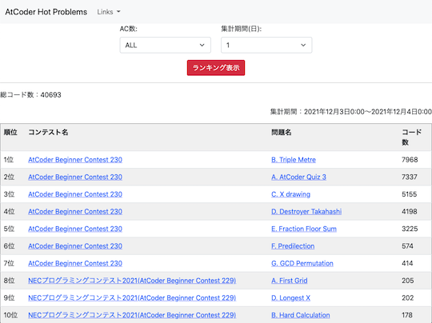

リンクが切れていると思われるサービス・ツールなどを掲載しています。

一定の期間(3〜6か月程度)更新されない場合は、「[開発・提供終了](../no_longer_available)」ページへ移動させたいと思います。

<!-- markdown-link-check-disable -->

## 入門者・初心者向け

- [競技プログラミングとの向き合い方に関する記事](https://note.com/fidia0709/n/n3bde5443cd17) - 競技プログラミングを続ける上で必要なメンタル面に関するアドバイスが書かれた記事です。

## Webアプリ・Webサイト

### 問題に関する統計情報

- [AtCoder Code Evaluate](https://ac-code-eval.com/) - 問題の実装の重さをAC(Accepted)コードをもとに評価しているWebアプリ。
    - 確認した日: 2022/06/23
    - 理由: バグにより主要な機能が動作していない可能性が高いため([出典](https://twitter.com/IT_parsely/status/1319228723908857856))
    - 代替手段: 調査中。

- [AtCoder Hot Problems](https://new-hot-problems.herokuapp.com/ranking/) - 任意の期間(1〜30日)における問題別の提出数を集計し、上位100問を表示する。
    - 確認した日: 2022/07/15

    

      
    

## スクリプト

### おすすめの紹介

- [AtCoderを120%楽しむために便利な拡張機能](https://dailylife.dev/posts/79#body) - 記事の作成者が便利だと感じたユーザスクリプトや拡張機能が紹介されている記事。初めて使う方にもおすすめ。
    - 確認した日: 2022/02/09

## 記事

### 入門者・初心者向けの内容

- [私と競プロと教育活動（Qiita Night LT 資料）](https://www.slideshare.net/MasatakaYoneda/qiita-night-lt) - 記事「[現役高校生が、AtCoderでレッドコーダーになるまでにやってきたこと。プログラミング上達の秘訣を全て教えます](https://engineer-lab.findy-code.io/redcoder)」の続編とも言えるスライド。
    - 確認した日: 2021/12/01

### アルゴリズムを学ぶ

- [誰でも分かる！ランダム性を利用した平衡二分木](https://qiita.com/Kodaman_KoD/items/5868462d530782e0a3a0) - ランダム性を利用した平行二分木について、丁寧に解説した記事。平行二分木の図解、ランダム性を利用する方法やC++による実装について説明されている。
    - 確認した日: 2022/09/05

### 数学を学ぶ

- [異常modまとめ](https://hyado.hatenablog.jp/entry/2020/12/07/000000) - 場合の数を大きな素数で割った余りを求める問題において、珍しい素数や有名な素数に近い値が出題された事例を紹介した記事。
    - 確認した日: 2022/02/24
- 接続行列を係数にもつ線形方程式 (PDF)[archive.org](http://web.archive.org/web/20201101013405/https://opt-cp.com/linear-system-incidence/) - 「グラフの接続行列を係数にもつ線形方程式」の解法を説明した記事。また、解法の擬似コードやコンテストの例題も掲載されている。
    - 確認した日: 2022/10/03
- 形式的冪級数（FPS）が使えるAtCoderの問題リスト + 解説（随時更新）[archive.org](http://web.archive.org/web/20201101035012/https://opt-cp.com/fps-problem-list/) - 形式的冪級数が活用できる問題リスト。
    - 確認した日: 2022/10/03
- ミニマックス定理の意味と初等的証明[archive.org](http://web.archive.org/web/20220616233449/https://opt-cp.com/minimax-game-proof/) - ミニマックス定理のゲーム理論的な意味の解釈方法と同定理の証明を紹介した記事。
    - 確認した日: 2022/10/03

### 解説ブログ・サイトを見る

- [うさぎ小屋](https://kimiyuki.net/) - [kimiyuki](https://atcoder.jp/users/kimiyuki)さんの解説ブログ。C++で実装されている。
    - 確認した日: 2022/02/17

    ---

    - [競プロ環境構築入門](https://kimiyuki.net/blog/2020/11/11/modern-environments-for-competitive-programming/) - 競技プログラミングという文脈において「環境構築」の意味や実現できることについて理解を深めることを目的とした記事。注: これから環境構築を行う場合は、より具体的な手順が書かれた記事を並行して読むことを推奨。
    - なお、二分法との違いを知りたい場合は、別の著者による[解説記事](https://kimiyuki.net/blog/2020/11/07/binary-search-and-bisection-method/)を参照されたい。
    - [集合 列 多重集合 違い](https://kimiyuki.net/blog/2020/11/03/set-sequence-multiset/) - 集合・列・多重集合の違いと記法について解説した記事。これらの要素を含む問題を作成・公開する前に確認すると、回答者に誤解されにくい問題文を用意できると思われる。
    - [競技プログラミングにおける個人的C++コーディングスタイル(2020)](https://kimiyuki.net/blog/2020/10/25/coding-style-for-competitive-programming/) - [kimiyuki](https://atcoder.jp/users/kimiyuki)さんの好みのコーディングスタイルについて、競技プログラミングという文脈での利点と批判の両面から紹介した記事。
    - [プログラミング言語処理系の作り方 (競プロer向け)](https://kimiyuki.net/blog/2021/08/05/how-to-make-your-own-interpreter/) - 競技プログラマーに向けて、言語処理系の作り方やその難易度について説明した記事。

- [optの競プロブログ](https://opt-cp.com/) - [opt](https://atcoder.jp/users/opt)さんの解説ブログ。数学に関する解説・証明を扱った記事が多い。
    - 確認した日: 2022/10/03

### 部活・サークル・同好会に参加する

- [AtCoder座談会 - deepblue](https://deepblue-ts.co.jp/competition/atcoder_symposium/) - 株式会社deepblueのメンバーによる座談会。練習方法や好きな問題、今後の目標などについて語られている。
    - 確認した日: 2022/10/23

### 競技プログラミングと就転職

- [AtCoder純粋培養緑コーダーが転職ACするまで](https://seashellpink-frostywhite.hatenablog.com/entry/2021/03/31/185821) - [riano_](https://atcoder.jp/users/riano_)さんが[AtCoderJobs](https://jobs.atcoder.jp/)を利用してIT業界未経験の状態から転職した経験談を紹介した記事。
    - 確認した日: 2022/6/02

## ブログ

- [自作ブログ - opt](https://opt-cp.com/)
    - 確認した日: 2022/10/03
- [Qiita - KoD](https://qiita.com/Kodaman_KoD)
    - 確認した日: 2022/09/05
- [はてなブログ - yochan](https://www.yochan.blog/main/)
    - 確認した日: 2022/07/02

## 動画

### VTuber

- [ちょこちょこっ](https://www.youtube.com/c/chocochocoxtu/featured) - [chocochocoxtu](https://atcoder.jp/users/chocochocoxtu)さんのYouTubeチャンネル。コンテストの過去問を解く動画などが公開されている。
    - 確認した日: 2021/11/17

## ライブラリ・スニペット

### ACLの使用方法の解説

- 遅延伝播セグメント木の使い方，ACLPC: K – Range Affine Range Sumの解説[archive.org](http://web.archive.org/web/20210207063437/https://opt-cp.com/lazysegtree-aclpc-k/) - [opt](https://atcoder.jp/users/opt)さんによる遅延伝播セグメント木(lazysegtree)の使い方を解説した記事。`lazysegtree`をブラックボックスとして使えるようになることを目標としており、「モノイド」などの用語を一切使わずに説明されている点が特徴。例題として、[コンテストで出題された問題](https://atcoder.jp/contests/practice2/tasks/practice2_k)の解説もある。さらに、つまづきやすいポイントが別の記事[archive.org](http://web.archive.org/web/20201211073151/https://opt-cp.com/lazysegtree-practice/)でカバーされている。
    - 確認した日: 2022/10/03

### ACL Kotlin

- [da-louis/ac-library-kt](https://github.com/da-louis/ac-library-kt)  - [AtCoder Library (ACL)](https://atcoder.jp/posts/517)のKotlin版。[Java版](https://github.com/NASU41/AtCoderLibraryForJava)をベースに作成されている。
    - 確認した日: 2022/03/16

### 複数の言語

- [The Algorithms - Webサイト版](https://the-algorithms.com/)

### Node.js

- [DecoratedKnight/js-cp-template](https://github.com/DecoratedKnight/js-cp-template/tree/0a09186b4bbf8dcb040f23e202957b40071f8b35)  - [decoratedknight](https://atcoder.jp/users/decoratedknight)さんのNode.jsテンプレート。
    - 確認した日: 2022/02/12

### Python

- [summersky08/CompetitiveProgramming](https://github.com/summersky08/CompetitiveProgramming)  - rkato5680さんのPythonライブラリ。
    - 確認した日: 2022/05/02

## 色変記事

### レーティング400〜799(茶色)

- [Atcoderで茶色になりました - sin471のブログ](https://sin471.hatenablog.com/entry/2022/02/06/003702) - [sin471](https://atcoder.jp/users/sin471)さんが、2022年2月5日に達成。
    - 確認した日: 2022/06/21

- [【入茶記事】AtCoderで茶色になりました！](https://note.com/takuma1229/n/n4c013fca8439) - [takuma1229](https://atcoder.jp/users/takuma1229)さんが、2021年11月27日に達成。
    - 確認した日: 2021/12/19

### レーティング800〜1199(緑色)

- [30代プログラミング初心者がAtCoderで緑色になった所感](https://zenn.dev/shinsatt/articles/81a926fe88987f) - [shinsatt](https://atcoder.jp/users/shinsatt)さんが、2021年7月4日に達成。
    - 確認した日: 2022/01/19

### レーティング1200〜1599(水色)

- [AtCoderで水色になりました！ - bit_kyoproの日記](https://bit-kyopro.hatenablog.com/entry/2021/11/10/202718) - [bit_zentansaku](https://atcoder.jp/users/bit_zentansaku)さんが、2021年11月7日に達成。
    - 確認した日: 2022/03/28

- [AtCoderで水になったのでなんか書く - Takeshiのブログ](https://takesyhi.hatenablog.com/entry/2021/10/07/152435) - [Coordinator](https://atcoder.jp/users/Coordinator)さんが、2021年10月7日に公開。
    - 確認した日: 2022/02/03

### レーティング1600〜1999(青色)

- [【色変記事】AtCoder青になりました - piddy’s blog](https://piddy-cp.hatenablog.com/entry/2021/10/31/015517) - [piddy](https://atcoder.jp/users/piddy)さんが、2021年10月30日に達成。
    - 確認した日: 2022/06/11

- [AtCoder青になった感想 - An Engineering Student's Frank Report.](https://hachiji.hatenadiary.com/entry/2021/07/31/230301) - [AngrySadEight](https://atcoder.jp/users/AngrySadEight)さんが、2021年7月25日に達成。
    - 確認した日: 2022/09/17

### 休止

- [競技プログラミングを休んでいる理由 - little star's memory](https://koboshi-kyopro.hatenablog.com/entry/2021/05/24/012158) - [koboshi](https://atcoder.jp/users/koboshi)さんが2021年5月24日に公開。
    - 確認した日: 2022/05/23

## 関連コンテストサイト

### LeetCode

- [Leetcode Rating Predictor](http://lcpredictor.herokuapp.com/)  - コンテスト終了直後に、レーティングの変動を見ることができる。[Google Chromeの拡張機能](https://chrome.google.com/webstore/detail/lc-predictor/jfhgaegpgiepniiebglgjhhfnjcibphh)も用意されている。

    

      
    

### 数学系コンテスト

- [入試数学コンテスト](https://manabitimes.jp/tests) - 数学の入試対策ができるコンテストサイト。
    - 確認した日: 2022/07/03

    

      
    

<!-- markdown-link-check-enable -->
