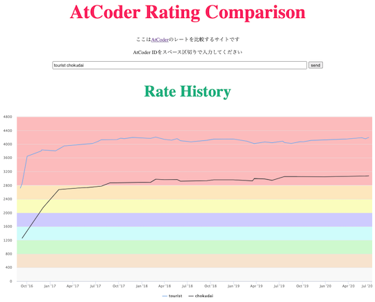

[Heroku](https://www.heroku.com)の無料プラン終了に伴い、サーバの移行が検討されているサービス・ツールなどを掲載しています。新しいサーバでの稼働を確認した段階で、元のページに戻す予定です。

<!-- markdown-link-check-disable -->

## 入門者・初心者向け

### "Q8: 脱初心者に向けて、次は何をすればいいですか?"

- コンテストで目標とする成績(パフォーマンス値)を設定してみましょう。有志が公開している[Webサービス](https://atcoderratingsimulator.herokuapp.com/)を利用すると、簡単に計算できます。

    

      
    

## おすすめのサービス・ツールを紹介

### 特定の分野を重点的に学ぶ

- [AtCoder Tags](https://atcoder-tags.herokuapp.com/) - カテゴリーごとに問題を見ることができるWebアプリです。ユーザ登録を行えば、問題にふさわしいと思うカテゴリーを投票できます。[⭐ AtCoderTags_Helper](https://greasyfork.org/ja/scripts/393121-atcodertags-helper)を導入すると、[AtCoder](https://atcoder.jp/)の「問題」ページからも投票できます。

    

      
    

    !!! info "参考"

        ユーザスクリプト(⭐️印が付いたサービス)を初めて利用される場合は、最初に[スクリプトマネージャ](https://greasyfork.org/ja)を導入する必要があります。

## Webアプリ、Webサイト

### 問題を解く

#### 特定の分野・難易度を重点的に学ぶ

- [AtCoder Tags](https://atcoder-tags.herokuapp.com/) - 問題のカテゴリーを分類する。ユーザ登録を行えば、問題にふさわしいと思うカテゴリーを投票できる。[AtCoderTags_Helper](https://greasyfork.org/ja/scripts/393121-atcodertags-helper)を導入すると、[AtCoder](https://atcoder.jp/)の「問題」ページからも投票できる。

    

      
    

### コンテストの成績を見る

#### レーティングを見る・比較する

- [Atcoder RatingGraph Generator](https://atcoder-ratinggraph-generator.herokuapp.com/) - 任意のユーザのレーティンググラフを表示する。PCを利用している場合は、グラフの点をドラッグすると自由に形状を変えられる。

    

      
    

- [AtCoder Rating Comparison](https://atcoder-rating-comparison.herokuapp.com/?q=) - 指定した2人以上のレーティングの比較ができる。[Codeforces版](https://rika0384.github.io/codeforces_rating_comparison/)も公開されている。

    

      
    

### コンテストの成績に関連するサービス

#### 成績の計算・予測

- [AtCoder Rating Simulator](https://atcoderratingsimulator.herokuapp.com/) - 目標とするレーティングに到達するまでに必要なパフォーマンスを表示する。任意の回数だけ同じパフォーマンスを取ったと仮定した場合についても計算できる。

    

      

## ユーザスクリプト

### 問題を解く

#### ヒントを見る

- [AtCoderTags_Hint](https://greasyfork.org/ja/scripts/393337-atcodertags-hint) - 「問題」ページにカテゴリーを表すヒントボタンを設置する。

    

      
    

#### カテゴリーを投票

- [AtCoderTags_Helper](https://greasyfork.org/ja/scripts/393121-atcodertags-helper) - 「問題」ページから[AtCoderTags](https://atcoder-tags.herokuapp.com/)に投票できる。

    

      
    

## 関連コンテストサイト

### LeetCode

#### コンテストの成績を見る

- [LeetCode Ranking](https://leetcode-country-ranking.herokuapp.com/)  - レーティングに関する順位表で、国籍やユーザ名を指定して閲覧できる。

    

      
    

#### 統計情報を見る

- [leetcode-stats](https://github.com/JeremyTsaii/leetcode-stats)  - ユーザの順位や解答状況を表示することができる。
    - [leetcode-stats-api](https://github.com/JeremyTsaii/leetcode-stats-api)  - 上記の統計情報を取得するためのAPI。

    

      
    

<!-- markdown-link-check-enable -->
