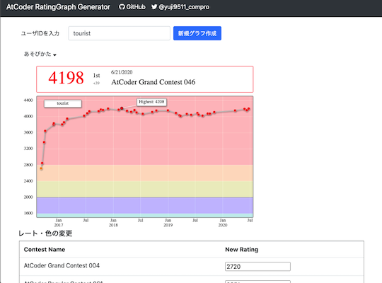
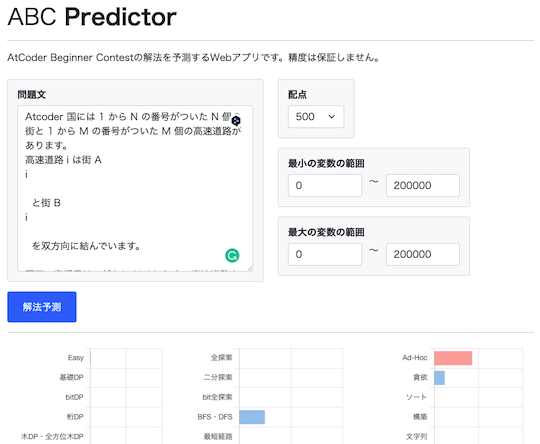

[Heroku](https://www.heroku.com)の無料プラン終了に伴い、サーバの移行が検討されているサービス・ツールなどを掲載しています。新しいサーバでの稼働を確認した段階で、元のページに戻す予定です。

<!-- markdown-link-check-disable -->

## 入門者・初心者向け

### "Q8: 脱初心者に向けて、次は何をすればいいですか?"

- コンテストで目標とする成績(パフォーマンス値)を設定してみましょう。有志が公開している[Webサービス](https://atcoderratingsimulator.herokuapp.com/)を利用すると、簡単に計算できます。

    

      
    

## Webアプリ、Webサイト

### 問題を解く

#### 復習の効果をより高める

- [AtCoder List](http://atcoder-list.herokuapp.com) - 過去問から自分専用の問題リストを作ることができる。コンテストで出題された問題の情報は、前述の[AtCoder Problems](https://kenkoooo.com/atcoder/)などを参照されたい。

    

      
    

### コンテストの成績を見る

#### レーティングを見る・比較する

- [Atcoder RatingGraph Generator](https://atcoder-ratinggraph-generator.herokuapp.com/) - 任意のユーザのレーティンググラフを表示する。PCを利用している場合は、グラフの点をドラッグすると自由に形状を変えられる。

    

      
    

- [AtCoder Rating Comparison](https://atcoder-rating-comparison.herokuapp.com/?q=) - 指定した2人以上のレーティングの比較ができる。[Codeforces版](https://rika0384.github.io/codeforces_rating_comparison/)も公開されている。

    

      
    

### コンテストの成績に関連するサービス

#### 成績の計算・予測

- [AtCoder Rating Simulator](https://atcoderratingsimulator.herokuapp.com/) - 目標とするレーティングに到達するまでに必要なパフォーマンスを表示する。任意の回数だけ同じパフォーマンスを取ったと仮定した場合についても計算できる。

    

      

### コンテストに関する統計情報

#### 解法を予測

- [ABC Predictor](https://abc-predictor.herokuapp.com/) - AtCoder Beginner Contestの問題を対象として、問題文・配点・変数の範囲を入力すると解法を予測することができる。作者による[紹介記事](https://qiita.com/assy0000/items/08a66203a70df3b730c3)も公開されている。

    

      
    

## 関連コンテストサイト

### Codeforces

### コンテストの成績を見る

- [Arugo](https://arugo.herokuapp.com/) - 任意の1問が80分以内に解けたかどうかに応じて、仮想的なレーティングの推移が表示されるWebサイト。作者による[紹介記事](https://codeforces.com/blog/entry/96830)もある。

    

      
    

### LeetCode

#### コンテストの成績を見る

- [LeetCode Ranking](https://leetcode-country-ranking.herokuapp.com/)  - レーティングに関する順位表で、国籍やユーザ名を指定して閲覧できる。

    

      
    

#### 統計情報を見る

- [leetcode-stats](https://github.com/JeremyTsaii/leetcode-stats)  - ユーザの順位や解答状況を表示することができる。
    - [leetcode-stats-api](https://github.com/JeremyTsaii/leetcode-stats-api)  - 上記の統計情報を取得するためのAPI。

    

      
    

<!-- markdown-link-check-enable -->
