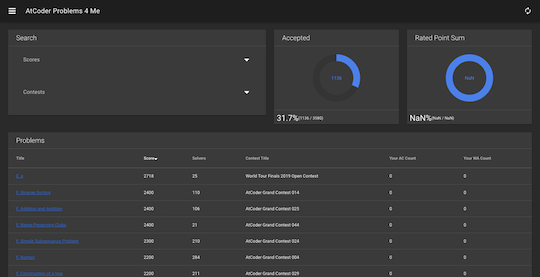
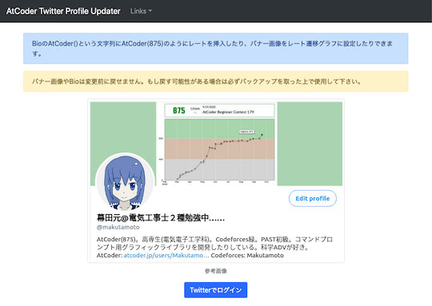

本サイトの運営者の環境で、動作が確認できていないサービス・ツールなどの一覧です。

該当サービス・ツールなどの作者の方や動作を確認された方は[本サイトの運営者](https://twitter.com/k_hiro1818)まで、ご一報いただけると幸いです。

## Webアプリ・Webサイト

### 問題を解く

- [AtCoder Problems 4 Me](https://compro.192.works/#/problems) - [AtCoder Problems](https://kenkoooo.com/atcoder/)をオマージュしたWebアプリ。

    - 理由: 記載なし。
    - 代替手段: 調査中。

    

      
    

- [AtCoder Review](https://github.com/jueve/atcoder-review) - コンテストの復習に焦点を置いたクロスプラットフォームのデスクトップアプリケーション。

    - 理由: ドキュメントに記載はないが、ソースコードのビルドおよび配布されているインストーラの動作保証が困難な状況のため。
    - 代替手段: 調査中。

    

      
    

### コンテストの成績を見る

- [AtCoder Twitter Profile Updater](https://atcoder-twitter-profile-updater.vercel.app/) - レーティングの推移と最新の値をTwitterのプロフィール欄に自動で追加・更新できる。また、アプリおよびその構成技術に関する[解説記事](https://qiita.com/makutamoto/items/f9761dcf8dbe4d43d2b1)も公開されている。

    - 理由: 記載なし。
    - 代替手段: 調査中。

    

      
    

### コンテストに関する統計情報

- [ACTouchBar](https://github.com/tallestorange/ACTouchBar)  - コンテストでの正解者数/提出者数、提出状況、レーティング・解いた問題数などの確認やメモを残すことができる。

    - 理由: 本サイトの運営者がTouchBarアプリに対応したPCを所持しておらず、動作検証が困難なため。
    - 代替手段: 調査中。

    

      
    

## ユーザスクリプト

### Webページに色付けする

- ["Atcoder" Finder](https://greasyfork.org/ja/scripts/373742-atcoder-finder) - [Twitter](https://twitter.com/)のツイートに含まれる"Atcoder"の文字列を赤色にするユーザスクリプト。

    - 理由: 記載なし。
    - 代替手段: 調査中。

### ユーザを探す・識別しやすくする

- [AtCoder Graduation](https://greasyfork.org/ja/scripts/394079-atcoder-graduation) - ユーザの「プロフィール」ページに卒業・修了年度を表示するユーザスクリプト。

    - 理由: 記載なし。
    - 代替手段: 調査中。

- [AtCoder Twitter Avatar](https://greasyfork.org/en/scripts/372507-atcoder-twitter-avatar) - 「ユーザ」ページのtwitter IDの欄に、[Twitter](https://twitter.com/)のアバターを追加するユーザスクリプト。

    - 理由: 記載はないが、[AtCoder](https://atcoder.jp/)の仕様変更に伴うものと思われる。
    - 代替手段: 調査中。

    

      
    

## Google Chromeの拡張機能

### 問題を解く

- [AtCoderBook](https://chrome.google.com/webstore/detail/atcoderbook/lcojnofidkanlkoaagdbjkdnelbnlnng?hl=ja&gl=UA) - 問題のリンクを保存するChrome拡張機能。復習やお気に入りの管理用など。[Codeforces](https://codeforces.com/)にも対応している。

    - 理由: 記載はないが、[AtCoder](https://atcoder.jp/)の仕様変更に伴うものと思われる。
    - 代替手段: 調査中。

    

      
    

### 提出コードの正誤判定

- [Coding Shout](https://chrome.google.com/webstore/detail/coding-shout/nggokghmfinpljihgjkkbogpgbbjjjme?hl=ja&gl=UA) - ジャッジ結果を通知するChrome拡張機能。[Codechef](https://www.codechef.com/)や[Codeforces](https://codeforces.com/)にも対応している。

    - 理由: [AtCoder](https://atcoder.jp/)の仕様変更に伴うもの。
    - 代替手段: [AtCoderResultNotifier](https://greasyfork.org/ja/scripts/371225-atcoderresultnotifier)などを利用する。

    

      
    

## コマンドラインツール

### ソースコードにバグがないか確認

- [kunai](https://github.com/mouri111/kunai)  - サンプルケースのテストができるコマンドラインツール。

    - 理由: パッケージのインストールによる動作確認、ソースコードのビルドにおいて依存関係の解消が困難なため。
    - 代替手段: 調査中。
