諸事情により提供・開発が終了した(と思われる)サービス・ツールなどに対して、感謝や敬意を表するため掲載しています。

<!-- markdown-link-check-disable -->

## おすすめのサービス・ツール

### コンテスト後の情報収集・発信

- [AtCoder TL](https://github.com/shirakia/atcoder_tl) - レーティング帯ごとのTwitterタイムラインを生成することができます。また、全てのタイムラインをまとめた[Web版](https://atcoder-tl.com/)も公開されています。
    - 確認した日: 2023/06/20
    - 理由: Twitter APIの有料化に伴い更新停止、サービス終了の告知を確認したため([出典](https://twitter.com/atcoder_tl/status/1652689228537683968))。

    

      
    

    

      
    

## Webアプリ・Webサイト

### 問題を解く

- [mm-tester](https://github.com/kosakkun/mm-tester)  - ヒューリスティック型コンテストの問題とサンプルコードがまとめられている。

- [AtCoder Scores](http://atcoder-scores.herokuapp.com/) - AtCoder Grand Contest 001(AGC 001)以降の問題が点数順に並んでいる。
    - 理由: サービスの提供終了を告知した[作者のツイート](https://twitter.com/rsk0315_h4x/status/1593906452259033088)を観測したため。

    

      
    

- [AtCoder Virtual Contest](https://not-522.appspot.com/) - 仮想コンテスト(本番のコンテストに近い状態で練習できる)を開催できるWebサービス。
    - 理由: [AtCoder](https://atcoder.jp/)の仕様変更に伴うもの。
    - 代替手段: 公式のバーチャル参加や[AtCoder Problems](https://kenkoooo.com/atcoder/)のVitual Contestsを利用する。

    ---

    - [ばちゃこんお知らせbot](https://twitter.com/vtcon_bot?lang=ja) - [AtCoder Virtual Contest](https://not-522.appspot.com/)に関する情報をつぶやくbot。
        - 理由: [AtCoder](https://atcoder.jp/)の仕様変更および[AtCoder Virtual Contest](https://not-522.appspot.com/)のサービス終了に伴い、新たな情報提供が困難な状況。
        - 代替手段: 調査中。

- [wacchoz/kyopro](https://github.com/wacchoz/kyopro) - 過去問の難易度を推定している。2019年11月以降は、更新が途絶えている。
    - 理由: 記載なし。
    - 代替手段: [AtCoder Problems](https://kenkoooo.com/atcoder/)で確認できる。

### 問題を解くときの補助ツール

- [AtCoderノートブック](https://atcoder-notebook.app/) - 過去問を繰り返し解くときに便利なメモアプリ。

    !!! warning "注意"
        解答状況を変更すると、過去の履歴が消える仕様になっている。

    - 理由: 記載なし。

    

      
    

- [Devotter](https://devotter.app/) - 1日1回AC(Accepted)数を[Twitter](https://twitter.com/)にツイートするWebアプリ。
    - 理由: 記載なし。

    

      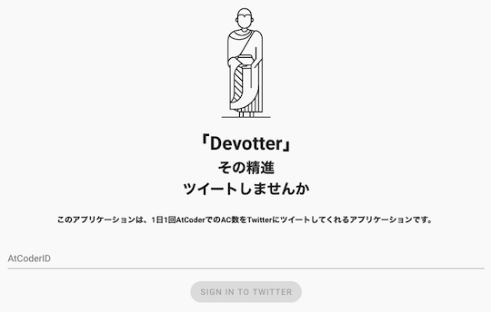
    

- [PROCON Q&A](https://procon-qa.herokuapp.com/) - 競技プログラミングを対象とした質問と回答を投稿できる。
    - 確認した日: 2021/12/15

    

      
    

- [テストケースランダム生成](https://testcase-generator-pr-5ba4e48ff086.herokuapp.com/index/) - 数列・グラフ・文字列を対象として、指定した条件を満たす入力データをランダムに生成できる。
    - 確認した日: 2024/06/13

    

      
    

### 解説を読む

- [AtCoderEditorials](https://github.com/null-null-programming/AtCoder-Editorials) - 解法ブログの投稿・閲覧と知見の集約を目指したWebサービス。
    - 理由: 記載なし。
    - 代替手段: 公式解説や個々の解説ブログ、提出コードを見る。

### コンテストに参加する

- [AtCoder Calendar](https://atcoder-calendar.tkt989.info/) - 指定したURLをGoogleカレンダーに登録する。
    - 理由: 記載はないが、[AtCoder](https://atcoder.jp/)の仕様変更に伴うものと思われる。
    - 代替手段: [CLIST](https://clist.by/)や[Competitive Programming Contests Calendar](https://competitiveprogramming.info/calendar)などを利用する。

- [AtCoderカレンダー通知](https://twitter.com/AtcoderCalendar) - イベント開始15分前に通知する。
    - 理由: 記載はないが、[AtCoder](https://atcoder.jp/)の仕様変更に伴うものと思われる。

- [Future Contest](https://future-contest.appspot.com/) - 開催予定のコンテスト情報を表示するWebアプリ。[yukicoder](https://yukicoder.me/)、[CS Academy](https://csacademy.com/)、[Codeforces](https://codeforces.com/)にも対応している。
    - 理由: Google Cloud Platform(GCP)で、Go1.9の提供が終了したため。

    

      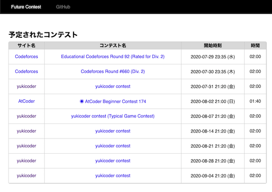
    

### コンテストの成績を見る

- [AtCoder Competition History Chart Maker](https://colab.research.google.com/github/bo9chan/AtCoderCharts/blob/main/CompetitionHistoryChart.ipynb) - 任意のユーザのレーティングとパフォーマンス値の推移を表示する。

    

      
    

- [AtCoder Rating Contributor Graph](https://atcoder-rating-contribution-graph.vercel.app/) - 任意のユーザのレーティングに対して、各コンテストにおけるパフォーマンス値の寄与度を可視化する。
    - 理由: 作者からサービスの提供終了(予定)の連絡を受けたため ([出典](https://github.com/KATO-Hiro/AtCoderClans/issues/9086))。
    - 代替手段: [AtCoder Graphs](https://atcoder-graphs.vercel.app/)を利用する。

    

      
    

- [AtCoder Rollback](https://phocom.github.io/atcoder-rollback/index.html) - 指定した日時までのレーティングの推移を表示する。

    

      
    

- [AtCoder Marathon Rating History](https://iilj.github.io/AtCoderMarathonRatingHistory/#/rating/) - [AtCoder Heuristic Contest](https://atcoder.jp/contests/archive?ratedType=0&category=1200&keyword=AtCoder+Heuristic+Contest)のレーティングの推移を表示する。
    - 理由: AtCoderで、ヒューリテスィックコンテストのランキング・レーティンググラフが実装されたため。
    - 対処方法: AtCoderの[ランキングページ](https://atcoder.jp/ranking?contestType=heuristic)やプロフィールページを閲覧する。

    

      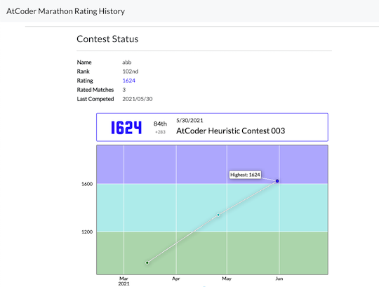
    

- [AtCoder Performances](https://atcoderapps.herokuapp.com/atcoderperformances/) - 指定した2人以上のパフォーマンスの推移が比較できる。
    - 理由: サービスの提供終了を告知した[作者のツイート](https://twitter.com/noisy_noimin/status/1584906723441405952)を観測したため。

    

      
    

- [Atcoder Performance Chart](https://atcoder-chart.web.app/) - パフォーマンス値、それらの短期・長期平均値を表示する。

    

      
    

- [Rating History](https://rating-history.herokuapp.com/index.html) - 複数のコンテストサイトで、解いた問題数とレーティングの推移を表示する。
    - 理由: 作者からサービスの提供終了の連絡を受けたため。

    

      
    

- [Badge Generator](https://badgen.org/) - レーティング(アルゴリズム部門、ヒューリスティック部門)に関するバッジが生成できる。[Qiita](https://qiita.com/)や[Zenn](https://zenn.dev/)の各種統計指標にも対応している。
    - 理由: 2023/04/25にAtCoderバッジのサポートが終了したため。（サービスのトップページにて掲示されていることを確認）

    

      
    

### コンテストの成績に関連するサービス

- [AtCoder Rating Simulator](https://atcoder-rating-simulator.dt.r.appspot.com/) - 目標とするレーティングに到達するまでに必要なパフォーマンスを表示する。任意の回数だけ同じパフォーマンスを取ったと仮定した場合についても計算できる。
    - 理由: 記載なし。
    - 代替手段: [AtCoder Rating Simulator(仮)](https://atcoder-notify.com/rating_simulator/)を利用する。

    

      

- [AtCoder Rating Simulator](https://twitter.com/AtCoderRS) - Ratedコンテスト当日に、所定のレーティングに到達するのに必要なパフォーマンスを自動返信するTwitter Bot。
    - 理由: 開発者により、Twitterアカウントの運用終了が告知されたため([出典](https://twitter.com/AtCoderRS/status/1323666246173413376))。
    - 代替手段: [AtCoder Rating Simulator(仮)](https://atcoder-notify.com/rating_simulator/)を利用する。

    

      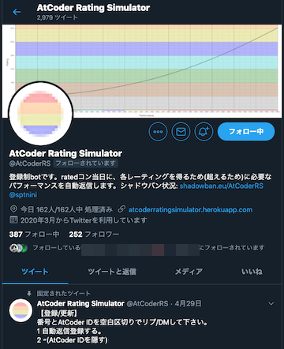
    

- [AtCoder Stalker](https://line.me/R/ti/p/@381fkvdg) - ライバルが精進したときLINEにプッシュ通知される。
    - 理由: 開発者により、サービス終了が告知されたため([出典](https://twitter.com/zaurus_yusya/status/1509534226332684288))。

    

      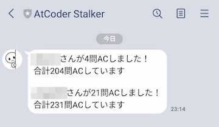
    

- [AtCoder TL](https://github.com/shirakia/atcoder_tl)  - レーティング帯ごとのTwitterタイムラインを生成する。全てのタイムラインをまとめた[Web版](https://atcoder-tl.com/)も公開されている。
    - 確認した日: 2023/06/20
    - 理由: Twitter APIの有料化に伴い更新停止、サービス終了の告知を確認したため([出典](https://twitter.com/atcoder_tl/status/1652689228537683968))。

    

      
    

    

      
    

- [AtCoder相性診断](https://atcoder-aisho-shindan.vercel.app/) - レーティングを元に相性を診断する。
    - 理由: 作者からサービスの提供終了の連絡を受けたため。

    

      
    

- [AtCoder じゃんけん](https://atcoder-janken.appspot.com/) - 指定した2人のユーザが共通して出場したコンテストの順位を比較できるWebアプリ。
    - 理由: Google Cloud Platform(GCP)で、Go1.9の提供が終了したため。

    

      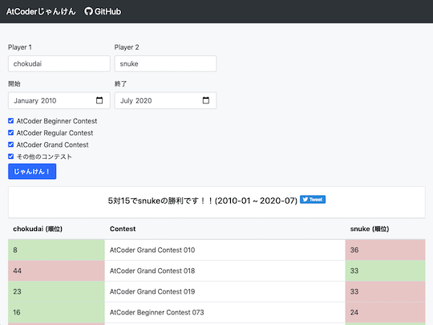
    

### コンテストに関する統計情報

- [AtCoder Training-Performance Visualizer](http://atcoder-training-performance-visualizer.azurewebsites.net/App) - 日々の練習（通称、精進）が、コンテストのパフォーマンスにどの程度影響しているかを確認できる。

    

      
    

- [AtCoder平均](http://rating-history.herokuapp.com/average.html) - 直近nか月における各種コンテストの平均順位とパフォーマンスを表示する。
    - 理由: 作者からサービスの提供終了の連絡を受けたため。

    

      
    

- [AtCoder Diff Scores](https://atcoder-diff-scores.herokuapp.com/home) - レーティングと[AtCoder Problems](https://kenkoooo.com/atcoder/)で推定されたDifficultyの累計値の推移を表示する。

    

      
    

- [AtCoderFacts](https://app.atcoder-facts.com/) - Ratedコンテストを対象として、レーティング別・問題別の正解者数・正解率を表示する。また、所定のパフォーマンスを得るための得点と所要時間の目安を知ることもできる。
    - 確認した日: 2024/07/31
    - 理由: 記載なし。

    !!! warning "注意"
        2022年2月以降のコンテストは、反映されていない可能性が高い。

    

      
    

- [AtCoder 色別正解率](http://shobonvip.web.fc2.com/atcoder/cp/index.html) - 各種コンテストにおけるレーティング帯ごとの正解率を表示する。作者による注: 手動更新のため、最新情報の反映にやや時間を要する。
    - 理由: 作者からサービスの更新終了の連絡を受けたため。
    - 代替手段: 同一の作者が公開しているユーザスクリプト「[AtCoderColorStandings](https://greasyfork.org/ja/scripts/423713-atcodercolorstandings)」を利用する。

    

      
    

- [AtCoder Stats](https://atcoderstats.appspot.com/) - コンテスト、問題、ユーザに関する様々な統計情報が閲覧できるWebアプリ。
    - 理由: Google Cloud Platform(GCP)で、Go1.9の提供が終了したため。

    

      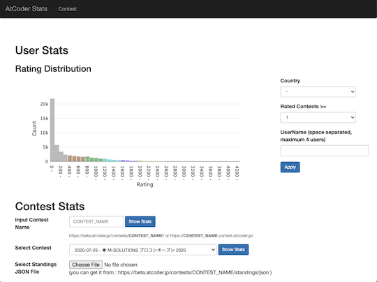
    

- [あなたのレートはどこから?](https://rating-history.herokuapp.com/rating.html) - レーティングが、どのコンテスト区分(ABC、ARC、AGC、その他)から得られているかを求める。
    - 理由: 作者からサービスの提供終了の連絡を受けたため。

    

      
    

### ライバルを探す・競う

- [AtCoder Rivals](https://atcoder-rivals.web.app/) - パフォーマンスやレーティングの遷移、日々の練習(通称、精進)状況などをライバルと比べることができる。
    - [作者による技術記事](https://note.com/sacckey/n/nf0b7ed1e9d1a)

    

      
    

### クイズ・ゲームなど

- [AtCoder Games](https://atcoder-games.herokuapp.com/games/) - 過去問に登場したゲームで遊ぶことができる。
    - 理由: 作者からサービスの提供終了の連絡を受けたため。

    

      
    

### Bot

- [毎日C D問題通知Bot](https://twitter.com/mainitiCDmondai) - AtCoder Beginner Contest (ABC)のC問題・D問題のリンクを毎日ツイートしてくれる。
    - 確認した日: 2023/06/03
    - 理由: 開発者により、サービスの提供終了が告知されたため([出典](https://twitter.com/mainitiCDmondai/status/1624789075629862913))。

    

      
    

## スクリプト

### 提出コードの正誤判定

- [ac-standings-notifier](https://greasyfork.org/ja/scripts/372988-ac-standings-notifier) - コンテスト中に「順位表」ページを開いておくと、順位を通知する。
    - 理由: 記載はないが、[AtCoder](https://atcoder.jp/)の仕様変更に伴うものと思われる。
    - 代替手段: [AtCoder コンテスト実況 Bot](https://twitter.com/cpcontest_bot?lang=en)を利用する。

- [AtCoder judge notifier](https://chrome.google.com/webstore/detail/atcoder-judge-notifier/hcjjfcidaloadjcemebolmdphhbpehba?hl=ja&gl=UA) - 「提出」ページのジャッジ結果を通知するChrome拡張機能。
    - 理由: 作者が公開を取りやめたと思われるため。
    - 代替手段: [AtCoderResultNotifier](https://greasyfork.org/ja/scripts/371225-atcoderresultnotifier)などを利用する。

    

      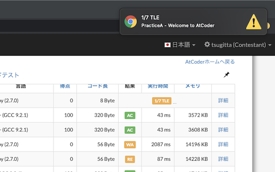
    

- [AtCoder Problems Penalty Counter](https://greasyfork.org/ja/scripts/395755-atcoder-problems-penalty-counter) -  [AtCoder Problems](https://kenkoooo.com/atcoder/)のTableページで、各問題のコンテスト中のペナルティ数を表示する。
    - 理由: [AtCoder Problems](https://kenkoooo.com/atcoder/)で実装されており、追加で導入する必要性は薄いと思われるため。
    - 代替手段: [AtCoder Problems](https://kenkoooo.com/atcoder/)を利用する。

### 提出コードを確認する

- [AtCoder Tab 4matter](https://greasyfork.org/ja/scripts/425327-atcoder-tab-4matter) - 「提出結果」ページで、ソースコードのタブ幅を4に揃える。
    - 理由: 作者が公開を取りやめたと思われるため。

- AtCoderProblemsRush - [AtCoder Problems](https://kenkoooo.com/atcoder/)のクローラが実行される前に、提出データをブラウザに保存し進捗状況を表示する。
    - 理由: [AtCoder Problems](https://kenkoooo.com/atcoder/)での進捗状況が短時間で更新されるようになり、追加で導入する必要性は薄いと思われるため。
    - 2021年2月23日追記: スクリプトのリンクが削除されているのを確認。

### 問題に関する統計情報を見る

- [AtCoderACPercentage](https://greasyfork.org/ja/scripts/388000-atcoderacpercentage) - ある問題について、同じレーティング帯の参加者が正解している割合を順位表に表示するユーザスクリプト。
    - 理由: 記載はないが、[AtCoder](https://atcoder.jp/)の仕様変更に伴うものと思われる。
    - 対処方法: 該当する[Issue](https://github.com/null-null-programming/AtCoderACPercentage/issues/14)を修正して、Pull Requestを送る。

- [ac-writers script](https://greasyfork.org/ja/scripts/369965-ac-writers-script) - ユーザの「コンテスト成績表」ページにコンテストのWriterを表示する。
    - 理由: 作者が公開を取りやめたと思われるため。
    - 確認した日: 2023/05/29

    

      
    

### Webページに色付けする

- [Colorful TL](https://greasyfork.org/ja/scripts/441551-colorful-tl) - TwitterのTimelineにおいて、ユーザ名をAtCoderのレーティングに対応した色に変更する。
    - 理由: データ取得先の[AtCoder TL](https://github.com/shirakia/atcoder_tl)のサービス終了に伴い、更新が停止した可能性が高いと思われるため。
    - 確認した日: 2023/08/20

- [AtCoder Comfortable Editor](https://greasyfork.org/ja/scripts/445582-atcoder-comfortable-editor) - 提出に関するページで、コードの表示に関する設定(カラーテーマ、タブ、行数など)をカスタマイズできる。
    - 理由: AtCoderのエディタアップデートに伴い、作者が同スクリプトの利用を非推奨としたため。
    - 確認した日: 2023/09/07

    

        
    

### 外部サービス

- [AC Problems Ranking Colorizer](https://greasyfork.org/ja/scripts/429485-ac-problems-ranking-colorizer) - [AtCoder Problems](https://kenkoooo.com/atcoder/) のランキングページで、ユーザ名をAtCoderのレーティングに対応した色に変更する。
    - 理由: スクリプトの機能が[AtCoder Problems](https://kenkoooo.com/atcoder/)に取り入れられたため。
    - 確認した日: 2023/07/17

    

      
    

- [acscores-link](https://greasyfork.org/ja/scripts/377267-acscores-link) - ユーザ名のドロップダウンメニューに[AtCoder Scores](http://atcoder-scores.herokuapp.com/)へのリンクを追加する。
    - 理由: 記載はないが、[AtCoder](https://atcoder.jp/)の仕様変更に伴うものと思われる。
    - 代替手段: [AtCoder Scores](http://atcoder-scores.herokuapp.com/)のリンクから閲覧する。

- [AtCoder Problems Premium](https://greasyfork.org/ja/scripts/468513-atcoder-problems-premium) - [AtCoder Problems](https://kenkoooo.com/atcoder/) の各ページをより華やかにする(背景色の変更、アニメーションの追加)。
    - 理由: 作者から削除依頼を受けたため。
    - 確認した日: 2023/06/22

    

      
    

### 文字・数字をより見やすく

- [AtCoderのScoreを見やすくする](https://chrome.google.com/webstore/detail/atcoder-%E3%81%AE-score-%E3%82%92%E8%A6%8B%E3%82%84%E3%81%99%E3%81%8F%E3%81%99%E3%82%8B/ndnmjoimfdcpjbnnlkieikajbbcaockp?hl=ja&gl=UA) - マラソン形式のスコアをカンマ区切りやlogで表示する。
    - 理由: 作者が公開を取りやめたと思われるため。
    - 確認した日: 2023/09/10

    

      
    

### 成績をSNSで共有

- [AtCoder_Result_Tweet_Button](https://greasyfork.org/ja/scripts/370227-atcoder-result-tweet-button) - [AtCoder](https://atcoder.jp/)のユーザページに、参加したコンテスト情報をツイートするボタンを追加する。
    - 確認した日: 2024/03/24
    - 理由: 作者が公開を取りやめたと思われるため。

    

      
    

## Google Chromeの拡張機能

### ソースコードの提出・確認を簡単に

- [AtCoder-Submission-RadioButton](https://chrome.google.com/webstore/detail/atcoder-submission-radiob/hkehpabdllmdfmflgjofmgcdbmjafcdd?hl=ja&gl=UA) - 「提出」ページに、各問題を選択するラジオボタンを設置する。[ユーザスクリプト版](https://greasyfork.org/ja/scripts/390828-atcoder-submission-radiobutton)もある。
    - 確認した日: 2025/03/08
    - 理由: 作者が公開を取りやめたと思われるため。

    

      
    

### コンテストに参加する

- [AtCoder Calendar](https://chrome.google.com/webstore/detail/atcoder-calendar/dokfhaljgioiaeappgnmibgoipegbldf?hl=ja&gl=UA) - コンテストの「トップ」ページにGoogle Calendarのスケジュール作成リンクを生成する。
    - 確認した日: 2025/03/08
    - 理由: 作者が公開を取りやめたと思われるため。

    

      
    

## 記事

### コードを書くための環境構築を行う

- [WSL2 + Ubuntu22.04 + VScodeでAtCoder用のC++環境を構築する](https://qiita.com/Kal24w/items/467dd26c2e5306b3ba59) - C++の環境構築手順を紹介した記事。Ubuntu22.04を利用しているのが特徴。
    - 確認した日: 2024/02/13
- [atcoder_docker_sample](https://github.com/yamatia/atcoder_docker_sample) - [Visual Studio Code](https://code.visualstudio.com/)・[Docker](https://www.docker.com/)・[Git](https://git-scm.com/downloads)を使って、PythonとC++の実行環境を構築することができる。

### コンテストに向けた練習方法を知る

- [競技プログラミングの練習法(AtCoderレート2100突破のために)](https://shinchankosen.hatenadiary.jp/entry/2024/07/21/181817) - [shinchan](https://atcoder.jp/users/shinchan)さんが取り組んでいる練習方法（主にレーティング2000前後のユーザ向け）が紹介されている。
    - 確認した日: 2024/09/09

### アルゴリズムを学ぶ

- [競プロ初心者が怖がるもの](https://qiita.com/NokonoKotlin/items/75e56515139a872fb629) - 初心者に恐れられがちなアルゴリズムに対して、それぞれの要点や関連記事が紹介されている。
    - 確認した日: 2025/05/17

- [こわくないbit全探索【AtCoder・アルゴリズム解説】](https://qiita.com/u2dayo/items/68e35815659b1041c3c2) - bit全探索の考え方や実装方法(C++とPython)について丁寧に解説されている記事。
    - 確認した日: 2024/09/20

### ヒューリスティック問題を解く

- [みんなAHCの魅力を知らなすぎて困る](https://trap.jp/post/2006/) - [AtCoder Heuristic Contest](https://atcoder.jp/contests/archive?ratedType=4&category=0&keyword=AtCoder+Heuristic+Contest)の魅力・おすすめの理由が語られている記事。次のコンテストに参加するまでにできることも紹介されている。
    - 確認した日: 2025/04/07
- [【AHC020 参加記】初参加の初心者でもそれなりに善戦できるぞという話](https://qiita.com/halcyonFX/items/c6d7ebdf375f359c596c) - [hirayuu_At](https://atcoder.jp/users/hirayuu_At)さんの参加記。初参加の[AtCoder Heuristic Contest 020](https://atcoder.jp/contests/ahc020)で、愚直な解法から高得点を得るための思考過程を紹介した記事。
    - 確認した日: 2024/04/14

### 実装テクニックを学ぶ

- [【プログラミング言語速度比較】Collatz数列ベンチマークを言語別比較しよー！](https://rheotommy.hatenablog.com/entry/2020/07/18/205343) - [RheoTommy](https://atcoder.jp/users/RheoTommy)さんによる記事。[Collatz数列](https://en.wikipedia.org/wiki/Collatz_conjecture#:~:text=Unsolved%20problem%20in%20mathematics%3A&text=The%20Collatz%20conjecture%20is%20a,half%20of%20the%20previous%20term.)を題材に、各言語の実行速度を比較・分類している。
    - 確認した日: 2024/09/02

### 解説ブログ・サイトを見る

- [AtCoder 昔の公式解説リンク集](https://bo9chan.hatenablog.jp/) - (非公式)Slideshareでアップロードされている公式解説へのリンク集。AtCoder Beginner Contest 001〜035とAtCoder Regular Contest 001、002、015〜049が掲載されている。
    - 確認した日: 2024/11/10
- [【AtCoder解説】PythonでABCxxxの(問題番号)問題を制する！](https://qiita.com/u2dayo) - [unidayo](https://atcoder.jp/users/unidayo)さんの解説記事。主にAtCoder Beginner ContestのA〜C問題を中心とした解説と実装例が紹介されている。
    - 確認した日: 2024/09/20

    !!! info "参考"

        AtCoder Beginner Contest 266以降は、別の著者の解説ブログを参照されたい。

### 部活・サークル・同好会に参加する

- [ゼロから始める競プロ部 - 部長 次郎花](https://note.com/jirohhana2/n/n0c1233f14824) - 会社のプロジェクトメンバーと競プロ部を立ち上げた[jirohhana2](https://atcoder.jp/users/jirohhana2)さんが、コンテストの参加記を不定期に連載している。
    - 確認した日: 2021/02/20

### 競技プログラミングと就転職

- [AtCoder学生ユーザー座談会「内定先、どうやって決めましたか？」](https://saponet.mynavi.jp/column/knowhow/zadankai-gakusei/) - [AtCoder](https://atcoder.jp/)の学生ユーザ3人を対象に、AtCoderを始めたきっかけ・内定先の決め手・初任給など覆面座談会の内容を紹介した記事。

## 資料集

- [KCLC公開講座](https://drive.google.com/drive/folders/12XfIWr37AiDJpvZkygd8H2fJjJdlQOxx) - Kaisei Computer Lovers' Club (KCLC)の有志によって作成された公開資料集。競技プログラミングの入門者・初心者向けに、興味を持ってもらうためのきっかけ作り、データ構造、基礎文法などの資料が用意されている。
    - 理由: 記載なし。
    - 代替手段: 調査中。

## 書籍

- [ヒューリスティック探索入門](https://jinnaiyuu.github.io/pdf/textbook.pdf) - グラフ探索アルゴリズムを状態空間問題(完全情報決定論的モデル)に応用するための入門書。特に、ヒューリスティック型コンテストで活用されることが期待される。
    - 確認した日: 2024/09/25

## 動画

### YouTubeのチャンネル

- [まぬお](https://www.youtube.com/@user-mj5sk4lu1t) - [manuo](https://atcoder.jp/users/manuo)さんのチャンネル。コンテストの実況動画が公開されている。
    - 確認した日: 2024/11/14
- [妹尾の解ると楽しいアルゴリズムチャンネル](https://www.youtube.com/@user-rs9rl9bk2k/videos) - [senohtube](https://atcoder.jp/users/senohtube)さんのチャンネル。コンテストの過去問を解く動画などが公開されている。
    - 確認した日: 2024/11/03
- [ななみつき](https://www.youtube.com/playlist?list=PLKs3DZp2szRMAHKnNg2ZlIhW9uXfBQg6a) - [Nanamitsuki](https://atcoder.jp/users/Nanamitsuki)さんのチャンネル。コンテストの過去問を解く動画などが公開されている。
    - 確認した日: 2023/07/02
    - 理由: 記載なし。
- [func](https://www.youtube.com/playlist?list=PLLbak3dBJyRbJ4R5Ax2vUFZlNBbLX8YLw) - [func_hs](https://twitter.com/func_hs)さんのチャンネル。コンテストの過去問を解く動画が公開されている。
    - 確認した日: 2023/07/02
    - 理由: 記載なし。
- [うさぎ](https://www.youtube.com/channel/UCAWN0xlHcDyMTaCIfn1GNXg/videos) - [kmyk](https://github.com/kmyk)さんのチャンネル。
    - 確認した日: 2023/07/02
    - 理由: 記載なし。
- [どきんちゃんねる](https://www.youtube.com/channel/UCRtRY2sRe36LXjaiyhqEqCg) - [dokin](https://atcoder.jp/users/dokin)さんのチャンネル。入門者・初心者向けに、問題の考察・C++での実装過程が丁寧に解説されている。
    - 理由: 記載なし。
    - 代替手段: 調査中。

### ニコニコ動画

- [ペニーワイズが競技プログラミングをオススメしたいようです](https://www.nicovideo.jp/watch/sm33889972) - 一世を風靡した「ペニーワイズがオススメするシリーズ」の一つ。プログラミングに興味があるものの、作りたいものがない人に向けて、競技プログラミングをオススメする動画。
    - 確認した日: 2024/02/06

## ライブラリ

### ACL C&#43;&#43;

- [ac-library-mirror](https://github.com/TonalidadeHidrica/ac-library-mirror) - [AtCoder Library (ACL)](https://atcoder.jp/posts/518)の非公式ミラー。別言語へのラッパー作成などに役立てるため、公式ライブラリの変更を管理している。
    - 理由: [公式レポジトリ](https://github.com/atcoder/ac-library)が公開されているため。
    - 代替手段: [公式レポジトリ](https://github.com/atcoder/ac-library)を参照する。

### ACL C&#35;

- [key-moon/ac-library-cs](https://github.com/key-moon/ac-library-cs)  - C#版。

### ACL Python

- [Mitarushi/ACL-Python](https://github.com/Mitarushi/ACL-Python)  - PyPy版。
    - 確認した日: 2024/09/28

### C&#43;&#43;

- [comp-prog-jp-library-standard/competitive-programming-library](https://github.com/comp-prog-jp-library-standard/competitive-programming-library) - 競技プログラミングのための共通ライブラリをまとめようとしたプロジェクト。
    - 理由: 記載なし。
    - 代替手段: [AtCoder Library (ACL)](https://atcoder.jp/posts/517)や[Libraries and Snippets](https://kato-hiro.github.io/AtCoderClans/libraries)などで公開されているライブラリを利用するか、自分で作成する。
- [fuppy0716/kyopro](https://github.com/fuppy0716/kyopro)  - [fuppy0716](https://atcoder.jp/users/fuppy0716)さんのC++ライブラリ。
    - 確認した日: 2024/07/13
- [ganyariya/library](https://github.com/ganyariya/library)  - [ganyariya](https://atcoder.jp/users/ganyariya)さんのC++ライブラリ。
    - 確認した日: 2025/06/08
- [gzlcp/competitive-library](https://github.com/gzlcp/competitive-library)  - [gazelle](https://atcoder.jp/users/gazelle)さんのC++ライブラリ。
- [latte0119/Library](https://github.com/latte0119/Library)  - [latte0119](https://atcoder.jp/users/latte0119)さんのC++ライブラリ。
    - 確認した日: 2023/10/16
- [monkukui/Library](https://github.com/monkukui/Library)  - [monkukui](https://atcoder.jp/users/monkukui)さんのC++ライブラリ。
    - 確認した日: 2023/10/10

### D

- [Sobaya007/sbylib](https://github.com/Sobaya007/sbylib)  - [sobaya](https://atcoder.jp/users/sobaya)さんのDライブラリ。

### Fortran

- [DSCF-1224/Fortran](https://github.com/DSCF-1224/Fortran)  - [DSCF_1224](https://atcoder.jp/users/DSCF_1224)さんのFortranライブラリ。
    - 確認した日: 2025/05/07

### Go

- [naipia/competitive-programming-go](https://github.com/naipia/competitive-programming-go)  - [naipia](https://atcoder.jp/users/naipia)さんのGoライブラリ。

### Java

- [hiro116s/atcoder_library](https://github.com/hiro116s/atcoder_library)  - [hiro116s](https://atcoder.jp/users/hiro116s)さんのJavaライブラリ。

### Kotlin

- [shin2ro/algorithms-in-kotlin](https://github.com/shin2ro/algorithms-in-kotlin)  - [shin2ro](https://atcoder.jp/users/shin2ro)さんのKotlinライブラリ。

### Python

- [Coki628/Python/lib](https://github.com/Coki628/Python/tree/master/lib)  - [Coki628](https://atcoder.jp/users/Coki628)さんのPythonライブラリ。
- [maspypy/compro_library](https://github.com/maspypy/compro_library)  - [maspy](https://atcoder.jp/users/maspy)さんのPythonライブラリ。
- [mts1104/atcoder](https://github.com/mts1104/atcoder/tree/master/python/lib)  - [parentheses](https://atcoder.jp/users/parentheses)さんのライブラリ。レポジトリには、[C++のライブラリ](https://github.com/mts1104/atcoder/tree/master/cpp/lib)も含まれている。
- [nanoseeing/AtCoder](https://github.com/nanoseeing/AtCoder)  - [nanoseeing](https://atcoder.jp/users/nanoseeing)さんのライブラリ。
    - 確認した日: 2025/04/10
- [Neterukun1993/algorithm](https://github.com/Neterukun1993/algorithm)  - [neterukun](https://atcoder.jp/users/neterukun)さんのPythonライブラリ。

### 不明

- [sciencesakura/atcoder-sandbox](https://github.com/sciencesakura/atcoder-sandbox)  - [sciencesakura](https://atcoder.jp/users/sciencesakura)さんのライブラリ。

## 関連コンテストサイト

### アルゴリズム系コンテスト

- [AOJ-ICPC](http://aoj-icpc.ichyo.jp/) - [ICPC 日本リージョン](https://icpc.iisf.or.jp/)の国内予選・アジア地区予選および[ICPC OB/OG の会](https://jag-icpc.org/)で出題された問題の難易度を、有志が評価したWebサイト。
    - 確認した日: 2025/06/10
    - 理由: 作者によりサービスの更新停止が明言されているため。
    - 代替手段: [ICPC Japan Problems](https://icpc-japan-problems.irrrrr.cc/)を利用する

    

      
    

- [CF Problems](https://cf-problems.glitch.me/) - 開催されたコンテストの問題を一覧できるwebアプリ。
    - 理由: 記載なし。
    - 代替手段: [CONTEST MANIA](https://contestmania.web.app/)や別の作者による同名の[Codeforces Problems](https://cf.kira924age.com/#/table/)、[CF-Problems](https://tom0727.github.io/cf-problems/)を利用する。

    

      
    

- [Codeforces Problems](https://yang33-kassa.jp/Codeforces-Problems/) - 開催されたコンテストの問題を一覧できるwebアプリ。
    - 理由: 記載なし。
    - 代替手段: [CONTEST MANIA](https://contestmania.web.app/)や別の作者による同名の[Codeforces Problems](https://cf.kira924age.com/#/table/)、[CF-Problems](https://tom0727.github.io/cf-problems/)を利用する。

- [Topcoder ARENA (Practice Problem List)](https://arena.topcoder.com/index.html#/u/practiceProblemList) - 過去問の一覧とその詳細が閲覧できるWebサイト。
    - 理由: Topcoder Arena（applet版・Web版）の提供終了とともに、コンテストの開催が一時的に休止されるため([出典](https://archive.topcoder.com/))。

    

      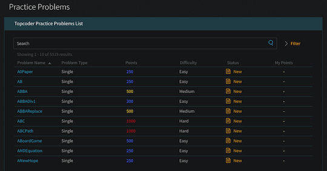
    

- [Topcoder (Problem Search)](https://community.topcoder.com/tc?module=ProblemArchive) - 過去問を検索・閲覧できるWebサイト。
    - 理由: Topcoder Arena（applet版・Web版）の提供終了とともに、コンテストの開催が一時的に休止されるため([出典](https://archive.topcoder.com/))。

    

      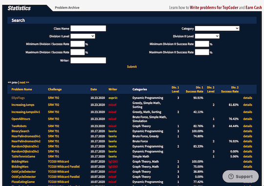
    

- [yukicoder最短コード更新お知らせ](https://twitter.com/yukigolfer) - 最短コードの更新を通知してくれるTwitter bot。別の作者による[AtCoder版](https://twitter.com/atgolfer1) もある。
    - 確認した日: 2023/07/10
    - 理由: Twitter APIの有料化に伴い更新停止、サービス終了の告知を確認したため([出典](https://twitter.com/saito_ta/status/1660632542461177857))。

    

      
    

### 数学系コンテスト

- [オイライン数学](https://twitter.com/qsypiRbuTSKQsqh) - 中学・高校数学オリンピックレベルの問題がほぼ毎日投稿されている。
    - 確認した日: 2023/06/22
    - 理由: 記載なし。

- [競技数学おしらせbot](https://twitter.com/MathContest_bot) - 競技数学に関連するコンテストの開催日時を通知してくれる。
    - 確認した日: 2023/11/25
    - 理由: 記載なし。

- [入試数学コンテスト](https://manabitimes.jp/tests) - 数学の入試対策ができるコンテストサイト。

    

      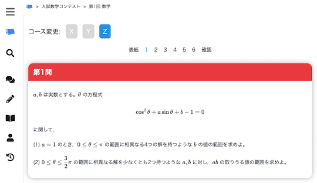
    

- [OMC problems](https://rusa6111.github.io/OMCproblems/) - [OnlineMathContest](https://onlinemathcontest.com/)で開催されたコンテストの問題一覧を確認できる。ベータ版。
    - 代替手段: [公式ページ](https://onlinemathcontest.com/problems)から閲覧する。

    

      
    

### パズル・クイズ系コンテスト

- [競技くそなぞなぞ関連ページ一覧：コンテストとその解説を中心に](https://hamukichi.hatenablog.jp/entry/kuso-nazonazo-portal#f-0e4fd4eb) - 「くそなぞなぞコンテスト」へのリンク、解説、支援ツールなどが網羅的にまとめられている記事。
    - 確認した日: 2024/07/30
    - 理由: 記載なし。

## プロセッサー（アクセラレータ）系コンテスト

- [学生向け Fixstars 高速化コンテスト 2024](https://fixstars-contest.com/) - Intel® CPUを利用した高速化コンテストが開催されている。
    - 確認した日: 2025/03/14
    - 理由: 記載なし。

### データベース系コンテスト

- [TOPSIC SQL Contest](https://topsic-contest.jp/home) - SQLを利用して問題を解くことができるコンテストが開催されている。
    - 確認した日: 2025/03/02
    - 理由: 記載なし。

    !!! warning "注意"
        使用できるのはSQLiteのみ。

<!-- markdown-link-check-enable -->
