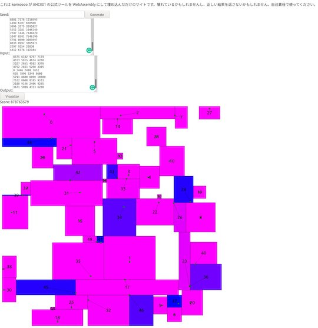
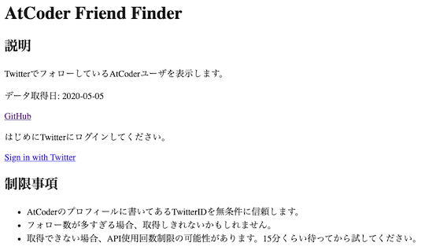

各種情報の更新が停止されたと思われるサービス・ツール、記載内容が古くなったと思われる記事・ツイートなどを掲載しています。

## Webアプリ・Webサイト

### 問題を解く

- [AtCoderTranslations](https://github.com/ADJA/AtCoderTranslations)  - 日本語で出題されているコンテストの問題を英語に翻訳している。

    - 理由: 記載なし。
    - 代替手段: AtCoderの言語表示を「English (EN)」にする。

    

      
    

### 得点状況と配点から次に解く問題を決める

- [AtCoder Strategies](https://atcoder-strategies.web.app/) - ある時点の得点状況と正解の可能性がある問題の配点に基づいて、得られる点数の組み合わせ(見込み)を昇順に表示する。

    !!! warning "注意"
        アルゴリズム部門の[日鉄ソリューションズプログラミングコンテスト2023（AtCoder Beginner Contest 303）](https://atcoder.jp/contests/abc303)以降のコンテストに対応(手動)。

    

      
    

### ヒューリスティック問題の入出力を可視化

- [ahc001-gen-vis-wasm](https://kenkoooo.github.io/ahc001-gen-vis-wasm/) - [AtCoder Heuristic Contest 001](https://atcoder.jp/contests/ahc001)で提供されている入力ジェネレータとビジュアライザをWebブラウザから利用することできる。ソースコードは、[GitHub](https://github.com/kenkoooo/ahc001-gen-vis-wasm) で公開されている。

    

      
    

### コンテストの成績を見る

<!-- markdown-link-check-disable -->

 - [AtCoder Heuristic Statistics](https://heuristic-statistics.herokuapp.com/) - [AtCoder Heuristic Contest](https://atcoder.jp/contests/archive?ratedType=0&category=1200&keyword=AtCoder+Heuristic+Contest)のレーティング分布を表示する。

    - 理由: 記載なし。
    - 代替手段: AtCoderの「プロフィール」ページを見る。

    

      
    

<!-- markdown-link-check-enable -->

- [AtCoderマラソンランキング](https://tomerun.github.io/atcoder_marathon_ranking/index.html) - マラソン系コンテストの順位を[AtCoder レースランキング](https://atcoder.jp/posts/170)と同じ形式でポイント化し、ランキングをつける。

    - 理由: 記載なし。
    - 代替手段: 調査中。

    

      
    

### コンテストに関する統計情報

- [AtCoderFacts](https://app.atcoder-facts.com/) - Ratedコンテストを対象として、レーティング別・問題別の正解者数・正解率を表示する。また、所定のパフォーマンスを得るための得点と所要時間の目安を知ることもできる。

    - 理由: 記載なし。

    !!! warning "注意"
        2022年2月以降のコンテストは、反映されていない可能性が高い。

    

      
    

- [AtCoder賞金ランキング](https://docs.google.com/spreadsheets/d/1E7Ho85znRw7ebB7ZATWBQckM2P_7qZYc35XZExlL_a4/edit#gid=1741891477) - 賞金付きコンテストの獲得額(目安)を集計している。[元ツイート](https://twitter.com/gojira_kyopro/status/1281199066408292353)を参照。
    - 確認した日: 2023/07/15

    !!! warning "注意"
        2021年5月以降のコンテストは、反映されていない可能性が高い。

    

      
    

### コンテスト後の情報収集・発信

<!-- markdown-link-check-disable -->

- [AtCoder Friend Finder](http://atcoder-friend-finder.herokuapp.com/) - [Twitter](https://twitter.com/)でフォローしている[AtCoder](https://atcoder.jp/)ユーザを表示する。

    - 理由: 記載なし。
    - 代替手段: 調査中。

    

      
    

    !!! warning "注意"
        2021年6月以降、更新が行われていない可能性がある。

<!-- markdown-link-check-enable -->

## Bot

### 問題の解答状況・記録を確認する

- [AtCoder Alert](https://atcoderalert-2a1a8.web.app/) - 自分の解答状況を自動でツイートしてくれる。つぶやく内容をカスタマイズすることも可能。
    - 確認した日: 2023/07/08
    - 理由: Twitter APIの有料化に伴い、更新が停止したと思われるため。

    

      
    

### コンテストの開催日時を確認する

- [Contests-Line-Bot](https://github.com/granddaifuku/Contests-Line-Bot)  - 「コンテスト」を含む文章を送ると、コンテストの日程が通知される。AtCoderだけでなく、[Codeforces](https://codeforces.com/)や[yukicoder](https://yukicoder.me/)にも対応している。
    - 確認した日: 2023/07/10
    - 理由: Herokuの有料化に伴い、更新が停止したと思われるため。

    

      
    

- [競プロer Bot](https://twitter.com/cper_bot) - AC(Accepted)、日単位のランキング、コンテストの予定を通知する。
    - 確認した日: 2023/07/10
    - 理由: Twitter APIの有料化に伴い、更新が停止したと思われるため。

    

      
    

- [競プロリマインダー](https://twitter.com/ComproReminder) - 毎朝8:00にコンテスト情報を通知する。[Codeforces](https://codeforces.com/)、[CSAcademy](https://csacademy.com/)、Google Code Jam、[LeetCode](https://leetcode.com/)、[Topcoder](https://www.topcoder.com/)、[yukicoder](https://yukicoder.me/)にも対応している。
    - 確認した日: 2023/07/10
    - 理由: Twitter APIの有料化に伴い、更新が停止したと思われるため。

    

      
    

### コンテストの成績を見る

- [AtCoder コンテスト実況 Bot](https://twitter.com/cpcontest_bot?lang=en) - コンテスト開催中に登録されているユーザの順位が上がったら通知する。
    - 確認した日: 2023/07/10
    - 理由: Twitter APIの有料化に伴い、更新が停止したと思われるため。

    

      
    

## ユーザスクリプト

### Webページに色付けする

- [AtCoder Difficulty Colorizer for Typical 90](https://greasyfork.org/ja/scripts/425463-atcoder-difficulty-colorizer-for-typical-90) - 「[競プロ典型90問](https://atcoder.jp/contests/typical90)」の問題名を、難易度に応じた色に変更する。
    - 確認した日: 2023/07/17
    - 理由: [atcoder-difficulty-display](https://greasyfork.org/ja/scripts/397185-atcoder-difficulty-display)に同じ機能が実装されたことを確認したため。

    

      
    

- [AtCoder Beautiful Code View](https://greasyfork.org/ja/scripts/444280-atcoder-beautiful-code-view) - [Monaco Editor](https://github.com/microsoft/monaco-editor)を利用して、「提出結果」ページのコードを見やすく表示する。
    - 確認した日: 2023/07/17
    - 理由: [AtCoder Comfortable Editor](https://greasyfork.org/ja/scripts/445582-atcoder-comfortable-editor)の方がより高機能であり、かつ、併用ができないため。

    

      
    

- [AtCoder Better Highlighter](https://greasyfork.org/ja/scripts/412865-atcoder-better-highlighter) - 「提出結果」ページのコードをハイライトして見やすくする。デフォルトで10種類以上の言語をサポートしており、対応言語の拡張や配色の変更も可能。
    - 確認した日: 2023/07/17
    - 理由: 作者により同スクリプトの更新停止が告知されているため。

    

      
    

- [AtCoder Heuristic Rating coloring](https://greasyfork.org/ja/scripts/427070-atcoder-heuristic-rating-coloring) - [AtCoder Heuristic Contest](https://atcoder.jp/contests/archive?ratedType=0&category=1200&keyword=AtCoder+Heuristic+Contest)の「順位表」ページで、ユーザ名を同コンテストのレーティングに応じて色付けする。
    - 確認した日: 2023/07/17
    - 理由: 作者により同スクリプトの更新停止が告知されているため。

    

      
    

- [icpc2021_teamlist](https://github.com/riantkb/icpc2021_teamlist) - [ICPC 2021チーム一覧](http://www.yamagula.ic.i.u-tokyo.ac.jp/icpc2021/standings.html)に、ユーザ名とAtCoderのレーティングに対応した色を表示する。[Webサイト版](https://riantkb.github.io/icpc2021_teamlist/)もある。

    

      
    

- [ICPC-Yokohama-2020-Username-and-AtCoder-Color](https://github.com/TumoiYorozu/ICPC-Yokohama-2020-Username-and-AtCoder-Color) - ICPC 2020 Yokohama Liveの[順位表](https://icpcsec.firebaseapp.com/standings/)に、ユーザ名とAtCoderのレーティングに対応した色を表示する。

    

      
    

## Visual Studio Code 拡張機能

### テンプレート・テストケースを用意

- [editSampleCase](https://marketplace.visualstudio.com/items?itemName=imomo.editsamplecase)  - [online-judge-tools/oj](https://github.com/online-judge-tools/oj)のサンプルデータにテストケースを簡単に追加できる[Visual Studio Code](https://code.visualstudio.com/)の拡張機能。詳しい使い方は、作者の[紹介記事](https://iiiimmmmo.hatenablog.com/entry/2020/12/21/153307)を参照されたい。

    

      
    

## 記事

### コードを書くための環境構築を行う

- [AtCoder用C++開発環境 (Mac編)](https://blog.spiralray.net/cp/devenv-cpp) - 動作環境は、macOS Catalina。C++17(デバッグ:Clang、テスト実行・提出: G++)のコンパイル・実行環境を[Visual Studio Code](https://code.visualstudio.com/)と、拡張機能を使って構築する方法が紹介されている。サンプルケースの実行や提出もできる。

- [WSL2とVSCodeでC++環境構築した（AtCoder Libraryを使えるようになるまで）](https://ntk-ta01.hatenablog.com/entry/2020/09/09/181155) - C++やRustのコンパイル・実行環境を[Visual Studio Code](https://code.visualstudio.com/)と[Windows Subsystem for Linux](https://docs.microsoft.com/en-us/windows/wsl/install-win10)で構築するための記事。設定ファイルや[AtCoder Library](https://atcoder.jp/posts/517)に関する説明もある。

- [【VScode＋WSLで始める】競プロ用C++デバッグ環境構築](https://qiita.com/2019Shun/items/5ab290a4117a00e373b6) - C++のコンパイル・実行環境を[Visual Studio Code](https://code.visualstudio.com/)と[Windows Subsystem for Linux](https://docs.microsoft.com/en-us/windows/wsl/install-win10)で構築したあとの拡張機能の導入・設定ファイルについて紹介されている。

- [Windowsで競プロに必要なNeovim環境を整える](https://qiita.com/KowerKoint/items/89d1952b54dec57a1a07) - カスタマイズ性の高いエディタの一つである[NeoVim](https://neovim.io/)を利用して、C++(clang)のコンパイル・実行環境を構築するための記事。関連ツールの導入方法や設定ファイル・プラグインのおすすめ情報も紹介されている。

- [at-coder-with-php](https://github.com/KushibikiMashu/at-coder-with-php)  - PHPの実行環境を構築することができる。

- [atcoder-rs](https://github.com/catupper/atcoder-rs)  - Rustのテンプレートプロジェクト。
- [AtCoder with Rust in mac](https://github.com/hppRC/AtCoder-with-Rust-in-mac)  - [cargo-atcoder](https://github.com/tanakh/cargo-atcoder)を使用して、Mac OSでRustの実行環境を構築することができる。

### コンテストに向けた練習方法を知る

- [AtCoder問題カテゴリー分類](https://qiita.com/c-yan/items/56a051d826b873b4f78d) - コンテストで出題された問題が分類されている。難易度の高い問題が多く含まれている。
    - 確認した日: 2023/07/13

    !!! warning "注意"
        2021年10月以降の更新は確認できず。

### 実装テクニックを学ぶ

#### C&#43;&#43;

- [競技プログラミングとC++のアレコレ](https://koturn.hatenablog.com/entry/2018/07/29/180000) - 競技プログラミングで使われる記法(と業務プログラミングとの違い)を紹介した記事。

    !!! warning "注意"
        2018年7月末時点の情報のため、ジャッジシステムの実行環境および言語仕様の確認を推奨。

#### Python

- [【AtCoder】チートシート公開(コメント解説付き)【競技プログラミング】](https://qiita.com/sano192/items/5f6cec98ec4ecfb2af2c) - 別の著者による頻出コードのチートシート。コメントでとても丁寧に解説されているのが特徴。
- [Python3で競技プログラミングする時に知っておきたいtips（入力編）](https://qiita.com/kyuna/items/8ee8916c2f4e36321a1c) - Python利用者に向けて、初心者がつまづきがちなデータの入力方法を詳細に解説した記事。
- [競プロ界隈でpython強者がやっていることをまとめてみた](https://qiita.com/dekamisako/items/1c104e332351ab9389a6) - Python利用者に向けて、入出力や上位陣が利用している便利なコード集をまとめた記事。
- [PythonでMultisetっぽいことをする(heapqを用いた実装)](https://qiita.com/mymelochan/items/0c72d8b7ae8d9c3d836a) - Pythonで、C++の`Multiset`に相当する機能の実装方法を紹介した記事。

    !!! warning "注意"
        擬似`Multiset`での二分探索はできない。

#### Rust

- [Rustで競技プログラミングの入力をスッキリ記述するマクロ](https://qiita.com/tanakh/items/0ba42c7ca36cd29d0ac8) - Rustで入力データを扱うコードを簡潔に書くためのinput!マクロが紹介されている記事。

    - 理由: 言語アップデートに伴い、文法・言語仕様が変更されたため。
    - 代替手段: [AtCoder言語アップデートでRustの入出力が楽になっていた](https://qiita.com/koji-cw/items/0cce3b075faffe5e50ed)や[言語アップデートで追加されたライブラリ一覧](https://github.com/rust-lang-ja/atcoder-rust-base/blob/ja-all-enabled/Cargo.toml)を読む。

## 動画

### VTuber (バーチャルYouTuber)

- [糟屋もふ](https://www.youtube.com/playlist?list=PLXzhjyS-h7aEH31fB0gAfy_gskIirxBS7) - [KasuyaMofu](https://atcoder.jp/users/KasuyaMofu)さんのチャンネル。[C++入門 AtCoder Programming Guide for beginners (APG4b)](https://atcoder.jp/contests/APG4b)を解く動画などが公開されている。
    - 理由: 競技プログラミングに関連する動画が削除されているのを確認したため。
- [蟹江もなみ](https://www.youtube.com/channel/UC5OB45jE0XqRyXdGETY-2-w) - [kanipanunu](https://atcoder.jp/users/kanipanunu)さんのチャンネル。コンテストの過去問を解く動画が公開されている。
- [紅童ゆに](https://www.youtube.com/channel/UCJcNhhnFIomosRO9ZYWC1pQ/videos) - [紅童ゆに](https://twitter.com/koudou_uni)さんのチャンネル。
    - 理由: 競技プログラミングに関連する動画が削除されているのを確認したため。
- [西園寺まこ](https://www.youtube.com/channel/UClz8TzWlOzG-95FuH2TFD9g) - [saion_maco](https://atcoder.jp/users/saion_maco)さんのチャンネル。コンテストの過去問を解く動画などが公開されている。
- [浜ぬる](https://www.youtube.com/channel/UC_Fm2rtPE76XeuO-00I33cA/featured) - [hamanuru](https://twitter.com/hamanuru)さんのチャンネル。コンテストの過去問を解く動画が公開されている。
- [文月このは](https://www.youtube.com/playlist?list=PLhu1EKNfmGwS75JjK2YeMRm9AVcubN0WO) - [kono_july](https://atcoder.jp/users/kono_july)さんのチャンネル。コンテストの過去問を解く動画などが公開されている。
- [めいどさん MayDoSom](https://www.youtube.com/channel/UCCgPox6jBMMaeWutBXv7uRA) - [MayDoSom](https://atcoder.jp/users/MayDoSom)さんのチャンネル。コンテストの過去問を解く動画などが公開されている。

### YouTuber

- [ことり兄貴【プログラマ】](https://www.youtube.com/channel/UCf86wNbQtsJKh2EpRm7-Mrg/videos) - [KotoriAniki](https://atcoder.jp/users/KotoriAniki)さんのチャンネル。コンテストの過去問を解く動画などが公開されている。
- [長田歌菜](https://www.youtube.com/channel/UC9amFw1nimUfDGAf746HYXQ) - [ngtkana](https://atcoder.jp/users/ngtkana)さんのチャンネル。コンテスト終了後に、実況動画が公開されている。
    - 理由: 競技プログラミングに関連する動画が削除されているのを確認したため。

## コマンドラインツール

### ソースコードにバグがないか確認

#### 任意の言語

- [acc](https://github.com/Takachiha/acc)  - テスト、提出ができる。提出する言語は、オプションで新旧システムのいずれかを選択できる。
- [WrongAnswer](https://github.com/takoha-cpp/WrongAnswer)  - 指定した問題のテストケースをダウンロードする。利用には、前述の[Online Judge Tools](https://github.com/online-judge-tools/oj)が必須。使い方が日本語・英語で説明されている。

    

      
    

#### 複数の言語

- [atsubmit](https://github.com/flow6852/atsubmit)  - サンプルの取得・テスト、提出、結果の閲覧を自動で行うことができる。テストケースの正誤判定は、HaskellとRustが可能。
- [getac](https://github.com/fukamachi/getac)  - サンプルのテストを実行できる。対応言語は、C、C++、Clojure、Common Lisp、Go、Haskell、Java、Node.js、Python、Ruby、Scheme。

    

      
    

- [Procon Tools](https://github.com/naipia/procon-tools)  - 競技プログラミングサイトに参加する上で必要な機能を提供している[Visual Studio Code](https://code.visualstudio.com/)の拡張機能。C++とGoに対応している。

#### C&#43;&#43;

- [procon.vim](https://github.com/ogura01/procon.nvim)  - [Neovim](https://neovim.io/)プラグイン。
- [vim-atcoder](https://github.com/cannot-fly-pig/vim-atcoder)  - [Vim](https://www.vim.org/)でサンプルケースのテストするためのプラグイン。企業コンテストには、今後対応予定。

    

      
    

#### Python

利用するときは、Goの実行環境が必要。

- [atc](https://github.com/nasjp/atc)  - 軽量のテストツール。

### テンプレートを生成

#### ヒューリスティック部門

- [kmyk/marathon-kit](https://github.com/kmyk/marathon-kit)  - AtCoder Heuristic Contestのためのテンプレートレポジトリ。テストの並列実行、途中経過のビジュアライズ、GitHubでの自動テストが実行できる。

## 関連コンテストサイト

### 情報オリンピック

- [夏季セミナーで効率の良いアルゴリズムを一緒に学ぼう！（中高生対象：8/17～8/20の4日間, 設定：初級, 中級, 上級コース）](https://jcioi-summer-seminar-2023.peatix.com/) - 情報科学に興味のある中高生・高専生を対象として、オンラインの勉強会の参加者を募集している記事。

    !!! warning "注意"
        ・募集期間: 7月3日(月)〜8月10日(木) 12:00　(定員になり次第、締め切り)

        ・テキストを自己負担で事前に用意する必要がある

- [AtCoderにJOIの過去問の移植作業を行う有志を募集するツイート](https://twitter.com/Pro_ktmr/status/1485612598842519552) - AtCoderでJOIの過去問を解くことができるように、2022年度以降の移植作業を引き継ぐ方を募集しているツイート。

    - 理由: 記載なし。

- [JOI夏季セミナーに代わる輪読会の開催について](https://kaage.hatenablog.com/entry/2022/03/25/210000) - JOI夏季セミナー(ハイレベルコース)の開催見送りに伴い、代替イベントとなる輪読会の参加者を募集している記事。

### 数学系コンテスト

- [Beginners Math Contest](https://twitter.com/BMC_rifle) - 初心者向けの競技数学コンテストが開催されている。
    - 確認した日: 2023/06/22
    - 理由: 記載なし。

- [Math Olympiad Rating Project](https://twitter.com/MORatingProject) - 数学オリンピックの過去問を利用したコンテスト(が定期的に開催される予定)。この結果を用いて、問題の難易度を推定したデータベース「Math Olympiad problems」を作成することが最終目標として掲げられている。
    - 確認した日: 2023/06/22
    - 理由: 記載なし。

### セキュリティ系コンテスト

- [CTF-Ratings](https://github.com/theoremoon/ctf-ratings) - CTF(Capture The Flag)のレーティングシステム。レーティングとパフォーマンスは、AtCoderに準拠している。
    - 確認した日: 2023/07/31
    - 理由: 記載なし。

    

      
    

