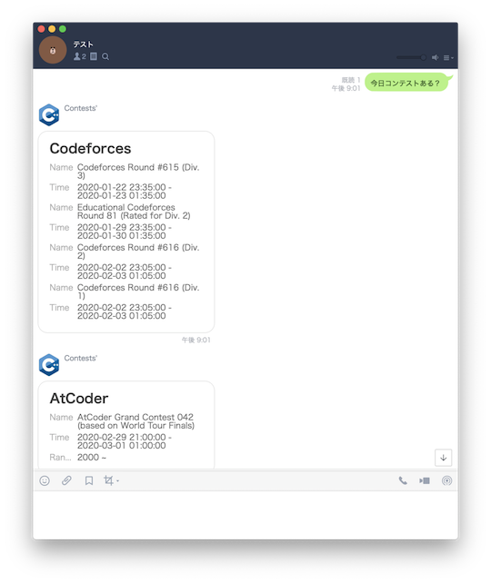
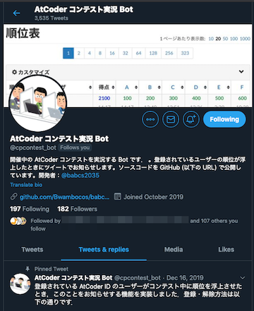

各種情報の更新が停止されたと思われるサービス・ツール、記載内容が古くなったと思われる記事・ツイートなどを掲載しています。

## Webアプリ・Webサイト

### 問題を解く

- [AtCoderTranslations](https://github.com/ADJA/AtCoderTranslations)  - 日本語で出題されているコンテストの問題を英語に翻訳している。

    - 理由: 記載なし。
    - 代替手段: AtCoderの言語表示を「English (EN)」にする。

    

      
    

### ヒューリスティック問題の入出力を可視化

- [ahc001-gen-vis-wasm](https://kenkoooo.github.io/ahc001-gen-vis-wasm/) - [AtCoder Heuristic Contest 001](https://atcoder.jp/contests/ahc001)で提供されている入力ジェネレータとビジュアライザをWebブラウザから利用することできる。ソースコードは、[GitHub](https://github.com/kenkoooo/ahc001-gen-vis-wasm) で公開されている。

    

      
    

### コンテストの成績を見る

<!-- markdown-link-check-disable -->

 - [AtCoder Heuristic Statistics](https://heuristic-statistics.herokuapp.com/) - [AtCoder Heuristic Contest](https://atcoder.jp/contests/archive?ratedType=0&category=1200&keyword=AtCoder+Heuristic+Contest)のレーティング分布を表示する。

    - 理由: 記載なし。
    - 代替手段: AtCoderの「プロフィール」ページを見る。

    

      
    

<!-- markdown-link-check-enable -->

- [AtCoderマラソンランキング](https://tomerun.github.io/atcoder_marathon_ranking/index.html) - マラソン系コンテストの順位を[AtCoder レースランキング](https://atcoder.jp/posts/170)と同じ形式でポイント化し、ランキングをつける。

    - 理由: 記載なし。
    - 代替手段: 調査中。

    

      
    

### コンテストに関する統計情報

- [AtCoderFacts](https://app.atcoder-facts.com/) - Ratedコンテストを対象として、レーティング別・問題別の正解者数・正解率を表示する。また、所定のパフォーマンスを得るための得点と所要時間の目安を知ることもできる。

    - 理由: 記載なし。

    !!! warning "注意"
        2022年2月以降のコンテストは、反映されていない可能性が高い。

    

      
    

### コンテスト後の情報収集・発信

<!-- markdown-link-check-disable -->

- [AtCoder Friend Finder](http://atcoder-friend-finder.herokuapp.com/) - [Twitter](https://twitter.com/)でフォローしている[AtCoder](https://atcoder.jp/)ユーザを表示する。

    - 理由: 記載なし。
    - 代替手段: 調査中。

    

      
    

    !!! warning "注意"
        2021年6月以降、更新が行われていない可能性がある。

<!-- markdown-link-check-enable -->

## Bot

### 問題の解答状況・記録を確認する

- [AtCoder Alert](https://atcoderalert-2a1a8.web.app/) - 自分の解答状況を自動でツイートしてくれる。つぶやく内容をカスタマイズすることも可能。
    - 確認した日: 2023/07/08
    - 理由: Twitter APIの有料化に伴い、更新が停止したと思われるため。

    

      
    

### コンテストの開催日時を確認する

- [Contests-Line-Bot](https://github.com/granddaifuku/Contests-Line-Bot)  - 「コンテスト」を含む文章を送ると、コンテストの日程が通知される。AtCoderだけでなく、[Codeforces](https://codeforces.com/)や[yukicoder](https://yukicoder.me/)にも対応している。
    - 確認した日: 2023/07/10
    - 理由: Herokuの有料化に伴い、更新が停止したと思われるため。

    

      
    

- [競プロer Bot](https://twitter.com/cper_bot) - AC(Accepted)、日単位のランキング、コンテストの予定を通知する。
    - 確認した日: 2023/07/10
    - 理由: Twitter APIの有料化に伴い、更新が停止したと思われるため。

    

      
    

- [競プロリマインダー](https://twitter.com/ComproReminder) - 毎朝8:00にコンテスト情報を通知する。[Codeforces](https://codeforces.com/)、[CSAcademy](https://csacademy.com/)、[Google Code Jam](https://codingcompetitions.withgoogle.com/codejam)、[LeetCode](https://leetcode.com/)、[Topcoder](https://www.topcoder.com/)、[yukicoder](https://yukicoder.me/)にも対応している。
    - 確認した日: 2023/07/10
    - 理由: Twitter APIの有料化に伴い、更新が停止したと思われるため。

    

      
    

### コンテストの成績を見る

- [AtCoder コンテスト実況 Bot](https://twitter.com/cpcontest_bot?lang=en) - コンテスト開催中に登録されているユーザの順位が上がったら通知する。
    - 確認した日: 2023/07/10
    - 理由: Twitter APIの有料化に伴い、更新が停止したと思われるため。

    

      
    

## ユーザスクリプト

### Webページに色付けする

- [icpc2021_teamlist](https://github.com/riantkb/icpc2021_teamlist) - [ICPC 2021チーム一覧](http://www.yamagula.ic.i.u-tokyo.ac.jp/icpc2021/standings.html)に、ユーザ名とAtCoderのレーティングに対応した色を表示する。[Webサイト版](https://riantkb.github.io/icpc2021_teamlist/)もある。

    

      
    

- [ICPC-Yokohama-2020-Username-and-AtCoder-Color](https://github.com/TumoiYorozu/ICPC-Yokohama-2020-Username-and-AtCoder-Color) - ICPC 2020 Yokohama Liveの[順位表](https://icpcsec.firebaseapp.com/standings/)に、ユーザ名とAtCoderのレーティングに対応した色を表示する。

    

      
    

## 記事

### 実装テクニックを学ぶ

- [Rustで競技プログラミングの入力をスッキリ記述するマクロ](https://qiita.com/tanakh/items/0ba42c7ca36cd29d0ac8) - Rustで入力データを扱うコードを簡潔に書くためのinput!マクロが紹介されている記事。

    - 理由: 言語アップデートに伴い、文法・言語仕様が変更されたため。
    - 代替手段: [AtCoder言語アップデートでRustの入出力が楽になっていた](https://qiita.com/koji-cw/items/0cce3b075faffe5e50ed)や[言語アップデートで追加されたライブラリ一覧](https://github.com/rust-lang-ja/atcoder-rust-base/blob/ja-all-enabled/Cargo.toml)を読む。

## 動画

### VTuber (バーチャルYouTuber)

- [糟屋もふ](https://www.youtube.com/playlist?list=PLXzhjyS-h7aEH31fB0gAfy_gskIirxBS7) - [KasuyaMofu](https://atcoder.jp/users/KasuyaMofu)さんのチャンネル。[C++入門 AtCoder Programming Guide for beginners (APG4b)](https://atcoder.jp/contests/APG4b)を解く動画などが公開されている。
    - 理由: 競技プログラミングに関連する動画が削除されているのを確認したため。
- [蟹江もなみ](https://www.youtube.com/channel/UC5OB45jE0XqRyXdGETY-2-w) - [kanipanunu](https://atcoder.jp/users/kanipanunu)さんのチャンネル。コンテストの過去問を解く動画が公開されている。
- [紅童ゆに](https://www.youtube.com/channel/UCJcNhhnFIomosRO9ZYWC1pQ/videos) - [紅童ゆに](https://twitter.com/koudou_uni)さんのチャンネル。
    - 理由: 競技プログラミングに関連する動画が削除されているのを確認したため。
- [西園寺まこ](https://www.youtube.com/channel/UClz8TzWlOzG-95FuH2TFD9g) - [saion_maco](https://atcoder.jp/users/saion_maco)さんのチャンネル。コンテストの過去問を解く動画などが公開されている。
- [文月このは](https://www.youtube.com/playlist?list=PLhu1EKNfmGwS75JjK2YeMRm9AVcubN0WO) - [kono_july](https://atcoder.jp/users/kono_july)さんのチャンネル。コンテストの過去問を解く動画などが公開されている。
- [めいどさん MayDoSom](https://www.youtube.com/channel/UCCgPox6jBMMaeWutBXv7uRA) - [MayDoSom](https://atcoder.jp/users/MayDoSom)さんのチャンネル。コンテストの過去問を解く動画などが公開されている。

### YouTuber

- [ことり兄貴【プログラマ】](https://www.youtube.com/channel/UCf86wNbQtsJKh2EpRm7-Mrg/videos) - [KotoriAniki](https://atcoder.jp/users/KotoriAniki)さんのチャンネル。コンテストの過去問を解く動画などが公開されている。
- [長田歌菜](https://www.youtube.com/channel/UC9amFw1nimUfDGAf746HYXQ) - [ngtkana](https://atcoder.jp/users/ngtkana)さんのチャンネル。コンテスト終了後に、実況動画が公開されている。
    - 理由: 競技プログラミングに関連する動画が削除されているのを確認したため。

## 関連コンテストサイト

### 情報オリンピック

- [AtCoderにJOIの過去問の移植作業を行う有志を募集するツイート](https://twitter.com/Pro_ktmr/status/1485612598842519552) - AtCoderでJOIの過去問を解くことができるように、2022年度以降の移植作業を引き継ぐ方を募集しているツイート。

    - 理由: 記載なし。

### 数学系コンテスト

- [Beginners Math Contest](https://twitter.com/BMC_rifle) - 初心者向けの競技数学コンテストが開催されている。
    - 確認した日: 2023/06/22
    - 理由: 記載なし。

- [Math Olympiad Rating Project](https://twitter.com/MORatingProject) - 数学オリンピックの過去問を利用したコンテスト(が定期的に開催される予定)。この結果を用いて、問題の難易度を推定したデータベース「Math Olympiad problems」を作成することが最終目標として掲げられている。
    - 確認した日: 2023/06/22
    - 理由: 記載なし。
