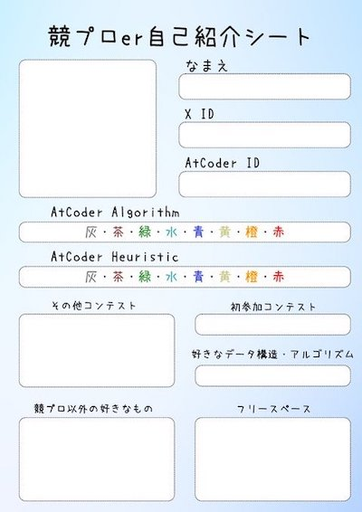

## 中学生・高校生

- [KCLC Course Page](https://kclc-kaisei.github.io/index.html) - Kaisei Computer Lovers' Club (KCLC)の有志によって作成された公式ホームページ。活動内容の紹介や新入生向けの学習教材が用意されている。
- [Introduction to Paken](https://tkpaken.github.io/beginners/) - 筑波大附属駒場中・高等学校の「中高パーソナル・コンピューター研究部(通称、Paken)」の新入生に向けて、部活の雰囲気やプログラミングの基礎を紹介している。

## 大学生・大学院生

- [「競技プログラミング」という青春　「開成―東大」天才学生たちの世界への挑戦](https://www.dailyshincho.jp/article/2021/04140602/) - 国際大学対抗プログラミングコンテスト（ICPC）に挑戦する学生たちを紹介した記事。学内での熾烈な代表争い、競技プログラミングとの出会い・挫折と成長、団体戦の醍醐味などが書かれている。
- [HCPC 北海道大学競技プログラミングサークル](https://hcpc-hokudai.github.io/) - 北海道大学にある競技プログラミングの練習会・勉強会を行うサークル。活動記録に加えて、勉強会のスライドや開催されたコンテストの過去問が掲載されている。
- [新大プログラミングサークル　PLOT](https://twitter.com/plot_niigata) - 新潟大学でプログラミングや統計学を勉強するサークル。活動内容が紹介されている。
- [阪大競技プログラミング部「RAINBOU」](https://rainbou.org/) - 大阪大学で競技プログラミングを楽しむ・学生同士で交流するための公認団体。活動内容の紹介や連絡先が掲載されている。

## 社会人

- [競技プログラミング部活動をはじめました - デロイト トーマツ リスクサービス公式ブログ](https://blog.mmmcorp.co.jp/blog/2020/12/26/competitive-programming-club/) - デロイト トーマツ リスクサービス株式会社(旧 株式会社MMM)の「競技プログラミング部」に関する記事。部活動を始めたきっかけ、活動内容、部活動によるメリット、社内制度が紹介されている。
- [競プロ部の紹介](https://note.com/t_fuki889/n/nc4ecec3265e2) - [株式会社オプティマインド](https://www.optimind.tech/)の競プロ部の活動内容(メンバー・社内バーチャルコンテスト・勉強会など)を紹介した記事。
- [フォルシア競プロ部発足！活動レポート](https://www.forcia.com/blog/002879.html) - [フォルシア株式会社](https://www.forcia.com/)の競技プログラミング部の活動内容(部活動の誕生の経緯、勉強会、オンサイトコンテスト)が紹介されている。
    - [「ゆるふわ競技プログラミングオンサイト at FORCIA #8」を開催しました](https://www.forcia.com/blog/003203.html) - 初級〜中級競技プログラマを対象としたオンサイトイベントについて、主催者がイベント当日の内容・感想をまとめている。

    ??? info "過去の開催記"

        - [「ゆるふわ競技プログラミングオンサイト at FORCIA #4」を開催しました](https://www.forcia.com/blog/002620.html)
        - [「ゆるふわ競技プログラミングオンサイト at FORCIA #2」を開催しました](https://www.forcia.com/blog/001393.html)

- [実装力底上げを目指して、社内で「バーチャルコンテスト」を開催している話](https://note.com/dev_onecareer/n/n5f486629806d) - 株式会社ワンキャリアの有志がさらなる技術力向上を目指して、社内バーチャルコンテストの企画・実践内容を紹介した記事。
- [社内ヒューリスティックコンテスト@アルゴ合宿2023 開催レポート](https://media.algo-artis.com/posts/bN4vP1cR) - 株式会社 ALGO ARTISの合宿で社内ヒューリスティックコンテストが開催された経緯・当日の様子・問題の解法まで紹介されている。

## イベント主催者・協賛者・参加者

- [競プロer自己紹介シート](https://twitter.com/deuteridayodayo/status/1763197371704631355) - 競技プログラミングに関心のあるユーザ向けの自己紹介用テンプレート。

    

      
    

- [発案から10日で107名の大宴会を開催した話(メール一括作成GASつき)](https://d-burioden.hateblo.jp/entry/2023/04/03/043035) - 100人規模の宴会を開催する際に、店の予約・参加者の把握・懸念事項への対策などの知見がまとめられている記事。

### CodeQUEEN

#### 2025

- [CodeQUEEN 2025 参加記](https://momoharahara.hatenadiary.com/entry/2025/08/03/003143) - [CodeQUEEN 2025 決勝](https://atcoder.jp/contests/codequeen2025-final-Public)の優勝者による参加記。予選突破から決勝参加までの練習方針と内容、当日のコンテストや懇親会・オフ会などを振り返っている。
- [CodeQUEEN2025の決勝に行った話](https://note.com/rieul/n/nc12ca268c87c) - 同大会決勝進出者による参加記。予選通過前後の状況・大会直前の練習内容・当日のコンテストの考察と振り返り・懇親会・オフ会などに言及されている。

#### 2024

<!-- markdown-link-check-disable -->

- [「CodeQUEEN 2024」決勝にスポンサーとして参加してきました！](https://note.e-seikatsu.info/n/n58a992f584f4) - 昨年に続き、[CodeQUEEN 2024 決勝](https://atcoder.jp/contests/codequeen2024-final-N9tn8QqD)の協賛者が当日を振り返った記事。主にコンテストの表彰式・懇親会について言及している。

<!-- markdown-link-check-enable -->

- [総勢217名の女性競技プログラマーが参加　女性競技プログラミングコンテスト「CodeQUEEN」結果発表](https://prtimes.jp/main/html/rd/p/000000048.000028415.html) - 同コンテストの開催経緯と優勝者・上位入賞者のコメントがまとめられている。
- [CodeQUEEN2024で優勝しました](https://www.forcia.com/blog/002983.html) - 同コンテストの優勝者が当日を振り返った参加記。配点に基づいた戦略・各問題の図解に加え、スポンサー活動にも言及されている。
- [CodeQUEEN 2024参加記](https://momoharahara.hatenadiary.com/entry/2024/08/07/122348) - [CodeQUEEN 2024 決勝](https://atcoder.jp/contests/codequeen2024-final-N9tn8QqD)の参加記。本番までの練習内容・コンテスト当日の振り返り・各種イベント・オフ会などについてまとめられている。

#### 2023

<!-- markdown-link-check-disable -->

- [「CodeQUEEN 2023」にスポンサーとしておじゃましてきました！](https://note.e-seikatsu.info/n/n423fde3ccf32) - [CodeQUEEN 2023 決勝](https://atcoder.jp/contests/codequeen2023-final-open)の協賛者が当日を振り返った記事。スポンサー参加の経緯、会場のスナップショット、スポンサーセッション、座談会、コンテストおよび結果発表・表彰式、懇親会の様子がまとめられている。

<!-- markdown-link-check-enable -->

- [CodeQUEEN2023でスポンサーをしたり優勝したりした話](https://www.forcia.com/blog/002760.html) - [CodeQUEEN 2023 決勝](https://atcoder.jp/contests/codequeen2023-final-open)に、個人と会社の両方の立場からイベントの参加内容を報告している記事。スポンサー参加までの経緯やコンテストの振り返りだけでなく、同イベントから高校生のインターンの受け入れと実務的な成果につながったことも言及されている。
    - [CodeQUEEN2023決勝に出場しました！](https://ayuna-stpyko.github.io/my_blog/archive/20231023.html)、[女性オンリーオンサイトイベント【CodeQUEEN 2023】に参加した話](https://d-burioden.hateblo.jp/entry/2023/10/23/220439)、[CodeQUEEN 2023 決勝 参加記](https://abvi.hatenablog.com/entry/2024012600) - 同イベントの参加記。オンサイトイベントへの参加決定までの経緯・コンテストの振り返り・各種イベント・オフ会などについてまとめられている。

### TOUPC001

- [競プロオンサイトは、数名の素晴らしい仲間と覚悟があれば開けるという話。（TOUPC001 開催記）](https://note.com/uruzunyaa/n/n0e83e9a59242) - [TOUPC001](https://onlinejudge.u-aizu.ac.jp/beta/room.html#TOUPC001)の主催者による開催記。コンテストのコンセプト・開催までの経緯と熱意を持って行動することの重要性・当日の会場運営・問題の振り返り・問題作成のTipsなどがまとめられている。
- [TOUPC001に参加してきた](https://inthebloom.github.io/post/toupc001/) - コンテストの参加記。コンテスト参加の経緯・振り返り・懇親会の様子などがつづられている。

### UTPC 2023

- [UTPC2023 開催記](https://chineristac.hatenablog.com/entry/2024/03/27/011633) - [UTPC 2023](https://atcoder.jp/contests/utpc2023)の運営・出題者による開催記。筆者が各問題を解いた感想や運営面での反省点がまとめられている。

    !!! warning "注意"

        問題および解法のネタバレを含む。

### TUPC2023

- [TUPC2023開催記](https://nononmath.hatenablog.com/entry/2024/03/20/104538) - [東北大学プログラミングコンテスト 2023](https://atcoder.jp/contests/tupc2023)の運営・出題者による開催記。問題・会場の準備、当日の回答状況と想定難易度、問題の裏話などがつづられている。

### OUPC 2023

- [OUPC 2023 開催記](https://kowerkoint.hatenablog.com/entry/2024/01/09/220819) - オンサイトイベントの主催者による開催記。問題作成のスケジュール・作業分担・使用ツール・解説、会場運営・告知、当日の運営者・参加者として感想・体験談がまとめられている。

### 緑以下コンテスト

- [第2回緑以下コンテスト開催記](https://kusirara.hatenablog.com/entry/2023/12/04/134934) - オンサイトイベントの主催者による開催記。同イベントの意義・開催経緯、準備状況、当日の様子、意識した内容、大変だった点や反省点、今後オンサイトイベントを開催したい人向けの行動指針などがつづられている。
- [オンサイトのプログラミングコンテスト「緑以下コンテスト」を開催しました！](https://deuteridayo.hateblo.jp/entry/2023/12/05/211915) - 同イベントの共催者・出題者による開催記。開催の経緯、出題した問題の狙い、オリジナル名札の準備と工夫、当日の服装などを振り返っている。

### World Tour Finals 2022

- [AtCoder World Tour Finals 2022 参加記](https://heno239.hatenablog.com/entry/2023/09/10/133932) - [heno239](https://atcoder.jp/users/heno239)さんによるWorld Tour Finals 2022 ([Day1](https://atcoder.jp/contests/wtf22-day1)、[Day2](https://atcoder.jp/contests/wtf22-day2))の参加記。コンテストの戦略・思考過程に加えて、各国の参加者との国際交流・グルメなどについても言及されている。

- [AtCoder WTF 2022 (お手伝いとして参加）](https://maspypy.com/atcoder-wtf-2022-%e3%81%8a%e6%89%8b%e4%bc%9d%e3%81%84%e3%81%a8%e3%81%97%e3%81%a6%e5%8f%82%e5%8a%a0%ef%bc%89) - コンテストの運営スタッフの一人である[maspy](https://atcoder.jp/users/maspy)さんの参加記。testerとしての活動の概略、コンテスト前後のイベントを含めて時系列での振り返りが行われている。

    !!! info "参考"

        問題の解法には一切言及しないことが明記されている。

## コーチングに興味がある人向け

- [茶コーダーが競プロ家庭教師した話](https://speakerdeck.com/burioden/240117-uv-lt-fa84027b-5df9-4c05-b31c-ace56c010103) - 個別指導の依頼を受けた筆者が、教材の準備・アドバイスの内容・意識していたこと・指導をしながら気づいたことをまとめている。
