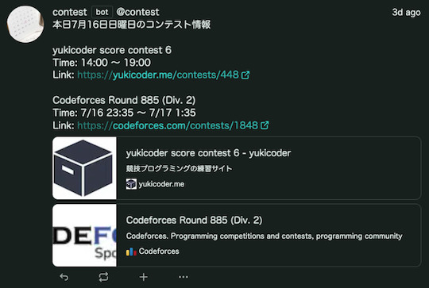

コンテストの日程、各種記録の更新などを自動的に通知してくれるサービスを掲載しています。

!!! info "参考"

    サービスを利用するときの判断材料となるよう、GitHubのStar数を掲載しています。

!!! warning "注意"

    ソースコードの一部変更や、[AWS Lambda](https://aws.amazon.com/lambda/)の導入が必要なサービスもあります。

## 問題を解く

### Slack

- [rcoder-todays-problem](https://github.com/mmck328/rcoder-todays-problem)  - 今日の問題をおすすめしてくれる。

## [AtCoder Problems](https://kenkoooo.com/atcoder/)でバーチャルコンテストに参加する

### Discord

- [あさかつ](https://discord.gg/6JbTEBnfrY)
    - 出題範囲:
        - [AtCoder Problems](https://kenkoooo.com/atcoder/)で推定された難易度のうち、灰色〜青色相当の6問
        - AtCoder Regular Contest (通称、ARC) 104以降から、同灰色〜黄色相当の6問
    - 開催日時: いずれも07:30〜08:30
    - 主催者: [hibit-at](https://github.com/hibit-at)さん

- [まよコン](http://discord.gg/exFTabXHhA)
    - 出題範囲: AtCoder Beginner Contest (通称、ABC)のA〜G問題から8問
    - 開催日時: 21:00〜22:40
    - 主催者: [mayocornsuki](https://twitter.com/mayocornsuki)さん

### X (旧Twitter)

- [もすーんバチャ通知](https://x.com/Mosoon_V)
    - 出題範囲: [AtCoder Problems](https://kenkoooo.com/atcoder/)で推定された難易度のうち、灰色〜黄色相当の7問
    - 開催日時: 不定期(30分)
    - 主催者: [Mo_SoooN2](https://x.com/Mo_SoooN2)さん

### Bluesky

- [Bluesky競プロ部](https://bsky.app/profile/kyopro.bsky.social)
    - 出題範囲: [AtCoder Problems](https://kenkoooo.com/atcoder/)で推定された難易度のうち、灰色〜青色相当から2~5問
    - 開催日時: 毎週1回で8:00~8:40
    - 主催者: [Hiroshi Kurokawa](https://x.com/hydrakecat)さん

## 問題の解答状況・記録を確認する

### Slack

- [AtCoder Daily AC Checker](https://github.com/purple-jwl/atcoder-daily-ac-checker)  - AC(Accepted)している人をSlack上で褒めてくれる。
- [atcoder_useful](https://github.com/Kota-Y/atcoder_useful)  - [AtCoder Problems](https://kenkoooo.com/atcoder/)のCurrent Streakを切らさないように通知する。

## コンテストの開催日時を確認する

### Discord

- [AtCoderChokuZen](https://github.com/KATO-Hiro/AtCoderChokuZen)  - コンテスト当日に、コンテスト情報(開催日時・開始までの残り時間)をスマートフォンにプッシュ通知する。

    

      
    

### Misskey

- [contest](https://misskey.kyoupro.com/@contest) - 当日に予定されているコンテストを通知する。以下のコンテストサイトに対応。
    - [AtCoder](https://atcoder.jp/)
    - [CodeChef](https://www.codechef.com/)
    - [Codeforces](https://codeforces.com/)
    - [yukicoder](https://yukicoder.me/)

    

      
    

### X (旧Twitter)

- [AtCoderお知らせ更新情報 (非公式)](https://x.com/AtCoderInfoBot) - [AtCoder](https://atcoder.jp/)公式のお知らせが更新されたときに通知する。

    

      
    

- [Procon Notification](https://x.com/procon_notify) - [15以上のコンテストサイト](https://procon-notification.vercel.app/about)を対象として、コンテスト開始30分前に通知してくれる。

## コンテストの成績を見る

### Slack

- [atcoder-rate-notify](https://github.com/ysk1180/atcoder-rate-notify)  - レーティングを毎週お知らせしてくれる。

### X (旧Twitter)

- [ABC bot](https://x.com/abc_notifier) - AtCoder Beginner Contest (ABC)の結果が確定したときにツイートしてくれる。

## コンテストの成績に関連するサービス

### Discord

- [shino-sky/AtCoder-bot](https://github.com/shino-sky/AtCoder-bot)  - レーティング(色)をもとに、自動でメンバーにロールを割り当てる。
