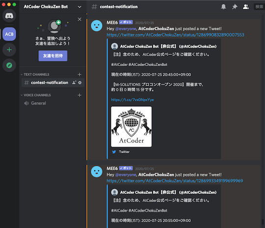
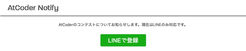
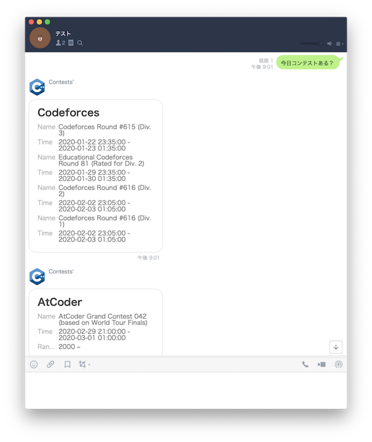
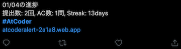
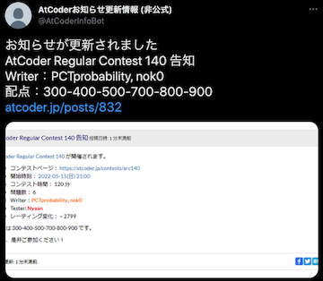
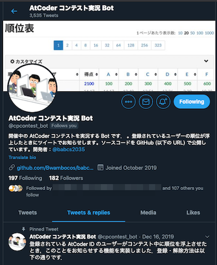
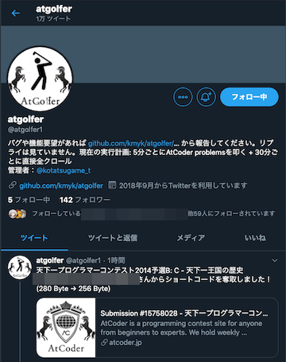
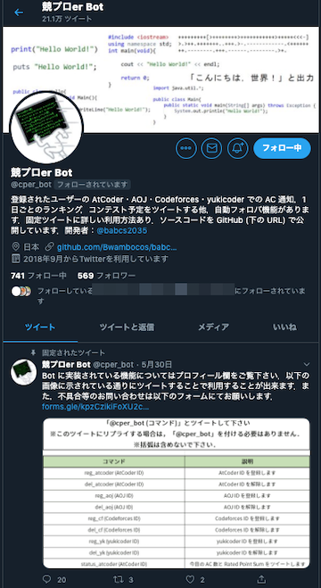
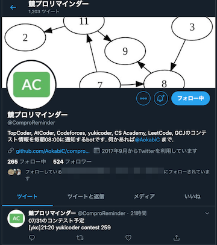
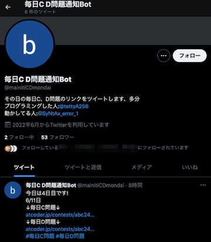

コンテストの日程、各種記録の更新などを自動的に通知してくれるサービスを掲載しています。

!!! info "参考"

    サービスを利用するときの判断材料となるよう、GitHubのStar数を掲載しています。

## Discord

- [AtCoderChokuZen](https://github.com/KATO-Hiro/AtCoderChokuZen)  - コンテスト当日に、コンテスト情報(開催日時・開始までの残り時間)をスマートフォンにプッシュ通知する。

    

      
    

- [shino-sky/AtCoder-bot](https://github.com/shino-sky/AtCoder-bot)  - レーティング(色)をもとに、自動でメンバーにロールを割り当てる。

## LINE

- [AtCoder Notify](https://atcoder-bot.firebaseapp.com/) - コンテスト情報を通知する。

    

      
    

- [Contests-Line-Bot](https://github.com/granddaifuku/Contests-Line-Bot)  - 「コンテスト」を含む文章を送ると、コンテストの日程が通知される。AtCoderだけでなく、[Codeforces](https://codeforces.com/)にも対応している。

    

      
    

## Slack

!!! warning "注意"

    ソースコードの一部変更や、[AWS Lambda](https://aws.amazon.com/lambda/)の導入が必要なサービスもあります。

- [AtCoder Daily AC Checker](https://github.com/purple-jwl/atcoder-daily-ac-checker)  - AC(Accepted)している人をSlack上で褒めてくれる。
- [atcoder-rate-notify](https://github.com/ysk1180/atcoder-rate-notify)  - レーティングを毎週お知らせしてくれる。
- [atcoder_useful](https://github.com/Kota-Y/atcoder_useful)  - [AtCoder Problems](https://kenkoooo.com/atcoder/)のCurrent Streakを切らさないように通知する。
- [rcoder-todays-problem](https://github.com/mmck328/rcoder-todays-problem)  - 今日の問題をおすすめしてくれる。

## Twitter

- [ABC bot](https://twitter.com/abc_notifier) - AtCoder Beginner Contest (ABC)の結果が確定したときにツイートしてくれる。

- [AtCoder Alert](https://atcoderalert-2a1a8.web.app/) - 自分の解答状況を自動でツイートしてくれる。つぶやく内容をカスタマイズすることも可能。

    

      
    

- [AtCoderお知らせ更新情報 (非公式)](https://twitter.com/AtCoderInfoBot) - [AtCoder](https://atcoder.jp/)公式のお知らせが更新されたときに通知する。

    

      
    

- [AtCoder コンテスト実況 Bot](https://twitter.com/cpcontest_bot?lang=en) - コンテスト開催中に登録されているユーザの順位が上がったら通知する。

    

      
    

- [atgolfer](https://twitter.com/atgolfer1) - [コードゴルフ](https://ja.wikipedia.org/wiki/%E3%82%B3%E3%83%BC%E3%83%89%E3%82%B4%E3%83%AB%E3%83%95)の記録更新を通知する。別の作者による[yukicoder版](https://twitter.com/yukigolfer)もある。

    

      
    

- [競プロer Bot](https://twitter.com/cper_bot) - AC(Accepted)、日単位のランキング、コンテストの予定を通知する。

    

      
    

- [競プロリマインダー](https://twitter.com/ComproReminder) - 毎朝8:00にコンテスト情報を通知する。[Codeforces](https://codeforces.com/)、[CSAcademy](https://csacademy.com/)、[Google Code Jam](https://codingcompetitions.withgoogle.com/codejam)、[LeetCode](https://leetcode.com/)、[Topcoder](https://www.topcoder.com/)、[yukicoder](https://yukicoder.me/)にも対応している。

    

      
    

- [毎日C D問題通知Bot](https://twitter.com/mainitiCDmondai) - AtCoder Beginner Contest (ABC)のC問題・D問題のリンクを毎日ツイートしてくれる。

    

      
    

