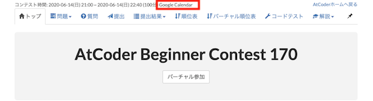
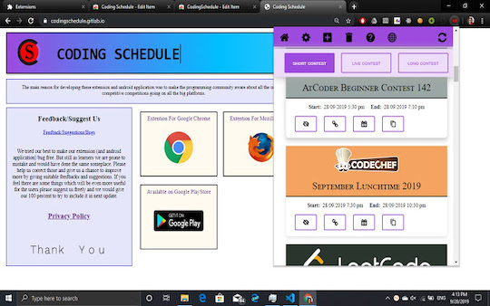
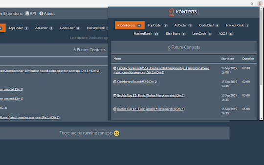
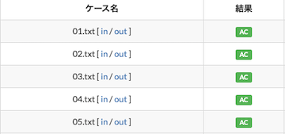
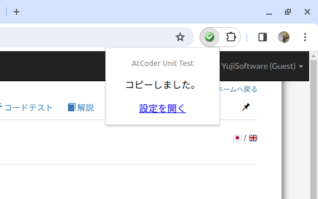
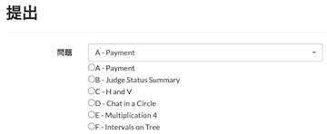
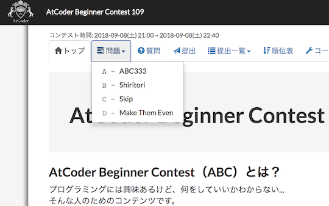
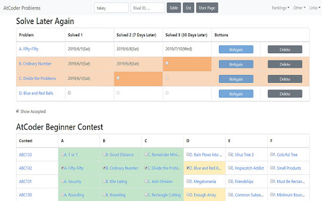

## コンテストの日程を確認

- [AtCoder Calendar](https://chrome.google.com/webstore/detail/atcoder-calendar/dokfhaljgioiaeappgnmibgoipegbldf?hl=ja&gl=UA) - コンテストの「トップ」ページにGoogle Calendarのスケジュール作成リンクを生成する。

    

      
    

- [Coder's Calendar](https://chrome.google.com/webstore/detail/coders-calendar/bageaffklfkikjigoclfgengklfnidll?hl=ja&gl=UA) - 開催予定のコンテスト情報を表示する。[Codechef](https://www.codechef.com/)、 [HackerEarth](https://www.hackerearth.com/)、[Hackerrank](https://www.hackerrank.com/)、[Topcoder](https://www.topcoder.com/)、[Codeforces](https://codeforces.com/)、[CSAcademy](https://csacademy.com/)、 [LeetCode](https://leetcode.com/)、[Kaggle](https://www.kaggle.com/)などにも対応している。

    

      
    

- [Coding Schedule](https://chrome.google.com/webstore/detail/coding-schedule/jbekfkgidfgnjgnnaiklfjhepdbhclme?hl=ja&gl=UA) - 開催中・開催予定のコンテスト情報を表示する。[Codeforces](https://codeforces.com/)、[Codechef](https://www.codechef.com/)、[CSAcademy](https://csacademy.com/)、[HackerEarth](https://www.hackerearth.com/)、[Hackerrank](https://www.hackerrank.com/)、[Topcoder](https://www.topcoder.com/)、[Sphere online judge (Spoj)](https://www.spoj.com/)などにも対応している。

    

      
    

- [KONTESTS](https://chrome.google.com/webstore/detail/kontests/agpdemlkalmmeenclchlajdcmbcacoea?hl=ja&gl=UA) - コンテスト情報を表示する。[Codeforces](https://codeforces.com/)、Codeforces::Gym、[TopCoder](https://www.topcoder.com/)、[CSAcademy](https://csacademy.com/)にも対応している。

    

      
    

## 問題を見る

- [AtCoder Opener](https://chrome.google.com/webstore/detail/atcoder-opener/fcfbcmhldmilebbhlapaekahjlcflinl) - コンテストの「トップ」ページで拡張機能のボタン(Aのマーク)をクリックすると、「印刷用問題文」と「提出」ページを新しいタブで開くことができる。

    

      
    

- [NextPage](https://chrome.google.com/webstore/detail/nextpage/mhhmddcnnehdkpclpjpmidpeejohlmfb?hl=ja&gl=UA) - あるコンテストの次の回のページに移動できる。

    !!! info "参考"

        拡張機能のアイコンが表示されていない場合は、ピン止めをする必要がある。青矢印のマークをクリックすると動作する。

    

      
    

## ソースコードにバグがないか確認

- [AtCoder TestCase Extension](https://chrome.google.com/webstore/detail/atcoder-testcase-extensio/klmflnjcfalpmeldgkcinfilloihmbdh?hl=ja&gl=UA) - 公開されているテストケースへのリンクを追加する。ABC/ARC/AGC以外のコンテストは一部未対応の場合もある。

    

      
    

- [AtCoder Unit Test](https://chrome.google.com/webstore/detail/atcoder-unit-test/lmahhninbclefepjbcdfbcjnancipfmi?hl=ja&gl=UA) - 「問題」ページから、単体(ユニット)テストを生成する。Java (JUnit)、Kotlin (JUnit)、C# (MS Test)、Python3 (unittest)に対応。デフォルトは、Java (JUnit)となっている。対応言語の切り替えは、「拡張機能 / アドオン」 → 「AC Unit Test」 のオプションで行うことができる。

    

      
    

## ソースコードの提出・確認を簡単に

- [AtCoder-Submission-RadioButton](https://chrome.google.com/webstore/detail/atcoder-submission-radiob/hkehpabdllmdfmflgjofmgcdbmjafcdd?hl=ja&gl=UA) - 「提出」ページに、各問題を選択するラジオボタンを設置する。[ユーザスクリプト版](https://greasyfork.org/ja/scripts/390828-atcoder-submission-radiobutton)もある。

    

      
    

- [Comfortable Atcoder](https://chrome.google.com/webstore/detail/comfortable-atcoder/ipmmkccdccnephfilbjdnmnfcbopbpaj?hl=ja&gl=UA) - 提出結果の通知、問題をドロップダウンリストで表示、などを設定できる。

    

      
    

## 解き直す問題を管理

- [Solve Later Again](https://chrome.google.com/webstore/detail/solve-later-again/emndffmnlppiaelhdneheagpaancfahk?hl=ja&gl=UA) - [AtCoder Problems](https://kenkoooo.com/atcoder/)のTableページに、「Solve Later Again（またあとで解く）」テーブルを追加し、解き直したい問題を管理できる。

    

      
    

