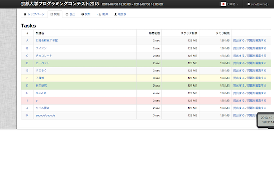
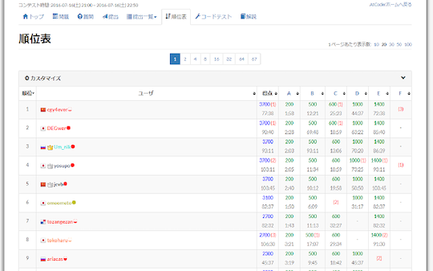
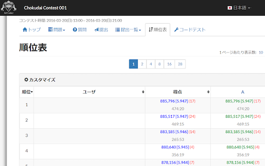

## コンテストの結果・成績に応じて色付け

- [AtCoder Color](https://chrome.google.com/webstore/detail/atcoder-color/mcefknoiablejellmicpmokcaelpdaec?hl=ja&gl=UA) - 「問題」ページで提出状況に応じて色付けする。

    

      
    

- [AtCoder Color Mark](https://chrome.google.com/webstore/detail/atcoder-color-mark/dogcmibkiolcdafifopmnghhlajpbmga?hl=ja&gl=UA) - 「順位表」や「コンテスト成績表」のページにレーティングを示す円を表示する。

    

      
    

## 文字・数字をより見やすく

- [AtCoderのScoreを見やすくする](https://chrome.google.com/webstore/detail/atcoder-%E3%81%AE-score-%E3%82%92%E8%A6%8B%E3%82%84%E3%81%99%E3%81%8F%E3%81%99%E3%82%8B/ndnmjoimfdcpjbnnlkieikajbbcaockp?hl=ja&gl=UA) - マラソン形式のスコアをカンマ区切りやlogで表示する。

    

      
    

