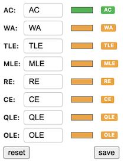
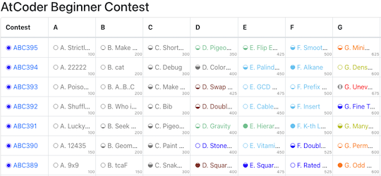

## 回答のラベルをカスタマイズ

- [AtCoder Label Customizer](https://chromewebstore.google.com/detail/atcoder-label-customizer/jfgmfcnlmgolnfadehfomajomolbadhl) - 「提出結果」ページで、回答状況を表すラベルの文字と背景色を変更できる。

    

      
    

## よく似た配色を識別

- [AtCoder Universal Color](https://github.com/gj5752/AtCoder-Universal-Color) - AtCoder や AtCoder Problems における茶色・緑色・水色を識別しやすくする。
    - [作者による解説記事](https://qiita.com/gj_5752/items/ccd7ab668cf3c48685cf)

    

      
    

