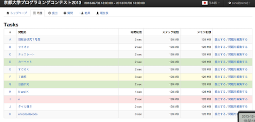

## コンテストの成績に応じて色付け

### 複数のページ

- [AtCoder Color Mark](https://chrome.google.com/webstore/detail/atcoder-color-mark/dogcmibkiolcdafifopmnghhlajpbmga?hl=ja&gl=UA) - 「順位表」や「コンテスト成績表」のページにレーティングを示す円を表示する。

    

      
    

### 問題

- [AtCoder Color](https://chrome.google.com/webstore/detail/atcoder-color/mcefknoiablejellmicpmokcaelpdaec?hl=ja&gl=UA) - 「問題」ページで提出状況に応じて色付けする。

    

      
    

