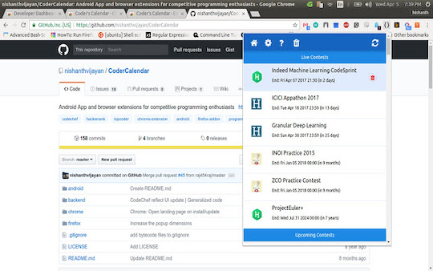
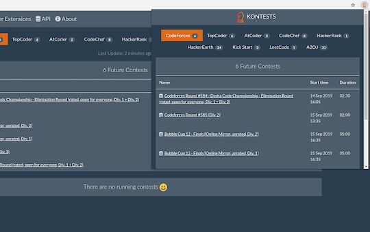

## コンテストの開催日時を確認する

### 開催日時をGoogle Calenderに追加

- [AtCoder Calendar](https://chrome.google.com/webstore/detail/atcoder-calendar/dokfhaljgioiaeappgnmibgoipegbldf?hl=ja&gl=UA) - コンテストの「トップ」ページにGoogle Calendarのスケジュール作成リンクを生成する。

    

      
    

### 開催予定を見る

- [Coder's Calendar](https://chrome.google.com/webstore/detail/coders-calendar/bageaffklfkikjigoclfgengklfnidll?hl=ja&gl=UA) - 開催予定のコンテスト情報を表示する。[Codechef](https://www.codechef.com/)、 [HackerEarth](https://www.hackerearth.com/)、[Hackerrank](https://www.hackerrank.com/)、[Topcoder](https://www.topcoder.com/)、[Codeforces](https://codeforces.com/)、[CSAcademy](https://csacademy.com/)、 [LeetCode](https://leetcode.com/)、[Kaggle](https://www.kaggle.com/)などにも対応している。

    

      
    

- [Coding Schedule](https://chrome.google.com/webstore/detail/coding-schedule/jbekfkgidfgnjgnnaiklfjhepdbhclme?hl=ja&gl=UA) - 開催中・開催予定のコンテスト情報を表示する。[Codeforces](https://codeforces.com/)、[Codechef](https://www.codechef.com/)、[CSAcademy](https://csacademy.com/)、[HackerEarth](https://www.hackerearth.com/)、[Hackerrank](https://www.hackerrank.com/)、[Topcoder](https://www.topcoder.com/)、[Sphere online judge (Spoj)](https://www.spoj.com/)などにも対応している。

    

      
    

- [KONTESTS](https://chrome.google.com/webstore/detail/kontests/agpdemlkalmmeenclchlajdcmbcacoea?hl=ja&gl=UA) - コンテスト情報を表示する。[Codeforces](https://codeforces.com/)、Codeforces::Gym、[TopCoder](https://www.topcoder.com/)、[CSAcademy](https://csacademy.com/)にも対応している。

    

      
    

