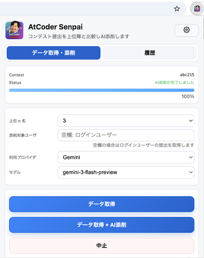
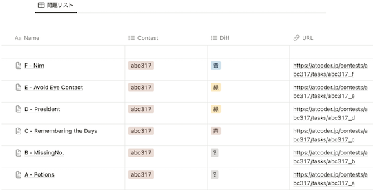
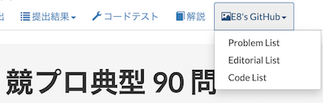

## 復習の効果をより高める

- [AtCoder Senpai](https://chromewebstore.google.com/detail/atcoder-senpai/fpjjeablidbinklnmidpjdiaepgkjkpj) - 指定したユーザと上位陣の提出コードをワンクリックで取得し、AIが上位陣のコードに基づいて添削レポートを自動生成してくれる。アルゴリズム部門だけでなく、ヒューリスティック部門にも対応している。

    

      
    

- [AtCoder to Notion](https://chrome.google.com/webstore/detail/atcoder-to-notion/mhoemoadpammfnlbjagngjenedfpcfgi) - 「問題」ページから問題文と制約を取得して、クラウド型の万能アプリ「[Notion](https://www.notion.so)」に保存する。また、コンテストの情報や難易度なども追加できる。
    - [使い方 - GitHub](https://github.com/hirakuuuu/AtCoderToNotion) - 

    

      
    

- [Solve Later Again](https://chrome.google.com/webstore/detail/solve-later-again/emndffmnlppiaelhdneheagpaancfahk?hl=ja&gl=UA) - [AtCoder Problems](https://kenkoooo.com/atcoder/)のTableページに、「Solve Later Again（またあとで解く）」テーブルを追加し、解き直したい問題を管理できる。

    

      
    

- [typical90_extension](https://chrome.google.com/webstore/detail/typical90extension/olilmbfbgdnilofdfbladkgbbfecbidb) - 「[競プロ典型 90 問](https://atcoder.jp/contests/typical90)」に、[GitHub](https://github.com/E869120/kyopro_educational_90)で公開されている問題の解説・想定ソースコードなどへのリンクを追加する。また、「問題」ページで、問題の並び順も変更できる。

    

      
    

