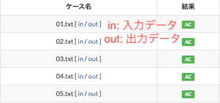
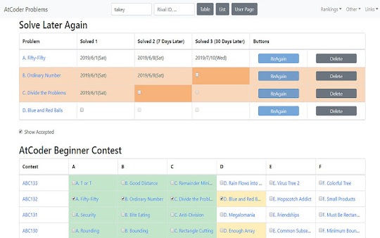

## テストケースを見る

- [AtCoder TestCase Extension](https://chrome.google.com/webstore/detail/atcoder-testcase-extensio/klmflnjcfalpmeldgkcinfilloihmbdh?hl=ja&gl=UA) - 公開されているテストケースへのリンクを追加する。ABC/ARC/AGC以外のコンテストは一部未対応の場合もある。

    

      
    

## 復習の効果をより高める

- [Solve Later Again](https://chrome.google.com/webstore/detail/solve-later-again/emndffmnlppiaelhdneheagpaancfahk?hl=ja&gl=UA) - [AtCoder Problems](https://kenkoooo.com/atcoder/)のTableページに、「Solve Later Again（またあとで解く）」テーブルを追加し、解き直したい問題を管理できる。

    

      
    

