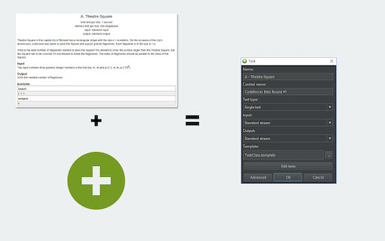
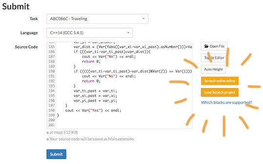

## サンプルケースの取得

- [Competitive Companion](https://github.com/jmerle/competitive-companion) - [AtCoder](https://atcoder.jp/)を含む複数のコンテストサイトのサンプルケースを取得することができるブラウザ拡張（[Chrome extension](https://chrome.google.com/webstore/detail/competitive-companion/cjnmckjndlpiamhfimnnjmnckgghkjbl)、[Firefox add-on](https://addons.mozilla.org/en-US/firefox/addon/competitive-companion/))。この結果を利用してテストするIDEプラグインが多数公開されている。例えば[CHelper](https://plugins.jetbrains.com/plugin/7091-chelper)、[JHelper](https://plugins.jetbrains.com/plugin/7541-jhelper)などがある。

    

      
    

## Scratchを利用

- [Scratcher's AtCoder](https://chrome.google.com/webstore/detail/scratchers-atcoder/hackndbjgkehhjinjjoldifbhnfddklh?hl=ja&gl=UA) - [Scratch](https://ja.wikipedia.org/wiki/Scratch_(%E3%83%97%E3%83%AD%E3%82%B0%E3%83%A9%E3%83%9F%E3%83%B3%E3%82%B0%E8%A8%80%E8%AA%9E))で問題を解くことができる。

    

      
    

