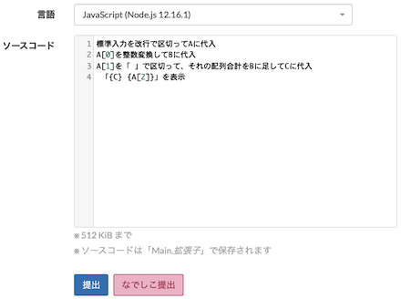

## 公式で未対応の言語を利用する

### Scratch

- [Scratcher's AtCoder](https://chrome.google.com/webstore/detail/scratchers-atcoder/hackndbjgkehhjinjjoldifbhnfddklh?hl=ja&gl=UA) - [Scratch](https://ja.wikipedia.org/wiki/Scratch_(%E3%83%97%E3%83%AD%E3%82%B0%E3%83%A9%E3%83%9F%E3%83%B3%E3%82%B0%E8%A8%80%E8%AA%9E))で問題を解くことができる。

    

      
    

### なでしこ

<!-- markdown-link-check-disable -->

- [なでしこーだー](https://chrome.google.com/webstore/detail/%E3%81%AA%E3%81%A7%E3%81%97%E3%81%93%E3%83%BC%E3%81%A0%E3%83%BC/pbhmgehdalachojhgbpnelagkfkoclfb/related?hl=ja&authuser=0) - 日本語のプログラミング言語「[なでしこ](https://nadesi.com/top/)」で問題を解くことができる。また、「コードテスト」ページで、ソースコードの実行も可能。
    - [「なでしこ」で「AtCoder」に挑戦できるGoogle Chrome拡張機能が登場](https://forest.watch.impress.co.jp/docs/news/1422840.html) - 同拡張機能の紹介記事
    - [axt-one/nadesicoder](https://github.com/axt-one/nadesicoder)  - GitHubで公開されているソースコードへのリンク

    !!! warning "注意"
        提出するときの言語は、JavaScriptを選ぶ必要がある。

    

      
    

<!-- markdown-link-check-enable -->
