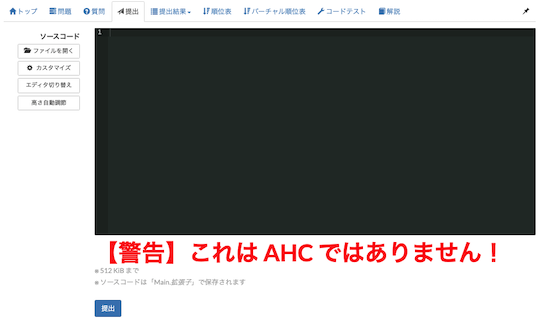
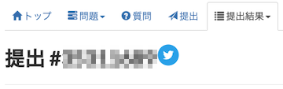

## 入出力例を取得

- [Competitive Companion](https://github.com/jmerle/competitive-companion) - [AtCoder](https://atcoder.jp/)を含む複数のコンテストサイトのサンプルケースを取得することができるブラウザ拡張（[Chrome extension](https://chrome.google.com/webstore/detail/competitive-companion/cjnmckjndlpiamhfimnnjmnckgghkjbl)、[Firefox add-on](https://addons.mozilla.org/en-US/firefox/addon/competitive-companion/))。この結果を利用してテストするIDEプラグインが多数公開されている。例えば[CHelper](https://plugins.jetbrains.com/plugin/7091-chelper)、[JHelper](https://plugins.jetbrains.com/plugin/7541-jhelper)などがある。

    

      
    

## バグがないか事前に確認

- [AtCoder Unit Test](https://chrome.google.com/webstore/detail/atcoder-unit-test/lmahhninbclefepjbcdfbcjnancipfmi?hl=ja&gl=UA) - 「問題」ページから、単体(ユニット)テストを生成する。Python3 (unittest)、Java (JUnit5)、Kotlin (JUnit5)、C# (MS Test), Go, Ruby (RSpec) に対応。デフォルトは、Python3 (unittest) となっている。Python と Ruby の場合は、テストコードを含んだまま提出できる。[Firefox版](https://addons.mozilla.org/ja/firefox/addon/ac-unit-test/)もある。

    

      
    

## ソースコードを提出する

### 誤提出による意図しない規約違反を防ぐ

- [AtCoder Parallel Alert](https://chromewebstore.google.com/detail/poiijcpfeaijlocfncmimadjkppkplef) - [AtCoder Heuristic Contest](https://atcoder.jp/contests/archive?ratedType=4&category=0&keyword=AtCoder+Heuristic+Contest)とそれ以外のコンテストの問題文を同時に閲覧しているときに、後者の「提出」ページに警告文を表示する。

    

      
    

## 提出コードをSNSで共有

- [AtCoder Submission Share](https://chrome.google.com/webstore/detail/atcoder-submission-share/iinlphkfpahlfohgkphcchhejkhclgap) - 「提出結果」ページに、ツイートボタンを設置する。[アルゴ式](https://algo-method.com/)と類似した形式で投稿できる。

    

      
    

