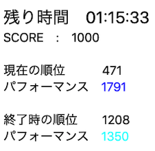

- [AtCoder ACer](https://chrome.google.com/webstore/detail/atcoder-acer/pmdfjdiiiacncpgmjmeicdoidkaadjde?hl=ja&gl=UA) - 「問題一覧」ページにコンテスト中にAC(Accepted)した人数を表示する。

    

      
    

- [AtCoder VirtualContest-Connect](https://chrome.google.com/webstore/detail/atcoder-virtualcontest-co/cedjfjpgichjfeaaijciagaoggpagipg) - バーチャルコンテストの成績を利用して、コンテスト当日に得られた可能性がある順位・パフォーマンス値を表示する。

    

      
    

