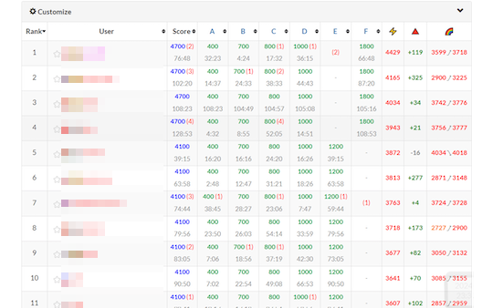

## 順位・パフォーマンス値を見る

- [AtCoder Companion](https://chromewebstore.google.com/detail/atcoder-companion/bflhekmjlbpdlibcmojpikplaldgceec) - コンテスト開催中のパフォーマンス値やレーティング（いずれも推定値）の表示、「問題」ページでの提出状況の確認、テストケースのコピー・ダウンロードおよびコードテストを使ったデバッグができる。

    

      
    

