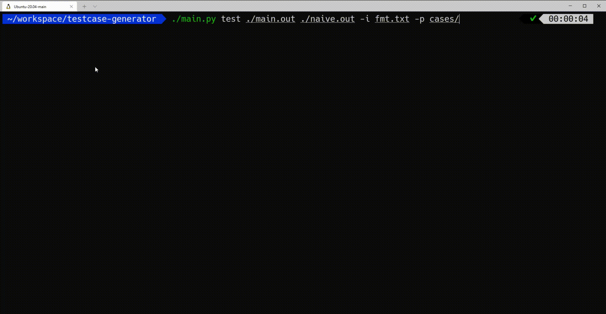

## テンプレートを生成

- [Online Judge Template Generator](https://github.com/online-judge-tools/template-generator)  - [Online Judge Tools](https://github.com/online-judge-tools/oj)と連携したツール。コンテストの問題を解析して、提出用のコードやランダムケース生成に関するテンプレートを出力できる。C++とPythonに対応。
    - [有志による紹介記事](https://hamukichi.hatenablog.jp/entry/2020/09/17/230818)
    - [Webアプリ版](https://online-judge-tools.github.io/template-generator-webapp/) - コマンドラインツールに不慣れなユーザ向け。

    !!! warning "注意"

        コンテスト中はコマンドライン版のみ利用できる。

- [kmyk/marathon-kit](https://github.com/kmyk/marathon-kit)  - AtCoder Heuristic Contestのためのテンプレートレポジトリ。テストの並列実行、途中経過のビジュアライズ、GitHubでの自動テストが実行できる。

## テストケースの生成・追加

- [bug_finder](https://github.com/Eug1ena/bug_finder)  - テストケースをランダムに生成し、愚直な解法で実装したコードとバグを含むコードを比較できるツール。

    !!! warning "注意"

        対応言語は、C++17のみ。

- [testcase-generator](https://github.com/naskya/testcase-generator)  - 多数のテストケース生成とテストの実行により、デバッグを支援するツール。

    

      
    

- [editSampleCase](https://marketplace.visualstudio.com/items?itemName=imomo.editsamplecase)  - [online-judge-tools/oj](https://github.com/online-judge-tools/oj)のサンプルデータにテストケースを簡単に追加できる[Visual Studio Code](https://code.visualstudio.com/)の拡張機能。詳しい使い方は、作者の[紹介記事](https://iiiimmmmo.hatenablog.com/entry/2020/12/21/153307)を参照されたい。

    

      
    

