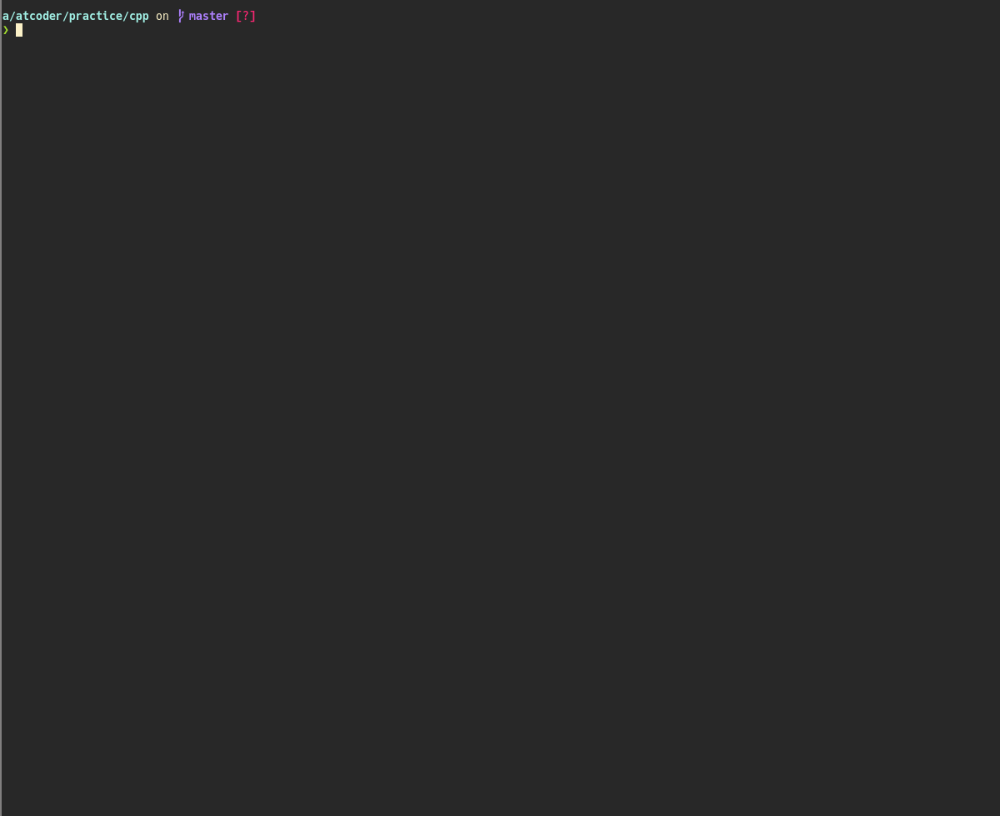
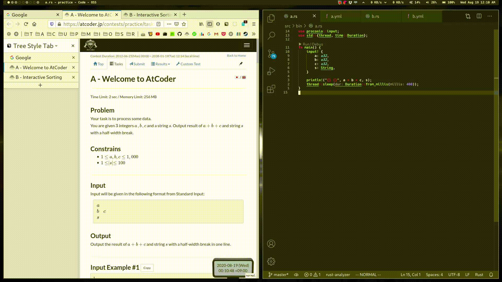

類似した機能を持つツールが多いため、対応言語ごとに分類しています。

!!! danger "警告"
    一部のコンテスト開催中は、利用が禁止されているサービスや機能があります ([出典](https://info.atcoder.jp/entry/llm-rules-ja))。参加前にルールをご確認ください。

!!! warning "注意"
    サブカテゴリで部門名(アルゴリズム・ヒューリスティック)が明記されていない場合は、アルゴリズム部門を対象としたサービスを表しています。

## コマンドラインツールからAtCoderにログイン

- [aclogin](https://github.com/key-moon/aclogin)  - コマンドラインツールからAtCoderに自動ログインできるようにする。

    !!! info "参考"

        2025年3月時点では、[Online Judge Tools](https://github.com/online-judge-tools/oj) に対応。

    !!! warning "注意"

        2025年3月にAtCoderの認証方法（Cloudflare CAPTCHAの導入）が変更されたことに伴う暫定的な対処方法。

## 任意の言語

### アルゴリズム部門

- [atcoder-cli](https://github.com/Tatamo/atcoder-cli)  - AtCoderでの利用に特化しているのが特徴。一部の機能は、後述の[Online Judge Tools](https://github.com/online-judge-tools/oj)に依存しており、導入が必要。日本語・英語ともにドキュメントが充実している。
- [AtCoder Tools](https://github.com/kyuridenamida/atcoder-tools)  - サンプルケースのダウンロードが便利になる。ログイン、サンプルのローカルテスト、コード提出、テンプレートからのコード自動生成機能などを備えている。

    

      
    

- [ICIE](https://marketplace.visualstudio.com/items?itemName=pustaczek.icie)  - 競技プログラミングに参加する上で、必要な機能を揃えた[Visual Studio Code](https://code.visualstudio.com/)の拡張機能。
- [OnlineJudgeHelper](https://github.com/nodchip/OnlineJudgeHelper)  - サンプルの入出力データを用いたテストや解答コードの提出ができるツール。これらの機能を備えた日本初のツールであり([出典](https://github.com/KATO-Hiro/AtCoderClans/issues/489))、後述する[Online Judge Tools](https://github.com/online-judge-tools/oj)などに大きな影響を与えた。
- [Online Judge API Client](https://github.com/online-judge-tools/api-client)  - 後述する[Online Judge Tools](https://github.com/online-judge-tools/oj)における`oj` commandのbackendライブラリとして使われている。サンプルケースやコンテスト情報などを出力できる。
- [Online Judge Tools](https://github.com/online-judge-tools/oj)  - サンプルケースのダウンロード、テスト、提出ができる。作者により、インストールの手順と使い方が[動画](https://www.youtube.com/watch?v=wOKuJyJIpUg)で紹介されている。
    - 関連するツール・派生ツールが充実している。ランダムケースを出力するテンプレートを生成する[Online Judge Template Generator](https://github.com/online-judge-tools/template-generator)などがある。
    - 複数のコンテストサイトで利用可能。詳細は、[対応表](https://github.com/online-judge-tools/api-client#supported-websites)を参照されたい。

    

      
    

### ヒューリスティック部門

- [pahcer](https://github.com/terry-u16/pahcer)  - ローカル環境でのテストの並列実行・実行結果の出力・相対スコアの表示・Optunaとの連携などができる。

- [psytester](https://github.com/FakePsyho/psytester)  - マルチスレッドを利用したテストの実行、スコアボードの表示、ユーザ定義のメタデータによるグループ化・フィルタリング、メトリクスに基づいた検索などができる。

## 複数の言語

- [AC Deck](https://github.com/sachaos/ac-deck)  - サンプルのテスト([Docker](https://www.docker.com/)にも対応)、提出ができる。対応言語は、C++ (GCC 9.2.1)、Python3 (3.8.2)、Go (1.14.1、[Gonum](https://www.gonum.org/)には未対応)、Rust (1.42.0)。組み込みのテンプレートが用意されており、主要な言語に対応している。

    

      
    

- [AI-virtual-assistant-python](https://github.com/Saurav-Paul/AI-virtual-assistant-python)  - サンプルのテスト、ログイン・コードの提出だけでなく、テンプレートやテストケースの生成などの多くの機能を備えているツール。C++とPythonに対応している。

    

      
    

- [AtCoderFriends](https://github.com/nejiko96/at_coder_friends)  - サンプルのテスト・提出が[36言語](https://github.com/nejiko96/at_coder_friends/blob/master/docs/CONFIGURATION.md)に対応している。また、テンプレートコードの生成機能もある（RubyとC++、C#はデフォルトで対応しており、他の言語もプラグインで追加できる）。
- [Snowchains](https://github.com/qryxip/snowchains)  - サンプルケースのテスト、解答コードの提出に加えて、システムテストの取得もできる。C++とRustが利用可能。また、一部の機能を除いて、[Codeforces](https://codeforces.com/)、[yukicoder](https://yukicoder.me/)にも対応している。

    

      
    

## Ruby

利用するときは、Rubyのパッケージ管理システムであるGemが必要。

- [GreenDay](https://github.com/QWYNG/green_day)  - サンプルケースのテスト、提出ができる。
    - [作者による紹介記事](https://qiita.com/QWYNG/items/0e2e6b72bd1969d0d751)

## Rust

利用するときは、RustとRustのビルドシステム・パッケージマネージャであるCargoが必要。

- [cargo-atcoder](https://github.com/tanakh/cargo-atcoder)  - サンプルケースのダウンロード、テスト、提出ができる。使い方が日本語で丁寧に説明されている。
    - [cargo-atcoder-vscode](https://github.com/himkt/cargo-atcoder-vscode)  - [Visual Studio Code](https://code.visualstudio.com/)のコマンドパレットから、コードのテスト・提出、タスクの実行ができる拡張機能。

    

      
    

- [cargo-compete](https://github.com/qryxip/cargo-compete)  - コンテストへの参加登録・サンプルケースの取得およびテスト、提出ができる。日本語のドキュメントも充実している(併せて、[作者による解説記事](https://qiita.com/qryxip/items/bff57848ac9310d27f1a)も参照されたい)。また、[Codeforces](https://codeforces.com/)や[yukicoder](https://yukicoder.me/)にも対応している。

    

      
    

