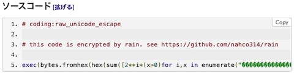
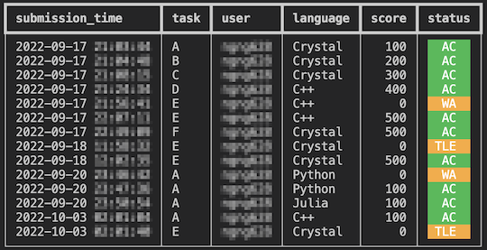

ソースコードの提出前後において、便利な補助ツールを掲載しています。

## ソースコードの高速化

### Python

- [atcoder-numba](https://github.com/pyatcoder/atcoder-numba)  - NumbaのJITを使用したコードをAOT(事前)コンパイルして、提出することができる。Pythonのパッケージ管理システムであるpipが必要。

## 提出コードを暗号化

- [rain](https://github.com/nahco314/rain)  - C++、Pythonで書かれた提出用コードを暗号化して、第三者が閲覧やコピーアンドペーストできないようにする。利用にあたっては、Pythonのパッケージマネージャの一つである[rye](https://github.com/mitsuhiko/rye)をインストールする必要がある。

    

      
    

## 提出コードを確認する

- [atcoder-submit-status](https://github.com/ngng628/atcoder-submit-status)  - ソースコードの提出状況を確認できる。

    

      
    

## ソースコードのバックアップ

- [AtCoder-AutoClone](https://github.com/kuriyan1204/AtCoder-AutoClone)  - 提出コードをGitHubのレポジトリに自動でコピーする。
- [AtCoder_GitCommit](https://github.com/xryuseix/AtCoder_GitCommit)  - 提出したコードをGitHubに自動でバックアップする。

    !!! warning "注意"

        定期的な実行には、Herokuなどのサーバを用意する必要がある。

- [procon-gardener](https://github.com/togatoga/procon-gardener)  - 提出した正解(AC)コードを自動的に取得し、ローカルレポジトリに保存する。Goの実行環境が必要。詳細は、作者の[解説記事](https://qiita.com/togatoga/items/3e8fd0042dc8be702201)も参照されたい。

    !!! warning "注意"

        GitHubへの反映は、自分で行う必要がある。

- [procon-grassmaker](https://github.com/bayashi-cl/procon-grassmaker)  - 提出したACコードを保存する(複数回提出した場合も取得できる)。また、[Codeforces](https://codeforces.com/)や[AOJ (AIZU ONLINE JUDGE)](https://onlinejudge.u-aizu.ac.jp/home)にも対応している。ツールを利用するときは、Pythonのパッケージ管理システムであるpipが必要。

- [atcoder-commiter](https://github.com/ultsaza/atcoder-commiter)  - AtCoderで提出したコードをボタン一つで取得してGitHubにコミットするvscode拡張機能。ソースコードを提出した時刻でコミットされ、GitHubの草を生やすことができる。

    !!! warning "注意"

        一度にpushできる提出の数には制限があるので復数実行する必要がある。
        また、大量の提出をpushするのには十分な時間を要する。

## AtCoder ProblemsのStreakをつなぐ

- [AtCoderStreak](https://github.com/kzrnm/AtCoderStreak)  - 遅延提出で[AtCoder Problems](https://kenkoooo.com/atcoder/)のStreakをつなぐ。
