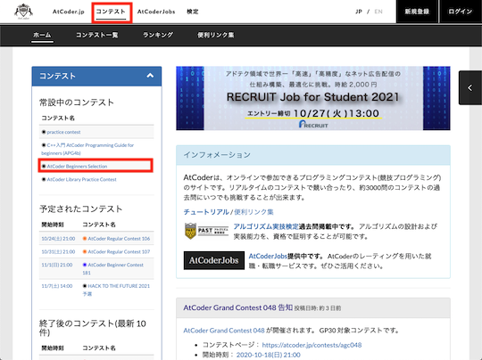

A1: 入門者、初心者向けの教材や記事を読んでみましょう。[AtCoder](https://atcoder.jp/)アカウントを登録し、コンテスト参加前に練習問題を解くことをおすすめします。

## プログラミングの基礎を学ぶ

- [C++入門 AtCoder Programming Guide for beginners (APG4b)](https://atcoder.jp/contests/APG4b) - 公式が提供する汎用的なプログラミングの基礎を学ぶための入門教材です。また、知識の定着を図るための練習問題と自分で書いたプログラムを自動で採点してくれるシステムがあるのが大きな特徴です。また、有志により[Fortran版](https://qiita.com/jj1guj/items/43a1c876360ddf180f1f)、[Python版](https://qiita.com/saba/items/b9418d7b54cce4b106e4)、[Rust版](https://zenn.dev/toga/books/apg4b-rust-ver)も作成・公開されています。

    

      
    

- [アルゴ式](https://algo-method.com/) - プログラミングを道具として利用しながら、論理的思考力やコーディング力を身につけることができるWebサービスです。[公式アカウント](https://twitter.com/algo_method)も用意されています。

    

      
    

    !!! info "参考"

        サービスを利用する前に、作者によるサービス開始の理由とアルゴリズムを学ぶ意義について書かれた[記事](https://note.com/sak_algo/n/nfb0058237ed5)を一読されることをお勧めします。

## AtCoderアカウントの登録〜コンテスト参加

- [【初心者向け】AtCoder Beginner Contestの取り組み方](https://qiita.com/rute_not_route/items/d1ae32a80d1c3a50d017) - [AtCoder](https://atcoder.jp/)アカウントの作成方法からコンテストの参加登録・問題の取り組み方と注意事項、コンテスト後の復習までの流れを丁寧に解説した記事です。
- [AtCoderに登録したら次にやること ～ これだけ解けば十分闘える！過去問精選10問 ～](https://qiita.com/drken/items/fd4e5e3630d0f5859067) - [AtCoder](https://atcoder.jp/)のコンテストに初めて参加する方に向けた精選10問を紹介した記事です。さまざまな言語による解答例のリンクなどの資料も充実しています。

    

      
    

    

      
各言語で実装された解答例(一部抜粋)のリンクを開く/閉じる

      <ul>
        <li><a href="https://qiita.com/cielavenir/items/ee1e47b844d05dcfc66e">C</a></li>
        <li><a href="https://qiita.com/tomerun/items/23ce2a2ed6ead291d222">Crystal</a></li>
        <li><a href="https://qiita.com/NotFounds/items/7b166af69a6f52a332de">C#</a></li>
        <li><a href="http://takeo1116.sakura.ne.jp/ABS_D.html">D</a></li>
        <li><a href="https://qiita.com/koyo-miyamura/items/9f224a3e56ea75939dca">Elixir</a></li>
        <li><a href="https://yukiutaai.wordpress.com/2018/03/21/atcoder%e3%81%ab%e7%99%bb%e9%8c%b2%e3%81%97%e3%81%9f%e3%82%89%e8%a7%a3%e3%81%8f%e3%81%b9%e3%81%8d%e7%b2%be%e9%81%b8%e9%81%8e%e5%8e%bb%e5%95%8f10%e3%82%92fortran%e3%81%a7%e8%a7%a3%e3%81%84%e3%81%a6/">Fortran</a></li>
        <li><a href="https://qiita.com/kuuso1/items/606b75c172cafa1d07f6">F#</a></li>
        <li><a href="https://qiita.com/ktateish/items/afdda77497c8e2ee0742">Go</a></li>
        <li><a href="https://qiita.com/hsjoihs/items/25a08b426196ab2b9bb0">Haskell</a></li>
        <li><a href="https://qiita.com/0x841/items/0ce887c86cf081312a08#">Java</a></li>
        <li><a href="https://qiita.com/ytanto/items/caf7bf0ba287da81b20f">JavaScript</a></li>
        <li><a href="https://sites.google.com/view/ymatsux/atcoder-abs-kotlin">Kotlin</a></li>
        <li><a href="https://qiita.com/Kutimoti_T/items/635bacddfa1304de40db">Nim</a></li>
        <li><a href="https://qiita.com/kotatsugame/items/dd73cf6441b17f27bb01">Perl6 (Raku)</a></li>
        <li><a href="https://qiita.com/rock619/items/3c4cc60416c94d081c54">PHP</a></li>
        <li><a href="http://delta114514.hatenablog.jp/entry/2018/03/15/014555">Python3</a></li>
        <li><a href="https://qiita.com/d_nishiyama85/items/f79e034f6dcd4175cdc1">Ruby</a></li>
        <li><a href="https://qiita.com/tubo28/items/e6076e9040da57368845">Rust</a></li>
        <li><a href="https://qiita.com/kgtkr/items/9b5798d02563e885d2ac">Scala</a></li>
        <li><a href="https://qiita.com/cielavenir/items/b90a94dce60a620fa2dc">Swift</a></li>
      </ul>
    

    !!! warning "注意"

        記事に掲載されているコードが最新のジャッジシステムで動作しない場合もあります

## 練習で実力を伸ばす

- [APG4bからAtCoderを始めた人向けの導線](https://mogurin1000000007.hatenablog.com/entry/2021/02/09/162158) - 公式が提供するプログラミングの入門教材[C++入門 AtCoder Programming Guide for beginners (通称APG4b)](https://atcoder.jp/contests/APG4b)の概説と、APG4bをある程度学習した人に向けた基本的な練習方法やTipsが紹介されている記事です。
- [AtCoderの練習方法](https://atcoder.jp/posts/677) - [AtCoder](https://atcoder.jp/)の公式ブログで紹介されている練習方法です。上達のために、問題を多く解く方法や典型的なアルゴリズムを学ぶ方法が説明されています。
- [AtCoderでの勉強の仕方（コンテスト編）](http://chokudai.hatenablog.com/entry/2014/08/07/212849) - [AtCoder](https://atcoder.jp/)社長の[chokudai](https://twitter.com/chokudai)さんによる記事です。プログラミングコンテストの参加を通して、アルゴリズムの学習を継続的に行う方法が解説されています。
- [AtCoder Problems](https://kenkoooo.com/atcoder/) - コンテストの過去問を一覧できるWebアプリです。登録したアカウント名を入力すると、問題の正誤状況や各種集計結果などを確認できます。有志による[使い方を解説した記事](https://ntk-ta01.hatenablog.com/entry/2020/04/15/001405)もご参照ください。

    

      
    

    !!! warning "注意"

        記事に掲載されている図やバーチャルコンテストの名称・内容は、最新情報と異なる場合もあリます。

- [レッドコーダーが教える、競プロ・AtCoder上達のガイドライン【初級編：競プロを始めよう】](https://qiita.com/e869120/items/f1c6f98364d1443148b3) - 初心者に向けて競技プログラミングの特徴・面白さ、アカウントの登録方法やレーティングの説明がされている記事です。さらに、上達するためのガイドラインが丁寧に解説されています。
