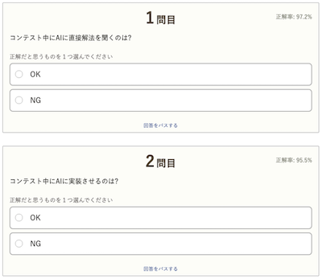

A3: 基本的には、土曜日もしくは日曜日の21時から1時間40分〜2時間程度です。[公式コンテストカレンダー](https://atcoder.jp/posts/1422)から確認できます。また、コンテスト終了後には、解説資料の公開とYouTubeを利用した[解説放送](https://www.youtube.com/channel/UCtG3StnbhxHxXfE6Q4cPZwQ)が行われます。

!!! warning "注意"

    - <strong>最初のうちは、AtCoder Beginner Contest (通称、ABC)に出場することをお勧めいたします。</strong>特に、AtCoder Grand Contest (同AGC)は上級者向けのコンテストのため、ABCと同じ配点でも非常に難しい問題が出題される傾向にあるためです。

    - コンテストの参加前にルールの確認を強く推奨いたします。有志による[クイズ(全10問)](https://quiz-maker.site/quiz/play/IuEjiJ20220508114221)や[生成AI利用に関するクイズ(全6問)](https://quiz-maker.site/quiz/play/tKKCCl20250430221107)をご活用ください。

      

        
      

      

        
      

    - 開催日時は急きょ変更されることもあるため、最新の情報をTwitterアカウントやWebサービスで確認することを推奨いたします。

## コンテストのルールなどを確認

<!-- markdown-link-check-disable -->

- [コンテスト体制の変更について](https://atcoder.jp/posts/1280) - 2024年8月以降のアルゴリズム部門のコンテストに関して、Admin・開催頻度・レーティングの更新対象範囲・AtCoder Regular Contest (通称、ARC) の難易度と配点の変更点が告知されています。
- [AtCoder生成AI対策ルール - 20250718版](https://info.atcoder.jp/entry/llm-rules-ja) - AtCoder Beginner Contest (通称 ABC) および AtCoder Regular Contest (同 ARC)のコンテスト開催中を対象として、生成AIの利用における禁止事項が説明されています ([英語版](https://info.atcoder.jp/entry/llm-rules-en))。
    - [ARC Div.1 に関する生成AIルール変更について](https://atcoder.jp/posts/1513) - ARC Div.1 も上記ルールの対象となったことが告知されています。
    - [AGC073でのAI使用について](https://atcoder.jp/posts/1563) - AtCoder Grand Contest (通称 AGC) 073 で生成AI単独で解答可能な問題が出題されたことや今後の対応について言及されています。
    - [AHCにおける生成AIルールの策定について](https://atcoder.jp/posts/1494) - AtCoder Heuristic Contest (通称 AHC) 049以降で適用される生成AI利用ルールのお知らせです ([詳細](https://info.atcoder.jp/entry/ahc-llm-rules-ja))。
- [ARCのDivision制についての告知](https://atcoder.jp/posts/1364) - ARC189以降、AtCoder Regular Contest (通称 ARC) は難易度の異なる2種類のコンテストに分けられることが告知されています。
- [AtCoder - コンテストモードについて](https://atcoder.jp/posts/1021) - コンテスト開催中の高負荷対策の一環として、一部のページへのアクセス制限をお知らせした記事です。

<!-- markdown-link-check-enable -->

## コンテストの開催日時を確認

- X (旧 Twitter) で[公式アカウント](https://x.com/atcoder)や[AtCoder](https://atcoder.jp/)社長の[chokudai](https://x.com/chokudai)さんをフォローすると、最新の情報が得られます。

- [公式コンテストカレンダー運用のお知らせ](https://atcoder.jp/posts/1422) - Google カレンダーに追加すると、公式コンテストの開催日時を簡単に確認できます。
    - [ABCカレンダー](https://calendar.google.com/calendar/u/0?cid=Y180MzA3MDIxZTE0ZDhhMzNlYzgzNjI5YmM1MWQ2OTEzMWMwNjMxOGJiNGQ1ZmRjOTYwODNlZDE2ODFmMGEwZWQ2QGdyb3VwLmNhbGVuZGFyLmdvb2dsZS5jb20)
    - [AHCカレンダー](https://calendar.google.com/calendar/u/0?cid=Y18yYTZiOWYxNTc3Nzg0N2E5YmNlNDhlMDI2OTkyYmY2ZGZjOWE2ZTlhMjk3Mjk4YTFjNjQ5NWMwYjE3NjQ5NjU0QGdyb3VwLmNhbGVuZGFyLmdvb2dsZS5jb20)

- [CLIST](https://clist.by/) - コンテストの開始・終了時刻、制限時間と閲覧時点での残り時間が一覧で表示されるWebアプリです。検索で「AtCoder」のコンテストを抽出するとより見やすくなります。

  

    
  

