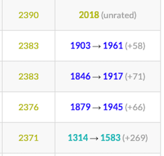
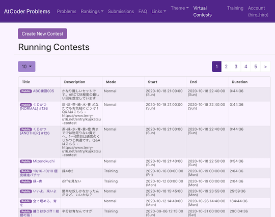

## 目標を設定しましょう

- 自分の実力と相談しながら、目標とするレーティング(もしくは、特定のレーティング帯に相当する色)と達成するまで期限を設定してみましょう。[AtCoder](https://atcoder.jp/)社長の[chokudai](https://twitter.com/chokudai)さんによる、[レーティングとアルゴリズムに関する実力の関係を説明した記事](http://chokudai.hatenablog.com/entry/2019/02/11/155904)も参考になると思います。

    !!! warning "注意"

        紹介している記事は、2020年6月下旬に更新されているものの、特定のレーティング帯については到達するまでの要求水準がさらに上がっている可能性があります。

- コンテストで目標とする成績(パフォーマンス値)を設定してみましょう。有志が公開している[Webサービス](https://atcoderratingsimulator.herokuapp.com/)を利用すると、簡単に計算できます。

    

      
    

- また、コンテスト開催中に[参加者のパフォーマンス値の推定値をリアルタイムで見られるスクリプト](https://greasyfork.org/ja/scripts/369954-ac-predictor)が公開されています。下の図は、左側がパフォーマンス値を、右側がレーティングの変動と前回との差分をそれぞれ表しています。

    

      
    

    !!! warning "注意"

        初めてユーザスクリプトを利用される方は、[スクリプトマネージャ](https://greasyfork.org/ja)を事前にインストールしてください。

## 過去問を解いてコンテストに参加しましょう

- 公式が提供している「バーチャル参加」機能や[AtCoder Problems](https://kenkoooo.com/atcoder/)のVirtual Contest機能を利用して、本番に近い環境で練習するのがおすすめです。

    

      
    

    

      
    

    !!! info "参考"

        AtCoder ProblemsのVirtual Contestを利用するときは、[GitHub](https://github.com/)のアカウントが必要です。

- [競プロ典型90問](https://twitter.com/e869120/status/1376089196100653060) - 競技プログラミング・アルゴリズムに関する教育的な問題が[常設コンテスト](https://atcoder.jp/contests/typical90)として、まとめられています。
    - [Qiita](https://qiita.com/e869120/items/1b2a5f0f07fd927e44e9) - コンテンツの活用方法
    - [GitHub](https://github.com/E869120/kyopro_educational_90) - 解説やサンプルコード
    - [Googleスプレッドシート](https://docs.google.com/spreadsheets/d/1GG4Higis4n4GJBViVltjcbuNfyr31PzUY_ZY1zh2GuI/edit#gid=0) - 問題の難易度表(非公式)

## 解答の提出前に入出力例の確認をしましょう

- [AtCoder Easy Test v2](https://greasyfork.org/ja/scripts/433152-atcoder-easy-test-v2) - 「問題」ページで、入出力例を使って素早くテストを実行できるユーザスクリプトです。また、自作のテストケースも実行できます。
    - メリット1: ケアレスミスを減らし、不正解によるペナルティを受けにくくなります。
    - メリット2: 解答が不正解の場合でも、境界条件を含むようなコーナーケースを素早く特定することができます。
    - メリット3: 問題を正確かつ素早く解く力が身に付きます。これによって、高いパフォーマンス値(コンテスト当日の成績に相当)が得られやすくなります。
    - デメリット: ツールの導入が難しいと感じる場合があります。ツールの作成者や有志が作成した記事を読んだり、他の参加者に質問したりしましょう。

    

      
    

    !!! warning "注意"

        初めてユーザスクリプトを利用される方は、[スクリプトマネージャ](https://greasyfork.org/ja)を事前にインストールしてください。

---

  

    <a href="../../cli/test_tools">自動テストツールを探す</a>
  

## 興味のあるサービス・ツール・記事などを探してみましょう

  

    <a href="../../recommendation">おすすめのサービス・ツールを試す</a>
  

---

  

    <a href="../../quick_start">「各ページの説明」に戻る</a>
  

