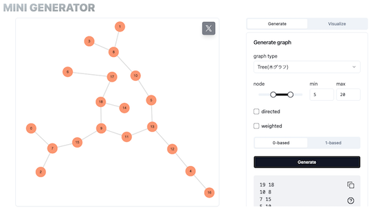
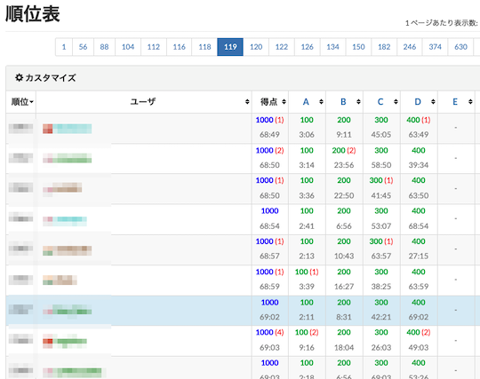
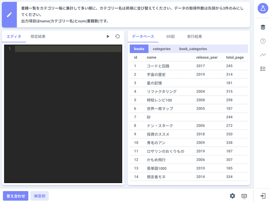

# AtCoder Clans

【非公式】競技プログラミングサイト[AtCoder](https://atcoder.jp/)がもっと楽しくなるリンク集です。有志による非公式サービス・ツール・ライブラリ・記事などをまとめています。

    
    
    
    

  

---

## 特長

* **網羅性が高い**: 初心者から上級者向けの情報まで幅広く掲載しています。
* **最新**: 最新の情報が入手できます。また、[X (旧 Twitter)](https://twitter.com/atcoderclans)で直近1週間の内容をお届けしています。
* **日本語の紹介文**: 日本語で紹介しています。
* **眺めるだけでも楽しい**: サービス・ツールのサムネイルが豊富です。
* **目的に応じて探せる**: 欲しい情報がすぐに探せるように、カテゴリ分けをしています。

## 対象ユーザとメリット

- [AtCoder](https://atcoder.jp/)ユーザ - 困ったことや不便なことが解決できるかもしれません。気になったサービス・ツールなどを使ってみましょう!

- 開発者 - 公開したサービスやツールなどの利用者が増えるだけでなく、ネタ探しや共同開発につながることも期待しています。

- [AtCoder](https://atcoder.jp/)運営チーム - 非公式サービス・ツールの全体像を踏まえ、公式として対応の有無を判断する材料の一つになると思います。また、企業向けの参考資料にもなるかもしれません。

- 企業の採用担当者 - [AtCoder](https://atcoder.jp/)ユーザの実務能力・ポテンシャルの評価材料の一つになると思います。ひいては人材発掘の効率化にも、つながるかもしれません。

---

## 最新情報を確認する

### AtCoder公式

<!-- markdown-link-check-disable -->

- [AtCoderInfo](https://info.atcoder.jp/) - [AtCoder](https://atcoder.jp/)の公式ポータルサイトです。コンテストの参加方法や取り組み方、採用担当者向け情報などが公開されています。

<!-- markdown-link-check-enable -->

### 非公式サービス・ツール・ライブラリ・記事など

直近1〜2週間の更新状況を掲載しています(ベータ版)。

=== "入門者・初心者向けの内容"

    2024-06-07

    - 「[Q3: コンテストは、いつ開催されていますか?](for_beginners/question3)」
        - [AtCoder生成AI対策ルール - 20240607版](https://info.atcoder.jp/entry/llm-abc-rules-ja)
        - [生成AIの台頭に伴うABCにおけるルール変更について](https://atcoder.jp/posts/1246)

=== "Webアプリ・Webサイト"

    2024-05-26

    - 「[問題を解くときの補助ツール](web_app/support_tools)」ページ
        - [MINI GENERATOR](https://mini-generator.netlify.app/graph)

    

      
    

=== "ユーザスクリプト"

    2024-06-08

    - 「[コンテストの成績や関連する統計情報を見る](user_scripts/view_scores)」ページ
        - [AtCoder Center Your Standing](https://greasyfork.org/ja/scripts/496241-atcoder-center-your-standing)

    

      
    

=== "記事"

    2024-06-07

    - 「[コンテストに向けた練習方法を知る](articles/how_to_practice)」ページ
        - [AtCoder生成AI対策ルール - 20240607版](https://info.atcoder.jp/entry/llm-abc-rules-ja)
        - [生成AIの台頭に伴うABCにおけるルール変更について](https://atcoder.jp/posts/1246)

    2024-06-05

    - 「[コードを書くための環境構築を行う](articles/development_env)」ページ
        - [AtCoderで快適に戦うための環境を作ろう](https://note.com/dev_onecareer/n/n673b1e040956)

    2024-06-03

    - 「[実装テクニックを学ぶ - C++](articles/implementation/cpp)」ページ
        - [比較回数の少ないソートについて](https://259-momone.hatenablog.com/entry/2024/06/03/012012)

    - 「[コンテストに関する統計情報を見る](articles/view_scores)」ページ
        - [AtCoder Junior League 2024 Summer - 学校ランキング (6月3日時点)](https://x.com/atcoder/status/1797454145278128235)

    2024-06-02

    - 「[アルゴリズムを学ぶ](articles/algorithm)」ページ
        - [負の添字を持つ対称な DP 配列を「半分だけ」管理する方法（$x^i$ + $x^{−i}$ で表す）](https://ngtkana.hatenablog.com/entry/2024/05/29/022603)

    2024-06-01

    - 「[ヒューリスティック問題を解く](articles/heuristic)」ページ
        - [私のスコア問題評価環境](https://topcoder-tomerun.hatenablog.jp/entry/2024/04/06/201915)

    2024-05-30

    - 「[アルゴリズムを学ぶ](articles/algorithm)」ページ
        - [競プロ初心者が怖がるもの](https://qiita.com/NokonoKotlin/items/75e56515139a872fb629)

    2024-05-28

    - 「[実装テクニックを学ぶ - Rust](articles/implementation/rust)」ページ
        - [proconio を使わない Rust の標準入力（Rust 1.61 ～ Rust 1.65 の一連のアップデートについて）](https://ngtkana.hatenablog.com/entry/2024/05/26/184605)

    - 「[ヒューリスティック問題を解く](articles/heuristic)」ページ
        - [トヨタ自動車プログラミングコンテスト2024#5（AtCoder Heuristic Contest 033）参加記](https://kaede2020.hatenablog.com/entry/2024/05/27/190036)

    2024-05-27

    - 「[コンテストに関する統計情報を見る](articles/view_scores)」ページ
        - [AtCoder Junior League 2024 Summer - 学校ランキング (5月27日時点)](https://x.com/atcoder/status/1794907108120649900)

=== "ブログ"
    アルゴリズム部門・ヒューリスティック部門におけるランキング上位の日本人ユーザのブログをまとめています(順不同)。

    2024-06-01

    - 「[ヒューリスティック部門 - C++](blogs/heuristic/cpp)」ページ
        - [niuez](https://atcoder.jp/users/niuez)さん - [GitHub Pages](https://niuez.github.io/)
        - [ssaattoo](https://atcoder.jp/users/ssaattoo)さん - [はてなブログ](https://ssaattoo.hatenablog.com/)
        - [tsutaj](https://atcoder.jp/users/tsutaj)さん - [はてなブログ](https://tsutaj.hatenablog.com/)

    - 「[ヒューリスティック部門 - Java](blogs/heuristic/java)」ページ
        - [tsukammo](https://atcoder.jp/users/tsukammo)さん - [はてなブログ](https://tsukammo.hatenablog.com/)、[Qiita](https://qiita.com/tsukammo)

    - 「[ヒューリスティック部門 - Nim](blogs/heuristic/nim)」ページ
        - [Ang107](https://atcoder.jp/users/Ang107)さん - [はてなブログ](https://ang107.hatenablog.jp/)

    - 「[ヒューリスティック部門 - Python](blogs/heuristic/python)」ページ
        - [toam](https://atcoder.jp/users/toam)さん - [はてなブログ](https://toriidao.hateblo.jp/)

=== "動画"

    2024-06-09

    - 「[YouTube - チャンネル](youtube/channel)」ページ
        - [ながたかな 競プロ部屋](https://www.youtube.com/@ngtkana_kyopro)

    2024-06-01

    - 「[YouTube - 個別の動画](youtube/video)」ページ
        - [【検証】最新モデル AI、ChatGPT-4o は「ひっかけ問題」をどれくらい解けるのか？【ゆっくり実況・ゆっくり解説】](https://www.youtube.com/watch?v=ZQf_JcAFah0)

    2024-05-31

    - 「[YouTube - チャンネル](youtube/channel)」ページ
        - [まぬお](https://www.youtube.com/@user-mj5sk4lu1t)

    2024-05-29

    - 「[YouTube - 個別の動画](youtube/video)」ページ
        - [【競技プログラミング　作問のポイント解説 #2】競プロの問題文を正しく書くには？【ゆっくり解説】](https://www.youtube.com/watch?v=uDeudtg_6-U)
        - [結婚定理：N人の女は好みの男と結婚できるか？【ゆっくり解説】](https://www.youtube.com/watch?v=zlawYWmuP4c)

=== "色変記事"

    色変記事とは、コンテストの参加者が所定のレーティングに到達した喜びをつづった記事(動画も含む)のことです。

    2024-06-04

    - 「[アルゴリズム部門 - レーティング1600〜1999(青色)](milestones/blue)」ページ
        - [yukimy](https://atcoder.jp/users/yukimy)さん - [AtCoderで入青しました！ - yukimyの日記](https://negiyukino.hatenablog.com/entry/2024/06/03/195516)

=== "国内外のコンテストサイト"

    2024-06-05

    - 「[データベース系コンテスト](related_contest_sites/db)」ページ
        - [SQLab](https://sqlab.net/)

    

      
    

## AtCoder公式グッズを購入する

- [SUZURI](https://suzuri.jp/AtCoder) - [AtCoder](https://atcoder.jp/)のロゴ入りグッズが購入できる。

    

        
    

## 競プロLINEスタンプ・グッズ(非公式)を購入する

- [LINE STORE](https://store.line.me/stickershop/product/22113834/en) - [burioden](https://atcoder.jp/users/burioden)さんが作成・配信している競プロLINEスタンプ(非公式)。[第2弾](https://store.line.me/stickershop/product/22810021/en)、[第3弾](https://store.line.me/stickershop/product/22851268/en)、[第4弾](https://store.line.me/stickershop/product/25256215/en)もある。
    - [kyopro-neko](https://github.com/burioden/kyopro-neko)  - 「競プロするねこ」のイラスト集。
    - [SUZURI](https://suzuri.jp/burioden) - 「競プロするねこ」のイラストが書かれたグッズを購入できる。

    

        
    

## 本サービスのスポンサー(敬称略・順不同)

本サービスの開発・運営を応援してくださり、ありがとうございます。

[GitHub Sponsors](https://github.com/sponsors/KATO-Hiro)で寄付していただいた方には、いくつかの特典をご用意しております。

### 💚 AtCoder Clans Sponsor

- [chokudai](https://github.com/chokudai)

### 🌐 Domain Supporter

- [KoyanagiHitoshi](https://github.com/KoyanagiHitoshi)

### 🍨 Ice Cream Supporter

- ia7ck
- tomii9273
- toshi201

### 🙂 Special Supporter

- otsuneko
