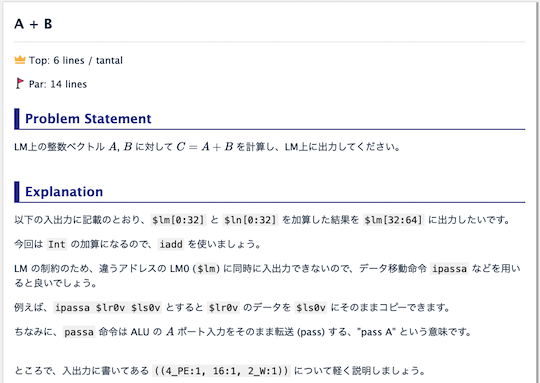
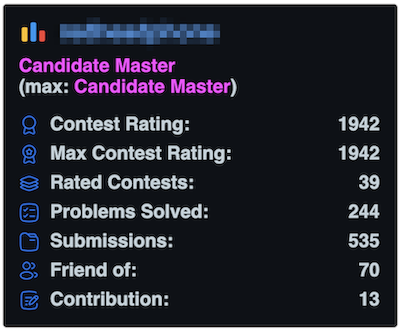

# AtCoder Clans

【非公式】競技プログラミングサイト[AtCoder](https://atcoder.jp/)がもっと楽しくなるリンク集です。有志による非公式サービス・ツール・ライブラリ・記事などをまとめています。

    
    
    
    

  

---

## 特長

* **網羅性が高い**: 初心者から上級者向けの情報まで幅広く掲載しています。
* **最新**: 最新の情報が入手できます。また、[X (旧 Twitter)](https://twitter.com/atcoderclans)で直近1週間の内容をお届けしています。
* **日本語の紹介文**: 日本語で紹介しています。
* **眺めるだけでも楽しい**: サービス・ツールのサムネイルが豊富です。
* **目的に応じて探せる**: 欲しい情報がすぐに探せるように、カテゴリ分けをしています。

## 対象ユーザとメリット

- [AtCoder](https://atcoder.jp/)ユーザ - 困ったことや不便なことが解決できるかもしれません。気になったサービス・ツールなどを使ってみましょう!

- 開発者 - 公開したサービスやツールなどの利用者が増えるだけでなく、ネタ探しや共同開発につながることも期待しています。

- [AtCoder](https://atcoder.jp/)運営チーム - 非公式サービス・ツールの全体像を踏まえ、公式として対応の有無を判断する材料の一つになると思います。また、企業向けの参考資料にもなるかもしれません。

- 企業の採用担当者 - [AtCoder](https://atcoder.jp/)ユーザの実務能力・ポテンシャルの評価材料の一つになると思います。ひいては人材発掘の効率化にも、つながるかもしれません。

---

## 最新情報を確認する

### AtCoder公式

<!-- markdown-link-check-disable -->

- [AtCoderInfo](https://info.atcoder.jp/) - [AtCoder](https://atcoder.jp/)の公式ポータルサイトです。コンテストの参加方法や取り組み方、採用担当者向け情報などが公開されています。

- [【重要なお知らせ】AtCoderを騙る偽サイトにご注意ください](https://atcoder.jp/posts/1268) - [AtCoder](https://atcoder.jp/)の偽サイトへのアクセス・ログインなどをしないように注意喚起している記事。

<!-- markdown-link-check-enable -->

### 非公式サービス・ツール・ライブラリ・記事など

直近1〜2週間の更新状況を掲載しています(ベータ版)。

=== "ホーム"

    2024-08-25

    - [アドバイスするねこ - 競プロするねこ](https://github.com/burioden/kyopro-neko/tree/main/advice_neko)

=== "記事"

    2024-08-29

    - 「[部活・サークル・同好会・オンサイトイベントに参加する](articles/club_activities)」ページ
        - [CodeQUEEN2024で優勝しました](https://www.forcia.com/blog/002983.html)

    2024-08-26

    - 「[コンテストに関する統計情報を見る](articles/view_scores)」ページ
        - [AtCoder Junior League 2024 Summer - 学校ランキング (8月26日時点)](https://x.com/atcoder/status/1827887897418387898)

    2024-08-22

    - 「[コードを書くための環境構築を行う](articles/development_env)」ページ
        - [【GitHubスター100個突破】Pythonのprint()のC++版を本気で作ってみた](https://zenn.dev/sassan/articles/4878e79272ed61)
            - [philip82148/cpp-dump](https://github.com/philip82148/cpp-dump) 

    2024-08-21

    - 「[部活・サークル・同好会・オンサイトイベントに参加する](articles/club_activities)」ページ

        <!-- markdown-link-check-disable -->

        - [「CodeQUEEN 2024」決勝にスポンサーとして参加してきました！](https://note.e-seikatsu.info/n/n58a992f584f4)

        <!-- markdown-link-check-enable -->

    2024-08-19

    - 「[コンテストに関する統計情報を見る](articles/view_scores)」ページ
        - [AtCoder Junior League 2024 Summer - 学校ランキング (8月19日時点)](https://x.com/atcoder/status/1825362031178137972)

    2024-08-16

    - 「[数学を学ぶ](articles/math)」ページ
        - [切り上げ処理 〜 (a + b - 1) / b とは何か 〜](https://drken1215.hatenablog.com/entry/2024/08/12/201231)
        - [a / b の切り上げ処理が (a + b - 1) / b でうまくいく絵本](https://x.com/burioden/status/1823675946974716166)

=== "ブログ"
    アルゴリズム部門・ヒューリスティック部門におけるランキング上位の日本人ユーザのブログをまとめています(順不同)。

    2024-08-18

    - 「[アルゴリズム部門 - Python](blogs/algorithm/python)」ページ
        - [hiro1729](https://atcoder.jp/users/hiro1729)さん - [はてなブログ](https://hiro1729.hatenablog.com/)

=== "動画"

    2024-08-27

    - 「[YouTube - 個別の動画](youtube/video)」ページ
        - [2本の交わらない線で点を結べるか？【ゆっくり解説】](https://www.youtube.com/watch?v=FnMgl2z86qo)

    2024-08-17

    - 「[YouTube - 個別の動画](youtube/video)」ページ
        - [π^π^π^πは整数か？【ゆっくり解説】](https://www.youtube.com/watch?v=TooFbrU-Wb4)

=== "ライブラリ・スニペット"

    2024-08-28

    - 「[C++](libraries/cpp)」ページ
        - [rainbou-kpr/library](https://github.com/rainbou-kpr/library) 

=== "色変記事"

    色変記事とは、コンテストの参加者が所定のレーティングに到達した喜びをつづった記事(動画も含む)のことです。

    2024-08-23

    - 「[レーティング1200〜1599(水色)](milestones/cyan)」ページ
        - [jupiter_68](https://atcoder.jp/users/jupiter_68)さん - [AtCoderで水色コーダーになりました](https://trap.jp/post/2310/)

    2024-08-22

    - 「[レーティング1200〜1599(水色)](milestones/cyan)」ページ
        - [soutome](https://atcoder.jp/users/soutome)さん - [AtCoder入水しました！！！！～ゼロから入水までの軌跡～](https://qiita.com/W0VKS1Cm8hwomGk/items/6a8910bcf5cb9439cec9)

    2024-08-21

    - 「[レーティング1600〜1999(青色)](milestones/blue)」ページ
        - [loop0919](https://atcoder.jp/users/loop0919)さん - [【AtCoder】入青した！ので語らせて【うれしい！】](https://zenn.dev/loop0919/articles/5a66f529ba9e08)

    2024-08-20

    - 「[レーティング2000〜2399(黄色)](milestones/yellow)」ページ
        - [hiro1729](https://atcoder.jp/users/hiro1729)さん - [AtCoder 入黄しました！ - hiro1729 競プロ](https://hiro1729.hatenablog.com/entry/2024/08/19/070114)

    2024-08-15

    - 「[レーティング1600〜1999(青色)](milestones/blue)」ページ
        - [n0ma_ru](https://atcoder.jp/users/n0ma_ru)さん - [青色になった！](https://warp-asteroid-8f6.notion.site/97f48f73432e4bb0b453178264c219f7)

=== "国内外のコンテストサイト"

    2024-08-25

    - 「[AIプロセッサー（アクセラレータ）系コンテスト](related_contest_sites/ai_accelerator)」ページ
        - [MN-Core Challenge](https://mncore-challenge.preferred.jp/)

    

      
    

    2024-08-24

    - 「[Codeforces](related_contest_sites/codeforces)」ページ
        - [Codeforces Readme Stats](https://codeforces-readme-stats.vercel.app/)

    

      
    

## AtCoder公式グッズを購入する

- [SUZURI](https://suzuri.jp/AtCoder) - [AtCoder](https://atcoder.jp/)のロゴ入りグッズが購入できる。

    

        
    

## 競プロLINEスタンプ・グッズ(非公式)を購入する

- [LINE STORE](https://store.line.me/stickershop/product/22113834/en) - [burioden](https://atcoder.jp/users/burioden)さんが作成・配信している競プロLINEスタンプ(非公式)。[第2弾](https://store.line.me/stickershop/product/22810021/en)、[第3弾](https://store.line.me/stickershop/product/22851268/en)、[第4弾](https://store.line.me/stickershop/product/25256215/en)もある。
    - [kyopro-neko](https://github.com/burioden/kyopro-neko)  - 「競プロするねこ」のイラスト集。
        - [アドバイスするねこ](https://github.com/burioden/kyopro-neko/tree/main/advice_neko) - 同キャラクターが、さまざまなアドバイスをしてくれる。
    - [SUZURI](https://suzuri.jp/burioden) - 「競プロするねこ」のイラストが書かれたグッズを購入できる。

    

        
    

## 本サービスのスポンサー(敬称略・順不同)

本サービスの開発・運営を応援してくださり、ありがとうございます。

[GitHub Sponsors](https://github.com/sponsors/KATO-Hiro)で寄付していただいた方には、いくつかの特典をご用意しております。

### 💚 AtCoder Clans Sponsor

- [chokudai](https://github.com/chokudai)

### 🌐 Domain Supporter

- [KoyanagiHitoshi](https://github.com/KoyanagiHitoshi)

### 🍨 Ice Cream Supporter

- ia7ck
- tomii9273
- toshi201

### 🙂 Special Supporter

- otsuneko
