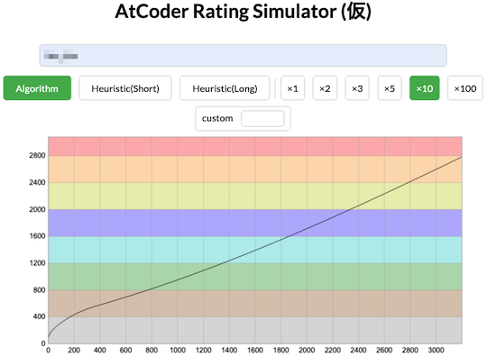
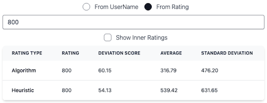
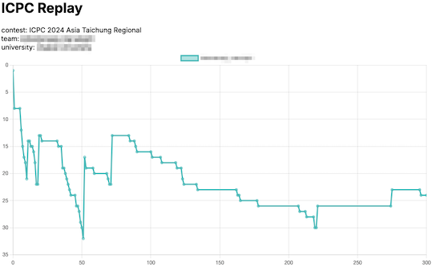

# AtCoder Clans

【非公式】競技プログラミングサイト[AtCoder](https://atcoder.jp/)がもっと楽しくなるリンク集です。有志による非公式サービス・ツール・ライブラリ・記事などをまとめています。

    
    
    
    

  

---

## 特長

* **網羅性が高い**: 初心者から上級者向けの情報まで幅広く掲載しています。
* **最新**: 最新の情報が入手できます。また、[X (旧 Twitter)](https://twitter.com/atcoderclans)で直近1週間の内容をお届けしています。
* **日本語の紹介文**: 日本語で紹介しています。
* **眺めるだけでも楽しい**: サービス・ツールのサムネイルが豊富です。
* **目的に応じて探せる**: 欲しい情報がすぐに探せるように、カテゴリ分けをしています。

## 対象ユーザとメリット

- [AtCoder](https://atcoder.jp/)ユーザ - 困ったことや不便なことが解決できるかもしれません。気になったサービス・ツールなどを使ってみましょう!

- 開発者 - 公開したサービスやツールなどの利用者が増えるだけでなく、ネタ探しや共同開発につながることも期待しています。

- [AtCoder](https://atcoder.jp/)運営チーム - 非公式サービス・ツールの全体像を踏まえ、公式として対応の有無を判断する材料の一つになると思います。また、企業向けの参考資料にもなるかもしれません。

- 企業の採用担当者 - [AtCoder](https://atcoder.jp/)ユーザの実務能力・ポテンシャルの評価材料の一つになると思います。ひいては人材発掘の効率化にも、つながるかもしれません。

---

## 最新情報を確認する

### AtCoder公式

<!-- markdown-link-check-disable -->

- [AtCoderInfo](https://info.atcoder.jp/) - [AtCoder](https://atcoder.jp/)の公式ポータルサイトです。コンテストの参加方法や取り組み方、採用担当者向け情報などが公開されています。

- [AtCoder生成AI対策ルール - 20241115版](https://info.atcoder.jp/entry/llm-rules-ja) - AtCoder Beginner Contest (通称 ABC) および AtCoder Regular Contest (同 ARC)のコンテスト開催中を対象として、生成AIの利用における禁止事項が説明されています ([英語版](https://info.atcoder.jp/entry/llm-rules-en))。
    - [生成AIの技術向上に伴うABCおよびARCにおけるルール変更について](https://atcoder.jp/posts/1347) - 上記のルール変更の背景、作成方針、概要、今後の変更の可能性について言及されています ([英語版](https://atcoder.jp/posts/1350))。

- [【重要なお知らせ】AtCoderを騙る偽サイトにご注意ください](https://atcoder.jp/posts/1268) - [AtCoder](https://atcoder.jp/)の偽サイトへのアクセス・ログインなどをしないように注意喚起している記事です。

<!-- markdown-link-check-enable -->

### 非公式サービス・ツール・ライブラリ・記事など

直近1〜2週間の更新状況を掲載しています(ベータ版)。

=== "入門者・初心者向けの内容"

    2024-11-16

    - 「[Q3: コンテストは、いつ開催されていますか?](for_beginners/question3)」ページ
        - [AtCoder生成AI対策ルール - 20241115版](https://info.atcoder.jp/entry/llm-rules-ja)
        - [生成AIの技術向上に伴うABCおよびARCにおけるルール変更について](https://atcoder.jp/posts/1347)

=== "Webアプリ・Webサイト"

    !!! info "お知らせ"

        一時的にリンク切れとなっていましたが、サービスが利用できることを確認したため、改めて掲載しています。

    2024-11-23

    - 「[コンテストの成績に関連するサービス](web_app/services_using_scores)」ページ
        - [AtCoder Rating Simulator(仮)](https://atcoder-notify.com/rating_simulator/)

    

      
    

    - 「[コンテストに関する統計情報](web_app/statistics)」ページ
        - [deviation](https://atcoder-notify.com/deviation/)

    

      
    

=== "記事"

    2024-11-26

    - 「[コンテストに関する統計情報を見る](articles/view_scores)」ページ
        - [AtCoder Junior League 2024 Winter - 学校ランキング (11月25日時点)](https://x.com/atcoder/status/1860906179104510443)

    2024-11-22

    - 「[ヒューリスティック問題を解く](articles/heuristic)」ページ
        - [THIRD プログラミングコンテスト2024 (AHC039) 解説](https://www.terry-u16.net/entry/ahc039)

    2024-11-19

    - 「[コンテストに関する統計情報を見る](articles/view_scores)」ページ
        - [AtCoder Junior League 2024 Winter - 学校ランキング (11月18日時点)](https://x.com/atcoder/status/1858360891198361785)

    2024-11-16

    - 「[コンテストに向けた練習方法を知る](articles/how_to_practice)」ページ
        - [AtCoder生成AI対策ルール - 20241115版](https://info.atcoder.jp/entry/llm-rules-ja)
        - [生成AIの技術向上に伴うABCおよびARCにおけるルール変更について](https://atcoder.jp/posts/1347)

    2024-11-14

    - 「[ヒューリスティック問題を解く](articles/heuristic)」ページ
        - [THIRD プログラミングコンテスト2024（AtCoder Heuristic Contest 039）参加記](https://kaede2020.hatenablog.com/entry/2024/11/11/222634)

    2024-11-12

    - 「[コンテストに関する統計情報を見る](articles/view_scores)」ページ
        - [AtCoder Junior League 2024 Winter - 学校ランキング (11月11日時点)](https://x.com/atcoder/status/1855799989181751468)

=== "ブログ"
    アルゴリズム部門・ヒューリスティック部門におけるランキング上位の日本人ユーザのブログをまとめています(順不同)。

    2024-11-20

    - 「[アルゴリズム部門 - C++](blogs/algorithm/cpp)」ページ
        - [hint908](https://atcoder.jp/users/hint908)さん - [はてなブログ](https://kureha908.hatenablog.com/)

    2024-11-17

    - 「[アルゴリズム部門 - C++](blogs/algorithm/cpp)」ページ
        - [miiitomi](https://atcoder.jp/users/miiitomi)さん - [GitHub Pages](https://miiitomi.github.io/categories/%E7%AB%B6%E3%83%97%E3%83%AD/)

    - 「[ヒューリスティック部門 - C&#35](blogs/heuristic/csharp)」ページ
        - [okudeottu](https://atcoder.jp/users/okudeottu)さん - [Blogger](https://blog.tobisatis.com/)

    2024-11-13

    - 「[アルゴリズム部門 - C++](blogs/algorithm/cpp)」ページ
        - [amentorimaru](https://atcoder.jp/users/amentorimaru)さん - [はてなブログ](https://amentorimaru.hatenablog.com)

=== "動画"

    2024-11-15

    - 「[YouTube - 個別の動画](youtube/video)」ページ
        - [1/√xを計算する変態コード【ゆっくり解説】](https://www.youtube.com/watch?v=n2Q1Sp7iew4)

=== "色変記事"

    色変記事とは、コンテストの参加者が所定のレーティングに到達した喜びをつづった記事(動画も含む)のことです。

    2024-11-25

    - 「[レーティング800〜1199(緑色)](milestones/green)」ページ
        - [comet725](https://atcoder.jp/users/comet725)さん - [【色変記事】AtCoder入緑しました](https://qiita.com/comet725/items/39cbd3a73ad3c50b3abc)

    2024-11-24

    - 「[レーティング1600〜1999(青色)](milestones/blue)」ページ
        - [InTheBloom](https://atcoder.jp/users/InTheBloom)さん - [AtCoder Algorithm 1600達成！](https://inthebloom.github.io/post/reached-1600/)

    2024-11-20

    - 「[レーティング2400〜2799(橙色)](milestones/orange)」ページ
        - [hint908](https://atcoder.jp/users/hint908)さん - [AtCoder 橙になりました - kureha's diary](https://kureha908.hatenablog.com/entry/2024/11/18/154518)

    2024-11-18

    - 「[レーティング1600〜1999(青色)](milestones/blue)」ページ
        - [Andrew8128](https://atcoder.jp/users/Andrew8128)さん - [競技プログラミングで意識していること【AtCoder】【入青】](https://qiita.com/Andrew8128/items/6931c014d33a95b6349b)

    2024-11-13

    - 「[レーティング2400〜2799(橙色)](milestones/orange)」ページ
        - [amentorimaru](https://atcoder.jp/users/amentorimaru)さん - [【AtCoder】橙に一瞬なりました - あめんばーどのバーチャル日記](https://amentorimaru.hatenablog.com/entry/2024/11/11/221155)

    - 「[レーティング800〜1199(緑色)](milestones/green)」ページ
        - [Q_re](https://atcoder.jp/users/Q_re)さん - [【色変記事】プログラミング未経験文系→AtCoderで入緑しました](https://note.com/kaze_246/n/n9682b5398878)

    - 「[レーティング400〜799(茶色)](milestones/brown)」ページ
        - [dualboot51](https://atcoder.jp/users/dualboot51)さん - [AtCoderで入茶するまでにやったこと3選](https://begi-pro.com/atcoder_brown/)

=== "国内外のコンテストサイト"

    2024-11-21

    - 「[ICPC (国際大学対抗プログラミングコンテスト)](related_contest_sites/icpc)」ページ
        - [ICPC Replay](https://icpc-replay.vercel.app/)

    

      
    

## AtCoder公式グッズを購入する

- [SUZURI](https://suzuri.jp/AtCoder) - [AtCoder](https://atcoder.jp/)のロゴ入りグッズが購入できる。

    

        
    

## 競プロLINEスタンプ・グッズ(非公式)を購入する

- [LINE STORE](https://store.line.me/stickershop/product/22113834/en) - [burioden](https://atcoder.jp/users/burioden)さんが作成・配信している競プロLINEスタンプ(非公式)。[第2弾](https://store.line.me/stickershop/product/22810021/en)、[第3弾](https://store.line.me/stickershop/product/22851268/en)、[第4弾](https://store.line.me/stickershop/product/25256215/en)もある。
    - [kyopro-neko](https://github.com/burioden/kyopro-neko)  - 「競プロするねこ」のイラスト集。
        - [アドバイスするねこ](https://github.com/burioden/kyopro-neko/tree/main/advice_neko) - 同キャラクターが、さまざまなアドバイスをしてくれる。
    - [SUZURI](https://suzuri.jp/burioden) - 「競プロするねこ」のイラストが書かれたグッズを購入できる。

    

        
    

## 本サービスのスポンサー(敬称略・順不同)

本サービスの開発・運営を応援してくださり、ありがとうございます。

[GitHub Sponsors](https://github.com/sponsors/KATO-Hiro)で寄付していただいた方には、いくつかの特典をご用意しております。

### 💚 AtCoder Clans Sponsor

- [chokudai](https://github.com/chokudai)

### 🌐 Domain Supporter

- [KoyanagiHitoshi](https://github.com/KoyanagiHitoshi)

### 🍨 Ice Cream Supporter

- ia7ck
- tomii9273
- toshi201

### 🙂 Special Supporter

- otsuneko
- yunix-kyopro
