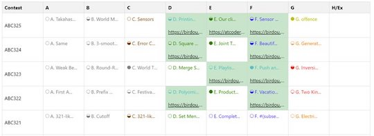
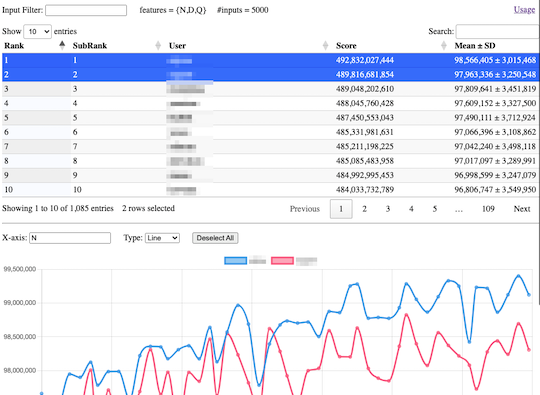
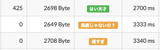
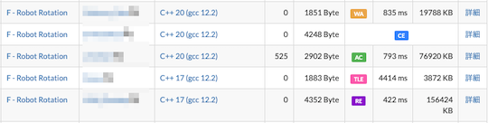

# AtCoder Clans

【非公式】競技プログラミングサイト[AtCoder](https://atcoder.jp/)がもっと楽しくなるリンク集です。有志による非公式サービス・ツール・ライブラリ・記事などをまとめています。

    
    
    
    

  

---

## 特長

* **網羅性が高い**: 初心者から上級者向けの情報まで幅広く掲載しています。
* **最新**: 最新の情報が入手できます。また、[Twitter](https://twitter.com/atcoderclans)で直近1週間の内容をお届けしています。
* **日本語の紹介文**: 日本語で紹介しています。
* **眺めるだけでも楽しい**: サービス・ツールのサムネイルが豊富です。
* **目的に応じて探せる**: 欲しい情報がすぐに探せるように、カテゴリ分けをしています。

## 対象ユーザとメリット

- [AtCoder](https://atcoder.jp/)ユーザ - 困ったことや不便なことが解決できるかもしれません。気になったサービス・ツールなどを使ってみましょう!

- 開発者 - 公開したサービスやツールなどの利用者が増えるだけでなく、ネタ探しや共同開発につながることも期待しています。

- [AtCoder](https://atcoder.jp/)運営チーム - 非公式サービス・ツールの全体像を踏まえ、公式として対応の有無を判断する材料の一つになると思います。また、企業向けの参考資料にもなるかもしれません。

- 企業の採用担当者 - [AtCoder](https://atcoder.jp/)ユーザの実務能力・ポテンシャルの評価材料の一つになると思います。ひいては人材発掘の効率化にも、つながるかもしれません。

---

## 最新情報を確認する

直近1〜2週間の更新状況を掲載しています(ベータ版)。

=== "Webアプリ・Webサイト"

    2023-11-01

    - 「[問題を解く](web_app/solve_problems)」ページ
        - [AtCoderBlogs](https://atcoder-blogs.jp)

    

      
    

    2023-10-27

    - 「[コンテストに関する統計情報](web_app/statistics)」ページ
        - [ahc_standings](https://img.atcoder.jp/ahc_standings/index.html?contest=ahc025)

    

      
    

=== "ユーザスクリプト"

    2023-10-30

    - 「[ネタスクリプト](user_scripts/jokes)」ページ
        - [AC Custom](https://greasyfork.org/ja/scripts/478609-ac-custom)

    

      
    

    2023-10-28

    - 「[Webページに色付けする](user_scripts/colors)」ページ
        - [AtCoder Error Colorizer](https://greasyfork.org/ja/scripts/478281-atcoder-error-colorizer)

    

      
    

=== "記事"

    2023-11-06

    - 「[アルゴリズムを学ぶ](articles/algorithm)」ページ
        - [二部グラフ判定をUnionFindTreeで行う](https://noshi91.hatenablog.com/entry/2018/04/17/183132)

    - 「[競技プログラミングと就転職](articles/jobs)」ページ
        - [とある競技プログラマーの1年](https://www.estie.jp/blog/entry/2023/11/06/174536)

    - 「[コンテストに関する統計情報を見る](articles/view_scores)」ページ
        - [AtCoder Junior League 2023 - 学校ランキング (11月6日時点)](https://twitter.com/atcoder/status/1721379697609855201)

    2023-11-05

    - 「[情報オリンピック](related_contest_sites/joi_ioi)」ページ
        - [国際情報オリンピック2023 参加記](https://qiita.com/black-yuki/items/10b297ffe486cd36cd8a)

    2023-11-04

    - 「[コードを書くための環境構築を行う](articles/development_env)」ページ
        - [競技プログラミングの環境構築 [VSCode+WSL+AtCoder Library]【ゆっくり解説】](https://www.youtube.com/watch?v=uhnASau7fB4)

    - 「[アルゴリズムを学ぶ](articles/algorithm)」ページ
        - [【問題集】フローの入門](https://drken1215.hatenablog.com/archive/category/%E3%80%90%E5%95%8F%E9%A1%8C%E9%9B%86%E3%80%91%E3%83%95%E3%83%AD%E3%83%BC%E3%81%AE%E5%85%A5%E9%96%80)

    - 「[競技プログラミングと就転職](articles/jobs)」ページ
        - [「AtCoder 競技プログラマー就職企業人気ランキング2023」を発表](https://prtimes.jp/main/html/rd/p/000000039.000028415.html)

    2023-10-30

    - 「[コンテストに関する統計情報を見る](articles/view_scores)」ページ
        - [AtCoder Junior League 2023 - 学校ランキング (10月30日時点)](https://twitter.com/atcoder/status/1718845595371319578)

    2023-10-26

    - 「[ヒューリスティック問題を解く](articles/heuristic)」ページ
        - [AtCoder Heuristic Contest 025参加記](https://kaede2020.hatenablog.com/entry/2023/10/22/195315)

    2023-10-25

    - 「[部活・サークル・同好会・オンサイトイベントに参加する](articles/club_activities)」ページ
        - [CodeQUEEN2023決勝に出場しました！](https://ayuna-stpyko.github.io/my_blog/archive/20231023.html)
        - [女性オンリーオンサイトイベント【CodeQUEEN 2023】に参加した話](https://d-burioden.hateblo.jp/entry/2023/10/23/220439)

=== "ブログ"
    アルゴリズム部門・ヒューリスティック部門におけるランキング上位の日本人ユーザのブログをまとめています(順不同)。

    2023-10-29

    - 「[アルゴリズム部門 - C++](blogs/algorithm/cpp)」ページ
        - [US_cube](https://atcoder.jp/users/US_cube)さん - [はてなブログ](https://uscube.hatenablog.com/)

    - 「[ヒューリスティック部門 - C++](blogs/heuristic/cpp)」ページ
        - [hamamu](https://atcoder.jp/users/hamamu)さん - [Qiita](https://qiita.com/hamamu)
        - [ValGrowth](https://atcoder.jp/users/ValGrowth)さん - [はてなブログ](https://valgrowth.hatenablog.com/archive)

    - 「[ヒューリスティック部門 - Python](blogs/heuristic/python)」ページ
        - [cozy_sauna](https://atcoder.jp/users/cozy_sauna)さん - [Qiita](https://qiita.com/cozy_sauna/)

=== "ライブラリ・スニペット"

    2023-11-02

    - 「[C++](libraries/cpp)」ページ
        - [UScuber/Algorithm-Library](https://github.com/UScuber/Algorithm-Library) 

=== "色変記事"

    色変記事とは、コンテストの参加者が所定のレーティングに到達した喜びをつづった記事のことです。

    2023-10-31

    - 「[レーティング800〜1199(緑色)](milestones/green)」ページ
         - [totosuki](https://atcoder.jp/users/totosuki)さん - [【AtCoder】Pythonで入緑しました！！](https://qiita.com/Totosuki/items/cc98efbd260c76635cc5)

    2023-10-27

    - 「[レーティング1600〜1999(青色)](milestones/blue)」ページ
        - [chimaki821](https://atcoder.jp/users/chimaki821)さん - [【AtCoder】プログラミング未経験からのんびり続けて青コーダーになった話](https://qiita.com/chimaki821/items/eb76c042954f725b3bbc)

    2023-10-26

    - 「[レーティング1200〜1599(水色)](milestones/cyan)」ページ
        - [tosh55](https://atcoder.jp/users/tosh55)さん - [50代半ばでAtCoder入水しました](https://qiita.com/tosh55/items/4153942b4bac39e0e5a8)

## AtCoder公式グッズを購入する

- [SUZURI](https://suzuri.jp/AtCoder) - [AtCoder](https://atcoder.jp/)のロゴ入りグッズが購入できる。

    

        
    

## 競プロLINEスタンプ・グッズ(非公式)を購入する

- [LINE STORE](https://store.line.me/stickershop/product/22113834/en) - [burioden](https://atcoder.jp/users/burioden)さんが作成・配信している競プロLINEスタンプ(非公式)。[第2弾](https://store.line.me/stickershop/product/22810021/en)、[第3弾](https://store.line.me/stickershop/product/22851268/en)もある。
    - [kyopro-neko](https://github.com/burioden/kyopro-neko)  - 「競プロするねこ」のイラスト集。
    - [SUZURI](https://suzuri.jp/burioden) - 「競プロするねこ」のイラストが書かれたグッズを購入できる。

    

        
    

## 本サービスのスポンサー(敬称略・順不同)

本サービスの開発・運営を応援してくださり、ありがとうございます。

[GitHub Sponsors](https://github.com/sponsors/KATO-Hiro)で寄付していただいた方には、いくつかの特典をご用意しております。

### 🍨 Ice Cream Supporter

- ia7ck
- tomii9273
- toshi201
