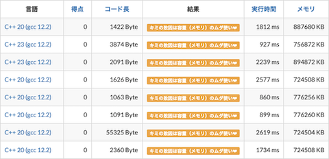

# AtCoder Clans

【非公式】競技プログラミングサイト[AtCoder](https://atcoder.jp/)がもっと楽しくなるリンク集です。有志による非公式サービス・ツール・ライブラリ・記事などをまとめています。

    
    
    
    

  

---

## 特長

* **網羅性が高い**: 初心者から上級者向けの情報まで幅広く掲載しています。
* **最新**: 最新の情報が入手できます。また、[Twitter](https://twitter.com/atcoderclans)で直近1週間の内容をお届けしています。
* **日本語の紹介文**: 日本語で紹介しています。
* **眺めるだけでも楽しい**: サービス・ツールのサムネイルが豊富です。
* **目的に応じて探せる**: 欲しい情報がすぐに探せるように、カテゴリ分けをしています。

## 対象ユーザとメリット

- [AtCoder](https://atcoder.jp/)ユーザ - 困ったことや不便なことが解決できるかもしれません。気になったサービス・ツールなどを使ってみましょう!

- 開発者 - 公開したサービスやツールなどの利用者が増えるだけでなく、ネタ探しや共同開発につながることも期待しています。

- [AtCoder](https://atcoder.jp/)運営チーム - 非公式サービス・ツールの全体像を踏まえ、公式として対応の有無を判断する材料の一つになると思います。また、企業向けの参考資料にもなるかもしれません。

- 企業の採用担当者 - [AtCoder](https://atcoder.jp/)ユーザの実務能力・ポテンシャルの評価材料の一つになると思います。ひいては人材発掘の効率化にも、つながるかもしれません。

---

## 最新情報を確認する

直近1〜2週間の更新状況を掲載しています(ベータ版)。

=== "入門者・初心者向けの内容"

    2023-11-14

    - 「[Q0: アルゴリズム、競技プログラミングとは?](for_beginners/question0)」ページ
        - [競技プログラミングの始め方【ゆっくり解説】](https://www.youtube.com/watch?v=BPkZc3wsCxU)

=== "ユーザスクリプト"

    2023-11-12

    - 「[ネタスクリプト](user_scripts/jokes)」ページ
        - [AtCoderMLEtoHisoka](https://greasyfork.org/ja/scripts/478297-atcodermletohisoka)

    

      
    

=== "記事"

    2023-11-20

    - 「[コンテストに関する統計情報を見る](articles/view_scores)」ページ
        - [AtCoder Junior League 2023 - 学校ランキング (11月20日時点)](https://twitter.com/atcoder/status/1726455552606372167)

    2023-11-18

    - 「[コンテストに向けた練習方法を知る](articles/how_to_practice)」ページ
        - [AtCoder練習・活用サービス](https://atcoder.jp/posts/1134)

    2023-11-17

    - 「[競技プログラミングと就転職](articles/jobs)」ページ
        - [超強力なアルゴリズムチームの魅力 - Algo Artis Media](https://media.algo-artis.com/posts/1ZH8I2PM)

    2023-11-15

    - 「[実装テクニックを学ぶ - Python](articles/implementation/python)」ページ
        - [【AtCoder】Pythonで競プロをするときの注意点まとめ【競技プログラミング】](https://qiita.com/kemuniku/items/1f1537e1df2ac8180d9b)

    - 「[コンテストに関する統計情報を見る](articles/view_scores)」ページ
        - [AtCoder Junior League 2023 - 学校ランキング (11月15日時点)](https://twitter.com/atcoder/status/1724615306881204451)

    2023-11-13

    - 「[ヒューリスティック問題を解く](articles/heuristic)」ページ
        - [AHC典型解法シリーズ第1弾「モンテカルロ法」](https://qiita.com/thun-c/items/8e7ae0249f1907854763)

    2023-11-11

    - 「[プログラミング言語を学ぶ](articles/programming_languages)」ページ
        - [RustCoder ―― AtCoder と Rust で始める競技プログラミング入門](https://zenn.dev/toga/books/rust-atcoder)

    2023-11-10

    - 「[1年をふりかえる](articles/look_back_on_past)」ページ
        - [競プロ Advent Calendar 2023](https://adventar.org/calendars/8745)

    2023-11-07

    - 「[ヒューリスティック問題を解く](articles/heuristic)」ページ
        - [AHC 典型: 解をたくさん作る](https://iwashi31.hatenablog.com/entry/2023/11/05/234449)

=== "ブログ"
    アルゴリズム部門・ヒューリスティック部門におけるランキング上位の日本人ユーザのブログをまとめています(順不同)。

    2023-11-09

    - 「[ヒューリスティック部門 - C++](blogs/heuristic/cpp)」ページ
        - [yamunaku](https://atcoder.jp/users/yamunaku)さん - [はてなブログ](https://yamunaku.hatenablog.com/)

    - 「[ヒューリスティック部門 - Python](blogs/heuristic/python)」ページ
        - [Kiri8128](https://atcoder.jp/users/Kiri8128)さん - [はてなブログ](https://kiri8128.hatenablog.com/)
        - [toam](https://atcoder.jp/users/toam)さん - [はてなブログ](https://toriidao.hateblo.jp/)

=== "動画"

    2023-11-18

    - 「[YouTube - チャンネル](youtube/channel)」ページ
        - [ngtkana](https://www.youtube.com/channel/UC9amFw1nimUfDGAf746HYXQ)

    2023-11-16

    - 「[YouTube - 個別の動画](youtube/video)」ページ
        - [全探索とは？お気持ち編［競技プログラミング初心者へ］【ゆっくり解説】](https://www.youtube.com/watch?v=-vGsAqDIgQo)

=== "色変記事"

    色変記事とは、コンテストの参加者が所定のレーティングに到達した喜びをつづった記事のことです。

    2023-11-08

    - 「[レーティング1200〜1599(水色)](milestones/cyan)」ページ
        - [LiKaf](https://atcoder.jp/users/LiKaf)さん - [入水しました！](https://note.com/likaf/n/n1957fa5cb178)

## AtCoder公式グッズを購入する

- [SUZURI](https://suzuri.jp/AtCoder) - [AtCoder](https://atcoder.jp/)のロゴ入りグッズが購入できる。

    

        
    

## 競プロLINEスタンプ・グッズ(非公式)を購入する

- [LINE STORE](https://store.line.me/stickershop/product/22113834/en) - [burioden](https://atcoder.jp/users/burioden)さんが作成・配信している競プロLINEスタンプ(非公式)。[第2弾](https://store.line.me/stickershop/product/22810021/en)、[第3弾](https://store.line.me/stickershop/product/22851268/en)もある。
    - [kyopro-neko](https://github.com/burioden/kyopro-neko)  - 「競プロするねこ」のイラスト集。
    - [SUZURI](https://suzuri.jp/burioden) - 「競プロするねこ」のイラストが書かれたグッズを購入できる。

    

        
    

## 本サービスのスポンサー(敬称略・順不同)

本サービスの開発・運営を応援してくださり、ありがとうございます。

[GitHub Sponsors](https://github.com/sponsors/KATO-Hiro)で寄付していただいた方には、いくつかの特典をご用意しております。

### 🍨 Ice Cream Supporter

- ia7ck
- tomii9273
- toshi201
