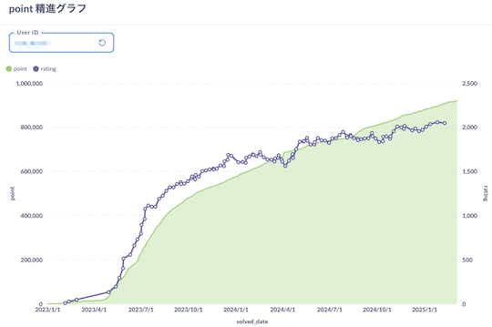

# AtCoder Clans

【非公式】競技プログラミングサイト[AtCoder](https://atcoder.jp/)がもっと楽しくなるリンク集です。有志による非公式サービス・ツール・ライブラリ・記事などをまとめています。

    
    
    
    

  

---

## 特長

* **網羅性が高い**: 初心者から上級者向けの情報まで幅広く掲載しています。
* **最新**: 最新の情報が入手できます。また、[X (旧 Twitter)](https://twitter.com/atcoderclans)で直近1週間の内容をお届けしています。
* **日本語の紹介文**: 日本語で紹介しています。
* **眺めるだけでも楽しい**: サービス・ツールのサムネイルが豊富です。
* **目的に応じて探せる**: 欲しい情報がすぐに探せるように、カテゴリ分けをしています。

## 対象ユーザとメリット

- [AtCoder](https://atcoder.jp/)ユーザ - 困ったことや不便なことが解決できるかもしれません。気になったサービス・ツールなどを使ってみましょう!

- 開発者 - 公開したサービスやツールなどの利用者が増えるだけでなく、ネタ探しや共同開発につながることも期待しています。

- [AtCoder](https://atcoder.jp/)運営チーム - 非公式サービス・ツールの全体像を踏まえ、公式として対応の有無を判断する材料の一つになると思います。また、企業向けの参考資料にもなるかもしれません。

- 企業の採用担当者 - [AtCoder](https://atcoder.jp/)ユーザの実務能力・ポテンシャルの評価材料の一つになると思います。ひいては人材発掘の効率化にも、つながるかもしれません。

---

## 最新情報を確認する

### AtCoder公式

<!-- markdown-link-check-disable -->

- [AtCoderInfo](https://info.atcoder.jp/) - [AtCoder](https://atcoder.jp/)の公式ポータルサイトです。コンテストの参加方法や取り組み方、採用担当者向け情報などが公開されています。

#### 公式コンテストの日時を確認

- [公式コンテストカレンダー運用のお知らせ](https://atcoder.jp/posts/1422) - Google カレンダーに追加すると、公式コンテストの開催日時を簡単に確認できます。
    - [ABCカレンダー](https://calendar.google.com/calendar/u/0?cid=Y180MzA3MDIxZTE0ZDhhMzNlYzgzNjI5YmM1MWQ2OTEzMWMwNjMxOGJiNGQ1ZmRjOTYwODNlZDE2ODFmMGEwZWQ2QGdyb3VwLmNhbGVuZGFyLmdvb2dsZS5jb20)
    - [ARCカレンダー](https://calendar.google.com/calendar/u/0?cid=Y185NGJiMDZmYmI0MDA2NjEzM2VmOTlkNTQ2NDhiZjIzYjI4MTEwNzdjZjU0MWE0ZGMyZDJlYjFiODI1MmU2NmZhQGdyb3VwLmNhbGVuZGFyLmdvb2dsZS5jb20)
    - [AGCカレンダー](https://calendar.google.com/calendar/u/0?cid=Y18wMTk0MDA5MTllZmYyNTI2MzNjNGIxNWE3MTA5YjUyNjhjNTkyNmFhMTFlMDQ2NWE5OWVmNTE5NDdhOTI4YmQ0QGdyb3VwLmNhbGVuZGFyLmdvb2dsZS5jb20)
    - [AHCカレンダー](https://calendar.google.com/calendar/u/0?cid=Y18yYTZiOWYxNTc3Nzg0N2E5YmNlNDhlMDI2OTkyYmY2ZGZjOWE2ZTlhMjk3Mjk4YTFjNjQ5NWMwYjE3NjQ5NjU0QGdyb3VwLmNhbGVuZGFyLmdvb2dsZS5jb20)

#### コンテストに関するルール変更

- [AtCoder生成AI対策ルール - 20241206版](https://info.atcoder.jp/entry/llm-rules-ja) - AtCoder Beginner Contest (通称 ABC) および AtCoder Regular Contest (同 ARC)のコンテスト開催中を対象として、生成AIの利用における禁止事項が説明されています ([英語版](https://info.atcoder.jp/entry/llm-rules-en))。
    - [生成AIの技術向上に伴うABCおよびARCにおけるルール変更について](https://atcoder.jp/posts/1347) - 上記のルール変更の背景、作成方針、概要、今後の変更の可能性について言及されています ([英語版](https://atcoder.jp/posts/1350))。
    - [ARCのDivision制に伴うルール変更について](https://atcoder.jp/posts/1368) - ARC の Division制の導入に伴うルールの変更点が紹介されています。

- [ARCのDivision制についての告知](https://atcoder.jp/posts/1364) - ARC189以降、AtCoder Regular Contest (通称 ARC) は難易度の異なる2種類のコンテストに分けられることが告知されています。

#### セキュリティ対策

- [AtCoderアカウントのパスワード管理について](https://atcoder.jp/posts/1366) - 不正アクセス防止のため、[AtCoder](https://atcoder.jp/)アカウントのパスワード確認・必要に応じて変更を促しています。
- [【重要なお知らせ】AtCoderを騙る偽サイトにご注意ください](https://atcoder.jp/posts/1268) - [AtCoder](https://atcoder.jp/)の偽サイトへのアクセス・ログインなどをしないように注意喚起している記事です。

#### 中学生・高校生向け

- [競技プログラミング教室](https://atcoder.jp/contests/atcoder_programming_class) - [AtCoder](https://atcoder.jp/)が開催を予定している中学生・高校生向けの教室です。競技プログラミングに興味があり、国内トップクラスの実力を身につけたいユーザが対象です。

<!-- markdown-link-check-enable -->

### 非公式サービス・ツール・ライブラリ・記事など

直近1〜2週間の更新状況を掲載しています(ベータ版)。

=== "入門者・初心者向けの内容"

    2025-03-01

    - 「[Q3: コンテストは、いつ開催されていますか?](for_beginners/question3)」ページ
        - [公式コンテストカレンダー運用のお知らせ](https://atcoder.jp/posts/1422)
            - [ABCカレンダー](https://calendar.google.com/calendar/u/0?cid=Y180MzA3MDIxZTE0ZDhhMzNlYzgzNjI5YmM1MWQ2OTEzMWMwNjMxOGJiNGQ1ZmRjOTYwODNlZDE2ODFmMGEwZWQ2QGdyb3VwLmNhbGVuZGFyLmdvb2dsZS5jb20)
            - [ARCカレンダー](https://calendar.google.com/calendar/u/0?cid=Y185NGJiMDZmYmI0MDA2NjEzM2VmOTlkNTQ2NDhiZjIzYjI4MTEwNzdjZjU0MWE0ZGMyZDJlYjFiODI1MmU2NmZhQGdyb3VwLmNhbGVuZGFyLmdvb2dsZS5jb20)
            - [AGCカレンダー](https://calendar.google.com/calendar/u/0?cid=Y18wMTk0MDA5MTllZmYyNTI2MzNjNGIxNWE3MTA5YjUyNjhjNTkyNmFhMTFlMDQ2NWE5OWVmNTE5NDdhOTI4YmQ0QGdyb3VwLmNhbGVuZGFyLmdvb2dsZS5jb20)
            - [AHCカレンダー](https://calendar.google.com/calendar/u/0?cid=Y18yYTZiOWYxNTc3Nzg0N2E5YmNlNDhlMDI2OTkyYmY2ZGZjOWE2ZTlhMjk3Mjk4YTFjNjQ5NWMwYjE3NjQ5NjU0QGdyb3VwLmNhbGVuZGFyLmdvb2dsZS5jb20)

=== "Webアプリ・Webサイト"

    2025-03-05

    - 「[コンテストの成績を見る](web_app/view_and_compare_scores)」ページ
        - [point 精進グラフ](https://atcoder-db.sirogami.com/public/question/69720724-2aa4-4594-984b-37bd39fa1b9b?user_id=sirogamichandayo)

    

      
    

=== "ユーザスクリプト"

    2025-03-08

    - 「[問題を解く](user_scripts/solve_problems)」ページ
        - [AtCoder Dropdown Tasks](https://greasyfork.org/ja/scripts/529085-atcoder-dropdown-tasks)

    

      
    

=== "記事"

    2025-03-07

    - 「[ヒューリスティック問題を解く](articles/heuristic)」ページ
        - [AHC のジャッジコードを流用して作る visualzer作成 (AtCoder 第二回マスターズ選手権 -予選- )](https://tsukammo.hatenablog.com/entry/2025/03/03/011646)

    2025-03-06

    - 「[ヒューリスティック問題を解く](articles/heuristic)」ページ
        - [AHC典型解法シリーズ第4弾「ビームサーチ」](https://qiita.com/thun-c/items/98f22c8fcdb1fd827b00)

    2025-03-05

    - 「[コンテストに向けた練習方法を知る](articles/how_to_practice)」ページ
        - [生成AIはAtCoderBeginnerContestを実際に破壊しているのか](https://qiita.com/sirsoldano/items/cccb48c7201ed1de099f)

    2025-03-03

    - 「[コンテストに関する統計情報を見る](articles/view_scores)」ページ
        - [AtCoder Junior League 2024 Winter - 学校ランキング (2025年3月3日時点)](https://x.com/atcoder/status/1896378668232139251)

    2025-03-02

    - 「[実装テクニックを学ぶ - Python](articles/implementation/python)」ページ
        - [Python における int(a / b) と a // b について](https://rsk0315.hatenablog.com/entry/2025/02/27/230634)

    2025-02-26

    - 「[コンテストに関する統計情報を見る](articles/view_scores)」ページ
        - [AtCoder Junior League 2024 Winter - 学校ランキング (2025年2月25日時点)](https://x.com/atcoder/status/1894213612027207815)

    2025-02-25

    - 「[ヒューリスティック問題を解く](articles/heuristic)」ページ
        - [RECRUIT 日本橋ハーフマラソン 2025冬（AtCoder Heuristic Contest 043）参加記](https://kaede2020.hatenablog.com/entry/2025/02/24/190210)

    2025-02-24

    - 「[実装テクニックを学ぶ - Python](articles/implementation/python)」ページ
        - [PuLP入門](https://speakerdeck.com/mosson/pulpru-men)

    2025-02-23

    - 「[数学を学ぶ](articles/math)」ページ
        - [floor sum アルゴリズムとその一般化](https://qiita.com/sounansya/items/51b39e0d7bf5cc194081)

    2025-02-22

    - 「[ヒューリスティック問題を解く](articles/heuristic)」ページ
        - [1000人を熱狂させる問題はこうして作る – AHC Writer の奮闘記](https://note.com/algoartis/n/na09ebec91106)

    2025-02-21

    - 「[実装テクニックを学ぶ - Others](articles/implementation/others)」ページ
        - [【PHP】標準入力・標準出力チートシート【AtCoder】](https://qiita.com/noko206/items/421ae69d91f3c442d9cf)

=== "ブログ"
    アルゴリズム部門・ヒューリスティック部門におけるランキング上位の日本人ユーザのブログをまとめています(順不同)。

    <!-- markdown-link-check-disable -->

    2025-02-28

    - 「[ヒューリスティック部門 - Nim](blogs/heuristic/nim)」ページ
        - [Ang107](https://atcoder.jp/users/Ang107)さん - [はてなブログ](https://ang107.hatenablog.jp/)

    - 「[ヒューリスティック部門 - D](blogs/heuristic/d)」ページ
        - [allegrogiken](https://atcoder.jp/users/allegrogiken)さん - [はてなブログ](https://vvani07.hatenadiary.org/)

    <!-- markdown-link-check-enable -->

=== "色変記事"

    色変記事とは、コンテストの参加者が所定のレーティングに到達した喜びをつづった記事(動画も含む)のことです。

    2025-03-04

    - 「[レーティング1200〜1599(水色)](milestones/cyan)」ページ
        - [oceajigger](https://atcoder.jp/users/oceajigger)さん - [AtCoder で水色になった](https://publish.obsidian.md/naoya/articles/AtCoder+%E3%81%A7%E6%B0%B4%E8%89%B2%E3%81%AB%E3%81%AA%E3%81%A3%E3%81%9F)

=== "アーカイブス"

    諸事情により開発・提供が終了した(と思われる)サービス・ツールなどに対して、感謝や敬意を表するため掲載しています。

    2025-03-08

    - サービスの開発・提供終了の可能性が高い
        - AtCoder Calendar
        - AtCoder-Submission-RadioButton

    - 安全性が保証できないため、今後の利用は非推奨
        - AtCoder ACer
        - AtCoder Color
        - AtCoder Color Mark
        - AtCoder Opener
        - AtCoder VirtualContest-Connect
        - Coder's Calendar
        - Coding Schedule
        - Comfortable Atcoder
        - KONTESTS
        - NextPage

    2025-03-02

    - サービスの開発・提供終了の可能性が高い
        - TOPSIC SQL Contest

## AtCoder公式グッズを購入する

- [SUZURI](https://suzuri.jp/AtCoder) - [AtCoder](https://atcoder.jp/)のロゴ入りグッズが購入できる。

    

        
    

## 競プロLINEスタンプ・グッズ(非公式)を購入する

- [LINE STORE](https://store.line.me/stickershop/product/22113834/en) - [burioden](https://atcoder.jp/users/burioden)さんが作成・配信している競プロLINEスタンプ(非公式)。[第2弾](https://store.line.me/stickershop/product/22810021/en)、[第3弾](https://store.line.me/stickershop/product/22851268/en)、[第4弾](https://store.line.me/stickershop/product/25256215/en)もある。
    - [kyopro-neko](https://github.com/burioden/kyopro-neko)  - 「競プロするねこ」のイラスト集。
        - [アドバイスするねこ](https://github.com/burioden/kyopro-neko/tree/main/advice_neko) - 同キャラクターが、さまざまなアドバイスをしてくれる。
    - [SUZURI](https://suzuri.jp/burioden) - 「競プロするねこ」のイラストが書かれたグッズを購入できる。

    

        
    

## 本サービスのスポンサー(敬称略・順不同)

本サービスの開発・運営を応援してくださり、ありがとうございます。

[GitHub Sponsors](https://github.com/sponsors/KATO-Hiro)で寄付していただいた方には、いくつかの特典をご用意しております。

### 💚 AtCoder Clans Sponsor

- [chokudai](https://github.com/chokudai)

### 🌐 Domain Supporter

- [KoyanagiHitoshi](https://github.com/KoyanagiHitoshi)

### 🍨 Ice Cream Supporter

- ia7ck
- ngtkana
- tomii9273
- toshi201

### 🙂 Special Supporter

- otsuneko
- yunix-kyopro
