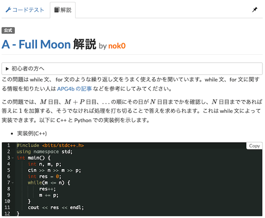

# AtCoder Clans

【非公式】競技プログラミングサイト[AtCoder](https://atcoder.jp/)がもっと楽しくなるリンク集です。有志による非公式サービス・ツール・ライブラリ・記事などをまとめています。

    
    
    
    

  

---

## 特長

* **網羅性が高い**: 初心者から上級者向けの情報まで幅広く掲載しています。
* **最新**: 最新の情報が入手できます。また、[Twitter](https://twitter.com/atcoderclans)で直近1週間の内容をお届けしています。
* **日本語の紹介文**: 日本語で紹介しています。
* **眺めるだけでも楽しい**: サービス・ツールのサムネイルが豊富です。
* **目的に応じて探せる**: 欲しい情報がすぐに探せるように、カテゴリ分けをしています。

## 対象ユーザとメリット

- [AtCoder](https://atcoder.jp/)ユーザ - 困ったことや不便なことが解決できるかもしれません。気になったサービス・ツールなどを使ってみましょう!

- 開発者 - 公開したサービスやツールなどの利用者が増えるだけでなく、ネタ探しや共同開発につながることも期待しています。

- [AtCoder](https://atcoder.jp/)運営チーム - 非公式サービス・ツールの全体像を踏まえ、公式として対応の有無を判断する材料の一つになると思います。また、企業向けの参考資料にもなるかもしれません。

- 企業の採用担当者 - [AtCoder](https://atcoder.jp/)ユーザの実務能力・ポテンシャルの評価材料の一つになると思います。ひいては人材発掘の効率化にも、つながるかもしれません。

---

## 最新情報を確認する

直近1〜2週間の更新状況を掲載しています(ベータ版)。

=== "ボット"

    2023-09-16

    - 「[Bot](bot)」ページ
        - [ほぼ日バチャbot](https://twitter.com/contest_bot_mcc)

=== "ユーザスクリプト"

    2023-09-07

    - 「[解説を読む・テストケースを見る](user_scripts/read_editorials)」ページ
        - [AtCoder Ace Editor Editorial](https://greasyfork.org/ja/scripts/473919-atcoder-ace-editor-editorial)

    

      
    

=== "記事"

    2023-09-17

    - 「[実装テクニックを学ぶ - Python](articles/implementation/python)」ページ
        - [AtCoderの2023新ジャッジで使えるPython標準の便利機能](https://qiita.com/mo124121/items/595358fdcfdc1d2baf2c)
        - [【Python】AtCoderの言語アップデートでの変更点をまとめてみたよ。](https://qiita.com/hyouchun/items/8a830952315666576c3d)

    2023-09-15

    - 「[ヒューリスティック問題を解く](articles/heuristic)」ページ
        - [第10回 Asprova プログラミングコンテスト 参加記 (39.1M; 130位)](https://www.wantedly.com/companies/learningbox/post_articles/538136)

    2023-09-14

    - 「[実装テクニックを学ぶ - Others](articles/implementation/others)」ページ
        - [Zig言語の練習に AtCoder 202308 新ジャッジテストコンテスト A-E を解いてみた](https://qiita.com/hossie/items/080f8d49ec445022284b)

    2023-09-13

    - 「[入門者・初心者向けの内容](articles/introduction)」ページ
        - [日本最大のプログラミングコンテストサイトAtCoder　中高生に特化した学校対抗リーグ「AtCoder Junior League」開催にかける思いとは](https://prtimes.jp/story/detail/zrELeosmk4x)

    - 「[ヒューリスティック問題を解く](articles/heuristic)」ページ
        - [第10回 Asprova プログラミングコンテスト（AtCoder Heuristic Contest 023）参加メモ](https://kaede2020.hatenablog.com/entry/2023/09/10/200121)

    2023-09-12

    - 「[アルゴリズムを学ぶ](articles/algorithm)」ページ
        - [️灰茶向け　ざっくりわかろうDP️](https://twitter.com/burioden/status/1700943044714086469)

    - 「[コンテストに関する統計情報を見る](articles/view_scores)」ページ
        - [AtCoder Junior League 2023 - 学校ランキング (9月11日時点)](https://twitter.com/atcoder/status/1701090985978310979)
        - [AJL 高校部門上位40校 (2023年9月11日時点)](https://twitter.com/kiri8128/status/1701251352075075616)

    2023-09-11

    - 「[部活・サークル・同好会・オンサイトイベントに参加する](articles/club_activities)」ページ
        - [AtCoder World Tour Finals 2022 参加記](https://heno239.hatenablog.com/entry/2023/09/10/133932)
        - [AtCoder WTF 2022 (お手伝いとして参加）](https://maspypy.com/atcoder-wtf-2022-%e3%81%8a%e6%89%8b%e4%bc%9d%e3%81%84%e3%81%a8%e3%81%97%e3%81%a6%e5%8f%82%e5%8a%a0%ef%bc%89)

    2023-09-09

    - 「[部活・サークル・同好会・オンサイトイベントに参加する](articles/club_activities)」ページ
        - [CodeQUEEN2023でスポンサーをしたり優勝したりした話](https://www.forcia.com/blog/002760.html)

    2023-09-08

    - 「[アルゴリズムを学ぶ](articles/algorithm)」ページ
        - [DPの俗称](https://www.mathenachia.blog/dp/)

    2023-09-06

    - 「[競技プログラミングと就転職](articles/jobs)」ページ
        - [フォルシア株式会社のインターンに参加しました](https://qiita.com/rare0b/items/36dfa2fce750b3067e92)

    2023-09-05

    - 「[コンテストに関する統計情報を見る](articles/view_scores)」ページ
        - [AtCoder Junior League 2023 - 学校ランキング (9月4日時点)](https://twitter.com/atcoder/status/1698538878603239785)
        - [継続というのはそれ自体が特異なことなのだと思いながらAtCoder全ユーザのコンテスト参加回数をグラフにしてみた](https://qiita.com/nabata/items/322c30ad3b827b1b508c)

=== "ブログ"
    アルゴリズム部門・ヒューリスティック部門におけるランキング上位の日本人ユーザのブログをまとめています(順不同)。

    2023-09-13

    - 「[ヒューリスティック部門 - C++](blogs/heuristic/cpp)」ページ
        - [mtsd](https://atcoder.jp/users/mtsd)さん - [はてなブログ](https://mtsd-programming.hatenablog.com/)
        - [Shun_PI](https://atcoder.jp/users/Shun_PI)さん - [Qiita](https://qiita.com/Shun_PI)
        - [hogloid](https://atcoder.jp/users/hogloid)さん - [はてなブログ](https://hogloid.hatenablog.com/)

    - 「[ヒューリスティック部門 - Java](blogs/heuristic/java)」ページ
        - [rabot](https://atcoder.jp/users/rabot)さん - [Qiita](https://qiita.com/tanaka-a)

    - 「[ヒューリスティック部門 - Rust](blogs/heuristic/rust)」ページ
        - [sugim48](https://atcoder.jp/users/sugim48)さん - [はてなブログ](https://sugim48.hatenadiary.org/)

    2023-09-10

    - 「[アルゴリズム部門 - C++](blogs/algorithm/cpp)」ページ
        - [k1suxu](https://atcoder.jp/users/k1suxu)さん - [はてなブログ](https://k1suxu.hatenablog.com/)

=== "SNS"

    2023-09-13

    - 「[SNS](sns)」ページ
        - [競プロオンサイト情報！](https://twitter.com/kyopro_onsite)

=== "色変記事"

    色変記事とは、コンテストの参加者が所定のレーティングに到達した喜びをつづった記事のことです。

    2023-09-16

    - 「[レーティング1600〜1999(青色)](milestones/blue)」ページ
        - [hirayuu_At](https://atcoder.jp/users/hirayuu_At)さん - [【AtCoder】現役中学生がPythonで青になったから書いた記事](https://qiita.com/halcyonFX/items/5eeb2240412a1e587bff)

    - 「[レーティング400〜799(茶色)](milestones/brown)」ページ
        - [kunaisn](https://atcoder.jp/users/kunaisn)さん - [AtCoderで茶色になりました](https://sekaishi-beta.com/kunaisn_atcoder_brown/)

    2023-09-12

    - 「[レーティング2400〜2799(橙色)](milestones/orange)」ページ
        - [Yu_212](https://atcoder.jp/users/Yu_212)さん - [【色変記事】AtCoder橙になりました - Yu_212’s diary](https://yu212.hatenablog.com/entry/2023/09/11/025001)

    - 「[レーティング400〜799(茶色)](milestones/brown)」ページ
        - [OtakuMoyashi](https://atcoder.jp/users/OtakuMoyashi)さん - [挫折しかけたけど入茶できた中学生の話。](https://qiita.com/harryp0tterK/items/33ebd57f1b7e2a1a3a9e)

=== "国内外のコンテストサイト"

    2023-09-14

    - 「[情報オリンピック](related_contest_sites/joi_ioi)」ページ
        - [IOI2023 参加記](https://kodaman.hatenablog.com/entry/2023/09/10/160836)

=== "アーカイブス"

    2023-09-10

    - 「[開発・提供終了](archived/no_longer_available)」ページ
        - AtCoderのScoreを見やすくする

    2023-09-07

    - 「[開発・提供終了](archived/no_longer_available)」ページ
        - AtCoder Comfortable Editor

## AtCoder公式グッズを購入する

- [SUZURI](https://suzuri.jp/AtCoder) - [AtCoder](https://atcoder.jp/)のロゴ入りグッズが購入できる。

    

        
    

## 競プロLINEスタンプ・グッズ(非公式)を購入する

- [LINE STORE](https://store.line.me/stickershop/product/22113834/en) - [burioden](https://atcoder.jp/users/burioden)さんが作成・配信している競プロLINEスタンプ(非公式)。[第2弾](https://store.line.me/stickershop/product/22810021/en)、[第3弾](https://store.line.me/stickershop/product/22851268/en)もある。
    - [kyopro-neko](https://github.com/burioden/kyopro-neko)  - 「競プロするねこ」のイラスト集。
    - [SUZURI](https://suzuri.jp/burioden) - 「競プロするねこ」のイラストが書かれたグッズを購入できる。

    

        
    

## 本サービスのスポンサー(敬称略・順不同)

本サービスの開発・運営を応援してくださり、ありがとうございます。

[GitHub Sponsors](https://github.com/sponsors/KATO-Hiro)で寄付していただいた方には、いくつかの特典をご用意しております。

### 🍨 Ice Cream Supporter

- ia7ck
- tomii9273
