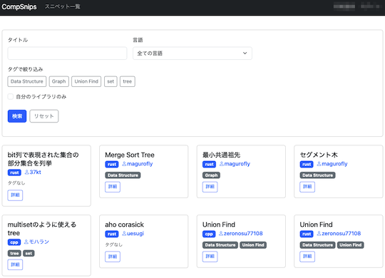
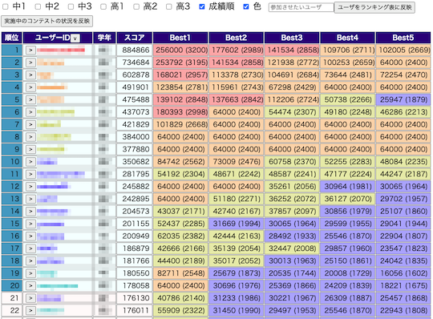
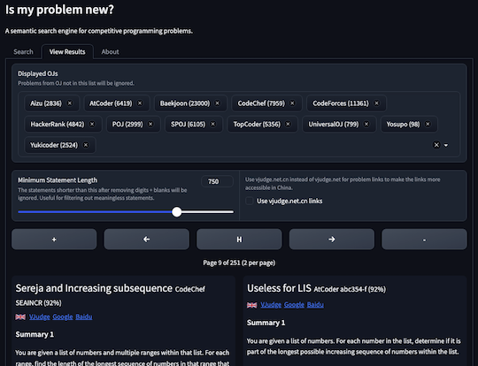
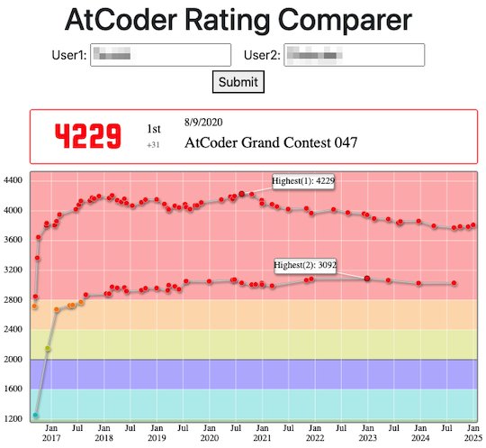

# AtCoder Clans

【非公式】競技プログラミングサイト[AtCoder](https://atcoder.jp/)がもっと楽しくなるリンク集です。有志による非公式サービス・ツール・ライブラリ・記事などをまとめています。

    
    
    
    

  

---

## 特長

* **網羅性が高い**: 初心者から上級者向けの情報まで幅広く掲載しています。
* **最新**: 最新の情報が入手できます。また、[X (旧 Twitter)](https://twitter.com/atcoderclans)で直近1週間の内容をお届けしています。
* **日本語の紹介文**: 日本語で紹介しています。
* **眺めるだけでも楽しい**: サービス・ツールのサムネイルが豊富です。
* **目的に応じて探せる**: 欲しい情報がすぐに探せるように、カテゴリ分けをしています。

## 対象ユーザとメリット

- [AtCoder](https://atcoder.jp/)ユーザ - 困ったことや不便なことが解決できるかもしれません。気になったサービス・ツールなどを使ってみましょう!

- 開発者 - 公開したサービスやツールなどの利用者が増えるだけでなく、ネタ探しや共同開発につながることも期待しています。

- [AtCoder](https://atcoder.jp/)運営チーム - 非公式サービス・ツールの全体像を踏まえ、公式として対応の有無を判断する材料の一つになると思います。また、企業向けの参考資料にもなるかもしれません。

- 企業の採用担当者 - [AtCoder](https://atcoder.jp/)ユーザの実務能力・ポテンシャルの評価材料の一つになると思います。ひいては人材発掘の効率化にも、つながるかもしれません。

---

## 最新情報を確認する

### AtCoder公式

<!-- markdown-link-check-disable -->

- [AtCoderInfo](https://info.atcoder.jp/) - [AtCoder](https://atcoder.jp/)の公式ポータルサイトです。コンテストの参加方法や取り組み方、採用担当者向け情報などが公開されています。

- [AtCoder生成AI対策ルール - 20241206版](https://info.atcoder.jp/entry/llm-rules-ja) - AtCoder Beginner Contest (通称 ABC) および AtCoder Regular Contest (同 ARC)のコンテスト開催中を対象として、生成AIの利用における禁止事項が説明されています ([英語版](https://info.atcoder.jp/entry/llm-rules-en))。
    - [生成AIの技術向上に伴うABCおよびARCにおけるルール変更について](https://atcoder.jp/posts/1347) - 上記のルール変更の背景、作成方針、概要、今後の変更の可能性について言及されています ([英語版](https://atcoder.jp/posts/1350))。
    - [ARCのDivision制に伴うルール変更について](https://atcoder.jp/posts/1368) - ARC の Division制の導入に伴うルールの変更点が紹介されています。

- [ARCのDivision制についての告知](https://atcoder.jp/posts/1364) - ARC189以降、AtCoder Regular Contest (通称 ARC) は難易度の異なる2種類のコンテストに分けられることが告知されています。

- [【重要なお知らせ】AtCoderを騙る偽サイトにご注意ください](https://atcoder.jp/posts/1268) - [AtCoder](https://atcoder.jp/)の偽サイトへのアクセス・ログインなどをしないように注意喚起している記事です。
- [AtCoderアカウントのパスワード管理について](https://atcoder.jp/posts/1366) - 不正アクセス防止のため、[AtCoder](https://atcoder.jp/)アカウントのパスワード確認・必要に応じて変更を促しています。

<!-- markdown-link-check-enable -->

### 非公式サービス・ツール・ライブラリ・記事など

直近1〜2週間の更新状況を掲載しています(ベータ版)。

=== "Webアプリ・Webサイト"

    2025-01-05

    - 「[問題を解く](web_app/solve_problems)」ページ
        - [CompSnips](https://compsnips.zeronosu77108.com/)

    

      
    

    2025-01-04

    - 「[コンテストの成績に関連するサービス](web_app/services_using_scores)」ページ
        - [AtCoder Junior League (AJL）のスコア予測ツール](https://kfrom40.github.io/)

    

      
    

    2025-01-03

    - 「[問題作成者向けの情報](web_app/for_writers)」ページ
        - [Is my problem new?](http://yuantiji.ac/en/)

    

      
    

    2025-01-01

    - 「[コンテストの成績を見る](web_app/view_and_compare_scores)」ページ
        - [AtCoder Rating Comparer](https://atcoderratingcomparer.onrender.com/)

    

      
    

=== "記事"

    2025-01-06

    - 「[コンテストに関する統計情報を見る](articles/view_scores)」ページ
        - [AtCoder Junior League 2024 Winter - 学校ランキング (2025年1月6日時点)](https://x.com/atcoder/status/1876085047893389331)

    2025-01-02

    - 「[実装テクニックを学ぶ - 複数の言語](articles/implementation/multiple_languages)」ページ
        - [誤差に対して祈ることしかできない人かわいそう](https://rsk0315.hatenablog.com/entry/2024/12/28/151905)

    2024-12-30

    - 「[数学を学ぶ](articles/math)」ページ
        - [グリッドの最短経路の数え上げまとめ](https://kanpurin.hatenablog.com/entry/2021/09/15/220913)

    2024-12-29

    - 「[コンテストに関する統計情報を見る](articles/view_scores)」ページ
        - [AHCの新ratingのお知らせ](https://atcoder.jp/posts/1380)
        - [AHCレーティングver.2の計算スクリプト](https://gist.github.com/terry-u16/0901a3e8f4119ee58ed9d8817a423b6f)

    2024-12-24

    - 「[コンテストに関する統計情報を見る](articles/view_scores)」ページ
        - [AtCoder Junior League 2024 Winter - 学校ランキング (12月24日時点)](https://x.com/atcoder/status/1871385196383375665)

    2024-12-23

    - 「[入門者・初心者向けの内容](articles/introduction)」ページ
        - [楽しい競技プログラミングの世界](https://drive.google.com/file/d/1Vu1_9VzPhMjiVKfJvCPUhmXBbkywG6co)

=== "色変記事"

    色変記事とは、コンテストの参加者が所定のレーティングに到達した喜びをつづった記事(動画も含む)のことです。

    2025-01-01

    - 「[レーティング1200〜1599(水色)](milestones/cyan)」ページ
        - [kojyasu](https://atcoder.jp/users/kojyasu)さん - [子育てしながらAtCoder水色になりました。](https://note.com/kojyasu/n/nfcba254b9974)

    2024-12-31

    - 「[レーティング1200〜1599(水色)](milestones/cyan)」ページ
        - [KA37RI](https://atcoder.jp/users/KA37RI)さん - [AtCoderにて水色に到達しました（入水記事）](https://note.com/ka37ri/n/na3937d3996f4)

    2024-12-28

    - 「[レーティング2000〜2399(黄色)](milestones/yellow)」ページ
        - [hirakuuuu](https://atcoder.jp/users/hirakuuuu)さん - [AtCoder黄色になりました](https://www.jackapp.jp/blog/d7384dc1-260e-4748-9bb8-bdb648f6f5fa)

    2024-12-27

    - 「[レーティング800〜1199(緑色)](milestones/green)」ページ
        - [Yuulis](https://atcoder.jp/users/Yuulis)さん - [【色変記事】AtCoderで入緑したのでこれまでの軌跡を振り返る - Yuulis.log](https://yuulis.hatenablog.com/entry/atc-green)

    2024-12-26

    - 「[レーティング2000〜2399(黄色)](milestones/yellow)」ページ
        - [blueberry1001](https://atcoder.jp/users/blueberry1001)さん - [【Atcoder】高校2年生でAtcoder黄色になりました](https://qiita.com/bluebery1001/items/3253399ebf287e197346)

=== "国内外のコンテストサイト"

    2024-12-25

    - 「[ICPC (国際大学対抗プログラミングコンテスト)](related_contest_sites/icpc)」ページ
        - [ICPC 2024 横浜大会参加記](https://e869120.hatenablog.com/entry/2024/12/25/124746)

=== "アーカイブス"

    諸事情により提供・開発が終了した(と思われる)サービス・ツールなどに対して、感謝や敬意を表するため掲載しています。

    2025-01-02

    - AtCoder Find Rivals

## AtCoder公式グッズを購入する

- [SUZURI](https://suzuri.jp/AtCoder) - [AtCoder](https://atcoder.jp/)のロゴ入りグッズが購入できる。

    

        
    

## 競プロLINEスタンプ・グッズ(非公式)を購入する

- [LINE STORE](https://store.line.me/stickershop/product/22113834/en) - [burioden](https://atcoder.jp/users/burioden)さんが作成・配信している競プロLINEスタンプ(非公式)。[第2弾](https://store.line.me/stickershop/product/22810021/en)、[第3弾](https://store.line.me/stickershop/product/22851268/en)、[第4弾](https://store.line.me/stickershop/product/25256215/en)もある。
    - [kyopro-neko](https://github.com/burioden/kyopro-neko)  - 「競プロするねこ」のイラスト集。
        - [アドバイスするねこ](https://github.com/burioden/kyopro-neko/tree/main/advice_neko) - 同キャラクターが、さまざまなアドバイスをしてくれる。
    - [SUZURI](https://suzuri.jp/burioden) - 「競プロするねこ」のイラストが書かれたグッズを購入できる。

    

        
    

## 本サービスのスポンサー(敬称略・順不同)

本サービスの開発・運営を応援してくださり、ありがとうございます。

[GitHub Sponsors](https://github.com/sponsors/KATO-Hiro)で寄付していただいた方には、いくつかの特典をご用意しております。

### 💚 AtCoder Clans Sponsor

- [chokudai](https://github.com/chokudai)

### 🌐 Domain Supporter

- [KoyanagiHitoshi](https://github.com/KoyanagiHitoshi)

### 🍨 Ice Cream Supporter

- ia7ck
- tomii9273
- toshi201

### 🙂 Special Supporter

- otsuneko
- yunix-kyopro
