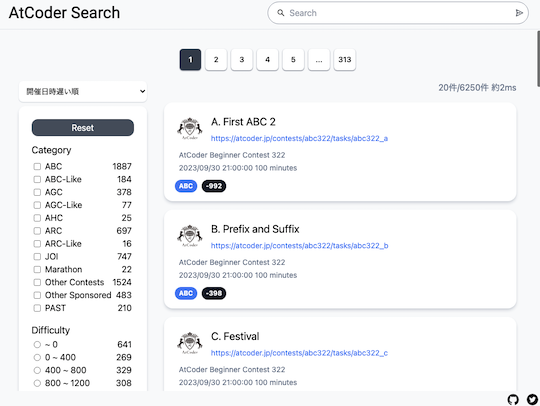
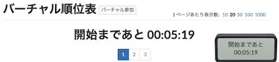

# AtCoder Clans

【非公式】競技プログラミングサイト[AtCoder](https://atcoder.jp/)がもっと楽しくなるリンク集です。有志による非公式サービス・ツール・ライブラリ・記事などをまとめています。

    
    
    
    

  

---

## 特長

* **網羅性が高い**: 初心者から上級者向けの情報まで幅広く掲載しています。
* **最新**: 最新の情報が入手できます。また、[Twitter](https://twitter.com/atcoderclans)で直近1週間の内容をお届けしています。
* **日本語の紹介文**: 日本語で紹介しています。
* **眺めるだけでも楽しい**: サービス・ツールのサムネイルが豊富です。
* **目的に応じて探せる**: 欲しい情報がすぐに探せるように、カテゴリ分けをしています。

## 対象ユーザとメリット

- [AtCoder](https://atcoder.jp/)ユーザ - 困ったことや不便なことが解決できるかもしれません。気になったサービス・ツールなどを使ってみましょう!

- 開発者 - 公開したサービスやツールなどの利用者が増えるだけでなく、ネタ探しや共同開発につながることも期待しています。

- [AtCoder](https://atcoder.jp/)運営チーム - 非公式サービス・ツールの全体像を踏まえ、公式として対応の有無を判断する材料の一つになると思います。また、企業向けの参考資料にもなるかもしれません。

- 企業の採用担当者 - [AtCoder](https://atcoder.jp/)ユーザの実務能力・ポテンシャルの評価材料の一つになると思います。ひいては人材発掘の効率化にも、つながるかもしれません。

---

## 最新情報を確認する

直近1〜2週間の更新状況を掲載しています(ベータ版)。

=== "ホーム"

    2023-10-12

    本サービスのスポンサーを掲載(敬称略)。ご支援いただき、ありがとうございます。

    - [toshi201](https://github.com/toshi201)

=== "Webアプリ・Webサイト"

    2023-10-07

    - 「[開発者向けの情報](web_app/for_developers)」ページ
        - [RustでAtCoderのログイン認証を通す](https://qiita.com/ppputtyo/items/e724f68eeb912b00290d)

    2023-10-04

    - 「[問題を解く](web_app/solve_problems)」ページ
        - [AtCoder Search](https://atcoder-search.fjnkt98.com/)

    

      
    

=== "ユーザスクリプト"

    2023-10-09

    - 「[コンテストに参加する](user_scripts/participate_in_contests)」ページ
        - [AtCoderVirtualTimer](https://greasyfork.org/ja/scripts/476928-atcodervirtualtimer)

    

      
    

=== "記事"

    2023-10-13

    - 「[実装テクニックを学ぶ - Others](articles/implementation/others)」ページ
        - [Go言語による各種データ構造の扱い方(やや競プロer向け)](https://zenn.dev/smartshopping/articles/5feb3666ba40b2)

    2023-10-12

    - 「[部活・サークル・同好会・オンサイトイベントに参加する](articles/club_activities)」ページ
        - [社内ヒューリスティックコンテスト@アルゴ合宿2023 開催レポート](https://media.algo-artis.com/posts/bN4vP1cR)

    2023-10-11

    - 「[ヒューリスティック問題を解く](articles/heuristic)」ページ
        - [rhooさんによるヒューリスティックコンテストの汎用テクニック集](https://github.com/rhoo19937/p/blob/main/tech/.md)

    - 「[コンテストに関する統計情報を見る](articles/view_scores)」ページ
        - [AJL 高校部門上位40校 (10月10日時点)](https://twitter.com/kiri8128/status/1711744359920812511)

    2023-10-10

    - 「[コンテストに関する統計情報を見る](articles/view_scores)」ページ
        - [AtCoder Junior League 2023 - 学校ランキング (10月10日時点)](https://twitter.com/atcoder/status/1711587000539853082)

    2023-10-09

    - 「[コードを書くための環境構築を行う](articles/development_env)」ページ
        - [【必見】Rust 競プロ環境を一撃で構築する方法を紹介します。](https://www.youtube.com/watch?v=GO5JE7g7AUE)

    2023-10-07

    - 「[コンテストに関する統計情報を見る](articles/view_scores)」ページ
        - [AtCoderのレート計算式](https://qiita.com/anqooqie/items/92005e337a0d2569bdbd)
        - [【日本語翻訳】Atcoderレーティングの計算](https://qiita.com/karutetto332/items/42c5d710de0b0545cd57)

    2023-10-06

    - 「[アルゴリズムを学ぶ](articles/algorithm)」ページ
        - [【競プロ】緑〜水のためのSegmentTree超入門](https://qiita.com/ZOI_dayo/items/f53122c831be78c695bc)

    2023-10-05

    - 「[ヒューリスティック問題を解く](articles/heuristic)」ページ
        - [焼きなまし法での評価関数の打ち切り](https://qiita.com/not522/items/cd20b87157d15850d31c)

    2023-10-03

    - 「[コードを書くための環境構築を行う](articles/development_env)」ページ
        - [Dockerを使ってAtCoder用のPHPのPHP Unitでテストの自動化とxdebugでデバッグをする環境を構築する](https://qiita.com/yami-yami/items/dde58544c954e00b5c3c)

    2023-10-02

    - 「[コンテストに関する統計情報を見る](articles/view_scores)」ページ
        - [AtCoder Junior League 2023 - 学校ランキング (10月2日時点)](https://twitter.com/atcoder/status/1708694473100886405)

    2023-10-01

    - 「[数学を学ぶ](articles/math)」ページ
        - [誰でもなんとなく理解できる形式的冪級数](https://qiita.com/Michirakara/items/9f1080e389300ca6eb86)

=== "ブログ"
    アルゴリズム部門・ヒューリスティック部門におけるランキング上位の日本人ユーザのブログをまとめています(順不同)。

    2023-10-08

    - 「[アルゴリズム部門 - C++](blogs/algorithm/cpp)」ページ
        - [leaf1415](https://atcoder.jp/users/leaf1415)さん - [はてなブログ](https://leaf1415.hatenablog.com/)

=== "動画"

    2023-10-11

    - 「[YouTube - チャンネル](youtube/channel)」ページ
        - [blueberry1001](https://www.youtube.com/@blueberry-1001/featured)

=== "色変記事"

    色変記事とは、コンテストの参加者が所定のレーティングに到達した喜びをつづった記事のことです。

    2023-10-10

    - 「[レーティング1200〜1599(水色)](milestones/cyan)」ページ
        - [yu7400ki](https://atcoder.jp/users/yu7400ki)さん - [【AtCoder】一年と半年、水色になりました。](https://zenn.dev/yu7400ki/articles/bea3e57ac34de1)

    2023-10-08

    - 「[レーティング1200〜1599(水色)](milestones/cyan)」ページ
        - [Toncochan](https://atcoder.jp/users/Toncochan)さん - [AtCoder入水記事！！](https://qiita.com/Toncochan/items/a131519f7431f9da0882)

## AtCoder公式グッズを購入する

- [SUZURI](https://suzuri.jp/AtCoder) - [AtCoder](https://atcoder.jp/)のロゴ入りグッズが購入できる。

    

        
    

## 競プロLINEスタンプ・グッズ(非公式)を購入する

- [LINE STORE](https://store.line.me/stickershop/product/22113834/en) - [burioden](https://atcoder.jp/users/burioden)さんが作成・配信している競プロLINEスタンプ(非公式)。[第2弾](https://store.line.me/stickershop/product/22810021/en)、[第3弾](https://store.line.me/stickershop/product/22851268/en)もある。
    - [kyopro-neko](https://github.com/burioden/kyopro-neko)  - 「競プロするねこ」のイラスト集。
    - [SUZURI](https://suzuri.jp/burioden) - 「競プロするねこ」のイラストが書かれたグッズを購入できる。

    

        
    

## 本サービスのスポンサー(敬称略・順不同)

本サービスの開発・運営を応援してくださり、ありがとうございます。

[GitHub Sponsors](https://github.com/sponsors/KATO-Hiro)で寄付していただいた方には、いくつかの特典をご用意しております。

### 🍨 Ice Cream Supporter

- ia7ck
- tomii9273
- toshi201
