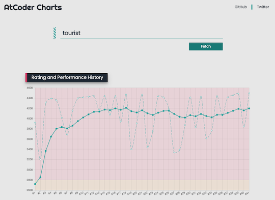
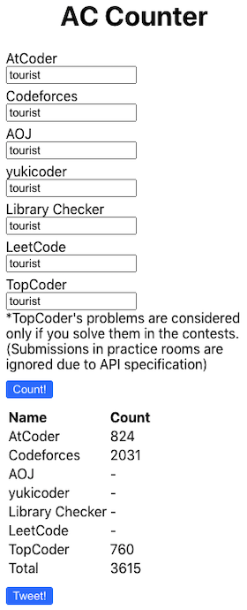
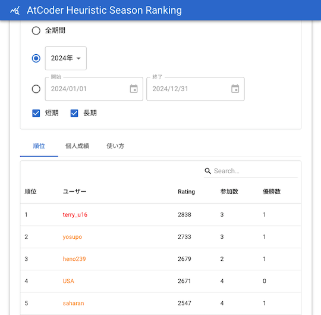

# AtCoder Clans

【非公式】競技プログラミングサイト[AtCoder](https://atcoder.jp/)がもっと楽しくなるリンク集です。有志による非公式サービス・ツール・ライブラリ・記事などをまとめています。

    
    
    
    

  

---

## 特長

* **網羅性が高い**: 初心者から上級者向けの情報まで幅広く掲載しています。
* **最新**: 最新の情報が入手できます。また、[X (旧 Twitter)](https://twitter.com/atcoderclans)で直近1週間の内容をお届けしています。
* **日本語の紹介文**: 日本語で紹介しています。
* **眺めるだけでも楽しい**: サービス・ツールのサムネイルが豊富です。
* **目的に応じて探せる**: 欲しい情報がすぐに探せるように、カテゴリ分けをしています。

## 対象ユーザとメリット

- [AtCoder](https://atcoder.jp/)ユーザ - 困ったことや不便なことが解決できるかもしれません。気になったサービス・ツールなどを使ってみましょう!

- 開発者 - 公開したサービスやツールなどの利用者が増えるだけでなく、ネタ探しや共同開発につながることも期待しています。

- [AtCoder](https://atcoder.jp/)運営チーム - 非公式サービス・ツールの全体像を踏まえ、公式として対応の有無を判断する材料の一つになると思います。また、企業向けの参考資料にもなるかもしれません。

- 企業の採用担当者 - [AtCoder](https://atcoder.jp/)ユーザの実務能力・ポテンシャルの評価材料の一つになると思います。ひいては人材発掘の効率化にも、つながるかもしれません。

---

## 最新情報を確認する

### AtCoder公式

<!-- markdown-link-check-disable -->

- [AtCoderInfo](https://info.atcoder.jp/) - [AtCoder](https://atcoder.jp/)の公式ポータルサイトです。コンテストの参加方法や取り組み方、採用担当者向け情報などが公開されています。

<!-- markdown-link-check-enable -->

### 非公式サービス・ツール・ライブラリ・記事など

直近1〜2週間の更新状況を掲載しています(ベータ版)。

=== "Webアプリ・Webサイト"

    2024-05-07

    - 「[コンテストの成績を見る](web_app/view_and_compare_scores)」ページ
        - [AtCoder Charts](https://atcoder-charts.netlify.app/)

    

      
    

    2024-04-30

    - 「[コンテストに関する統計情報](web_app/statistics)」ページ
        - [AC Counter](https://ac-counter.onrender.com)

    

      
    

    2024-04-29

    - 「[コンテストの成績に関連するサービス](web_app/services_using_scores)」ページ
        - [AtCoder Heuristic Season Ranking](https://ahc-season-ranking.terry-u16.net/)

    

      
    

    2024-04-26

    - 「[問題を解くときの補助ツール](web_app/support_tools)」ページ
        - [検索エンジン集](https://magurofly.github.io/tools/search)

    

      
    

=== "記事"

    2024-05-06

    - 「[実装テクニックを学ぶ - Python](articles/implementation/python)」ページ
        - [Python 高速化選手権](https://qiita.com/n4mlz/items/fbadc02b7864f62b9622)

    - 「[数学を学ぶ](articles/math)」ページ
        - [エラトステネスの篩の高速化](https://qiita.com/peria/items/a4ff4ddb3336f7b81d50)

    2024-05-05

    - 「[アルゴリズムを学ぶ](articles/algorithm)」ページ
        - [一次方程式をUnionFindに乗せる　〜dsu_equationを作ろう〜](https://qiita.com/nouka28/items/a7cf4bb7130a541e97fb)

    2024-05-04

    - 「[実装テクニックを学ぶ - Python](articles/implementation/python)」ページ
        - [競プロでよく使うけど空で書けないフレーズ](https://qiita.com/do_an/items/e5a202cac4fc69fe849d)

    2024-05-03

    - 「[実装テクニックを学ぶ - Python](articles/implementation/python)」ページ
        - [大きい方/小さい方からtopKを管理しながらなんかやるモジュールを書いた](https://prd-xxx.hateblo.jp/entry/2024/05/01/235922)

    2024-04-24

    - 「[ヒューリスティック問題を解く](articles/heuristic)」ページ
        - [いま、ここにしかない、出会い。(AtCoder 第一回マスターズ選手権 -決勝- で五位入賞しました。)](https://tsukammo.hatenablog.com/entry/2024/04/21/161831)
        - [第一回マスターズ参加記](https://amentorimaru.hatenablog.com/entry/2024/04/21/034648)

    2024-04-23

    - 「[コンテストに関する統計情報を見る](articles/view_scores)」ページ
        - [AtCoder Junior League 2024 Summer - 学校ランキング (4月22日時点)](https://twitter.com/atcoder/status/1782249854766546993)

=== "ブログ"
    アルゴリズム部門・ヒューリスティック部門におけるランキング上位の日本人ユーザのブログをまとめています(順不同)。

    2024-05-05

    - 「[アルゴリズム部門 - C++](blogs/algorithm/cpp)」ページ
        - [cled0328](https://atcoder.jp/users/cled0328)さん - [はてなブログ](https://cled0328.hatenablog.com/)

    - 「[アルゴリズム部門 - Python](blogs/algorithm/python)」ページ
        - [Thinkingpegasus](https://atcoder.jp/users/Thinkingpegasus)さん - [Qiita](https://qiita.com/nouka28)

    2024-04-28

    - 「[アルゴリズム部門 - C++](blogs/algorithm/cpp)」ページ
        - [new_textfile](https://atcoder.jp/users/new_textfile)さん - [はてなブログ](https://new-textfile.hatenablog.com/)
        - [onsen_manjuuu](https://atcoder.jp/users/onsen_manjuuu)さん - [自作ブログ](https://onsen-manjuuu.net/blog/index.html)

=== "動画"

    2024-04-30

    - 「[YouTube - チャンネル](youtube/channel)」ページ
        - [forループ](https://www.youtube.com/@for_i_in_loop)

    2024-04-27

    - 「[YouTube - チャンネル](youtube/channel)」ページ
        - [AngrySadEight](https://www.youtube.com/@AngrySadEight)

    - 「[YouTube - 個別の動画](youtube/video)」ページ
        - [半分全列挙を「高速化」する【ゆっくり解説】](https://www.youtube.com/watch?v=EUZX4tBqo0M)

=== "色変記事"

    色変記事とは、コンテストの参加者が所定のレーティングに到達した喜びをつづった記事(動画も含む)のことです。

    2024-05-07

    - 「[アルゴリズム部門 - レーティング2000〜2399(黄色)](milestones/yellow)」ページ
        - [Thinkingpegasus](https://atcoder.jp/users/Thinkingpegasus)さん - [AtCoderで入黄しました！！](https://qiita.com/nouka28/items/a8b06865331838642ff2)

    2024-05-02

    - 「[アルゴリズム部門 - レーティング800〜1199(緑色)](milestones/green)」ページ
        - [Alumite14](https://atcoder.jp/users/Alumite14)さん - [【色変記事】PythonメインでAtCoder入緑したので振り返り（スニペットもあるよ）](https://qiita.com/alumite14/items/649aa426bc1b72e5de84)

    2024-05-01

    - 「[アルゴリズム部門 - レーティング2000〜2399(黄色)](milestones/yellow)」ページ
        - [onsen_manjuuu](https://atcoder.jp/users/onsen_manjuuu)さん - [AtCoder黄色になったよ](https://onsen-manjuuu.net/blog/posts/yellow.html)

    2024-04-25

    - 「[アルゴリズム部門 - レーティング800〜1199(緑色)](milestones/green)」ページ
        - [dhirabayashi](https://atcoder.jp/users/dhirabayashi)さん - [AtCoderでぴったり入緑したので、落ちないうちに色変記事を書かせてくださいお願いします](https://qiita.com/dhirabayashi/items/ae3a685140d1910747a9)

=== "国内外のコンテストサイト"

    2024-05-03

    - 「[ICPC (国際大学対抗プログラミングコンテスト)](related_contest_sites/icpc)」ページ
        - [ICPC 2023 世界大会参加記](https://e869120.hatenablog.com/entry/2024/05/01/165143)

## AtCoder公式グッズを購入する

- [SUZURI](https://suzuri.jp/AtCoder) - [AtCoder](https://atcoder.jp/)のロゴ入りグッズが購入できる。

    

        
    

## 競プロLINEスタンプ・グッズ(非公式)を購入する

- [LINE STORE](https://store.line.me/stickershop/product/22113834/en) - [burioden](https://atcoder.jp/users/burioden)さんが作成・配信している競プロLINEスタンプ(非公式)。[第2弾](https://store.line.me/stickershop/product/22810021/en)、[第3弾](https://store.line.me/stickershop/product/22851268/en)、[第4弾](https://store.line.me/stickershop/product/25256215/en)もある。
    - [kyopro-neko](https://github.com/burioden/kyopro-neko)  - 「競プロするねこ」のイラスト集。
    - [SUZURI](https://suzuri.jp/burioden) - 「競プロするねこ」のイラストが書かれたグッズを購入できる。

    

        
    

## 本サービスのスポンサー(敬称略・順不同)

本サービスの開発・運営を応援してくださり、ありがとうございます。

[GitHub Sponsors](https://github.com/sponsors/KATO-Hiro)で寄付していただいた方には、いくつかの特典をご用意しております。

### 💚 AtCoder Clans Sponsor

- [chokudai](https://github.com/chokudai)

### 🌐 Domain Supporter

- [KoyanagiHitoshi](https://github.com/KoyanagiHitoshi)

### 🍨 Ice Cream Supporter

- ia7ck
- tomii9273
- toshi201

### 🙂 Special Supporter

- otsuneko
