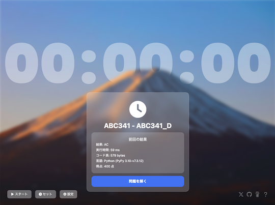
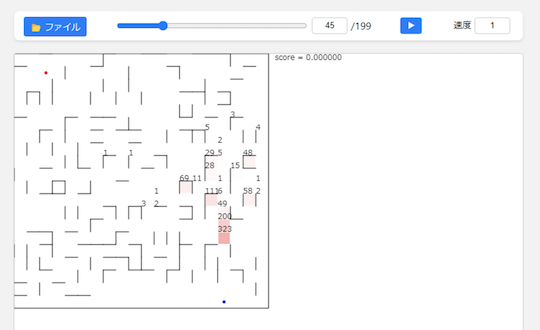
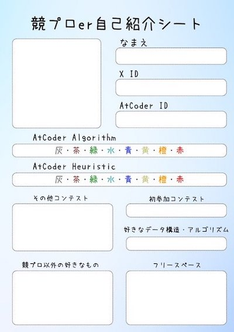
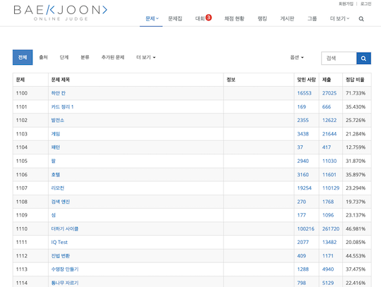
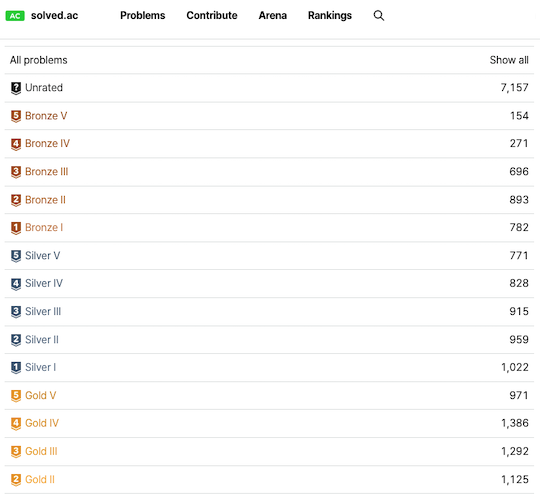

# AtCoder Clans

【非公式】競技プログラミングサイト[AtCoder](https://atcoder.jp/)がもっと楽しくなるリンク集です。有志による非公式サービス・ツール・ライブラリ・記事などをまとめています。

    
    
    
    

  

---

## 特長

* **網羅性が高い**: 初心者から上級者向けの情報まで幅広く掲載しています。
* **最新**: 最新の情報が入手できます。また、[X (旧 Twitter)](https://twitter.com/atcoderclans)で直近1週間の内容をお届けしています。
* **日本語の紹介文**: 日本語で紹介しています。
* **眺めるだけでも楽しい**: サービス・ツールのサムネイルが豊富です。
* **目的に応じて探せる**: 欲しい情報がすぐに探せるように、カテゴリ分けをしています。

## 対象ユーザとメリット

- [AtCoder](https://atcoder.jp/)ユーザ - 困ったことや不便なことが解決できるかもしれません。気になったサービス・ツールなどを使ってみましょう!

- 開発者 - 公開したサービスやツールなどの利用者が増えるだけでなく、ネタ探しや共同開発につながることも期待しています。

- [AtCoder](https://atcoder.jp/)運営チーム - 非公式サービス・ツールの全体像を踏まえ、公式として対応の有無を判断する材料の一つになると思います。また、企業向けの参考資料にもなるかもしれません。

- 企業の採用担当者 - [AtCoder](https://atcoder.jp/)ユーザの実務能力・ポテンシャルの評価材料の一つになると思います。ひいては人材発掘の効率化にも、つながるかもしれません。

---

## 最新情報を確認する

### AtCoder公式

<!-- markdown-link-check-disable -->

- [AtCoderInfo](https://info.atcoder.jp/) - [AtCoder](https://atcoder.jp/)の公式ポータルサイトです。コンテストの参加方法や取り組み方、採用担当者向け情報などが公開されています。

<!-- markdown-link-check-enable -->

### 非公式サービス・ツール・ライブラリ・記事など

直近1〜2週間の更新状況を掲載しています(ベータ版)。

=== "Webアプリ・Webサイト"

    2024-03-06

    - 「[問題を解く](web_app/solve_problems)」ページ
        - [Atcoder Clock](https://clock.zuk246.net/)

    

      
    

    2024-03-01

    - 「[問題を解くときの補助ツール](web_app/support_tools)」ページ
        - [p5visualizer](https://github.com/shindannin/p5visualizer) 

    

      
    

=== "記事"

    2024-03-07

    - 「[ヒューリスティック問題を解く](articles/heuristic)」ページ
        - [第一回マスターズ選手権予選・参加記](https://medium.com/karakuri/%E7%AC%AC%E4%B8%80%E5%9B%9E%E3%83%9E%E3%82%B9%E3%82%BF%E3%83%BC%E3%82%BA%E4%BA%88%E9%81%B8-%E5%8F%82%E5%8A%A0%E8%A8%98-8f605012aa4a)

    2024-03-03

    - 「[部活・サークル・同好会・オンサイトイベントに参加する](articles/club_activities)」ページ
        - [競プロer自己紹介シート](https://twitter.com/deuteridayodayo/status/1763197371704631355)

    

      
    

    2024-02-29

    - 「[実装テクニックを学ぶ - 複数の言語](articles/implementation/multiple_languages)」ページ
        - [浮動小数点型の算術とお近づきになりたい人向けの記事](https://rsk0315.hatenablog.com/entry/2024/02/25/231237)

    2024-02-28

    - 「[ヒューリスティック問題を解く](articles/heuristic)」ページ
        - [相互情報量を学んでもっとうまくAHC030を解こう！](https://qiita.com/aplysia/items/29a4fb4573fc1b8dec79)

=== "ブログ"
    アルゴリズム部門・ヒューリスティック部門におけるランキング上位の日本人ユーザのブログをまとめています(順不同)。

    2024-03-06

    - 「[アルゴリズム部門 - C++](blogs/heuristic/cpp)」ページ

        - [karinohito](https://atcoder.jp/users/karinohito)さん - [はてなブログ](https://karinohito.hatenablog.com)

        - [MtSaka](https://atcoder.jp/users/MtSaka)さん - [はてなブログ](https://mt-saka.hatenablog.com)

        - [Slephy](https://atcoder.jp/users/Slephy)さん - [Qiita](https://qiita.com/Slephy)

    - 「[ヒューリスティック部門 - C++](blogs/heuristic/cpp)」ページ
        - [RinSakamichi](https://atcoder.jp/users/RinSakamichi)さん - [GitHub Pages](https://rinsakamichi.github.io/)

        - [sky58](https://atcoder.jp/users/sky58)さん - [はてなブログ](https://topcoder-g-hatena-ne-jp.jag-icpc.org/skyaozora/)

    - 「[ヒューリスティック部門 - Rust](blogs/heuristic/rust)」ページ
        - [xyz600](https://atcoder.jp/users/xyz600)さん - [はてなブログ](https://xyz600.hatenablog.com/)

        - [Kyo_s_s](https://atcoder.jp/users/Kyo_s_s)さん - [自作ブログ](https://kyo-homepage.vercel.app/blog)

=== "書籍"

    2024-03-05

    - 「[書籍](books)」ページ
        - [アルゴリズムの乙女たち](https://www.amazon.co.jp/dp/4198949344)

=== "動画"

    2024-03-10

    - 「[YouTube - 個別の動画](youtube/video)」ページ
        - [100÷9899=?（母関数・形式的べき級数入門）【ゆっくり解説】](https://www.youtube.com/watch?v=I02Obi-yXJU)

=== "ライブラリ・スニペット"

    2024-02-27

    - 「[C++](libraries/cpp)」ページ
        - [tatyam-prime/ICPC_notebook](https://github.com/tatyam-prime/ICPC_notebook) 

=== "色変記事"

    色変記事とは、コンテストの参加者が所定のレーティングに到達した喜びをつづった記事のことです。

    2024-03-11

    - 「[アルゴリズム部門 - レーティング800〜1199(緑色)](milestones/green)」ページ
        - [trkwm](https://atcoder.jp/users/trkwm)さん - [[AtCoder]入緑しました！競プロ始める前~入緑までの道のり](https://qiita.com/Cecil_Ha/items/ee8b3620c87b255cf085)

    2024-03-09

    - 「[アルゴリズム部門 - レーティング1200〜1599(水色)](milestones/cyan)」ページ
        - [Zoi2](https://atcoder.jp/users/Zoi2)さん - [【色変記事】AtCoderで入水した話 by ZOI2](https://qiita.com/ZOI2/items/9acafc4153356765721a)

    2024-02-26

    - 「[アルゴリズム部門 - レーティング1200〜1599(水色)](milestones/cyan)」ページ
        - [cyan0515](https://atcoder.jp/users/cyan0515)さん - [cyan が AtCoder で cyan になるまで](https://cyan515.github.io/blogs/records_of_activities/cyan_%E3%81%8C_AtCoder_%E3%81%A7_cyan_%E3%81%AB%E3%81%AA%E3%82%8B%E3%81%BE%E3%81%A7.html)
        - [RinaX](https://atcoder.jp/users/RinaX)さん - [AtCoder 入水までにやったこと 【Tier形式】](https://note.com/yokoyama_inf/n/nfaea395c71a3)
        - [uta_ccc](https://atcoder.jp/users/uta_ccc)さん - [【色変記事】入水しました - 競プロ日記他](https://utac.hateblo.jp/entry/2024/02/25/223132)

=== "国内外のコンテストサイト"

    2024-03-08

    - 「[BOJ (Baekjoon Online Judge)](related_contest_sites/boj)」ページ

        - [Baekjoon Online Judge](https://www.acmicpc.net/)

        - [solved.ac](https://solved.ac/en)

    

      
    

    

      
    

## AtCoder公式グッズを購入する

- [SUZURI](https://suzuri.jp/AtCoder) - [AtCoder](https://atcoder.jp/)のロゴ入りグッズが購入できる。

    

        
    

## 競プロLINEスタンプ・グッズ(非公式)を購入する

- [LINE STORE](https://store.line.me/stickershop/product/22113834/en) - [burioden](https://atcoder.jp/users/burioden)さんが作成・配信している競プロLINEスタンプ(非公式)。[第2弾](https://store.line.me/stickershop/product/22810021/en)、[第3弾](https://store.line.me/stickershop/product/22851268/en)、[第4弾](https://store.line.me/stickershop/product/25256215/en)もある。
    - [kyopro-neko](https://github.com/burioden/kyopro-neko)  - 「競プロするねこ」のイラスト集。
    - [SUZURI](https://suzuri.jp/burioden) - 「競プロするねこ」のイラストが書かれたグッズを購入できる。

    

        
    

## 本サービスのスポンサー(敬称略・順不同)

本サービスの開発・運営を応援してくださり、ありがとうございます。

[GitHub Sponsors](https://github.com/sponsors/KATO-Hiro)で寄付していただいた方には、いくつかの特典をご用意しております。

### 💚 AtCoder Clans Sponsor

- [chokudai](https://github.com/chokudai)

### 🍨 Ice Cream Supporter

- ia7ck
- tomii9273
- toshi201

### 🙂 Special Supporter

- otsuneko
