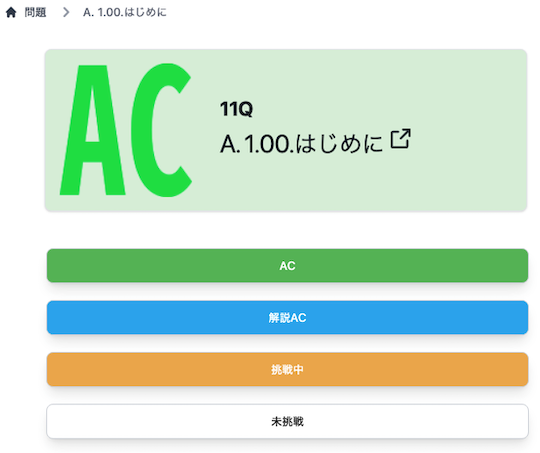
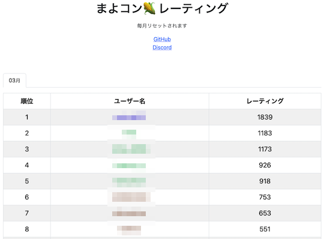
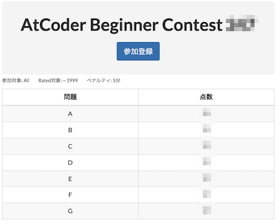

# AtCoder Clans

【非公式】競技プログラミングサイト[AtCoder](https://atcoder.jp/)がもっと楽しくなるリンク集です。有志による非公式サービス・ツール・ライブラリ・記事などをまとめています。

    
    
    
    

  

---

## 特長

* **網羅性が高い**: 初心者から上級者向けの情報まで幅広く掲載しています。
* **最新**: 最新の情報が入手できます。また、[X (旧 Twitter)](https://twitter.com/atcoderclans)で直近1週間の内容をお届けしています。
* **日本語の紹介文**: 日本語で紹介しています。
* **眺めるだけでも楽しい**: サービス・ツールのサムネイルが豊富です。
* **目的に応じて探せる**: 欲しい情報がすぐに探せるように、カテゴリ分けをしています。

## 対象ユーザとメリット

- [AtCoder](https://atcoder.jp/)ユーザ - 困ったことや不便なことが解決できるかもしれません。気になったサービス・ツールなどを使ってみましょう!

- 開発者 - 公開したサービスやツールなどの利用者が増えるだけでなく、ネタ探しや共同開発につながることも期待しています。

- [AtCoder](https://atcoder.jp/)運営チーム - 非公式サービス・ツールの全体像を踏まえ、公式として対応の有無を判断する材料の一つになると思います。また、企業向けの参考資料にもなるかもしれません。

- 企業の採用担当者 - [AtCoder](https://atcoder.jp/)ユーザの実務能力・ポテンシャルの評価材料の一つになると思います。ひいては人材発掘の効率化にも、つながるかもしれません。

---

## 最新情報を確認する

### AtCoder公式

<!-- markdown-link-check-disable -->

- [AtCoderInfo](https://info.atcoder.jp/) - [AtCoder](https://atcoder.jp/)の公式ポータルサイトです。コンテストの参加方法や取り組み方、採用担当者向け情報などが公開されています。

<!-- markdown-link-check-enable -->

### 非公式サービス・ツール・ライブラリ・記事など

直近1〜2週間の更新状況を掲載しています(ベータ版)。

=== "入門者・初心者向けの内容"

    2024-04-08

    - 「[Q1: アルゴリズムや競技プログラミングに興味はありますが、何から始めたらいいですか?](for_beginners/question1)」ページ
        - [Python入門 AtCoder Programming Guide for beginners (APG4bPython)](https://atcoder.jp/contests/APG4bPython)

=== "Webアプリ・Webサイト"

    2024-04-06

    - 「[問題を解く](web_app/solve_problems)」ページ
        - [AtCoder NoviSteps](https://atcoder-novisteps.vercel.app/)

    

      
    

    2024-03-26

    - 「[コンテストの成績に関連するサービス](web_app/services_using_scores)」ページ
        - [まよコン🌽 レーティング](https://mayocon.shinnshinn.dev/)

    

      
    

=== "ユーザスクリプト"

    2024-03-27

    - 「[問題を解く](user_scripts/solve_problems)」ページ
        - [AtCoder Scoreboard Pinner](https://greasyfork.org/ja/scripts/490663-atcoder-scoreboard-pinner)

    

      
    

=== "記事"

    2024-04-08

    - 「[入門者・初心者向けの内容](articles/introduction)」ページ
        - [Python入門 AtCoder Programming Guide for beginners (APG4bPython)](https://atcoder.jp/contests/APG4bPython)

    2024-04-03

    - 「[ヒューリスティック問題を解く](articles/heuristic)」ページ
        - [MC Digital プログラミングコンテスト2024（AtCoder Heuristic Contest 031）参加記](https://kaede2020.hatenablog.com/entry/2024/04/01/190115)

    2024-03-30

    - 「[部活・サークル・同好会・オンサイトイベントに参加する](articles/club_activities)」ページ
        - [UTPC2023 開催記](https://chineristac.hatenablog.com/entry/2024/03/27/011633)

    2024-03-29

    - 「[入門者・初心者向けの内容](articles/introduction)」ページ
        - [日本最大のプログラミングコンテストサイト AtCoder　全世界での登録者数が60万人を突破！](https://prtimes.jp/main/html/rd/p/000000046.000028415.html)

=== "ブログ"
    アルゴリズム部門・ヒューリスティック部門におけるランキング上位の日本人ユーザのブログをまとめています(順不同)。

    2024-04-04

    - 「[ヒューリスティック部門 - C++](blogs/heuristic/cpp)」ページ
        - [tokoharu](https://atcoder.jp/users/tokoharu)さん - [はてなブログ](https://tokoharuland.hateblo.jp/)
        - [starpentagon](https://atcoder.jp/users/starpentagon)さん - [自作ブログ](https://starpentagon.net/analytics/category/%e7%ab%b6%e6%8a%80%e3%83%97%e3%83%ad%e3%82%b0%e3%83%a9%e3%83%9f%e3%83%b3%e3%82%b0/)

    2024-03-25

    - 「[アルゴリズム部門 - C++](blogs/algorithm/cpp)」ページ
        - [binap](https://atcoder.jp/users/binap)さん - [Qiita](https://qiita.com/binap/)

=== "動画"

    2024-03-31

    - 「[YouTube - 個別の動画](youtube/video)」ページ
        - [【ゆっくり解説】尺取り法と二分探索の「本当の」違い](https://www.youtube.com/watch?v=omD-yyb730k)

=== "色変記事"

    色変記事とは、コンテストの参加者が所定のレーティングに到達した喜びをつづった記事(動画も含む)のことです。

    2024-04-07

    - 「[アルゴリズム部門 - レーティング1200〜1599(水色)](milestones/cyan)」ページ
        - [sinzyousan](https://atcoder.jp/users/sinzyousan)さん - [【競技プログラミング】プログラミング初心者がAtCoderを始めて10か月で水色になった方法【ゆっくり解説】](https://www.youtube.com/watch?v=eOUXJ_KP9xg)

    2024-04-05

    - 「[アルゴリズム部門 - レーティング1600〜1999(青色)](milestones/blue)」ページ
        - [shinnshinn](https://atcoder.jp/users/shinnshinn)さん - [AtCoderで青色になったので記事を書いてみる](https://www.ochappa.net/posts/atc-blue)

    2024-04-02

    - 「[アルゴリズム部門 - レーティング800〜1199(緑色)](milestones/green)」ページ
        - [raspberry1729](https://atcoder.jp/users/raspberry1729)さん - [【AtCoder】プログラミングを始めて3ヶ月でAtCoderで入緑しました](https://qiita.com/raspberry1729/items/7d09fc03c2be5a1447b9)

    2024-04-01

    - 「[アルゴリズム部門 - レーティング2400〜2799(橙色)](milestones/orange)」ページ
        - [shobonvip](https://atcoder.jp/users/shobonvip)さん - [AtCoder 黄色になりました！（橙→黄になっただけなので中身は入橙記事） - しょぼんブログ](https://shobon2019.hatenablog.com/entry/2024/04/01/103336)

    2024-03-28

    - 「[アルゴリズム部門 - レーティング400〜799(茶色)](milestones/brown)」ページ
        - [orangekid](https://atcoder.jp/users/orangekid)さん - [【入茶記事】ABC346で入茶しました！](https://note.com/orangekid1210/n/n70d627b13646)

    2024-03-25

    - 「[アルゴリズム部門 - レーティング2000〜2399(黄色)](milestones/yellow)」ページ
        - [binap](https://atcoder.jp/users/binap)さん - [binapの入黄記事](https://qiita.com/binap/items/ec99b413e77e274116c5)

## AtCoder公式グッズを購入する

- [SUZURI](https://suzuri.jp/AtCoder) - [AtCoder](https://atcoder.jp/)のロゴ入りグッズが購入できる。

    

        
    

## 競プロLINEスタンプ・グッズ(非公式)を購入する

- [LINE STORE](https://store.line.me/stickershop/product/22113834/en) - [burioden](https://atcoder.jp/users/burioden)さんが作成・配信している競プロLINEスタンプ(非公式)。[第2弾](https://store.line.me/stickershop/product/22810021/en)、[第3弾](https://store.line.me/stickershop/product/22851268/en)、[第4弾](https://store.line.me/stickershop/product/25256215/en)もある。
    - [kyopro-neko](https://github.com/burioden/kyopro-neko)  - 「競プロするねこ」のイラスト集。
    - [SUZURI](https://suzuri.jp/burioden) - 「競プロするねこ」のイラストが書かれたグッズを購入できる。

    

        
    

## 本サービスのスポンサー(敬称略・順不同)

本サービスの開発・運営を応援してくださり、ありがとうございます。

[GitHub Sponsors](https://github.com/sponsors/KATO-Hiro)で寄付していただいた方には、いくつかの特典をご用意しております。

### 💚 AtCoder Clans Sponsor

- [chokudai](https://github.com/chokudai)

### 🍨 Ice Cream Supporter

- ia7ck
- tomii9273
- toshi201

### 🙂 Special Supporter

- otsuneko
