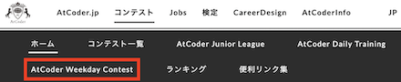
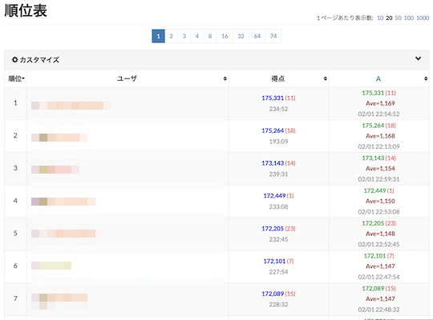
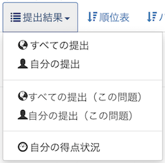

# AtCoder Clans

【非公式】競技プログラミングサイト[AtCoder](https://atcoder.jp/)がもっと楽しくなるリンク集です。有志による非公式サービス・ツール・ライブラリ・記事などをまとめています。

    
    
    
    

  

---

## 特長

* **網羅性が高い**: 初心者から上級者向けの情報まで幅広く掲載しています。
* **最新**: 最新の情報が入手できます。また、[X (旧 Twitter)](https://twitter.com/atcoderclans)で直近1週間の内容をお届けしています。
* **日本語の紹介文**: 日本語で紹介しています。
* **眺めるだけでも楽しい**: サービス・ツールのサムネイルが豊富です。
* **目的に応じて探せる**: 欲しい情報がすぐに探せるように、カテゴリ分けをしています。

## 対象ユーザとメリット

- [AtCoder](https://atcoder.jp/)ユーザ - 困ったことや不便なことが解決できるかもしれません。気になったサービス・ツールなどを使ってみましょう!

- 開発者 - 公開したサービスやツールなどの利用者が増えるだけでなく、ネタ探しや共同開発につながることも期待しています。

- [AtCoder](https://atcoder.jp/)運営チーム - 非公式サービス・ツールの全体像を踏まえ、公式として対応の有無を判断する材料の一つになると思います。また、企業向けの参考資料にもなるかもしれません。

- 企業の採用担当者 - [AtCoder](https://atcoder.jp/)ユーザの実務能力・ポテンシャルの評価材料の一つになると思います。ひいては人材発掘の効率化にも、つながるかもしれません。

---

## 最新情報を確認する

### AtCoder公式

<!-- markdown-link-check-disable -->

- [AtCoderInfo](https://info.atcoder.jp/) - [AtCoder](https://atcoder.jp/)の公式ポータルサイトです。コンテストの参加方法や取り組み方、採用担当者向け情報などが公開されています。

#### 公式コンテストの日時を確認

- [公式コンテストカレンダー運用のお知らせ](https://atcoder.jp/posts/1422) - Google カレンダーに追加すると、公式コンテストの開催日時を簡単に確認できます。
    - [ABCカレンダー](https://calendar.google.com/calendar/u/0?cid=Y180MzA3MDIxZTE0ZDhhMzNlYzgzNjI5YmM1MWQ2OTEzMWMwNjMxOGJiNGQ1ZmRjOTYwODNlZDE2ODFmMGEwZWQ2QGdyb3VwLmNhbGVuZGFyLmdvb2dsZS5jb20)
    - [ARCカレンダー](https://calendar.google.com/calendar/u/0?cid=Y185NGJiMDZmYmI0MDA2NjEzM2VmOTlkNTQ2NDhiZjIzYjI4MTEwNzdjZjU0MWE0ZGMyZDJlYjFiODI1MmU2NmZhQGdyb3VwLmNhbGVuZGFyLmdvb2dsZS5jb20)
    - [AGCカレンダー](https://calendar.google.com/calendar/u/0?cid=Y18wMTk0MDA5MTllZmYyNTI2MzNjNGIxNWE3MTA5YjUyNjhjNTkyNmFhMTFlMDQ2NWE5OWVmNTE5NDdhOTI4YmQ0QGdyb3VwLmNhbGVuZGFyLmdvb2dsZS5jb20)
    - [AHCカレンダー](https://calendar.google.com/calendar/u/0?cid=Y18yYTZiOWYxNTc3Nzg0N2E5YmNlNDhlMDI2OTkyYmY2ZGZjOWE2ZTlhMjk3Mjk4YTFjNjQ5NWMwYjE3NjQ5NjU0QGdyb3VwLmNhbGVuZGFyLmdvb2dsZS5jb20)

#### コンテストに関するルール変更

- [AtCoder生成AI対策ルール - 20251003版](https://info.atcoder.jp/entry/llm-rules-ja) - AtCoder Beginner Contest (通称 ABC)、AtCoder Regular Contest (同 ARC) および AtCoder Grand Contest (同 AGC) のコンテスト開催中を対象として、生成AIの利用における禁止事項が説明されています ([英語版](https://info.atcoder.jp/entry/llm-rules-en))。
    - [生成AIの技術向上に伴うABC,ARC,AGCにおけるルール変更について](https://atcoder.jp/posts/1567) - 2025年10月上旬時点での生成AI対策ルールの概要と、主な変更点がまとめられています。
    - [ARC Div.1 に関する生成AIルール変更について](https://atcoder.jp/posts/1513) - ARC Div.1 も上記ルールの対象となったことが告知されています。
    - [AGC073でのAI使用について](https://atcoder.jp/posts/1563) - AGC073 で生成AI単独で解答可能な問題が出題されたことや今後の対応について言及されています。
    - [AHCにおける生成AIルールの策定について](https://atcoder.jp/posts/1494) - AtCoder Heuristic Contest (通称 AHC) 049以降で適用される生成AI利用ルールのお知らせです ([詳細](https://info.atcoder.jp/entry/ahc-llm-rules-ja))。

- [初参加者の内部レートを変更いたします](https://atcoder.jp/posts/1591) - ABC430 以降、初めてコンテストに参加したユーザは、初期レーティングの計算方法が変更されます。

- [2026年のARCについての変更点](https://atcoder.jp/posts/2026ARC_ja) - ARC215以降、AtCoder Regular Contest (通称 ARC) は難易度の異なる3種類のコンテストに分けられることが告知されています。

#### ジャッジシステム

- [AtCoderの言語アップデートに関して (2024-25年度)](https://atcoder.jp/posts/1342) - ジャッジシステムの言語アップデートの準備状況に関するお知らせです。
    - [新ジャッジ運用開始のお知らせ](https://atcoder.jp/posts/1593) - ABC430 以降、新しいジャッジシステムが利用できます。また、一部の回答の表示形式や動作が変更されます。
    - [言語更新ADT先行運用のお知らせ](https://atcoder.jp/posts/1566) - 2025年10月7日以降の[AtCoder Daily Training](https://atcoder.jp/contests/adt_top)で、言語アップデート後の実行環境が利用できます。
    - [Language Test 202505](https://atcoder.jp/contests/language-test-202505) - ジャッジシステムに追加・更新された言語を試すためのコンテストが開催されています。
    - [Discord サーバの招待URL](https://discord.gg/NQ3PZQkq7M) - 言語アップデートの議論・ジャッジシステムの仕様に関する質問などを行うことができます。
- [ジャッジキューの処理遅延と今後の対応につきまして](https://atcoder.jp/posts/1456) - (2025年4月時点) ジャッジシステムで処理の遅延が発生している原因と今後の対応、非公式ツールへの影響が説明されています。

#### セキュリティ対策

- [AtCoderアカウントのパスワード管理について](https://atcoder.jp/posts/1366) - 不正アクセス防止のため、[AtCoder](https://atcoder.jp/)アカウントのパスワード確認・必要に応じて変更を促しています。
- [【重要なお知らせ】AtCoderを騙る偽サイトにご注意ください](https://atcoder.jp/posts/1268) - [AtCoder](https://atcoder.jp/)の偽サイトへのアクセス・ログインなどをしないように注意喚起している記事です。

#### 中学生・高校生向け

- [競技プログラミング教室 (2026 年度)](https://atcoder.jp/contests/atcoder_programming_class2026) -  [AtCoder](https://atcoder.jp/)が開催を予定している中学生・高校生向けの教室（「基礎コース」「上級コース」の二クラス制）。競技プログラミングに興味があり、国内トップクラスの実力を身につけたいユーザが対象です。

<!-- markdown-link-check-enable -->

### 非公式サービス・ツール・ライブラリ・記事など

直近1〜2週間の更新状況を掲載しています(ベータ版)。

=== "入門者・初心者向けの内容"

    2026-02-21

    - 「[Q3: コンテストは、いつ開催されていますか?](for_beginners/question3)」ページ
        - [2026年のARCについての変更点](https://atcoder.jp/posts/2026ARC_ja)

=== "Webアプリ・Webサイト"

    2026-02-14

    - 「[コンテストに関する統計情報](web_app/statistics)」ページ
        - [Shojin Viewer](https://shojin.woody1227.com/)

    

      
    

=== "ユーザスクリプト"

    2026-02-25

    - 「[問題を解く](user_scripts/solve_problems)」ページ
        - [AtCoder AWC Tab](https://greasyfork.org/ja/scripts/566748-atcoder-awc-tab)

    

      
    

    2026-02-21

    - 「[コンテストの成績や関連する統計情報を見る](user_scripts/view_scores)」ページ
        - [AHC Standings Customizer](https://greasyfork.org/ja/scripts/564554-ahc-standings-customizer)

    

      
    

    2026-02-19

    - 「[ソースコードの提出・確認を簡単に](user_scripts/submit_codes)」ページ
        - [AtCoder この問題の提出一覧に移動](https://greasyfork.org/ja/scripts/564014-atcoder-%E3%81%93%E3%81%AE%E5%95%8F%E9%A1%8C%E3%81%AE%E6%8F%90%E5%87%BA%E4%B8%80%E8%A6%A7%E3%81%AB%E7%A7%BB%E5%8B%95)

    

      
    

    2026-02-15

    - 「[問題を解く](user_scripts/solve_problems)」ページ
        - [AtCoderProblemCopier](https://greasyfork.org/ja/scripts/565854-atcoderproblemcopier)

    

      
    

=== "記事"

    2026-02-25

    - 「[ヒューリスティック問題を解く](articles/heuristic)」ページ
        - [THIRD プログラミングコンテスト 2026 （AtCoder Heuristic Contest 061）参加記](https://kaede2020.hatenablog.com/entry/2026/02/23/190431)

    2026-02-24

    - 「[コンテストに関する統計情報を見る](articles/view_scores)」ページ
        - [AtCoder Junior League 2025 Winter - 学校ランキング (2026年2月24日時点)](https://x.com/atcoder/status/2026200626594758856)

    2026-02-21

    - 「[コンテストに向けた練習方法を知る](articles/how_to_practice)」ページ
        - [2026年のARCについての変更点](https://atcoder.jp/posts/2026ARC_ja)

    2026-02-17

    - 「[コンテストに関する統計情報を見る](articles/view_scores)」ページ
        - [AtCoder Junior League 2025 Winter - 学校ランキング (2026年2月16日時点)](https://x.com/atcoder/status/2023274897653600414)

=== "ブログ"
    アルゴリズム部門・ヒューリスティック部門におけるランキング上位の日本人ユーザのブログをまとめています(順不同)。

    2026-02-25

    - 「[ヒューリスティック部門 - C++](blogs/heuristic/cpp)」ページ
        - [kencho](https://atcoder.jp/users/kencho)さん - [はてなブログ](https://kencho.hatenablog.com/)
        - [not](https://atcoder.jp/users/not)さん - [はてなブログ](https://not522.hatenablog.com/)
        - [sirsoldano](https://atcoder.jp/users/sirsoldano)さん - [Qiita](https://qiita.com/sirsoldano)
        - [zuba](https://atcoder.jp/users/zuba)さん - [はてなブログ](https://zubassyaaaaaaaaaaaaan.hatenablog.com/)

    - 「[ヒューリスティック部門 - C#](blogs/heuristic/csharp)」ページ
        - [G4NP0N](https://atcoder.jp/users/G4NP0N)さん - [はてなブログ](https://g4np0n-kyopro.hatenablog.com)

=== "動画"

    2026-02-22

    - 「[YouTube - チャンネル](youtube/channel)」ページ
        - [だいくすとら](https://www.youtube.com/@daikusutora-dayo)

    2026-02-12

    - 「[YouTube - 個別の動画](youtube/video)」ページ
        - [競プロerにしか伝わらないフリップネタ／AtCoder Conference 2025 発表ネタ](https://www.youtube.com/watch?v=qZt3BbQV3nQ)

=== "色変記事"

    色変記事とは、コンテストの参加者が所定のレーティングに到達した喜びをつづった記事(動画も含む)のことです。

    2026-02-23

    - 「[レーティング400から799まで(茶色)](milestones/brown)」ページ
        - [okawari0915](https://atcoder.jp/users/okawari0915)さん - [目が見えない僕が茶色コーダーになるまでのお話](https://note.com/okawari_0915/n/n662bf0e78b35)

    2026-02-20

    - 「[アルゴリズム部門 - レーティング2000〜2399(黄色)](milestones/yellow)」ページ
        - [tau1235](https://atcoder.jp/users/tau1235)さん - [AtCoderで黄色になりました](https://qiita.com/tau1235/items/b6175745b3593a5df336)

    2026-02-16

    - 「[レーティング1200〜1599(水色)](milestones/cyan)」ページ
        - [mizu7e](https://atcoder.jp/users/mizu7e)さん - [【色変記事】入水までにあったこと](https://qiita.com/mizu7e/items/a1e7335daa6f12eb11d8)

    2026-02-13

    - 「[レーティング400から799まで(茶色)](milestones/brown)」ページ
        - [bashibasshy](https://atcoder.jp/users/bashibasshy)さん - [AtCoderで茶色コーダーになれたのでコンテスト結果や取り組みを整理](https://qiita.com/meel_tech/items/5409c7299c41658ba056)

## AtCoder公式グッズを購入する

- [SUZURI](https://suzuri.jp/AtCoder) - [AtCoder](https://atcoder.jp/)のロゴ入りグッズが購入できる。

    

        
    

## 競プロLINEスタンプ・グッズ(非公式)を購入する

- [LINE STORE](https://store.line.me/stickershop/product/22113834/en) - [burioden](https://atcoder.jp/users/burioden)さんが作成・配信している競プロLINEスタンプ(非公式)。[第2弾](https://store.line.me/stickershop/product/22810021/en)、[第3弾](https://store.line.me/stickershop/product/22851268/en)、[第4弾](https://store.line.me/stickershop/product/25256215/en)もある。
    - [kyopro-neko](https://github.com/burioden/kyopro-neko)  - 「競プロするねこ」のイラスト集。
        - [アドバイスするねこ](https://github.com/burioden/kyopro-neko/tree/main/advice_neko) - 同キャラクターが、さまざまなアドバイスをしてくれる。
    - [SUZURI](https://suzuri.jp/burioden) - 「競プロするねこ」のイラストが書かれたグッズを購入できる。

    

        
    

## 本サービスのスポンサー(敬称略・順不同)

本サービスの開発・運営を応援してくださり、ありがとうございます。

[GitHub Sponsors](https://github.com/sponsors/KATO-Hiro)で寄付していただいた方には、いくつかの特典をご用意しております。

### 🏢 𝑬𝑵𝑻𝑬𝑹𝑷𝑹𝑰𝑺𝑬 Sponsor

- [AtCoder株式会社](https://github.com/atcoder)

### 🌐 Domain Supporter

- [KoyanagiHitoshi](https://github.com/KoyanagiHitoshi)

### 🍨 Ice Cream Supporter

- ia7ck
- ngtkana
- tomii9273
