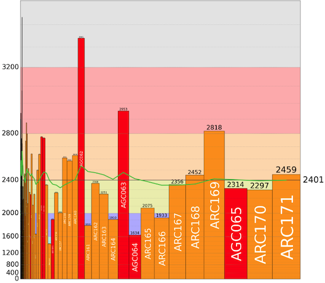

# AtCoder Clans

【非公式】競技プログラミングサイト[AtCoder](https://atcoder.jp/)がもっと楽しくなるリンク集です。有志による非公式サービス・ツール・ライブラリ・記事などをまとめています。

    
    
    
    

  

---

## 特長

* **網羅性が高い**: 初心者から上級者向けの情報まで幅広く掲載しています。
* **最新**: 最新の情報が入手できます。また、[X (旧 Twitter)](https://twitter.com/atcoderclans)で直近1週間の内容をお届けしています。
* **日本語の紹介文**: 日本語で紹介しています。
* **眺めるだけでも楽しい**: サービス・ツールのサムネイルが豊富です。
* **目的に応じて探せる**: 欲しい情報がすぐに探せるように、カテゴリ分けをしています。

## 対象ユーザとメリット

- [AtCoder](https://atcoder.jp/)ユーザ - 困ったことや不便なことが解決できるかもしれません。気になったサービス・ツールなどを使ってみましょう!

- 開発者 - 公開したサービスやツールなどの利用者が増えるだけでなく、ネタ探しや共同開発につながることも期待しています。

- [AtCoder](https://atcoder.jp/)運営チーム - 非公式サービス・ツールの全体像を踏まえ、公式として対応の有無を判断する材料の一つになると思います。また、企業向けの参考資料にもなるかもしれません。

- 企業の採用担当者 - [AtCoder](https://atcoder.jp/)ユーザの実務能力・ポテンシャルの評価材料の一つになると思います。ひいては人材発掘の効率化にも、つながるかもしれません。

---

## 最新情報を確認する

### AtCoder公式

<!-- markdown-link-check-disable -->

- [AtCoderInfo](https://info.atcoder.jp/) - [AtCoder](https://atcoder.jp/)の公式ポータルサイトです。コンテストの参加方法や取り組み方、採用担当者向け情報などが公開されています。

<!-- markdown-link-check-enable -->

### 非公式サービス・ツール・ライブラリ・記事など

直近1〜2週間の更新状況を掲載しています(ベータ版)。

=== "Webアプリ・Webサイト"

    2024-02-08

    - 「[コンテストの成績を見る](web_app/view_and_compare_scores)」ページ
        - [AtCoder Rating Contributor Graph](https://atcoder-rating-contribution-graph.vercel.app/)

    

      
    

=== "ユーザスクリプト"

    2024-02-16

    - 「[解説を読む・テストケースを見る](user_scripts/read_editorials)」ページ
        - [Hide Solutions](https://greasyfork.org/ja/scripts/485421-hide-solutions)

    2024-02-05

    - 「[ネタスクリプト](user_scripts/jokes)」ページ
        - [文字化けcoder](https://greasyfork.org/ja/scripts/485969-%E6%96%87%E5%AD%97%E5%8C%96%E3%81%91coder)

=== "記事"

    2024-02-17

    - 「[アルゴリズムを学ぶ](articles/algorithm)」ページ
        - [関係式付き Union Find](https://qiita.com/Kiri8128/items/ae19133ee6921cb18dec)

    2024-02-15

    - 「[実装テクニックを学ぶ - Python](articles/implementation/python)」ページ
        - [【Python】セグ木、遅延セグ木【AtCoder】](https://qiita.com/ether2420/items/7b67b2b35ad5f441d686)

    2024-02-14

    - 「[実装テクニックを学ぶ - C++](articles/implementation/cpp)」ページ
        - [遅延Segtree3 (本サイト運営者による注: 抽象化Segtree Treeの実装例のみ)](https://yosupo.hatenablog.com/entry/2023/12/09/010658)

    2024-02-11

    - 「[部活・サークル・同好会・オンサイトイベントに参加する](articles/club_activities)」ページ
        - [茶コーダーが競プロ家庭教師した話](https://speakerdeck.com/burioden/240117-uv-lt-fa84027b-5df9-4c05-b31c-ace56c010103)

    2024-02-10

    - 「[アルゴリズムを学ぶ](articles/algorithm)」ページ
        - [最小全域木問題を O(|E| log log |V|) 時間で【AdC2日目】](https://trap.jp/post/2059/)

    2024-02-09

    - 「[数学を学ぶ](articles/math)」ページ
        - [【競技プログラミング】多項式のGCDを O(N(logN)^2) で行う方法(half GCD) に関して解説！【暫定版】](https://qiita.com/hotman78/items/14809fa0214b168ddf80)

    2024-02-07

    - 「[数学を学ぶ](articles/math)」ページ
        - [「中学受験の算数」で磨くプログラミング的思考力！ 〜 親・子供・プログラマすべてに送る 25 問 〜](https://qiita.com/drken/items/3b15cf5f089488c38faa)

    2024-02-04

    - 「[ヒューリスティック問題を解く](articles/heuristic)」ページ
        - [ヒューリスティックコンテスト用Visualizer(Rust, SVG) チートシート集](https://zenn.dev/tipstar0125/articles/d2cf0ef63bceb7)

=== "ブログ"
    アルゴリズム部門・ヒューリスティック部門におけるランキング上位の日本人ユーザのブログをまとめています(順不同)。

    2024-02-03

    - 「[ヒューリスティック部門 - C++](blogs/heuristic/cpp)」ページ
        - [yosupo](https://atcoder.jp/users/yosupo)さん - [はてなブログ](https://yosupo.hatenablog.com/)

    - 「[ヒューリスティック部門 - C#](blogs/heuristic/csharp)」ページ
        - [chokudai](https://atcoder.jp/users/chokudai)さん - [はてなブログ](https://chokudai.hatenablog.com/)

=== "SNS"

    2024-02-02

    - 「[SNS](sns)」ページ
        - [AtCoderDailyTraining](https://twitter.com/atcoder_adt)

=== "色変記事"

    色変記事とは、コンテストの参加者が所定のレーティングに到達した喜びをつづった記事のことです。

    2024-02-13

    - 「[アルゴリズム部門 - レーティング1600〜1999(青色)](milestones/blue)」ページ
        - [highlighter_math](https://atcoder.jp/users/highlighter_math)さん - [AtCoderで入青しました！！](https://qiita.com/highlighter_math/items/4e28ac3aa3d7b592d514)

    2024-02-12

    - 「[アルゴリズム部門 - レーティング2000〜2399(黄色)](milestones/yellow)」ページ
        - [momohara](https://atcoder.jp/users/momohara)さん - [競プロ復帰してから約10ヶ月、黄色復帰するまでにやったこと](https://momoharahara.hatenadiary.com/entry/2024/02/11/181024)

    - 「[アルゴリズム部門 - レーティング1600〜1999(青色)](milestones/blue)」ページ
        - [hiroyuk1](https://atcoder.jp/users/hiroyuk1)さん - [AtCoderで入青したので記事を書く](https://qiita.com/hiroyuk1/items/5a75448e826bb08a17e4)

## AtCoder公式グッズを購入する

- [SUZURI](https://suzuri.jp/AtCoder) - [AtCoder](https://atcoder.jp/)のロゴ入りグッズが購入できる。

    

        
    

## 競プロLINEスタンプ・グッズ(非公式)を購入する

- [LINE STORE](https://store.line.me/stickershop/product/22113834/en) - [burioden](https://atcoder.jp/users/burioden)さんが作成・配信している競プロLINEスタンプ(非公式)。[第2弾](https://store.line.me/stickershop/product/22810021/en)、[第3弾](https://store.line.me/stickershop/product/22851268/en)、[第4弾](https://store.line.me/stickershop/product/25256215/en)もある。
    - [kyopro-neko](https://github.com/burioden/kyopro-neko)  - 「競プロするねこ」のイラスト集。
    - [SUZURI](https://suzuri.jp/burioden) - 「競プロするねこ」のイラストが書かれたグッズを購入できる。

    

        
    

## 本サービスのスポンサー(敬称略・順不同)

本サービスの開発・運営を応援してくださり、ありがとうございます。

[GitHub Sponsors](https://github.com/sponsors/KATO-Hiro)で寄付していただいた方には、いくつかの特典をご用意しております。

### 💚 AtCoder Clans Sponsor

- [chokudai](https://github.com/chokudai)

### 🍨 Ice Cream Supporter

- ia7ck
- tomii9273
- toshi201

### 🙂 Special Supporter

- otsuneko
