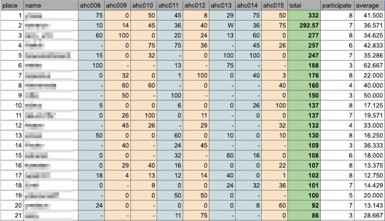
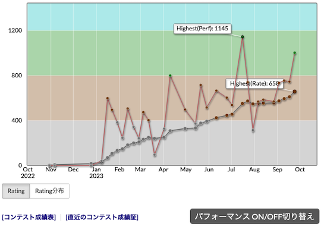
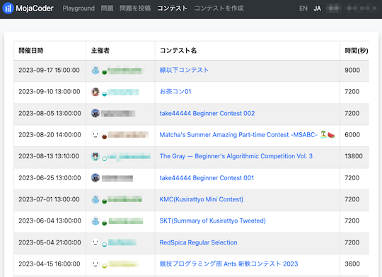

# AtCoder Clans

【非公式】競技プログラミングサイト[AtCoder](https://atcoder.jp/)がもっと楽しくなるリンク集です。有志による非公式サービス・ツール・ライブラリ・記事などをまとめています。

    
    
    
    

  

---

## 特長

* **網羅性が高い**: 初心者から上級者向けの情報まで幅広く掲載しています。
* **最新**: 最新の情報が入手できます。また、[Twitter](https://twitter.com/atcoderclans)で直近1週間の内容をお届けしています。
* **日本語の紹介文**: 日本語で紹介しています。
* **眺めるだけでも楽しい**: サービス・ツールのサムネイルが豊富です。
* **目的に応じて探せる**: 欲しい情報がすぐに探せるように、カテゴリ分けをしています。

## 対象ユーザとメリット

- [AtCoder](https://atcoder.jp/)ユーザ - 困ったことや不便なことが解決できるかもしれません。気になったサービス・ツールなどを使ってみましょう!

- 開発者 - 公開したサービスやツールなどの利用者が増えるだけでなく、ネタ探しや共同開発につながることも期待しています。

- [AtCoder](https://atcoder.jp/)運営チーム - 非公式サービス・ツールの全体像を踏まえ、公式として対応の有無を判断する材料の一つになると思います。また、企業向けの参考資料にもなるかもしれません。

- 企業の採用担当者 - [AtCoder](https://atcoder.jp/)ユーザの実務能力・ポテンシャルの評価材料の一つになると思います。ひいては人材発掘の効率化にも、つながるかもしれません。

---

## 最新情報を確認する

直近1〜2週間の更新状況を掲載しています(ベータ版)。

=== "Webアプリ・Webサイト"

    2023-09-21

    - 「[コンテストに関する統計情報](web_app/statistics)」ページ
        - [AtCoder Heuristic Race Ranking *Unofficial*](https://tomerun.github.io/ahc_point_race/publish/2023.html)

    

      
    

=== "ユーザスクリプト"

    2023-09-27

    - 「[コンテストの成績や関連する統計情報を見る](user_scripts/view_scores)」ページ
        - [Atcoder Perf Graph](https://greasyfork.org/ja/scripts/476103-atcoder-perf-graph)

    

      
    

    2023-09-19

    - 「[Webページに色付けする](user_scripts/colors)」ページ
        - [MojaCoder Submission User Colorizer (by AtCoder Rating)](https://greasyfork.org/ja/scripts/475500-mojacoder-submission-user-colorizer-by-atcoder-rating)

    

      
    

=== "記事"

    2023-09-30

    - 「[数学を学ぶ](articles/math)」ページ
        - [Wolfram Alpha](https://ja.wolframalpha.com/)
        - [【競プロ Tips】Wolfram Alpha を使いこなそう](https://hackmd.io/@tatyam-prime/ByuUsAfla)

    2023-09-29

    - 「[数学を学ぶ](articles/math)」ページ
        - [形式的べき級数](https://zenn.dev/koboshi/books/600753d917cdbc)

    2023-09-28

    - 「[ヒューリスティック問題を解く](articles/heuristic)」ページ
        - [8近傍だけで連結性を良い感じに確保し続ける典型](https://twitter.com/chokudai/status/1706124817915908481)

    2023-09-27

    - 「[ヒューリスティック問題を解く](articles/heuristic)」ページ
        - [みんなAHCの魅力を知らなすぎて困る](https://trap.jp/post/2006/)
        - [ヒューリスティックコンテストで機械学習しよう](https://speakerdeck.com/nagiss/hiyurisuteitukukontesutodeji-jie-xue-xi-siyou)

    2023-09-26

    - 「[コンテストに関する統計情報を見る](articles/view_scores)」ページ
        - [AtCoder Junior League 2023 - 学校ランキング (9月25日時点)](https://twitter.com/atcoder/status/1706169824861397059)

    2023-09-23

    - 「[コンテストに向けた練習方法を知る](articles/how_to_practice)」ページ
        - [AtCoder Typical Components (β)](https://not-leonian.hatenablog.com/entry/ATCs/ATCs)

    2023-09-22

    - 「[解説ブログ・サイトを見る](articles/user_editorials)」ページ
        - [ABCxxxをPythonで解いてみたよ。](https://qiita.com/hyouchun)

    - 「[実装テクニックを学ぶ - Others](articles/implementation/others)」ページ
        - [AtCoderでSageMathを使う](https://qiita.com/kusano_k/items/b082423861705c41cac8)

    2023-09-20

    - 「[入門者・初心者向けの内容](articles/introduction)」ページ
        - [AtCoder Junior League 2023 ランキング上位校の強さの秘密に迫る（第1回：筑波大学附属駒場中・高等学校）](https://prtimes.jp/story/detail/7bZGPLcXjeB)

    - 「[コンテストに関する統計情報を見る](articles/view_scores)」ページ
        - [AtCoder Junior League 2023 - 学校ランキング (9月19日時点)](https://twitter.com/atcoder/status/1703981215890788411)
        - [AJL 高校部門上位40校 (2023年9月19日時点)](https://twitter.com/kiri8128/status/1704120665950056450)

    2023-09-18

    - 「[アルゴリズムを学ぶ](articles/algorithm)」ページ
        - [x軸とy軸について独立に考えてよい - けんちょんの競プロ精進記録](https://drken1215.hatenablog.com/archive/category/x%E8%BB%B8%E3%81%A8y%E8%BB%B8%E3%81%AB%E3%81%A4%E3%81%84%E3%81%A6%E7%8B%AC%E7%AB%8B%E3%81%AB%E8%80%83%E3%81%88%E3%81%A6%E3%82%88%E3%81%84)

=== "ブログ"
    アルゴリズム部門・ヒューリスティック部門におけるランキング上位の日本人ユーザのブログをまとめています(順不同)。

    2023-09-25

    - 「[ヒューリスティック部門 - C++](blogs/heuristic/cpp)」ページ
        - [takumi152](https://atcoder.jp/users/takumi152)さん - [はてなブログ](https://takumi152.hatenablog.jp/)
        - [kotamanegi](https://atcoder.jp/users/kotamanegi)さん - [はてなブログ](https://kotamanegi.hatenablog.com/)

    - 「[ヒューリスティック部門 - Go](blogs/heuristic/go)」ページ
        - [montplusa](https://atcoder.jp/users/montplusa)さん - [はてなブログ](https://montplusa.hatenablog.com/archive)

    - 「[ヒューリスティック部門 - Rust](blogs/heuristic/rust)」ページ
        - [ichyo](https://atcoder.jp/users/ichyo)さん - [はてなブログ](https://blog.ichyo.jp/)

=== "動画"

    2023-09-25

    - 「[YouTube - チャンネル](youtube/channel)」ページ
        - [ぱるま](https://www.youtube.com/playlist?list=PL2M7xTSHX0HqdXvk74PKSZ2De_EyVUq0d)

=== "SNS"

    2023-09-21

    - 「[SNS](sns)」ページ
        - [高専競プロ部](https://discord.com/invite/nhMReq9nMz)

=== "色変記事"

    色変記事とは、コンテストの参加者が所定のレーティングに到達した喜びをつづった記事のことです。

    2023-09-30

    - 「[レーティング1600〜1999(青色)](milestones/blue)」ページ
        - [mono_0812](https://atcoder.jp/users/mono_0812)さん - [入青した！！ - mono_0812のブログ](https://mono-0812.hatenablog.com/entry/20230924/1695517992)

    - 「[レーティング1200〜1599(水色)](milestones/cyan)」ページ
        - [NEET0321](https://atcoder.jp/users/NEET0321)さん - [入水記事 - AFKK](https://afkk.hatenablog.com/entry/2023/09/25/180656)

    2023-09-26

    - 「[レーティング2800〜(赤色、銅・銀・金王冠)](milestones/red)」ページ
        - [leaf1415](https://atcoder.jp/users/leaf1415)さん - [【色変記事】レッドコーダーになりました！ - leaf1415の日記](https://leaf1415.hatenablog.com/entry/2023/09/25/115311)

    2023-09-24

    - 「[レーティング1200〜1599(水色)](milestones/cyan)」ページ
        - [hiroyuk1](https://atcoder.jp/users/hiroyuk1)さん - [ABC321で中2が入水したよ！！！！](https://qiita.com/hiroyuk1/items/363fce5a43f1cda1d49d)

    - 「[レーティング800〜1199(緑色)](milestones/green)」ページ
        - [kirimin](https://atcoder.jp/users/kirimin)さん - [算数の教養がほとんどなかったプログラマがAtCoderを4年やって緑になれた話](https://note.com/kirimin_chan/n/n337f5bdf7e48)

    2023-09-23

    - 「[レーティング1600〜1999(青色)](milestones/blue)」ページ
        - [achapi](https://atcoder.jp/users/achapi)さん - [入青記事 - あちゃぴのブログ](https://achapi.hatenablog.jp/entry/2023/09/19/225144)

    - 「[レーティング1200〜1599(水色)](milestones/cyan)」ページ
        - [Satsuki_8198](https://atcoder.jp/users/Satsuki_8198)さん - [Houdinist が競プロerになってみた話  (本サイト運営者による注:水色コーダー達成に関する内容を含む) ](https://qiita.com/Satsuki-Sensei/items/2e5ed965f4a6b8794f9e)

    - 「[レーティング800〜1199(緑色)](milestones/green)」ページ
        - [ZUkA_](https://atcoder.jp/users/ZUkA_)さん - [数学が苦手な大学生の AtCoder 入緑記事](https://note.com/yindolsa/n/n512d1530339e)

## AtCoder公式グッズを購入する

- [SUZURI](https://suzuri.jp/AtCoder) - [AtCoder](https://atcoder.jp/)のロゴ入りグッズが購入できる。

    

        
    

## 競プロLINEスタンプ・グッズ(非公式)を購入する

- [LINE STORE](https://store.line.me/stickershop/product/22113834/en) - [burioden](https://atcoder.jp/users/burioden)さんが作成・配信している競プロLINEスタンプ(非公式)。[第2弾](https://store.line.me/stickershop/product/22810021/en)、[第3弾](https://store.line.me/stickershop/product/22851268/en)もある。
    - [kyopro-neko](https://github.com/burioden/kyopro-neko)  - 「競プロするねこ」のイラスト集。
    - [SUZURI](https://suzuri.jp/burioden) - 「競プロするねこ」のイラストが書かれたグッズを購入できる。

    

        
    

## 本サービスのスポンサー(敬称略・順不同)

本サービスの開発・運営を応援してくださり、ありがとうございます。

[GitHub Sponsors](https://github.com/sponsors/KATO-Hiro)で寄付していただいた方には、いくつかの特典をご用意しております。

### 🍨 Ice Cream Supporter

- ia7ck
- tomii9273
