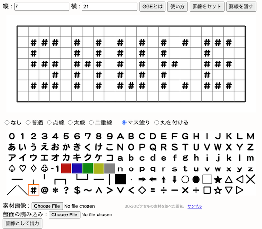
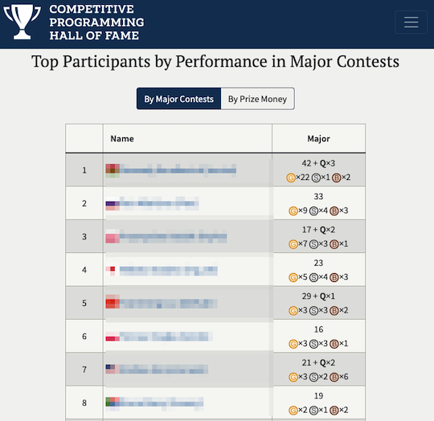
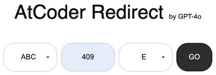
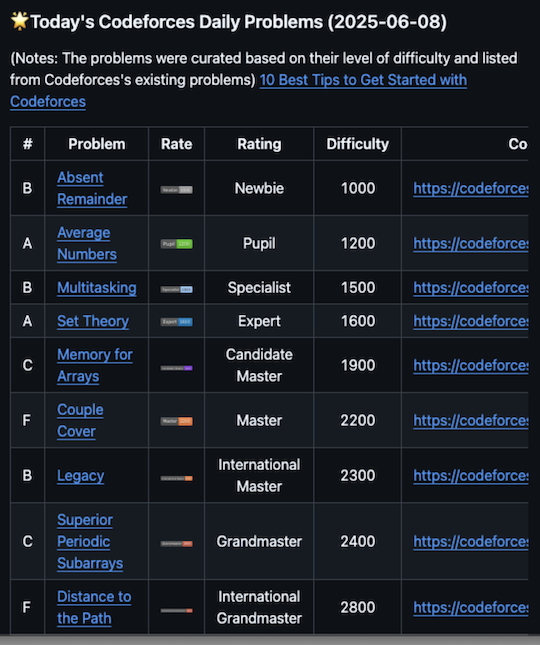
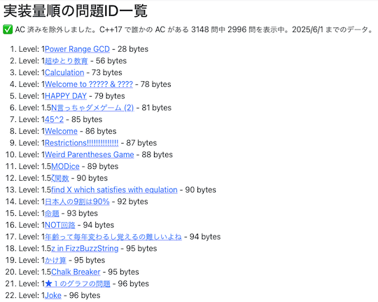

# AtCoder Clans

【非公式】競技プログラミングサイト[AtCoder](https://atcoder.jp/)がもっと楽しくなるリンク集です。有志による非公式サービス・ツール・ライブラリ・記事などをまとめています。

    
    
    
    

  

---

## 特長

* **網羅性が高い**: 初心者から上級者向けの情報まで幅広く掲載しています。
* **最新**: 最新の情報が入手できます。また、[X (旧 Twitter)](https://twitter.com/atcoderclans)で直近1週間の内容をお届けしています。
* **日本語の紹介文**: 日本語で紹介しています。
* **眺めるだけでも楽しい**: サービス・ツールのサムネイルが豊富です。
* **目的に応じて探せる**: 欲しい情報がすぐに探せるように、カテゴリ分けをしています。

## 対象ユーザとメリット

- [AtCoder](https://atcoder.jp/)ユーザ - 困ったことや不便なことが解決できるかもしれません。気になったサービス・ツールなどを使ってみましょう!

- 開発者 - 公開したサービスやツールなどの利用者が増えるだけでなく、ネタ探しや共同開発につながることも期待しています。

- [AtCoder](https://atcoder.jp/)運営チーム - 非公式サービス・ツールの全体像を踏まえ、公式として対応の有無を判断する材料の一つになると思います。また、企業向けの参考資料にもなるかもしれません。

- 企業の採用担当者 - [AtCoder](https://atcoder.jp/)ユーザの実務能力・ポテンシャルの評価材料の一つになると思います。ひいては人材発掘の効率化にも、つながるかもしれません。

---

## 最新情報を確認する

### AtCoder公式

<!-- markdown-link-check-disable -->

- [AtCoderInfo](https://info.atcoder.jp/) - [AtCoder](https://atcoder.jp/)の公式ポータルサイトです。コンテストの参加方法や取り組み方、採用担当者向け情報などが公開されています。

#### 公式コンテストの日時を確認

- [公式コンテストカレンダー運用のお知らせ](https://atcoder.jp/posts/1422) - Google カレンダーに追加すると、公式コンテストの開催日時を簡単に確認できます。
    - [ABCカレンダー](https://calendar.google.com/calendar/u/0?cid=Y180MzA3MDIxZTE0ZDhhMzNlYzgzNjI5YmM1MWQ2OTEzMWMwNjMxOGJiNGQ1ZmRjOTYwODNlZDE2ODFmMGEwZWQ2QGdyb3VwLmNhbGVuZGFyLmdvb2dsZS5jb20)
    - [ARCカレンダー](https://calendar.google.com/calendar/u/0?cid=Y185NGJiMDZmYmI0MDA2NjEzM2VmOTlkNTQ2NDhiZjIzYjI4MTEwNzdjZjU0MWE0ZGMyZDJlYjFiODI1MmU2NmZhQGdyb3VwLmNhbGVuZGFyLmdvb2dsZS5jb20)
    - [AGCカレンダー](https://calendar.google.com/calendar/u/0?cid=Y18wMTk0MDA5MTllZmYyNTI2MzNjNGIxNWE3MTA5YjUyNjhjNTkyNmFhMTFlMDQ2NWE5OWVmNTE5NDdhOTI4YmQ0QGdyb3VwLmNhbGVuZGFyLmdvb2dsZS5jb20)
    - [AHCカレンダー](https://calendar.google.com/calendar/u/0?cid=Y18yYTZiOWYxNTc3Nzg0N2E5YmNlNDhlMDI2OTkyYmY2ZGZjOWE2ZTlhMjk3Mjk4YTFjNjQ5NWMwYjE3NjQ5NjU0QGdyb3VwLmNhbGVuZGFyLmdvb2dsZS5jb20)

#### コンテストに関するルール変更

- [AtCoder生成AI対策ルール - 20241206版](https://info.atcoder.jp/entry/llm-rules-ja) - AtCoder Beginner Contest (通称 ABC) および AtCoder Regular Contest (同 ARC)のコンテスト開催中を対象として、生成AIの利用における禁止事項が説明されています ([英語版](https://info.atcoder.jp/entry/llm-rules-en))。
    - [生成AIの技術向上に伴うABCおよびARCにおけるルール変更について](https://atcoder.jp/posts/1347) - 上記のルール変更の背景、作成方針、概要、今後の変更の可能性について言及されています ([英語版](https://atcoder.jp/posts/1350))。
    - [ARCのDivision制に伴うルール変更について](https://atcoder.jp/posts/1368) - ARC の Division制の導入に伴うルールの変更点が紹介されています。
    - [AHCにおける生成AIルールの策定について](https://atcoder.jp/posts/1494) - AtCoder Heuristic Contest (通称 AHC) 049以降で適用される生成AI利用ルールのお知らせです ([詳細](https://info.atcoder.jp/entry/ahc-llm-rules-ja))。

- [ARCのDivision制についての告知](https://atcoder.jp/posts/1364) - ARC189以降、AtCoder Regular Contest (通称 ARC) は難易度の異なる2種類のコンテストに分けられることが告知されています。
    - [ARC Div.1 の rated 上限の変更について](https://atcoder.jp/posts/1433) - ARC196 以降の ARC Div.1 の 開催形式の変更に関するお知らせです。

#### ジャッジシステム

- [AtCoderの言語アップデートに関して (2024-25年度)](https://atcoder.jp/posts/1342) - ジャッジシステムの言語アップデートの準備状況に関するお知らせです。
    - [Language Test 202505](https://atcoder.jp/contests/language-test-202505) - ジャッジシステムに追加・更新された言語を試すためのコンテストが開催されています。
    - [Discord サーバの招待URL](https://discord.gg/NQ3PZQkq7M) - 言語アップデートの議論・ジャッジシステムの仕様に関する質問などを行うことができます。
- [ジャッジキューの処理遅延と今後の対応につきまして](https://atcoder.jp/posts/1456) - (2025年4月時点) ジャッジシステムで処理の遅延が発生している原因と今後の対応、非公式ツールへの影響が説明されています。

#### セキュリティ対策

- [AtCoderアカウントのパスワード管理について](https://atcoder.jp/posts/1366) - 不正アクセス防止のため、[AtCoder](https://atcoder.jp/)アカウントのパスワード確認・必要に応じて変更を促しています。
- [【重要なお知らせ】AtCoderを騙る偽サイトにご注意ください](https://atcoder.jp/posts/1268) - [AtCoder](https://atcoder.jp/)の偽サイトへのアクセス・ログインなどをしないように注意喚起している記事です。

<!-- markdown-link-check-enable -->

### 非公式サービス・ツール・ライブラリ・記事など

直近1〜2週間の更新状況を掲載しています(ベータ版)。

=== "スペシャル・サンクス"

    2025-06-07

    - 「[Special Thanks](special_thanks)」ページ
        - [競技プログラミング入門ストーリー - 便利なリンク集](https://paiza.jp/pages/works/stories/competitive_programming)

=== "Webアプリ・Webサイト"

    2025-06-15

    - 「[問題を解くときの補助ツール](web_app/support_tools)」ページ
        - [Generic Grid Editor](https://snuke.main.jp/gge/)

    

      
    

    2025-06-11

    - 「[コンテストに関する統計情報](web_app/statistics)」ページ
        - [Competitive Programming Hall Of Fame](https://cphof.org/)

    

      
    

    2025-06-10

    - 「[問題を解く](web_app/solve_problems)」ページ

        <!-- markdown-link-check-disable -->

        - [AtCoder Redirect](https://codepen.io/uchi8977/full/gbpGOzY)

        <!-- markdown-link-check-enable -->

    

      
    

    2025-06-07

    - 「[問題を解く](web_app/solve_problems)」ページ
        - [Rosetta Problems](https://rosetta-problems-dev.vercel.app/)

=== "ユーザスクリプト"

    2025-06-01

    - 「[ネタスクリプト](user_scripts/jokes)」ページ
        - [AC-Rotate](https://greasyfork.org/ja/scripts/537633-ac-rotate)

=== "記事"

    2025-06-09

    - 「[コンテストに関する統計情報を見る](articles/view_scores)」ページ
        - [AtCoder Junior League 2025 Summer - 学校ランキング (2025年6月9日時点)](https://x.com/atcoder/status/1931906690863271960)

    2025-06-09

    - 「[ヒューリスティック問題を解く](articles/heuristic)」ページ
        - [MC Digital プログラミングコンテスト2025（AtCoder Heuristic Contest 048）参加記](https://kaede2020.hatenablog.com/entry/2025/06/09/202655)

    2025-06-05

    - 「[実装テクニックを学ぶ - Others](articles/implementation/others)」ページ
        - [AtCoderでのJavaScriptの入力](https://qiita.com/mizu7e/items/89db39527c7b920bbea1)

    2025-06-04

    - 「[実装テクニックを学ぶ - C++](articles/implementation/cpp)」ページ
        - [【非公式】[C++] AtCoder ジャッジアップデート (2024–2025) について](https://trap.jp/post/2589/)

    2025-06-03

    - 「[アルゴリズムを学ぶ](articles/algorithm)」ページ
        - [Implicit Treap解説](https://qiita.com/hamamu/items/570e7c36bf73913cbeb8)

    2025-06-02

    - 「[コンテストに関する統計情報を見る](articles/view_scores)」ページ
        - [AtCoder Junior League 2025 Summer - 学校ランキング (2025年6月2日時点)](https://x.com/atcoder/status/1929411005198520806)

=== "ブログ"
    アルゴリズム部門・ヒューリスティック部門におけるランキング上位の日本人ユーザのブログをまとめています(順不同)。

    2025-06-11

    - 「[ヒューリスティック部門 - C++](blogs/heuristic/cpp)」ページ
        - [dn6049949](https://atcoder.jp/users/dn6049949)さん - [Qiita](https://qiita.com/dn6049949)
        - [BinomialSheep](https://atcoder.jp/users/BinomialSheep)さん - [Qiita](https://qiita.com/BinomialSheep/items/e7a717f34e6991affa1c)

    - 「[ヒューリスティック部門 - Python](blogs/heuristic/python)」ページ
        - [isee](https://atcoder.jp/users/isee)さん - [Qiita](https://qiita.com/isee)

    - 「[ヒューリスティック部門 - Rust](blogs/heuristic/rust)」ページ
        - [tipstar0125](https://atcoder.jp/users/tipstar0125)さん - [Zenn](https://zenn.dev/tipstar0125)

    2025-06-01

    - 「[アルゴリズム部門 - C++](blogs/algorithm/cpp)」ページ
        - [lX57](https://atcoder.jp/users/lX57)さん - [はてなブログ](https://logk.hateblo.jp/)

=== "書籍"

    2025-06-14

    - 「[書籍](books)」ページ
        - [ヒューリスティック探索 合理的なAIをつくるためのアルゴリズム](https://www.amazon.co.jp/dp/4065392187)

=== "動画"

    2025-06-13

    - 「[YouTube - チャンネル](youtube/channel)」ページ
        - [ぶるけんプログラミング道場](https://www.youtube.com/@%E3%81%B6%E3%82%8B%E3%81%91%E3%82%93%E3%83%97%E3%83%AD%E3%82%B0%E3%83%A9%E3%83%9F%E3%83%B3%E3%82%B0%E9%81%93%E5%A0%B4)

    2025-06-12

    - 「[YouTube - 個別の動画](youtube/video)」ページ
        - [【音MAD】イワイイ（岩井星人×フォニイ）【競技プログラミング】](https://www.youtube.com/watch?v=zEbVkrb7FuM)

    2025-06-06

    - 「[YouTube - 個別の動画](youtube/video)」ページ
        - [DPの思いつき方](https://www.youtube.com/watch?v=2QDQUj69OiE)

    2025-06-04

    - 「[YouTube - 個別の動画](youtube/video)」ページ
        - [毒チョコゲームの必勝法【ゆっくり解説】](https://www.youtube.com/watch?v=agRtx_XREtA)

=== "国内外のコンテストサイト"

    2025-06-08

    - 「[Codeforces](related_contest_sites/codeforces)」ページ
        - [Codeforces Daily Problems](https://github.com/ika9810/Codeforces-Daily-Problems) - 

    

      
    

    2025-06-04

    - 「[yukicoder](related_contest_sites/yukicoder)」ページ
        - [yukicoder lazy solving](https://maruoka842.github.io/yukicoder-lazy-solving/)

    

      
    

=== "アーカイブス"

    諸事情により開発・提供が終了した(と思われる)サービス・ツールなどに対して、感謝や敬意を表するため掲載しています。

    2025-06-10

    - 関連コンテストサイト
        - AOJ-ICPC

    2025-06-08

    - Webアプリ・Webサイト
        - Atcoder Beginner Contest Tournament
        - AtCoder Competition History Chart Maker
        - Atcoder Daily Contests
        - AtCoder Heuristic Race Ranking *Unofficial*
        - AtCoder Language Visualizer
        - Atcoder Performance Chart
        - AtCoder Prophet
        - AtCoder QQ
        - AtCoder Rivals
        - AtCoder-Review
        - AtCoder Rollback
        - atcoder-synchronicity
        - AtCoder Tags
        - AtCoder Training-Performance Visualizer
        - AtCoder 中文站
        - mm-tester

    - エディタ
        - Rujaioon

    - Bot
        - AtCoder After Contest Bot
        - atgolfer
        - A?Cなにか
        - ほぼ日バチャbot

    - ユーザスクリプト
        - AtCoderTags_Helper

    - 関連コンテストサイト
        - Codeforces Tool
        - Hightail

## AtCoder公式グッズを購入する

- [SUZURI](https://suzuri.jp/AtCoder) - [AtCoder](https://atcoder.jp/)のロゴ入りグッズが購入できる。

    

        
    

## 競プロLINEスタンプ・グッズ(非公式)を購入する

- [LINE STORE](https://store.line.me/stickershop/product/22113834/en) - [burioden](https://atcoder.jp/users/burioden)さんが作成・配信している競プロLINEスタンプ(非公式)。[第2弾](https://store.line.me/stickershop/product/22810021/en)、[第3弾](https://store.line.me/stickershop/product/22851268/en)、[第4弾](https://store.line.me/stickershop/product/25256215/en)もある。
    - [kyopro-neko](https://github.com/burioden/kyopro-neko)  - 「競プロするねこ」のイラスト集。
        - [アドバイスするねこ](https://github.com/burioden/kyopro-neko/tree/main/advice_neko) - 同キャラクターが、さまざまなアドバイスをしてくれる。
    - [SUZURI](https://suzuri.jp/burioden) - 「競プロするねこ」のイラストが書かれたグッズを購入できる。

    

        
    

## 本サービスのスポンサー(敬称略・順不同)

本サービスの開発・運営を応援してくださり、ありがとうございます。

[GitHub Sponsors](https://github.com/sponsors/KATO-Hiro)で寄付していただいた方には、いくつかの特典をご用意しております。

### 🏢 𝑬𝑵𝑻𝑬𝑹𝑷𝑹𝑰𝑺𝑬 Sponsor

- [AtCoder株式会社](https://github.com/atcoder)

### 🌐 Domain Supporter

- [KoyanagiHitoshi](https://github.com/KoyanagiHitoshi)

### 🍨 Ice Cream Supporter

- ia7ck
- ngtkana
- tomii9273
