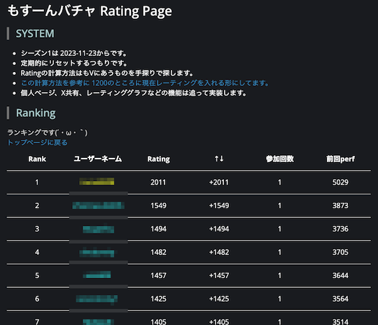
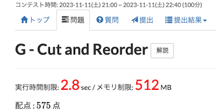

# AtCoder Clans

【非公式】競技プログラミングサイト[AtCoder](https://atcoder.jp/)がもっと楽しくなるリンク集です。有志による非公式サービス・ツール・ライブラリ・記事などをまとめています。

    
    
    
    

  

---

## 特長

* **網羅性が高い**: 初心者から上級者向けの情報まで幅広く掲載しています。
* **最新**: 最新の情報が入手できます。また、[Twitter](https://twitter.com/atcoderclans)で直近1週間の内容をお届けしています。
* **日本語の紹介文**: 日本語で紹介しています。
* **眺めるだけでも楽しい**: サービス・ツールのサムネイルが豊富です。
* **目的に応じて探せる**: 欲しい情報がすぐに探せるように、カテゴリ分けをしています。

## 対象ユーザとメリット

- [AtCoder](https://atcoder.jp/)ユーザ - 困ったことや不便なことが解決できるかもしれません。気になったサービス・ツールなどを使ってみましょう!

- 開発者 - 公開したサービスやツールなどの利用者が増えるだけでなく、ネタ探しや共同開発につながることも期待しています。

- [AtCoder](https://atcoder.jp/)運営チーム - 非公式サービス・ツールの全体像を踏まえ、公式として対応の有無を判断する材料の一つになると思います。また、企業向けの参考資料にもなるかもしれません。

- 企業の採用担当者 - [AtCoder](https://atcoder.jp/)ユーザの実務能力・ポテンシャルの評価材料の一つになると思います。ひいては人材発掘の効率化にも、つながるかもしれません。

---

## 最新情報を確認する

直近1〜2週間の更新状況を掲載しています(ベータ版)。

=== "ホーム"

    2023-11-30

    本サービスのスポンサーを掲載(敬称略)。ご支援いただき、ありがとうございます。

    - [chokudai](https://github.com/chokudai)

=== "Webアプリ・Webサイト"

    2023-11-26

    - 「[問題を解く](web_app/solve_problems)」ページ
        - [GitHub ActionsでAtCoder Problemsのバーチャルコンテストを自動で作成したい](https://zenn.dev/powell/scraps/224688ca6ce2b5)

    - 「[Bot](bot)」ページ
        - [AtCoder After Contest Bot](https://twitter.com/AfterContestBot)

    2023-11-24

    - 「[コンテストの成績に関連するサービス](web_app/services_using_scores)」ページ
        - [もすーんバチャ Rating Page](https://mosoon.net/mov_rating/top.html)

    

      
    

=== "ユーザスクリプト"

    2023-12-03

    - 「[Webページに色付けする](user_scripts/colors)」ページ
        - [timemory-limit-emphasizer](https://greasyfork.org/ja/scripts/480675-timemory-limit-emphasizer)

    

      
    

=== "Chrome拡張機能"

    2023-11-25

    - 「[ソースコードの提出・確認を簡単に](chrome_extensions/submit_codes)」ページ
        - [AtCoder Parallel Alert](https://chromewebstore.google.com/detail/poiijcpfeaijlocfncmimadjkppkplef)

    

      
    

=== "記事"

    2023-12-04

    - 「[部活・サークル・同好会・オンサイトイベントに参加する](articles/club_activities)」ページ
        - [第2回緑以下コンテスト開催記](https://kusirara.hatenablog.com/entry/2023/12/04/134934)

    - 「[コンテストに関する統計情報を見る](articles/view_scores)」ページ
        - [AtCoder Junior League 2023 - 学校ランキング (12月4日時点)](https://twitter.com/atcoder/status/1731514391756243121)

    2023-12-03

    - 「[ヒューリスティック問題を解く](articles/heuristic)」ページ
        - [AHC典型解法シリーズ第2弾「焼きなまし法」](https://qiita.com/thun-c/items/ecd438fde4d237b1f7bc)

    2023-11-29

    - 「[実装テクニックを学ぶ - Python](articles/implementation/python)」ページ
        - [ABC330-E Mex and Update を無思考で解けるライブラリを書いた](https://prd-xxx.hateblo.jp/entry/2023/11/29/002226)

    2023-11-27

    - 「[コンテストに関する統計情報を見る](articles/view_scores)」ページ
        - [AtCoder Junior League 2023 - 学校ランキング (11月27日時点)](https://twitter.com/atcoder/status/1728981309178159379)

    2023-11-23

    - 「[競技プログラミングと就転職](articles/jobs)」ページ
        - [グラフ縮約の前処理による再計算アルゴリズムの改善](https://tech.preferred.jp/ja/blog/improve_recomputation_algorithm_by_graph_contraction_preprocessing/)

    2023-11-22

    - 「[競技プログラミングと就転職](articles/jobs)」ページ
        - [AtCoder株式会社代表 高橋直大氏 - 社長の履歴書](https://donzoko-ceo.com/atcoder/)

    2023-11-21

    - 「[コンテストに向けた練習方法を知る](articles/how_to_practice)」ページ
        - [【AtCoder】 AtCoder Beginner Contest A~C問題の傾向と対策 part1](https://qiita.com/darake/items/dd66663b80f6974cd8a9)

=== "動画"

    2023-12-02

    - 「[YouTube - 個別の動画](youtube/video)」ページ
        - [DFS・BFSとは？お気持ち編［競技プログラミング初心者へ］【ゆっくり解説】](https://www.youtube.com/watch?v=0_9heBS7Flg)
        - [DP（動的計画法）とは？お気持ち編［競技プログラミング初心者へ］【ゆっくり解説】](https://www.youtube.com/watch?v=oB3L8yyHsFY)

=== "SNS"

    2023-11-30

    - 「[SNS](sns)」ページ
        - [Pythonライブラリ研究](https://discord.com/invite/rPWuuGRha2)

=== "ライブラリ・スニペット"

    2023-11-29

    - 「[Python](libraries/python)」ページ
        - [prd-xxx/gorichan_kyopro_library](https://github.com/prd-xxx/gorichan_kyopro_library) 

    2023-11-28

    - 「[Java](libraries/java)」ページ
        - [viral8code/viral-Library](https://github.com/viral8code/viral-Library) 

=== "色変記事"

    色変記事とは、コンテストの参加者が所定のレーティングに到達した喜びをつづった記事のことです。

    2023-12-01

    - 「[アルゴリズム部門 - レーティング1600〜1999(青色)](milestones/blue)」ページ
        - [blueberry1001](https://atcoder.jp/users/blueberry1001)さん - [【Atcoder】高校1年生でAtcoder青色になりました](https://qiita.com/bluebery1001/items/ec889d958ee3a81525ff)

    2023-11-29

    - 「[ヒューリスティック部門 - レーティング2400〜2799(橙色)](milestones/orange)」ページ
        - [Kiri8128](https://atcoder.jp/users/kiri8128)さん - [焼きなまし法が使えなくても AHC 橙になれたよ - Kiri8128の日記](https://kiri8128.hatenablog.com/entry/2023/11/29/024335)

    2023-11-27

    - 「[アルゴリズム部門 - レーティング1600〜1999(青色)](milestones/blue)」ページ
        - [through](https://atcoder.jp/users/through)さん - [2年かけてAtCoderで青色になりました！](https://zenn.dev/through/articles/fba81b6c5f4644)

## AtCoder公式グッズを購入する

- [SUZURI](https://suzuri.jp/AtCoder) - [AtCoder](https://atcoder.jp/)のロゴ入りグッズが購入できる。

    

        
    

## 競プロLINEスタンプ・グッズ(非公式)を購入する

- [LINE STORE](https://store.line.me/stickershop/product/22113834/en) - [burioden](https://atcoder.jp/users/burioden)さんが作成・配信している競プロLINEスタンプ(非公式)。[第2弾](https://store.line.me/stickershop/product/22810021/en)、[第3弾](https://store.line.me/stickershop/product/22851268/en)もある。
    - [kyopro-neko](https://github.com/burioden/kyopro-neko)  - 「競プロするねこ」のイラスト集。
    - [SUZURI](https://suzuri.jp/burioden) - 「競プロするねこ」のイラストが書かれたグッズを購入できる。

    

        
    

## 本サービスのスポンサー(敬称略・順不同)

本サービスの開発・運営を応援してくださり、ありがとうございます。

[GitHub Sponsors](https://github.com/sponsors/KATO-Hiro)で寄付していただいた方には、いくつかの特典をご用意しております。

### 💚 AtCoder Clans Sponsor

- [chokudai](https://github.com/chokudai)

### 🍨 Ice Cream Supporter

- ia7ck
- tomii9273
- toshi201
